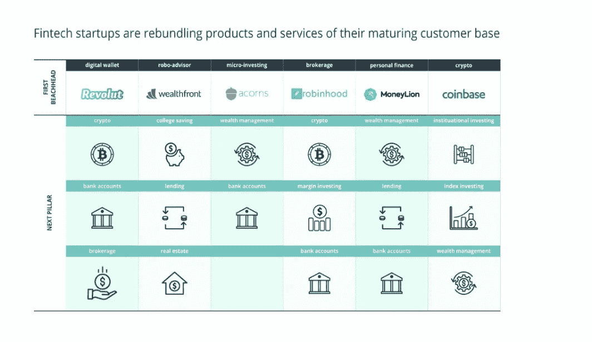
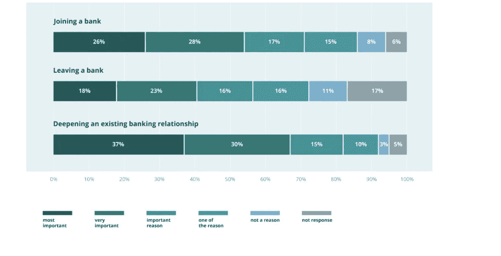
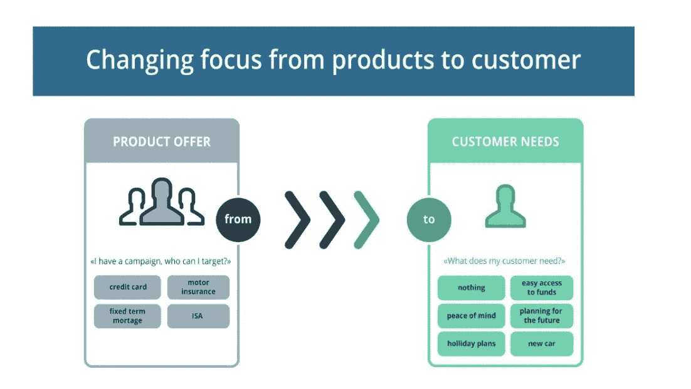
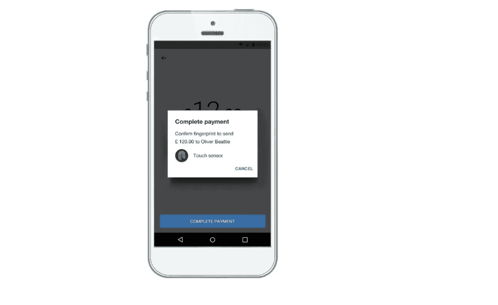
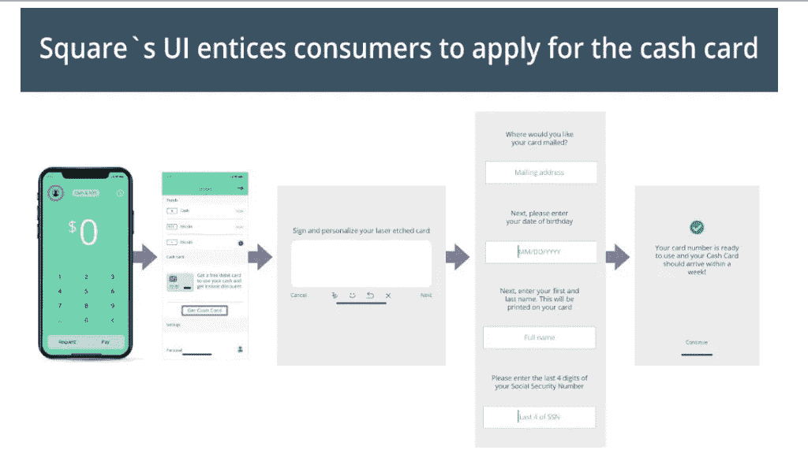
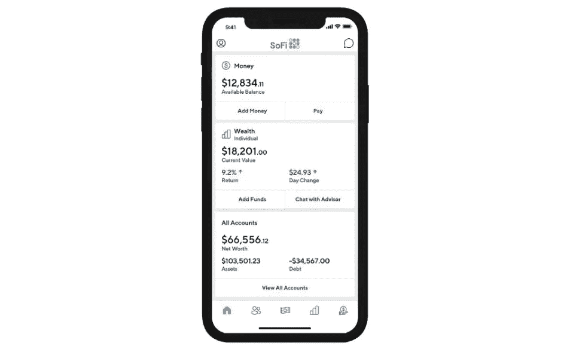
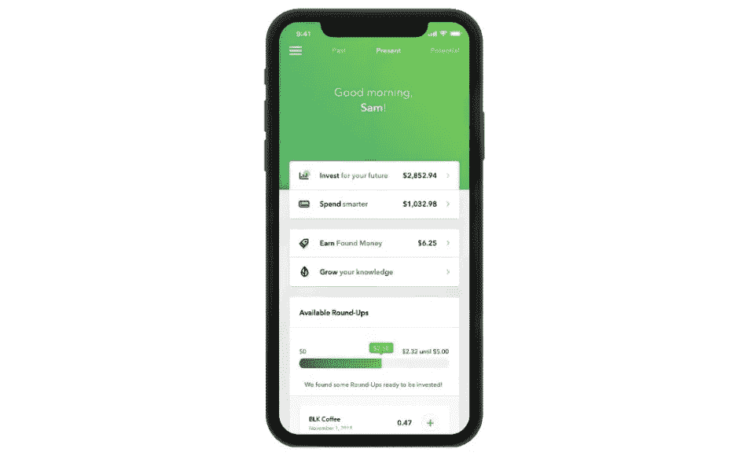

# 金融科技产品的完美公式:CX =毫升+ UX

> 原文：<https://towardsdatascience.com/the-perfect-formula-for-fintech-products-cx-ml-ux-fc6ab01f136d?source=collection_archive---------10----------------------->

## 成熟的金融科技面临的新挑战是用更多提供更少，我有解决这个问题的方法。

当金融科技行业刚刚成熟时，大多数公司都推出了一个简单的产品:一个[手机钱包](https://www.intellias.com/guide-to-mobile-wallets-apple-pay-google-pay-and-how-they-re-transforming-fintech/?utm_source=medium.com&utm_medium=referral&utm_campaign=AO&utm_content=formula) ***、*** 借记卡，或零钱投资应用程序。

这些产品受到了用户的欢迎，他们仍然不愿意将自己的血汗钱托付给一个应用程序。

但客户群已经迅速成熟。根据[凯捷](https://www.capgemini.com/service/world-retail-banking-report-2017/)的数据，2017 年，52%的零售银行消费者使用了三个或更多的金融科技应用来补充银行提供的服务。

如今，围绕金融科技出现了一个新的趋势:[平台化](https://medium.com/@annoleksyuk/super-app-as-the-future-of-fintech-become-a-platform-not-a-solution-802b6f41e9d6) ***。***

金融科技应用正在迅速改变[客户体验](https://www.intellias.com/how-to-use-gamification-in-banking/?utm_source=medium.com&utm_medium=referral&utm_campaign=AO&utm_content=formula),并从实用应用(做一件伟大的事情)演变为所有金融事务的一站式解决方案:

*来源:* [*CB 见解*](https://www.cbinsights.com/reports/CB-Insights_Fintech-Trends-2019.pdf)

这一举措的出现是因为应用程序疲劳是真实存在的。在理财方面，大多数千禧一代用户( [85%](https://www.businesswire.com/news/home/20190401005548/en/New-Kasasa%C2%AE-Study-Reveals-Millennials-Prefer-All-In-One) )更愿意选择一家提供全方位服务的金融机构。

好消息是什么？大多数金融科技公司都成功地利用尖端技术建立了一个应用内服务生态系统。他们正在从*解决方案*和[转变为*超级应用*](https://medium.com/@annoleksyuk/super-app-as-the-future-of-fintech-become-a-platform-not-a-solution-802b6f41e9d6)——以一系列互联金融和生活服务为特色的平台，从财富管理到加密投资、网络服务和零售商折扣。

现在，问题来了:随着金融科技平台变得越来越复杂，功能越来越多，用户开始抱怨功能/信息过载——这正是他们放弃现有银行，转而使用“直观”金融科技应用的确切原因。

问题就出在这里:打造技术先进的金融产品只是交易的一部分。如果产品的逻辑过于复杂，客户实现财务目标的道路过于曲折，那么在这个过程中，你将不可避免地失去客户。那么，如何提高银行业的客户参与度呢？

对成熟的金融科技公司来说，用更多提供更少是新的挑战。

但是使用**客户体验(CX) =机器学习(ML) +用户体验(UX)公式**是可以解决的。

# 为什么以客户为中心的金融科技产品开发方法是新的发展方向

千禧一代通常被贴上“T2 式自私的 T3 代”和“T4 式自私的 T5 代”的标签。作为一名千禧一代，我相信这些刻板印象通常是不准确的——但当涉及到银行业时，它们实际上是正确的。

事情是这样的:我不寻找特定的银行产品。我寻找解决方案来满足我(自私的)当下需求:想办法为出国旅行存钱，为我的婚礼存钱，或者只是评估在我想要的地区买房子的可行性。

我的顾客之旅与我的生活需求密切相关。然而，大多数金融科技产品所有者并没有将用户的需求置于聚光灯下，而是围绕他们投资组合中的产品构建客户之旅。

**结果，客户就是看不出*对我有什么好处？*你推销中的成分。**以至于 40%的千禧一代[说他们没有从他们的主要银行收到任何个性化的报价，另外 46%的人说他们的银行没有推销与未来购买计划相关的营销报价。](https://www.fico.com/millennial-quiz/pdf/fico-millennial-insight-report.pdf)

但是，大多数零售银行消费者确实希望在银行之旅的各个阶段都能感受到特别:

*来源:* [*金融品牌*](https://thefinancialbrand.com/74465/the-psychology-of-personalization-in-banking/)

好消息是什么？与现有银行不同，金融科技公司已经拥有了向用户提供更个性化体验所需的几乎一切。

# 解决方法:部署预测分析，以建议下一个最佳行动

金融科技公司常常坐拥客户交易和人生阶段的丰富数据，却没有给予太多思考。

是时候将这些数据从产品孤岛中解放出来了。通过这样做，您可以从管理一组帐户切换到以他们希望被管理的方式管理单个客户。

*来源:* [*德勤*](https://www2.deloitte.com/content/dam/Deloitte/uk/Documents/consultancy/deloitte-uk-con-next-best-action.pdf)

但是你怎么知道你的客户的需求呢？

1.  利用手头的数据
2.  设计机器学习算法来帮你处理数据
3.  接收下一个最佳行动建议

这里有一个定义客户需求的快速示例:

琳达订了一张五个月后去马略卡岛的机票。但是她的储蓄账户几乎空了。也许她需要一些预算建议，或者可能想考虑提供酒店积分的联名信用卡。

通过将预测性银行分析和倾向模型添加到您的产品中，您可以实时捕捉这种需求，并向 Linda 推荐她可能会接受的报价。简而言之，你可以学习卖什么，什么时候卖，什么时候什么都不做是最好的选择。通过这种方式，您可以借助预测分析实现更高水平的客户参与度。

以下是在移动金融科技产品中部署下一个最佳行动(NBA)概念的几种方式:

**向个人客户提供高度个性化的优惠、服务和奖励。**使用预测分析，金融科技公司可以根据用户的支出数据、位置、常见购买行为和过去对活动的反应，生成动态人物角色并为用户提供相关交易。这些可以以应用内消息、应用通知的形式发送。或者来自应用内人工智能助手的个性化建议。

**改善交叉销售、追加销售和产品推荐。** [ML-和 AI-](https://www.intellias.com/5-use-cases-of-machine-learning-in-fintech-and-banking/?utm_source=medium.com&utm_medium=referral&utm_campaign=AO&utm_content=formula) powered 模型可以生成动态的客户角色。将它们与产品属性映射结合起来，金融科技公司可以进一步预测客户下一步可能购买的产品。NBA 还使金融科技公司能够提供卓越的客户体验。通过了解你的客户下一步打算做什么(买房、出国旅游等)。)，您的团队可以采取行动引导客户实现他们的目标。您还可以动态跟踪和查看以前的优惠，以避免一次又一次地向相同的用户推销相同的产品。

**恰当的例子:** [摩根士丹利最近推出了 WealthDesk](https://www.cnbc.com/2018/11/20/morgan-stanley-launches-new-advisory-technology-platform.html) ，这是一个次优行动财富管理平台，帮助他们的顾问与客户建立更好的关系。

摩根士丹利的系统到底能做什么？

*   **根据生活事件为客户提供建议**。例如，如果客户有一个生病的孩子，系统可以推荐最好的当地医疗保健选择、学校和管理疾病的财务策略。
*   **向顾问发送个性化信息**，如低现金余额警报、客户投资组合重大增减通知、金融市场影响客户的重大事件更新等。然后，顾问可以将个性化文本与警报结合起来，并通过多种沟通渠道发送出去。
*   **提供更传统的“机器人建议”**该系统为客户收集建议和见解，并将其推销给顾问。

为了领先一步，FinTechs 也可以采用类似的 NBA 解决方案。但他们可以在更大程度上实现自动化，并使用对话式人工智能代替财务顾问与客户一对一接触。

另外，如果你对人工智能金融科技解决方案的更深层次的技术见解感兴趣，并了解机器学习在金融领域的工作方式，请查看《银行业的下一个十年:技术变革的时代》白皮书。

现在转到公式的第二个元素:用户体验。

# 简单银行=快乐银行

是时候分享一个令人不安的事实了:与其他几代人相比，千禧一代的金融知识落后了。

证据如下:千禧一代平均答对了 44%的 P-Fin 指数问题，而美国成年人的正确率为 50%。

理解风险和保险是千禧一代最缺乏知识的两个领域。这是有问题的，因为风险和不确定性存在于大多数金融决策中。

那么，你如何教导那些不想被说教无聊事物(预算、金融交易、共同基金)重要性的人呢？当涉及到管理财务时，你的产品如何减少摩擦或跳过障碍。

# 简单直观的数字银行应用剖析

快速安全的授权。

在英国，用户一周要查看 7 次以上。澳大利亚人每周登录他们的银行应用近十次。

那么，如何打造快速安全的银行体验呢？生物识别解决方案(触控 ID、Face ID、Voice ID)支持快速访问应用和核心功能。但是您可以将这些与多步认证(密码+文本/电话)相结合，以进行更敏感的操作，如更改卡取款限额和进行大额转账。

例如，Monzo 允许用户通过指纹授权 P2P 转账，但对银行转账有更高级的验证。

# 快速 KYC 和入职

[让入职流程](https://www.behance.net/gallery/82611165/WTB)成为一次愉快的对话，而不是令人生畏的纸质例行公事，使用智能手机的功能，如摄像头(捕捉身份证件)、生物识别、社交媒体数据和基于位置的服务。

仅请求验证新客户所需的数据。随着客户在你的应用中执行各种操作并提高他们的信任度，你可以逐步开放对附加服务的访问。此外，可以添加额外的 KYC 程序来解锁这些功能，以保持合规性。

**MyBank** (蚂蚁金服的一部分)在贷款申请中使用 3–1–0 原则:

*   **3**-新客户的分钟申请，大部分数据从蚂蚁金服生态系统内用户的其他档案同步
*   **1**-第二次认证
*   **0** 手动后台运营，因为这些都外包给了机器学习算法和预测分析

# 卡片订购的简单用户界面

获得一个借记卡/信用卡后验证应该只需要轻轻敲几下。 [Square Cash](https://cash.app/) 为如何做到这一点提供了一个很好的例子:

*来源:*[*CB Insights*](https://www.cbinsights.com/research/fintech-checking-accounts-debit-card-disruption/)

# 提供重要客户信息一览

提供关键账户数据的即时概览:余额、费用分析、未清/即将到来的账单，以及一些基本分析。Revolut 在他们的主屏幕上做得相当好，提供了渐进的，一键发现见解以及无缝导航到附加功能，如充值。

为了获得优势，您还可以引入更高级的分析仪表板，向用户显示他们在实现财务目标方面的表现。例如，如果他们正在实现他们的储蓄目标，你可以建议投资组合配置或发送其他个性化的财富管理建议。

SoFi 成功地将所有见解整合到一个简洁的界面中:

最后，不要忘记教育你的用户关于他们的账户选项和个人财务(不要听起来居高临下)。 [Acorns](https://www.acorns.com/) 是少数几个具有教育功能的金融科技应用之一，它与美国消费者新闻与商业频道合作，为用户提供一系列金融见解:

# 让支付体验变得顺畅，但确实会增加一些摩擦

这听起来可能违反直觉，但是请耐心听我说。

PayPal、Venmo 等为快捷方便的支付设立了标杆。借用 messenger UI 来设计一个类似的流畅的转账或账户充值体验是一个好主意。

但在金融科技产品中，零摩擦 UX 弊大于利。毕竟，金钱是一件严肃的事情。没有用户会高兴地意识到她只是给一些垃圾邮件联系人发送了 1000 美元，因为这样做是“无缝的”和“没有麻烦的”

因此，当涉及到重大的应用程序内操作或永久的帐户更改时，添加有意的摩擦是值得的。确认弹出窗口、双因素身份验证和其他小障碍可以降低用户采取错误操作的风险。

平衡流畅的体验和必要的摩擦是 FinTech 产品所必须的。

## 包扎

更好的客户体验一直是传统银行和金融科技产品之间的一个强大差异。但随着金融科技产品组合的增长，让客户体验变得更加困难。

通过投资预测性银行分析和金融领域的机器学习，你可以从大规模推销转向根据客户当前的生活阶段和众多其他因素向他们建议超个性化的交易和行动。

接下来，采取加权 UX 决策，逐步引导用户发现更多功能，同时允许他们只需轻点几下鼠标就能完成重要的工作。

这就是你为金融科技产品打造理想客户体验的方式。