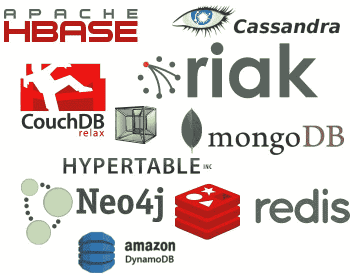
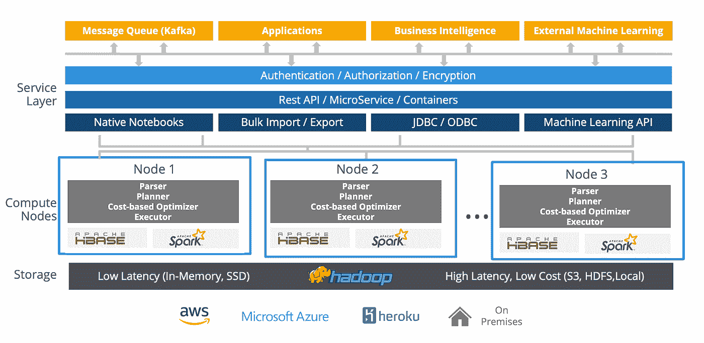

# NoSQL SQL 应用程序现代化的风险

> 原文：<https://towardsdatascience.com/the-perils-of-modernizing-sql-apps-on-nosql-593543c67790?source=collection_archive---------14----------------------->

在过去的 40 多年里，传统的关系数据库，如 DB2、Oracle、SQL Server、Postgres、MySQL 和许多其他数据库，已经被证明是构建数千亿美元应用程序的基础。通过 SQL 与后端数据库交互的应用程序在所有行业中都很普遍。如果所有依赖 SQL 的应用程序在一夜之间消失，我们的世界将陷入绝对的混乱。在无数的影响中:您将无法访问您的银行或在银行花钱，您的医疗记录将无法访问，货物将无法路由或运输，等等。在许多方面，如果没有基于 SQL 的应用程序，现代生活是无法识别的。

# NoSQL 数据库的崛起

在 21 世纪初，生成和存储的数据量、到达数据库的速度以及数据类型的多样性开始激增。最初，这是由网络应用程序生成的点击流数据推动的，但如今，物联网等许多其他数据源也产生了类似的挑战。以 SQL 为主要界面的传统数据库在这种新环境中举步维艰。绝大多数人都没有横向扩展的实际方法，他们刻板的打字风格使他们不适合存储完全非结构化的数据。

为了应对这些挑战，人们建立了新的方法，主要基于 21 世纪中期几家互联网公司(如谷歌、亚马逊和雅虎)的研究，这些公司正被他们收集的数据淹没。

非常依赖这项研究的一个值得注意的类别是 NoSQL 数据库，如 HBase、Cassandra、Dynamo 和 MongoDB。这些系统旨在通过可容纳半结构化或非结构化数据的横向扩展体系结构来处理大量数据。

# 抛弃 SQL 是一个错误吗？

为什么 SQL 最初被 NoSQL 项目和供应商放弃了？主要的论点是:1)前期的模式使您的业务在处理半结构化和非结构化数据时不太灵活；2)SQL 很慢，它的表达是不必要的。

首先，很明显，好的模式设计是困难的，需要你提前理解你的数据。当数据类型快速变化时，不被锁定在模式中似乎是非常合理和有吸引力的。

问题是，所有的分析都需要你理解数据的结构。结构，以定义的模式的形式，必须被应用来做任何有用的事情。仅在读取数据时应用结构，一种“读取时的模式”方法，确实减少了预先的数据工程工作，但是它将问题推给了实际的数据用户。通常，这不是一个好的权衡。数据用户通常比数据工程师多得多，将责任推给数据用户可能会将一个在前期完成的任务变成一个需要在下游重复完成的任务。此外，数据用户除了他们的直接职责之外，通常没有太多的上下文，可能会错误识别或误用数据。还有一个风险是，不同的数据用户可能不会以相同的方式解释数据，从而在理解和协调冗余和不一致的用法方面产生问题。

NoSQL leads to a bunch of spaghetti code to do what SQL does

第二，事实证明 SQL 的表达能力是有用的。这有许多原因，我们将在下一节中讨论，但最明显的证据是许多 NoSQL 项目和供应商实现了“类 SQL”查询语言。卡桑德拉的《CQL》就是一个例子。在某些方面，这些“类似 SQL”的查询语言是有帮助的。它们有效地将特定于 NoSQL 的语法映射到更广泛理解的 SQL 语法，减轻了开发人员的“新语言”负担，并可能开放一些第三方集成。

在其他方面，拥有一种看起来像 SQL，但实际上不是的查询语言会适得其反。这有可能让开发者产生一种虚假的自信。他们可能高估了这些语言中存在的 SQL 支持的实际水平，并且只有在项目进展顺利之后才发现重要的差距。可能更糟的是，在技术上适用于概念验证的“类似 SQL”功能可能无法在完整的生产系统上运行，因为从底层 NoSQL 数据库渗透出来的功能属性存在差异。如果底层的 NoSQL 数据库在设计或修改时没有考虑到这一目的，那么在 NoSQL 数据库上添加一些“类似 SQL”的语法糖并不能使表连接之类的东西在生产环境中“工作”。

NoSQL 系统中缺少 SQL 本身并不是一个固有的优势。在所有条件相同的情况下，为了一种 NoSQL 特有的语言而放弃一种很好理解的、广泛部署的数据查询语言是没有好处的。另一方面，完全放弃 SQL 或使用“类似 SQL”的语言有一些明显的缺点，尤其是在应用程序现代化的背景下。

# 放弃 SQL 是有风险的

在过去的 40 多年里，公司在体现其核心竞争力的任务关键型应用程序上进行了大量投资。数据是几乎所有应用程序的核心，传统数据库是数据存储和检索的主要选择。

当应用程序存储和操作的数据增长超过底层传统数据库的处理能力时，通常会出现对这些应用程序进行现代化的迫切需求，以便通过利用自应用程序最初部署以来可用的新数据源来使应用程序更加智能，并整合人工智能和机器学习等利用数据的现代技术。

例如，零售商的需求计划应用程序可能会开始整合有关当前天气或可能影响当地交通的当地事件的数据，以便更有效地分配库存。或者考虑一个保险索赔系统，该系统集成了车辆传感器数据和摄像机图像，以更加智能地处理索赔。

这些应用程序现代化项目通常会考虑使用 NoSQL 数据库。从某些方面来说，这是有道理的。它们确实提供了向外扩展以支持新数据源的能力。然而，当用 NoSQL 替换一个遗留的 SQL 数据库时，您可能会大大延长项目并增加风险。

Abandoning SQL in mission-critical applications impedes application modernization

首先，缺乏完整的 SQL 支持需要大量的应用程序重写。这些应用程序使用 SQL。即使 NoSQL 数据库中存在重要的功能，使用该功能也需要应用程序“说”一种定制的 NoSQL 或不兼容的“类似 SQL”的方言。此外，找到具有所需专业知识的开发人员比找到大量已经精通 SQL 的开发人员要困难得多。帮助将现有 SQL 转换成 NoSQL 方言的工具不完整或不存在。

接下来，底层数据模型通常需要完全重新考虑。例如，缺乏高性能的表连接(或者在某些情况下，根本没有连接数据的能力)会导致数据非规范化的激增，从而导致数据重复，浪费硬件资源，并且需要大量的新代码来确保重复的数据在其所有定义中保持一致。

此外，通常很难达到与传统数据库相似的性能。NoSQL 系统通常擅长只访问一行或几行的短期操作查询。扫描大量历史数据的分析查询的性能通常很差，不足以满足应用程序的需求。通常，NoSQL 数据库通过实现 [Lambda 架构](https://en.wikipedia.org/wiki/Lambda_architecture)与另一个更适合长期运行的分析查询的系统配对。这些体系结构很复杂，难以实现，引入了许多潜在的数据不一致途径，并意味着巨大的持续维护成本。

此外，应用程序在遗留数据库中所依赖的许多数据库和 SQL 特性通常是不可用的，需要由开发人员从头构建或完全消除。在 NoSQL 系统中复制遗留 SQL 数据库中存在的一些功能，如支持完全 ACID 支持的一致性模型，需要如此专业的开发人员技能和如此巨大的工作量，以至于任何依赖于重新实现的项目都将花费大量时间来有效地构建一次性数据库，而不是实际更新应用程序。

一种风险小得多的应用程序现代化方法是用一个可横向扩展、支持数据类型灵活性并在不放弃 SQL 的情况下提供数据库内机器学习和人工智能的数据库来替换您的遗留数据库。这样的数据库存在吗？

# 你能用 SQL 获得 NoSQL 的优势吗？

如今市场上有许多横向扩展的分布式 SQL 系统，如雪花、蟑螂和谷歌云扳手，以及我共同创立的公司 [Splice Machine](https://www.splicemachine.com) 。有了所有这些，我相信有可能获得 NoSQL 数据库的好处，而不接受上面讨论的问题。为了更深入地了解其中一个解决方案， [Splice Machine](https://splicemachine.com/product/how-it-works/) 使用 NoSQL 系统(HBase)作为其底层存储引擎，但它基于专为实现 OLTP SQL 应用程序现代化而设计的广泛功能，它提供:

*   受支持的 ANSI SQL 语法的详尽集合
*   带主键的行存储，用于快速查找
*   表中高效的列存储，可以像 S3 或 ADLS 那样存储为廉价的对象存储
*   全面的 [ACID](https://en.wikipedia.org/wiki/ACID) 合规性和多行交易支持
*   支持约束、参照完整性、主键、触发器和辅助索引
*   内存中的分布式分析处理
*   一个基于成本的优化器，它设计高效的查询计划，并可以选择直接针对 HBase(通常用于小型的“操作性”查询)或通过 Spark 执行器(通常用于大型的“分析性”查询)来执行这些计划
*   支持自定义存储过程和函数
*   使用 Kubernetes 在内部或 AWS 和 Microsoft Azure 上部署的能力
*   将半结构化或非结构化数据直接存储在数据库表中或通过集成 Spark 功能存储的能力
*   具有数据库内分析、集成 Jupyter 笔记本电脑、模型工作流管理和云部署功能的集成数据科学功能

An example of a scale-out SQL engine that handles OLTP and OLAP

像这样的横向扩展 SQL RDBMS 可以促进遗留系统的现代化。

首先，像 NoSQL 数据库一样，iit 可以横向扩展到非常大的数据大小和查询量，远远超过遗留数据库的能力。它还为存储和操作数据提供了广泛的灵活性。

其次，它使从支持遗留数据库的迁移变得简单。由于 Splice Machine 全面的 SQL 支持，针对遗留数据库编写的 SQL 几乎不需要返工。底层的遗留数据模型通常不需要修改，当然也不需要像迁移到 NoSQL 数据库那样进行大规模的重新思考。Splice Machine 可以处理所有遗留的数据库工作负载，无论是操作性的还是分析性的，而不需要将多个专门的系统连接在一起。

最后，它提供了允许迁移的应用程序变得“现代”的能力。它可以在内部或多个云平台上运行，并通过现代的“容器化”方法抽象出底层基础架构。它允许直接在数据库中进行数据科学，因此可以应用使应用程序更智能、更有价值的新数据源和技术，而无需在多个系统之间提取、转换和加载数据。

# 概括起来

建立在遗留数据库上的定制应用程序通常具有竞争优势。这就是为什么公司让他们定制而不是授权打包的应用程序。现代化这些应用程序通常是可取的，要么是因为底层数据库处于压力之下，无法扩展，要么是因为希望利用现代部署或人工智能技术。用需要对现有数据模型和业务逻辑进行大规模返工的 NoSQL 数据库替换支撑这些应用程序的遗留数据库是有风险的，并且会显著增加现代化项目的范围和进度。Splice Machine 等横向扩展 SQL 数据库提供了可伸缩性和灵活性，同时提供了从遗留数据库系统平稳迁移的途径。

要了解更多有关如何让您的定制应用变得敏捷并融入智能的信息，请下载我们关于[改造传统应用](https://info.splicemachine.com/digital-transformation-2.html?utm_source=medium&utm_medium=blog&utm_campaign=nosql)的白皮书。