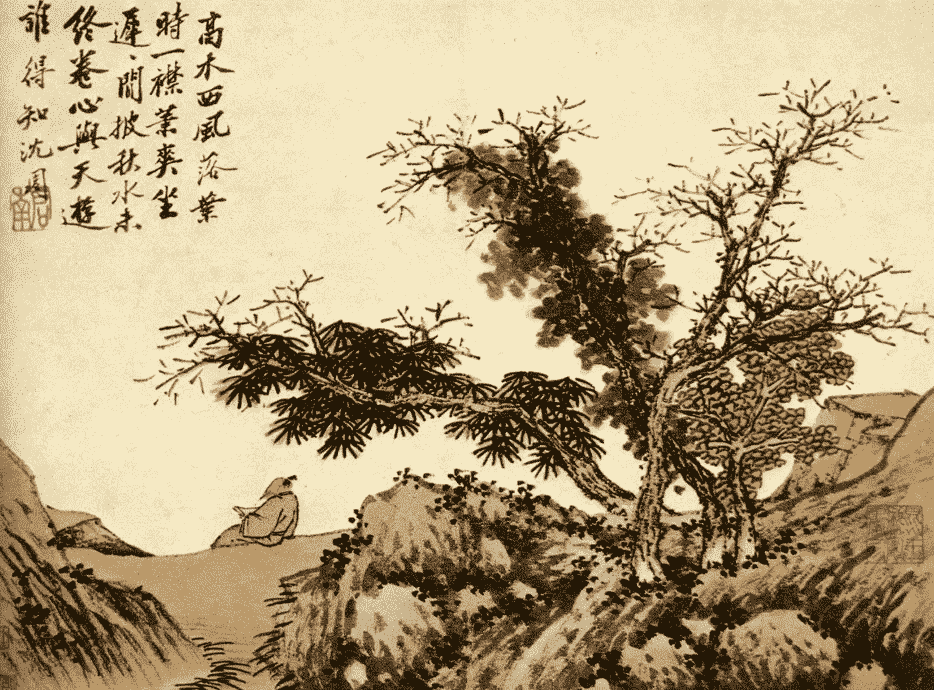

# 诗歌机器

> 原文：<https://towardsdatascience.com/the-poetry-machine-2764ec8b340b?source=collection_archive---------21----------------------->

## 使用 OpenAI GPT2 生成唐诗

我一直很欣赏中国诗歌的翻译——我不是这方面的专家，但有两位诗人杜甫和李白是我真正喜欢的。他们是盛唐时期的传奇大师，而且(如果翻译准确的话)，他们有着惊人的天赋，能够用他们的文字冻结某个瞬间，捕捉那段特定的时间；他们的诗读起来就像一串横跨河岸的宝丽来。

这里举例，是阿杜的赋诗。除此之外，这里有某种简单性:一种强烈的情感引起共鸣，不像我成长过程中听到的许多英语诗歌，它坚定地使用现在时态:

> 漫长的攀登
> 
> 广空疾风，猿呜咽，
> 飞鸟归巢，过清湖白沙，
> 落叶如瀑，
> 我看长河滚滚。我从三千英里外赶来。带着秋天的悲伤和我百年的悲哀，我独自攀登这个高度。厄运在我的鬓角上结了一层寒霜，心痛和疲倦是我酒里的一层厚厚的灰尘。

我想这就是吸引我的原因——这里有一种罕见的清晰，即使翻译可能不准确。

因此，对于我的机器生成艺术的实验来说，唐诗似乎是一个合适的起点(此外，优秀的 GWERN 已经做了通常的英语[1])。现在，我已经从我的统计模型中溜出来几个小时，偷看一下我今天早上设置要运行的代码。

在我们这些从事机器学习的人当中，我在整个项目中投入的工作是微不足道的:一个微小的数据集，一杯咖啡，几行 Python 代码，以及在等待 OpenAI 基于 transformer 的生成模型[2]下载时抽一支烟。

像大多数神经网络一样，OpenAI 模型可以被认为是人脑的粗略模拟——一系列成层排列的人工神经元，当思想(输入)的片段在一层和下一层之间传递时，这些神经元会发光。我们通过指向某物并告诉它产生类似的东西来教它。OpenAI 的研究人员裁定，他们的完整模型太复杂，太像人类，无法发布——在这个假新闻的时代，天知道人们会对它做什么——所以他们敲锣打鼓，只发布了他们的野兽 GPT2 117M 的小型儿童版。

没关系。我们应该利用这个孩子。我把它设定在一本唐诗集上，鉴于我个人的偏好，李白和杜甫在这里都很突出。它已经消化并向我吐出了一些诗歌，而我，扮演着一个很像报社助理编辑的角色，正在审阅新记者交来的稿件。

以下是我们的第一批结果:从十首作品中精选出六首诗歌。我的编辑是删除每首诗不超过两行。

> 无尽的思念
> 
> 我一直渴望去宝沙。
> ……金井边秋虫鸣；
> 薄薄的霜像小镜子一样在我冰冷的垫子上闪闪发光；
> 高灯闪烁；还有。我的渴望越来越深。
> 我掀起窗帘，长叹一声，凝视月亮，像一朵花，从云层中升起。上面，我看到天空的蓝色和深邃。在下面，我看到了水的绿色和躁动。
> 天高，地广；他们之间弥漫着我的悲伤。我能梦想穿越山门吗？无尽的渴望让我心碎。
> 
> 无尽的思念 II
> 
> 太阳落山了，花儿中有一层薄雾；月亮变得很白，人们悲伤难眠。愿它能随着春天的风来到杨希嫣。因为没有人能为你承担我的歌的重担，所以我想你在遥远的地方，在蓝天之外，我那曾经闪亮的眼睛现在充满了泪水。哦，如果你怀疑我的心痛，在我明亮的镜子里，回来看看我吧！

这不是我见过的最好的诗歌，但也不是最差的。据我所知，父母们一直试图让孩子们写诗——我的父母当然也是这样做的——但通常要过很多年，这个小家伙才会停止在尿布上拉屎，决定接受罗伯特·弗罗斯特。到目前为止，我已经在这上面花了大概三个小时的时间，其中大部分时间都花在了解决代码问题上。

> 艰难的道路
> 
> 我要渡过黄河，但是冰阻塞了渡船；我想去爬太行山，但是天空被雪遮住了。
> 我会坐在一根鱼竿上，懒洋洋地靠在小溪边—
> 但我突然梦想驾着一艘船，向着太阳航行……
> 旅途艰辛，
> 有很多弯道——我该走哪条？….总有一天，我会乘风破浪，扬帆直上，穿越深深的大海。
> 
> 终南山下
> 
> 沿着凤县的蓝山
> 你找到了你的家。风拍打着我们，拍打着我们的耳朵，而我们只看到乌云；我们只听到静静的河面下沙沙作响的草。
> 农民们都在归还他们所拥有的东西，
> 清洗他们的土地，并烧毁它们。

在我这个未经训练的人看来，GPT 2–117m 型号似乎更有效地掌握了唐诗的“形式”。鉴于这个数据集如此之小，一些死记硬背的短语是不可避免的，但我对如此之少感到惊讶。通过一些小心的删减——一条线在这里和那里被修剪——我可以带出一种支配一切的情感的印象。我对此特别自豪:

> 进攻皇帝的哀叹
> 
> 士兵们被派往北方守卫丝绸之城，被派往东方接受来自天堂之矛的雨水。
> 南奔塞外，群星冉冉，
> 而我们的足迹在三百里之外。
> 我怎么忍心把他们扫走？
> 一条消失的河流被人们遗忘了。
> 谁知道它是否还活着？谁知道它是否曾经存在过？

我必须强调，最后两行绝对不是我写的。

每当我看到这样的事情，我都会想起一个人，他就是象棋大师加里·卡斯帕罗夫。卡斯帕罗夫可能是迄今为止我们见过的最伟大的人类棋手；从 1986 年到 2005 年，他是这项运动的世界最佳选手。

1997 年，卡斯帕罗夫被一台机器打败——IBM 的深蓝。这一举动改变了国际象棋的历史，我认为——回过头来看——这才是“人类对机器”的恐惧真正击中要害的地方。从那以后，人类的棋子已经接受了被机器打败。

卡斯帕罗夫做了什么？卡斯帕罗夫走开了，让计算机辅助国际象棋工作。他拿人类 vs 机器，做成人类+机器。他的主题是他的 TED 演讲的标题——“不要害怕智能机器；和他们一起工作”[4]。今天，一些世界上最强大的玩家是电子人——人类玩家和机器智能的结合体——他们很难被击败。

我相信这种人类+机器的哲学。在接下来的一年左右的时间里，我将沿着这条路线发起更多的小实验。让我们看看它能带给我们什么。

我的一位数学家朋友最近向我提出，诗歌的作用是捕捉复杂的情感；我反驳说，诗歌的作用是通过单词的顺序和单词本身一样传递信息。但是在我们的辩论中，都有一种隐含的理解，即*是一个诗人，一个有目的感的创造者，不管是信息还是情感。我想知道我们是否可以对此进行同样的辩论，或者我们是否必须在消除几个偏见的情况下重新开始这场辩论。*

这最初是在 http://yudhanjaya.com/2019/04/the-poetry-machine/发布的。这篇文章以前是“GPT 2110 米”而不是“117 米”——这个问题已经解决。

[1][https://www . gwern . net/RNN-metadata # fine tuning-the-GPT-2-small-transformer-for-English-poem-generation](https://www.gwern.net/RNN-metadata#finetuning-the-gpt-2-small-transformer-for-english-poetry-generation)

[https://openai.com/blog/better-language-models/](https://openai.com/blog/better-language-models/)

[3][https://www.chess.com/article/view/deep-blue-kasparov-chess](https://www.chess.com/article/view/deep-blue-kasparov-chess)

【4】[https://www . ted . com/talks/garry _ Kasparov _ don _ t _ fear _ intelligent _ machines _ work _ with _ them？language=en](https://www.ted.com/talks/garry_kasparov_don_t_fear_intelligent_machines_work_with_them?language=en)

[5][http://www . BBC . com/future/story/2015 12 01-the-cyborg-chess-players-that-can-be-beat](http://www.bbc.com/future/story/20151201-the-cyborg-chess-players-that-cant-be-beaten)