# 泊松过程:你需要知道的一切

> 原文：<https://towardsdatascience.com/the-poisson-process-everything-you-need-to-know-322aa0ab9e9a?source=collection_archive---------2----------------------->

## 了解泊松过程以及如何使用 Python 模拟它

让我先挑起你的好奇心。让我们看看泊松序列是什么样子的。

A sample Poisson process (Image by [Author](https://sachin-date.medium.com/))

该图显示了患者到达医院急诊室的时间，单位为小时(从任意时间 0 开始)。我们还碰巧知道*平均到达率是每小时 5 个病人*。

事实证明，使用泊松过程可以很好地模拟这种“到达”数据。

泊松过程在各行各业都能看到。以下是一些例子:

*   在免下车药房，在某个时间间隔内，开到停车窗口的汽车数量。
*   [木瓜大王](https://www.papayaking.com/)周日中午 12 点到下午 4 点卖热狗的数量。
*   医院超声机的故障。
*   工作日上午 8 点到 11 点通过某个交叉路口的车辆数量。
*   暴露在一束光子下的光电探测器在 1 分钟内产生的电脉冲数。

既然我已经激起了你的好奇心，让我们开始进入泊松过程的奇妙世界的旅程。所以跳上船吧！

## 首先，快速概述随机变量和随机过程

**随机变量**中的‘变量’一词是用词不当。一个随机变量，通常用 ***X，Y，Z，X1，X2*** *，**等表示。，其实是一个函数！和所有表现良好的函数一样， ***X*** 有一个域和一个范围。*

***域(X)**:***X***的域是随机结果的样本空间。这些结果出现在一些随机实验中(比如投掷一对硬币)。结果可能是也可能不是数字。例如,(正面，正面)或(反面，正面)是抛硬币实验的两种可能结果。*

***范围(X):*****X***的范围是实数的集合。*

**

*Random variable X maps the sample space of events to a range (Image by [Author](https://sachin-date.medium.com/))*

*为什么 ***X*** 被称为*随机*变量？这是因为 ***X*** 使用概率分布从范围( **X** )中输出一个值，该概率分布应该表示样本空间中事件发生的可能性。在上图中，概率分布可能是:*

*{ **1** → 0.2、 **2** → 0.45、 **3** → 0.15、 **4** → 0.2}*

*请注意，所有结果的概率之和是 1，因为抛硬币实验总是会产生一些结果:*

***P** ( **1** 或 **2** 或 **3** 或 **4** ) = P(1) + P(2) + P(3) + P(4)*

*= 0.2 + 0.45 + 0.15 + 0.2 = 1.0*

*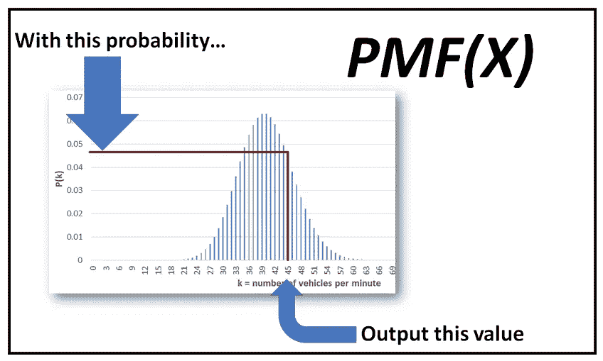*

*The **P**robability **M**ass **F**unction of ***X*** (Image by [Author](https://sachin-date.medium.com/))*

*x 可以是**离散的**或**连续的**。*

***离散随机变量**的范围是可数无限的，例如对于整数集合。离散的 ***X*** 的真实世界例子是在某个时间间隔内通过十字路口的汽车数量。一个离散随机变量的概率分布被称为 **P** 概率 **M** ass **F** 函数(PMF)。*

*一个**连续随机变量**的值域是实数的集合，也就是一个不可数的无穷集合。现实世界中不容易找到纯粹连续的 ***X*** 的例子。一个非常接近的近似值是一个地方在一年中特定时间的温度，以任意大的精度测量。连续随机变量的概率分布称为概率密度函数(PDF)。*

> *一个纯粹连续的 ***随机*变量**的真实世界例子不容易找到。*

*现在让我们回顾一下什么是随机过程。*

## *随机过程*

*一个**随机过程**是一个随机变量序列 ***X1、X2、X3……等等*** 。通常按时间索引。每个变量可以从某个概率分布中取不同的值。请参见下图中的随机过程:*

*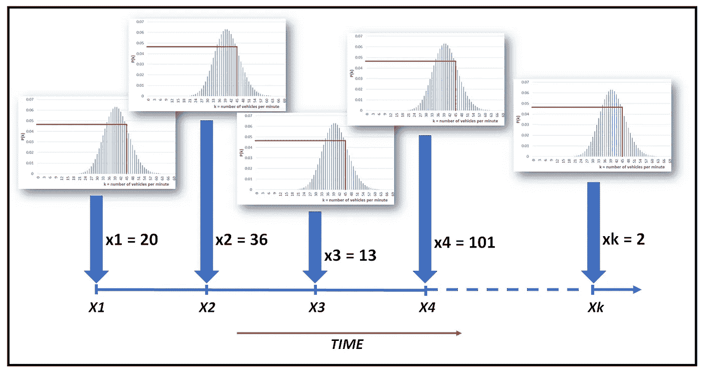*

*A random process (Image by [Author](https://sachin-date.medium.com/))*

*一个随机过程既可以是**离散**也可以是**连续**取决于它的成员变量 ***X1、X2、X3…等*** 是离散变量还是连续变量。*

*我们现在准备看看泊松过程是一种什么样的生物。*

## *泊松过程*

*泊松过程可用于对事件发生的次数进行建模，例如在某个时间段内，例如 24 小时内，患者到达急诊室的次数，*假设人们知道这些事件在某个时间段内的平均发生次数。*例如，平均每小时有 10 名患者走进急诊室。*

*泊松过程具有以下特性:*

1.  ***它由一系列随机变量 *X1，X2，X3，…Xk*** 组成，每个变量代表某个事件在某个时间间隔内发生的次数，比如病人走进急诊室。*
2.  ***它是一个随机过程**。每次你运行泊松过程，它会产生一个不同的随机结果序列，按照我们很快会看到的概率分布。*
3.  ***这是一个离散的过程**。泊松过程的结果是*某一事件在特定时间段内发生的次数*，这无疑是一个整数——即一个离散的数字。*
4.  ***有独立的增量**。这意味着，在任何给定的时间间隔内，流程预测将发生的事件数量与任何其他不相交的时间间隔内的数量无关。例如，从时间 0(观察开始)到上午 10 点走进急诊室的人数与从下午 3:33 到 8:26，或从晚上 11:00 到 11:05 等走进急诊室的人数无关。*
5.  *泊松过程的组成变量 ***X1、X2、X3、……Xk***都具有**同分布**。*
6.  *泊松过程的组成变量 ***X1，X2，X3，…Xk*** 都有一个**泊松分布**，它由 **P** 概率 **M** ass **F** 函数给出:*

*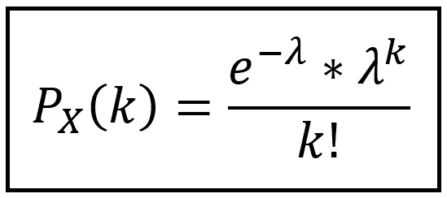*

*Probability of k occurrences in unit time, given an average occurrence rate of **λ** per unit time (Image by [Author](https://sachin-date.medium.com/))*

*上面的公式给出了单位时间内 ***k*** 事件*发生的概率，假设平均发生率为单位时间*内 **λ** 事件*。**

*以下 4 个图显示了 **λ:** 的不同值的 PMF 的形状*

**

***P**(**k**) for **λ** = 0.1, 1.0, 5 and 20 events per unit time (Image by [Author](https://sachin-date.medium.com/))*

*在每个图中，您可以看到概率在 **λ，**的相应值处达到峰值，并在该值的两侧逐渐变小。*

*在每个图中，*的所有可能值的概率之和总是 1.0，即其中一个结果必然会实现。**

**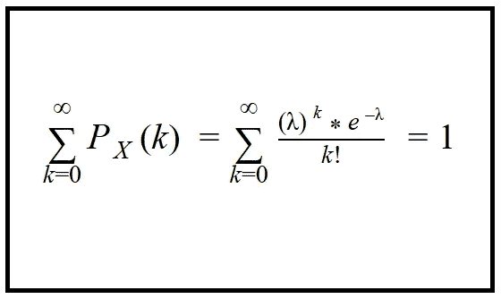**

**(Image by [Author](https://sachin-date.medium.com/))**

**我们再仔细看看 **λ** = 5 时的情况。在我们的例子中，这相当于每小时有 5 名患者到达。0，1，2，3，…，10，11，…等的概率。一小时后走进急诊室的病人*是这样的:***

***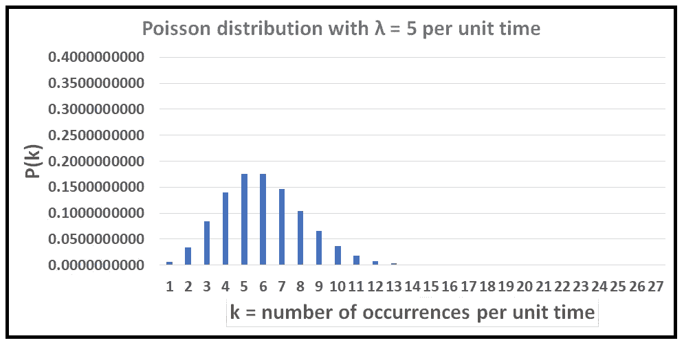***

***Probability of k arrivals in one hour given that an average of 5 patients walk into the ER per hour (Image by [Author](https://sachin-date.medium.com/))***

***如你所见，概率在 k = 5 时达到峰值。***

***为了知道 ***k* 患者**在 *t* 小时内走进急诊室**的可能性，我们将其建模为一个带速率( **λ *t)的泊松过程。*****PMF 对应的公式是这样的:*******

**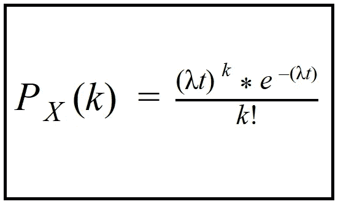**

**Probability of k arrivals in time t, given **λ** arrivals in unit time (Image by [Author](https://sachin-date.medium.com/))**

**以下一组概率分布都是使用上述泊松分布公式通过将速率 **λ** 缩放不同的时间间隔**t而生成的:****

**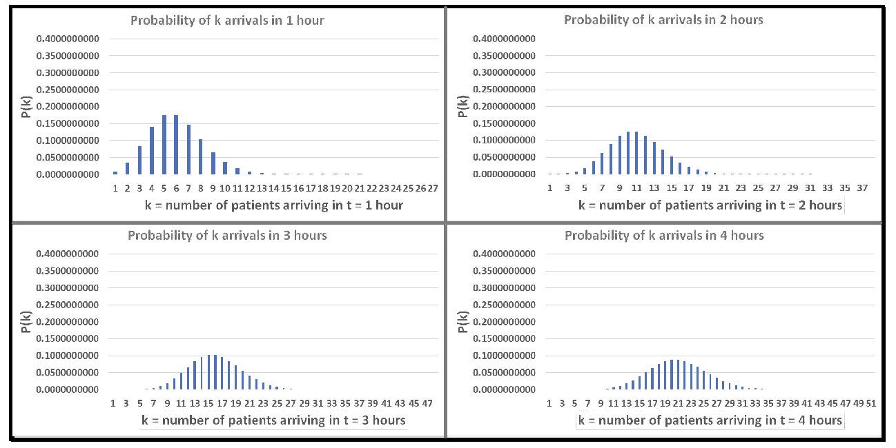**

**Probability of k arrivals in time t, given **λ** = 5 per hour (Image by [Author](https://sachin-date.medium.com/))**

## **建模到达间隔时间**

**泊松过程有一个显著的子结构。即使使用离散泊松分布对事件的发生次数进行建模，连续事件之间的时间间隔也可以使用连续分布[指数分布](https://en.wikipedia.org/wiki/Exponential_distribution)进行建模。**

**让我们进一步探讨这个问题。**

**让 ***X1、X2、X3……等等*** 。是随机变量，使得:**

*****【X1】***=流程开始与第一个事件之间的时间间隔，即第一个*到达*、
***、X2*** =第一个到达与第二个到达之间的间隔时间、
***、*** =第二个到达与第三个到达之间的间隔时间、
等等。**

**代表第*(k-1)*和第*(k)*次到达之间的间隔时间的随机变量 ***Xk*** 的分布为:**

**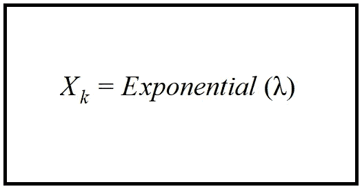**

**Inter-arrival times are exponentially distributed (Image by [Author](https://sachin-date.medium.com/))**

**随机变量 ***Xk*** 的 **P** 概率 **D** 密度 **F** 函数(PDF)如下:**

**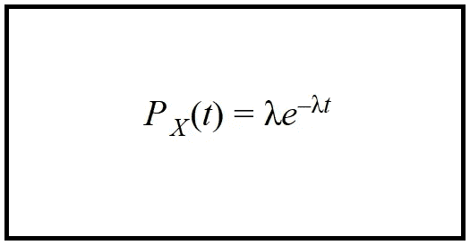**

**PDF of inter-arrival times in a Poisson process (Image by [Author](https://sachin-date.medium.com/))**

**并且 **C** 累积 **D** 分配 **F** 功能(CDF)为:**

**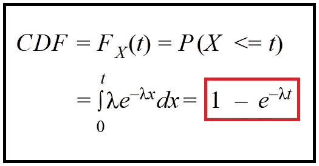**

**CDF of interval-arrival times in a Poisson process (Image by [Author](https://sachin-date.medium.com/))**

**回想一下 ***X*** 的 CDF 返回连续到达之间的时间间隔将小于或等于某个值 ***t*** 的概率。**

## **模拟泊松过程中的到达间隔时间**

**我们现在有足够的信息来生成泊松过程中的到达间隔时间。我们通过使用[逆 CDF](https://stephens999.github.io/fiveMinuteStats/inverse_transform_sampling.html) 技术来实现这一点，在该技术中，我们从字面上构造 CDF 的反函数，并从一个**(0，1)* 均匀分布向其提供不同的概率值。这为我们提供了相应概率的相应到达间隔时间。***

**到达间隔时间的 CDF 的反函数是:**

**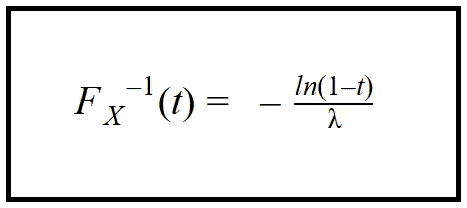**

**Inverse of the CDF of inter-arrival times (Image by [Author](https://sachin-date.medium.com/))**

**如前所述，我们馈入这个函数，概率值来自连续均匀分布**【0，1】*。我们将很快看到如何使用几行 Python 代码以编程方式完成这个操作。***

**目前，以下是前 10 名患者到达急诊室的间隔时间(小时)表。我们使用上述公式生成了这个日期，将 **λ** 设置为每小时 5 名患者。**

**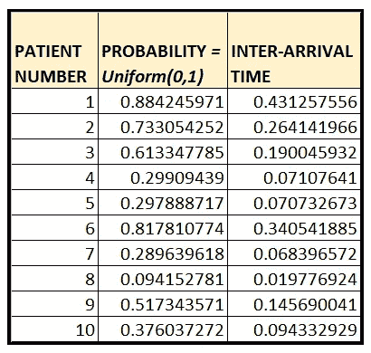**

**λ = 5 arrivals per hour (Image by [Author](https://sachin-date.medium.com/))**

**这是前 500 名到达者的间隔时间图。正如所料，它是 CDF 图的逆。**

**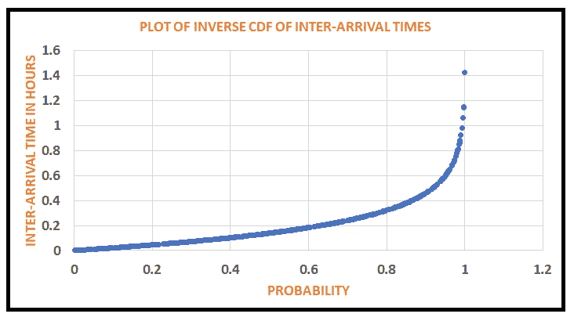**

**Inverse of CDF of interval arrival times (Image by [Author](https://sachin-date.medium.com/))**

## **模拟泊松过程中的到达时间**

**既然我们知道如何生成到达间隔时间，那么就很容易生成患者到达时间。**

**从上面显示的 10 个样本到达间隔时间的表中，我们可以推导出以下内容:**

****第一个病人的到达时间**=***x1***=**0.431257556****

****第二名患者的到达时间**=
***x1***+第一名与第二名患者的到达间隔时间=
***x1***+***x2***= 0.431257556+0.264141966 =**0.6954****

**第三名患者的**到达时间**=
***x1***+***x2***+***x3***= 0.431257556+0.264141966+0.190045932 =**0.885445****

**…等等**

**记住 ***X1，X2，X3，…Xk*** 是到达间隔时间，如果我们将 ***T1，T2，T3，…Tk*** 定义为变量，表示患者**到达急诊室的时间**，我们看到:**

*****T1 = X1
T2 = X1+X2
T3 = X1+X2+X3
…
Tk = X1+X2+X3+…+Xk*****

**注意，由于 ***T1，T2，T3…Tk*** 被定义为随机变量 ***X1，X2，X3，…Xk*** ，变量 ***T1，T2，T3，…Tk*** 也是随机变量。**

**这里还有一个非常有趣的事实:**

**由于 ***T1，T2，T3…Tk*** 都是各自服从指数分布的随机变量之和***【X1，】Xk*** ， ***T1，T2，T3，…，Tk 服从伽玛分布*** 。**

> **泊松过程中的到达时间遵循伽马分布，这是一种连续分布。**

**让我们后退一步，注意我们是如何顺利地从离散分布过渡到一组连续分布的！这就是泊松过程的神奇结构。虽然过程本身是离散的，但它的子结构完全由连续的随机变量表示。**

**下图总结了构成泊松过程的三种主要分布:**

**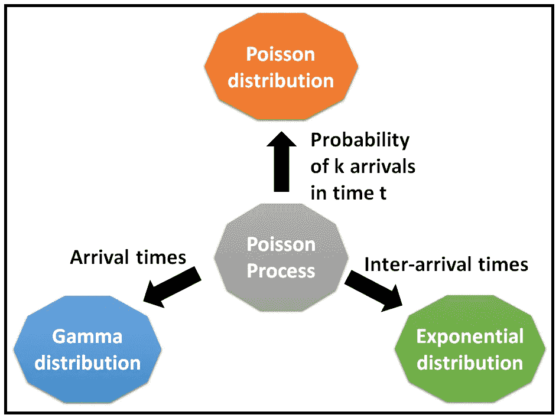**

**The sub-structure of the Poisson process (Image by [Author](https://sachin-date.medium.com/))**

## **模拟泊松过程**

**我们现在准备模拟整个泊松过程。**

**为此，我们需要遵循这个简单的两步程序:**

1.  **对于给定的平均发生率 **λ** ，使用逆 CDF 技术生成到达间隔时间。**
2.  **通过构建间隔到达时间的累计和来生成实际到达时间。**

**以下是模拟泊松过程的 Python 代码:**

**Python code to simulate a Poisson process**

**这是这个程序的输出，给了我们一个完全模拟但 100%真实的泊松序列:**

**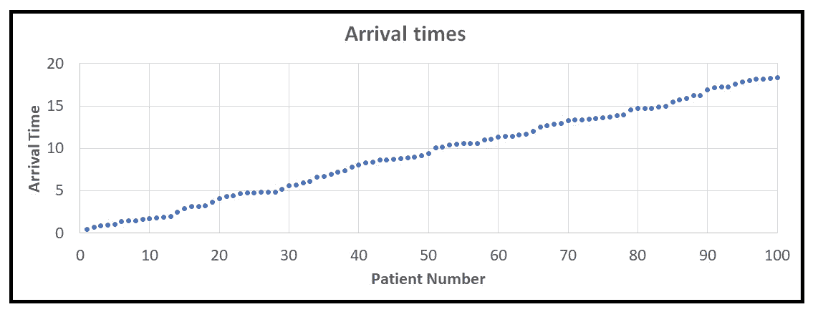**

**Poisson simulated arrivals (Image by [Author](https://sachin-date.medium.com/))**

**如果将到达时间向上舍入到最接近的小时，并将图旋转 90 度，可以发现平均到达率为每小时 5。**

**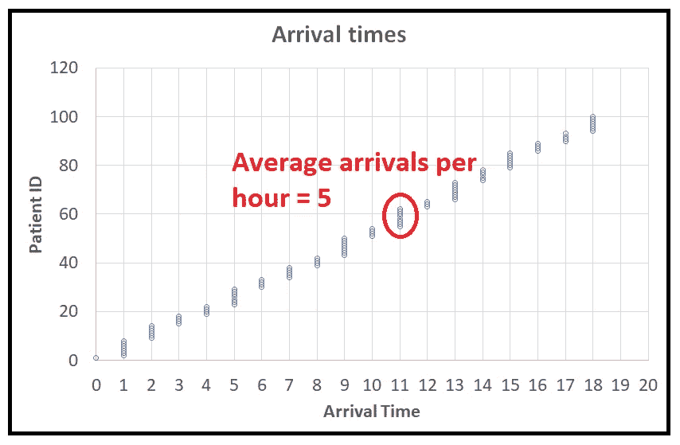**

**(Image by [Author](https://sachin-date.medium.com/))**

**以下是生成的完整源代码:**

*   **模拟泊松过程中连续事件之间的时间。**
*   **模拟泊松过程中连续事件的绝对时间。**
*   **模拟泊松过程中连续间隔内发生的事件数。**
*   **计算单位时间内的平均事件数。**

**Python code for Poisson process simulation**

## **相关阅读**

** [## 这种随机的生活

### 我们日常生活中有趣的随机线索

towardsdatascience.com](/this-stochastic-life-5146368bfd59)  [## 泊松回归模型图解指南

### 和使用 Python 的泊松回归教程

towardsdatascience.com](/an-illustrated-guide-to-the-poisson-regression-model-50cccba15958)  [## 泊松分布公式的直觉

### 这是二项式的极限。但是为什么呢？

towardsdatascience.com](/the-intuition-for-the-poisson-distribution-formula-34c5e52f4e04) 

*如果你喜欢这篇文章，请关注我的*[*Sachin Date*](https://timeseriesreasoning.medium.com)*以获得关于回归、时间序列分析和预测主题的提示、操作方法和编程建议。***