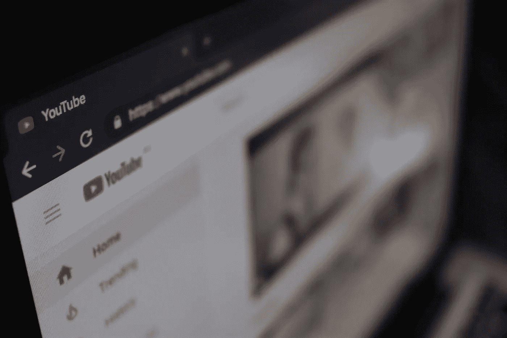

# YouTube 人工智能的政治

> 原文：<https://towardsdatascience.com/the-politics-of-youtubes-ai-289148c14e38?source=collection_archive---------33----------------------->

如果有人上传了一个极端暴力和血腥的视频——比如，有人因中毒而口吐白沫，或者一位父亲抱着他们垂死的婴儿 YouTube 的人工智能应该标记并从他们的网站上删除它吗？显而易见的答案是:是的。

也可能不是。

## **YouTube 审查的规模**

每天每分钟大约有 300 个小时的视频被上传到 YouTube。网站上难以想象的内容规模意味着人类无法独自审查所有可能提交出版的暴力、露骨或其他令人反感的材料。

幸运的是，谷歌(YouTube 的母公司)已经开发出了使用先进的机器学习技术的算法，可以在造成任何损害之前扼杀有害内容。例如，仅在 2019 年第一季度，该网站就屏蔽了 800 多万个视频。在这 800 万人中，超过 600 万[被 YouTube 的人工智能识别并删除，其中 70%是在一次观看被记录之前。当涉及到暴力极端主义内容时，这个数字甚至更好。甚至早在 2017 年，YouTube 的人工智能就能够捕捉到上传到该网站的 98%的恐怖视频。](https://www.ibc.org/publish/-frot-coutaz-youtubes-priority-is-tackling-harmful-content/4208.article)

考虑到今天的图像识别技术仍然是一个不断发展、尚未完全发展的领域，以及考虑到这些算法必须推动的材料的广度，这些数字构成了一个巨大的成功。但 YouTube 的人工智能删除不良内容的速度只能告诉你故事的一部分。对于所有离线拍摄的危险视频，也有大量的误报。

## **灵敏度**

假设你是一个商场警察，每天有几千人走进你的商场。你会对进出的人进行多严密的检查？出于安全考虑，你会拦住多少人进行审查？可能不多，因为受保护的东西的性质。

但如果你是运输安全管理局的特工呢？

受保护内容的性质迫使你在筛选时更加小心。美国运输安全管理局的工作人员不断地对乘客进行筛查，哪怕是最轻微的怀疑，因为让威胁通过的风险太大了。

我们可以把购物中心警察和运输安全管理局特工之间的区别称为敏感度。

事实证明，对于面向安全的软件和面向安全的专业人员来说，敏感性是同等重要的考虑因素。例如，在网络安全领域，恶意软件通常被伪装成普通数据，以试图在不被发现的情况下进入易受攻击的计算机。因此，安全程序必须对任何看起来像病毒的东西敏感。或许，对于个人电脑来说，滤镜可以让多一点的通过。但是高度敏感的政府计算机网络呢？在这种情况下，程序必须调整到高度敏感——对任何警告都竖起耳朵，即使这意味着会产生许多误报。

Ulrich Kaiser 是一名来自德国的音乐理论教师。去年，在他的一个教育视频被 YouTube 的[内容 ID](https://support.google.com/youtube/answer/2797370?hl=en) 系统离线后，该系统记录版权作品，并检查它们是否在平台上的其他地方被复制和滥用。他想知道为什么完全合法的音乐会被网站禁止，所以他开始了一个[实验](https://wikimediafoundation.org/news/2018/08/27/can-beethoven-send-takedown-requests-a-first-hand-account-of-one-german-professors-experience-with-overly-broad-upload-filters/)。他开通了一个新的 YouTube 账户，并开始努力上传去世已久的作曲家创作的公共领域音乐。几乎不可避免的是，每一次，他的视频都被标记为侵犯版权，并被网站屏蔽。

为什么这些视频被删除的可能性如此之大？出于同样的原因，美国运输安全管理局的特工会对乘客进行过度筛查。公共知识的版权专家梅雷迪思·罗斯告诉 Vice 的[主板](https://www.vice.com/en_us/article/59jgka/a-brief-history-of-youtube-censorship):“算法匹配总是不精确的，公司在法律上被鼓励在过滤中过度包容。”因为算法并不完美，而国际法律又是多种多样和复杂的，YouTube 被鼓励过度审查他们网站上的内容，并接受在这个过程中会产生一定数量的误报。音乐教师可能有理由感到不满，但另一种选择——审查不足——会糟糕得多。

## **做正确事情的后果**

每天必须处理的内容数量，加上发布危险材料的后果，意味着 YouTube 的监管者已经将他们的审查算法调高了，这是可以理解的。

不幸的是，不仅仅是古老的古典音乐被人工智能拿下。今年 2 月，与 Pokemon Go 和 Club Penguin 相关的多个频道因显示禁止的性内容而被[标记为](https://www.polygon.com/2019/2/18/18229640/pokemon-go-youtube-channels-banned-trainer-tips-mystic7-cp)。原来，YouTube 的 AI 捡起了他们使用的缩写“CP”，它解释为引用儿童色情(在 Pokemon Go 中，CP 指的是“战斗力”，在 Club Penguin 中，CP 只是指游戏的标题)。就在几周前，同一个人工智能开始标记战斗机器人(一种小众运动)的视频，将这些视频解释为虐待动物的演示。

每当这些误报出现时，它们都会引起一点骚动，它们被处理，谷歌的人工智能因此变得更好。机器人战斗中的短暂中断是为了让暴力和极端的材料远离平台而付出的小小代价。

但事情并不总是这么简单。有时，暴力和极端与合法和重要重叠。我在这篇文章的开头问你:YouTube 的人工智能应该禁止人们——婴儿，甚至——中毒和死亡的视频吗？显然，答案似乎是*是的*。

叙利亚内战期间，当记者和人权活动人士试图记录巴沙尔·阿萨德政府对其人民实施的暴行时，他们向 YouTube 寻求帮助。他们开始拍摄正在发生的暴行，向世界展示事情有多糟糕。视频显示了可怕的暴力:有人中毒，有人死亡，甚至儿童和婴儿死亡。然后，超过 10 万个视频被 YouTube 审查算法删除。

YouTube 是一个巨大的平台，有巨大的力量影响世界的积极变化，也有巨大的责任保护普通人免受伤害。支撑这一切的人工智能是非凡的——几乎令人难以置信地有效——也是不完美的，有着滑稽和有害的失态倾向。好的一面是:一年比一年好。