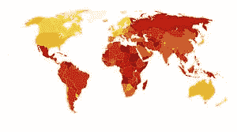

# 公开数据抑制腐败的潜力

> 原文：<https://towardsdatascience.com/the-potential-of-open-data-to-curb-corruption-23c7002f29e1?source=collection_archive---------44----------------------->

> *以下文章写于 2018 年墨西哥大选之前，证明了公开数据可能是打击腐败的关键因素。*

2018 年 7 月 1 日，墨西哥选民将选出新总统，任期 6 年。在整个选举季节，热点问题都围绕着腐败，如何遏制腐败，以及哪个政党的不可告人的秘密最少。随着选举日的临近，民粹主义领先者安德烈斯·曼努埃尔·洛佩斯·奥夫拉多尔(Andrés Manuel López Obrador)似乎有望赢得竞选。

无论谁获胜，墨西哥的选举民主都面临一个大问题:钱。

腐败在政治辩论中的中心地位部分解释了为什么安德烈斯·曼努埃尔·洛佩斯·奥夫拉多尔，或者他所知道的 AMLO，会领先群雄。多年来，AMLO 塑造了一个对物质财富漠不关心、不易腐败的人的形象。尽管如此，他和其他候选人都没有深入讨论墨西哥当前的反腐议程——公开数据在这一议程中发挥着重要作用。

最令人惊讶的沉默候选人是现任革命制度党的何塞·安东尼奥·米德，他将从展示他的政党的进步透明度倡议中受益。近年来，在国家开放数据政策方面，墨西哥已经成为经济合作与发展组织(OECD)中[最先进的国家之一，目前在 OECD 的 35 个成员国中](http://www.oecd.org/)[排名第 5](http://www.oecd.org/gov/digital-government/open-government-data-review-of-mexico-9789264259270-en.htm)。

这个成绩不是偶然的。这是联邦政府通过让公众更容易获取公共数据来提高墨西哥透明度和问责制的结果。但随着这些举措的启动，围绕开放数据作为遏制腐败手段的乐观情绪是否有根据？简单来说，策略有回报吗？

为了找到答案，我们首先必须就如何衡量成功达成一致。在跨国研究中，[透明国际](https://www.transparency.org/)每年发布的[清廉指数(CPI)](https://app.namara.io/#/data_sets/36bc3397-4b28-476b-b647-44ad23921c16) 是了解哪些国家反腐取得进展的基准。

CPI 通过“公共部门腐败的感知程度”来衡量 180 个国家。然而，通过衡量对腐败的看法，CPI 衡量的不是事件而是意见，因此是一个有问题的尺度。例如，2018 年关于拉丁美洲的调查报告称，尽管承认该地区作为一个整体在反腐败斗争中取得了“[巨大进步](https://www.transparency.org/news/feature/perceptions_remain_unchanged_despite_progress_in_the_americas)”，但对该地区的看法仍未改变。

很明显，需要一个新的衡量标准来超越过去的观念，成为现实。这就是开放数据的关键所在。利用政府公布的数据集，过去几年提出了一些衡量腐败的替代指标。其中一个指标是 T2 腐败风险指数(CRI)。它由 Fazekas 和 Kocsis 开发，由 2009 年至 2014 年期间 27 个欧盟成员国(加上挪威)超过 280 万份政府合同的公开官方电子记录组成。CRI 通过一个“危险信号”的综合指数来衡量公共采购中的腐败风险(例如，竞争性市场中的单一招标，反复使用“直接”或“紧急”奖励)，这些信号表明[潜在的腐败行为](http://www.govtransparency.eu/wp-content/uploads/2015/11/GTI_WP2015_2_Fazekas_Kocsis_151015.pdf)。虽然这些行为本身都不一定是腐败行为，但它们提供的数据点表明腐败环境的可能性更高。

墨西哥竞争研究所(IMCO)在今年早些时候发布的一项关于墨西哥公共招标系统的研究中采用了 CRI 的一个版本。利用联邦政府 2012 年至 2017 年间 70 万份记录的数据库(相当于那些年总支出的 10%)，IMCO 得出了两个重要发现:

> 该期间 80%的合同授予了 1.9%的投标人(129，411 人中的 2，512 人)；和
> 
> 授予前 1000 名投标人的合同中有 71%是通过直接裁决授予的。

同样，这些发现并不是腐败的证据，但它们确实暴露了墨西哥的招标系统缺乏竞争。人们可以由此合理地得出结论，政府没有充分利用技术来降低采购成本，并且在当前的系统中腐败的风险很高。

> “腐败的影响……肯定会影响投资成本”——墨西哥美国商会税务事务负责人 Luis Gerardo del Valle

IMCO 的发现还表明，开放数据本身并不是腐败的解决方案。事实是，在大多数情况下，腐败难以确定，直接衡量腐败远非一门精确的科学。除此之外，公职人员正在不断适应他们的环境，在当前的政治气候下，这意味着包括使用数据分析来衡量他们的表现。腐败的发展速度通常与防范措施的发展速度相同。事实上，腐败的本质是，大多数试图有效衡量腐败的人最终都像刘易斯·卡罗尔的《红皇后》一样:不停地奔跑，只是为了呆在同一个地方。

然而，通过开放数据门户提供公共信息基线是朝着正确方向迈出的关键一步。阳光是最好的消毒剂，对公共记录的整体分析可以大大削弱各级政府的腐败行为。为了跟上、跟踪和预测腐败，分析必须敏捷、灵活、具有适应性和实验性，但将相关数据转化为有价值的输入是打击腐败和确保信任的第一步。

ThinkData Works 正在连接成千上万的公共数据源，并与公司和政府合作，将数据转化为可操作的见解，帮助监管合规性，改善信息收集，并打开新信息的大门。如果您想了解我们如何帮助追踪腐败，请 [**联系我们**](https://www.thinkdataworks.com/contact) 。

【https://blog.thinkdataworks.com】最初发表于**。**