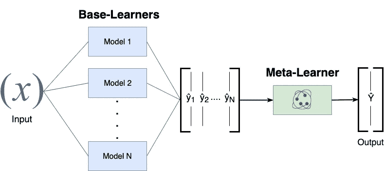
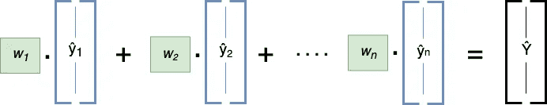
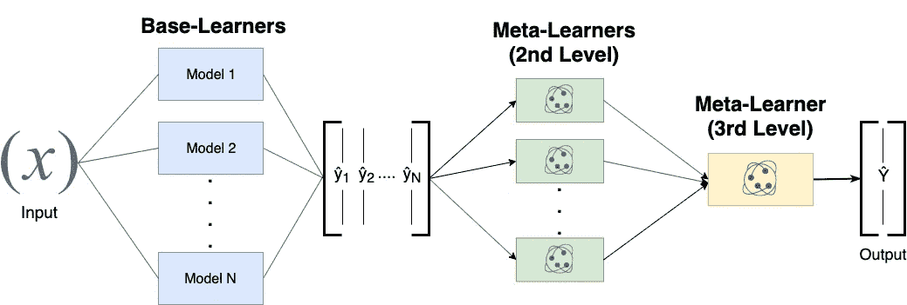

# 深度学习中集合的力量

> 原文：<https://towardsdatascience.com/the-power-of-ensembles-in-deep-learning-a8900ff42be9?source=collection_archive---------17----------------------->

## 介绍 DeepStack，一个用于构建深度学习集成的 python 包


Photo by [Manuel Will](https://unsplash.com/@manufactured?utm_source=medium&utm_medium=referral) on [Unsplash](https://unsplash.com?utm_source=medium&utm_medium=referral)

集成构建是机器学习竞赛的主要获胜策略，并且通常是用于解决现实世界问题的技术。经常发生的情况是，在解决一个问题或参加一场比赛时，你最终会有几个经过训练的模型，每个模型都有一些不同之处——并且你最终会根据你的最佳评估分数挑选出你的最佳模型。**事实是，你的最佳模型对数据的“了解”比所有其他“弱模型”的总和还要少**。将几个基本模型组合在一起创建一个更强大的集合模型，然后作为这个工作流程的自然副产品上升为**。**

> “没有一个非常强大的团队，你真的不可能赢得大多数 Kaggle 比赛。你最好的个人模特再好，也配不上好的合奏。” [*朱利亚诺·詹森在 quora (2016)*](https://www.quora.com/What-machine-learning-approaches-have-won-most-Kaggle-competitions)

集合的范围从简单的加权平均值到复杂的二级和三级元模型。回到为我的机器学习竞赛构建我的集合模型，我最终创建了几个代码块，帮助我测试不同的集合策略，并在这样的挑战中赢得或表现得更好。因此，我只是提出了一个自然的问题:**如果我能让构建深度学习集成变得像编写几行 python 代码一样简单，并与社区分享这一点**会怎么样？这些单独的项目孕育成脚本，并成熟为一个我命名为 **DeepStack** 的 python 包。

# **合奏简介**

集成学习就是学习如何最好地组合来自多个现有模型的预测(称为**基础学习器**)。集合中的每个成员都对最终的输出做出贡献，而其他成员的贡献抵消了个体的弱点。组合的学习模型被命名为**元学习器**。集成学习有几种风格。在本文中，我们将特别关注目前由 **DeepStack** 支持的两种方法。即:

**#1 堆叠**:在堆叠中，基础学习者的输出被用作训练元学习者的输入，元学习者学习如何最好地组合基础学习者的预测。



**Stacking** combines multiple predictive models in order to generate a new combined model.

由于叠加模型的平滑特性，叠加模型通常会优于每个单独的模型，抵消了单独模型的不足，从而获得更好的预测性能。**因此，当基本型号基本不同时，堆叠效果最佳**。

**#2 加权平均集成**:该方法基于每个集成成员在拒绝验证数据集上的表现，对其贡献进行加权。贡献较大的模型获得较高的权重。



**Weighted Average Ensemble** is all about weighting the predictions of each base-model generating a combined prediction.

这两种方法的主要区别在于，在堆叠中，元学习者将基础学习者的每一个输出作为训练实例，学习如何最好地将基础学习者的决策映射到改进的输出中。元学习者可以是任何经典的已知机器学习模型。另一方面，加权平均集成只是优化用于对基础学习者的所有输出进行加权的权重，并取加权平均值。这里没有元学习者(除了权重)。这里，权重的数量等于现有基础学习者的数量。

不用说，当构建一个集合时，你需要一个还没有被基础学习者看到的**训练数据集**，以避免过度拟合。你还需要一个支持(**验证**)数据集来指导/测试你的系综的表现。

集成学习有几种技术，我肯定会推荐约瑟夫·罗卡的这篇文章来深入了解诸如**增强**和**打包**之类的概念。《Kaggle 卡格尔组装指南》也是一本好书。

# 使用 CIFAR-10 数据集的 DeepStack 演练

准备好用真实的例子编码了吗？在接下来的几分钟里，我将向您展示如何使用 CIFAR-10 数据集通过 **DeepStack** 轻松构建集成。 [CIFAR-10](https://www.cs.toronto.edu/~kriz/cifar.html) 数据集由 10 类 60000 幅 32x32 彩色图像组成，每类 6000 幅图像。我们将开始创建简单的 CNN 来对图像进行分类，并使用前面描述的 2 种集成策略来创建单个 CNN 的集成。让我们开始吧。

```
pip install deepstack==0.0.9
```

现在，我们可以利用 DeepStack 接口并创建类 *deepstack.base.Member* 的实例，这些实例为构建集成的基本学习者提供了所有必要的逻辑。在这个演示中，我们将开始使用类 *KerasMember* ，它从*成员*继承而来，但是具有 Keras 模型的附加逻辑。基本原理是用元学习者的训练和验证数据集启动实例——我们已经为此构建了一个实用函数！

现在你可能会问自己，为什么我们用相同的训练和验证数据集初始化所有 4 个对象？嗯，你不需要。你的 *keras* 模型可以用不同的*图像数据生成器*进行训练，你可以直接将数据生成器作为参数传递给 *KerasMember* 。这里重要的是类标签( *y_train* / *y_val* )在成员之间是相等的，这样我们可以在后面的步骤中验证和比较基础学习者。

现在我们已经有了所有必要的构件，让我们创建我们的第一个合奏。

瞧，您应该会看到类似的输出，如下所示:

```
model1 - Weight: 0.2495 - roc_auc_score: 0.9269
model2 - Weight: 0.4498 - roc_auc_score: 0.9422
model3 - Weight: 0.0031 - roc_auc_score: 0.9090
model4 - Weight: 0.2976 - roc_auc_score: 0.9135
DirichletEnsemble roc_auc_score: 0.9523
```

对于作为默认评分函数的 AUC，加权平均集成比最佳单一模型 w.r.t .表现好约 1%。如您所见，得分较高的模型也获得了较高的权重。引擎盖下发生了什么？ *fit()* 方法基于目标得分函数在训练数据集上的表现来优化基础学习者的权重。权重优化搜索通过基于验证数据集上的狄利克雷分布的贪婪随机搜索来执行。默认情况下，score 函数是[*sk learn . metrics . roc _ AUC _ score*](https://scikit-learn.org/stable/modules/generated/sklearn.metrics.roc_auc_score.html)，但是您可以将任何 score 函数传递给构造函数。 *describe()* 方法只是在验证数据集上打印单个模型和集合的性能。

堆叠怎么样？

```
model1 - accuracy_score: 0.6116
model2 - accuracy_score: 0.6571
model3 - accuracy_score: 0.5500
model4 - accuracy_score: 0.6062
StackEnsemble accuracy_score: 0.6989
```

这个例子将来自 *scikit-learn* 的 *RandomForestRegressor* 作为元学习者。回归任务是基于基础学习者的类概率输出来优化(预测)10 个类的输出概率。但是分类器概率在这里也完全适用。DeepStack 注重灵活性，一切由您决定。这一次，我们将重点放在准确度分数上，与单独的最佳模型相比，通过叠加，我们可以获得 4%的准确度。

# 使用 scikit-learn 堆叠分类器进行三级堆叠

在叠加概化中，叠加级别的数量没有限制。然而，更高的级别数量不一定保证更好的结果。如前所述，只有通过实验和基础学习者之间的高度差异才能找到最佳架构。



Example of a 3-levels Stacking

*Scikit-learn* 0.22 引入了一个`[**StackingClassifier**](https://scikit-learn.org/dev/modules/generated/sklearn.ensemble.StackingClassifier.html#sklearn.ensemble.StackingClassifier)`和`[**StackingRegressor**](https://scikit-learn.org/dev/modules/generated/sklearn.ensemble.StackingRegressor.html#sklearn.ensemble.StackingRegressor)`，允许您拥有一堆 *scikit-learn* 估计器，以及一个最终分类器或回归器。不错！我们现在可以利用 *scikit-learn* 堆栈接口，用 DeepStack 构建第三级元学习者:

但是如果 *scikit-learn* 已经支持堆栈了，为什么我还需要 DeepStack 呢？DeepStack 的开发是为了在你已经有一大群预先训练好的模型，并希望将它们捆绑在一起，创建一个更强大的模型的情况下使用。也就是说，你不用 DeepStack 来创建或训练你的基础学习者。DeepStack 也是通用的，不依赖于用于创建基础学习者的库( *keras、pytorch、tensorflow* ，等等)。
sci kit-learn*堆栈 API 支持使用 *scikit-learn* 模型从头开始创建(培训)基础学习者——这不是我们这里的用例。*

这仅仅是表面现象。用于将 DeepStack 与您的任何 *pyTorch、tensorflow* 等的输出一起使用。为他们建模和培养元学习者检查类[*deep stack . base . member*](https://github.com/jcborges/DeepStack/blob/master/deepstack/base.py)。您还可以为系综指定任何自定义目标评分函数。DeepStack 还允许你**保存和加载**你的合奏，以便以后优化。

对于上面给出的例子，我们采用了一个相对简单的 CNN 模型，在几(25)个时期进行训练。事实上，更复杂和训练有素的模型已经[报告](https://mlwave.com/kaggle-ensembling-guide/)在 CIFAR-10 上达到 93.17%的准确性，其加权平均系综报告达到 94.12%。这 1%的错误率降低使结果超出了人类分类的准确度。

对尝试 DeepStack 感到兴奋吗？那么祝组装愉快！