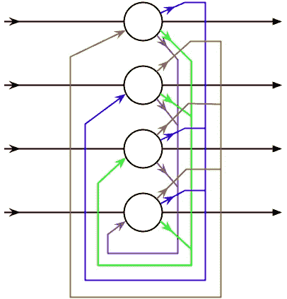

# 递归神经网络的力量

> 原文：<https://towardsdatascience.com/the-power-of-recurrent-neural-networks-1ef056dae2a5?source=collection_archive---------25----------------------->

## …以及它们如何让我们在给定正确数据的情况下学习几乎任何动态系统

> 有了四个参数，我就能适应一头大象，有了五个参数，我就能让它扭动鼻子。

*近年来，神经网络已经主导了现代人工智能研究，这是有充分理由的:它们提供了从数据中提取复杂模式的强大工具，无论是分类还是生成图像，辅助医疗诊断还是处理自然语言。*

*作为一个简短的提醒:神经网络是由一组称为神经元的定向单元组成的。这些神经元可以相互连接并传递输入，这取决于它们各自连接的强度。给定单元的输入之和通过激活函数运行，以给出其输出。*

*生物直觉在这里可以派上用场(尽管它们有其局限性):你可以将神经网络想象为一组通过突触连接的神经元，它们要么激活，要么不激活，取决于它们接收到多少输入。它们各自连接的强度决定了来自一个神经元的输入在多大程度上激发或抑制了它所连接的神经元的活动，而激活函数决定了在给定输入的情况下它如何以及何时触发。*

*虽然神经网络已经证明确实擅长做一系列事情，但许多人(包括本文中的我)认为，至少在某种程度上，纯神经网络在解释我们的大脑和为更复杂的、类似人类的人工智能提供架构基础的能力方面被高估了。有很多事情他们不能做，而且短期内也不会做。*

*但同时，神经网络是强大的近似器。更详细地研究神经网络在更正式的意义上能做什么，会让我们在数学和理论计算机科学的重叠部分得到一些有趣的结果，同时也有一些神经科学的含义。*

## *通用逼近定理*

*从两体问题转到三体，物理系学生在第二学期通常会惊恐地发现，几乎没有任何现实世界的问题可以用解析方法解决。*

*但幸运的是，我们有办法找到困难问题的完美解决方案:近似和分解成更小、更简单的比特和函数是数学家和物理学家食谱中最巧妙的技巧。三角函数和指数函数可以分解成多项式，函数可以围绕一个点进行泰勒展开，概率分布可以用高斯近似，像牛顿-拉夫森方法这样的数值方法允许我们迭代地寻找函数的根，等等。*

*正如冯·诺依曼在他厚颜无耻的评论中指出的，只要给定足够多的参数，以及足够有表现力的参数，你几乎可以将任何东西与任何东西相匹配。*

*因此同样可以证明，实空间的连续子集上的所有函数都可以通过组合一组简单函数来近似。逼近任何其他函数所需的函数的这种简单组合可以由配备有正确激活函数的单层神经网络来表达。*

*这个以 ***命名的定理被称为通用逼近定理*** ，被[西本科证明对 sigmoid 激活函数](http://citeseerx.ist.psu.edu/viewdoc/download?doi=10.1.1.441.7873&rep=rep1&type=pdf)成立，但是也可以扩展到其他，例如[双曲正切](https://link.springer.com/article/10.1007/s11766-015-3000-9)。*

*然而，当马文·明斯基和西蒙·派珀特在 1969 年出版了他们关于感知机的书[时，引起了不小的轰动，他们在书中表明，有许多直观上非常简单的函数是神经网络无法逼近的，例如奇偶校验(这涉及到它们不存在于真实空间的连通子集上的问题)，但事实证明，使用多层深度神经网络也可以逼近这些类型的函数。](https://en.wikipedia.org/wiki/Perceptrons_(book))*

*因此，在一些温和的约束下，我们可以表达几乎任何我们想要的函数(假设有足够大的神经网络，有足够多的层和足够多的参数可以调整)，并使用该函数将输入映射到输出，这本质上就是函数所做的。*

*这已经很不错了。我们可以装大象。但是我们能让他扭动他的鼻子吗？*

## *动力系统近似和递归神经网络*

*递归神经网络(RNNs) ( [此处阅读](https://neptune.ai/blog/recurrent-neural-network-guide)进行概述)是人工神经网络的一个子类型，其中包括一个时间序列，允许网络展示动态行为(系统如何随着时间的推移而表现)。*

**

*In a recurrent neural network, units of a given layer are interconnected among each other. Credit to Zawersh at the English Wikipedia [CC BY-SA 3.0]*

*1993 年，船明石和中村证明了通用逼近定理[同样适用于动力系统](https://link.springer.com/chapter/10.1007/11840817_66)。*

*为了理解它是如何做到的，我们需要理解一个动力系统的特征是它的流场加上一些初始条件。这个流场决定了其状态变量的导数，从而决定了其时间行为。这个流场可以写成一个函数(其中 x 后面的撇号表示导数……很抱歉，Medium 并不真正适合数学方程):*

***x'(t)=F(x(t))***

*我们通常可以在时间上对这些动力系统进行离散化，在某种意义上，我们通过时间 **t** 上的值的函数来定义某个时间**x**t+1，并通过新的函数 **G(x(t))** 来重新表达流场，该函数负责这种映射:*

***x(t+1)=G(x(t))***

*我们如何从 **F(x)** 移动到 **G(x)** 的数学细节可能有点复杂，但底线是系统在时间 **t+1** 的状态取决于时间 **t** 的状态，通过函数 **G** 发送。变量 **x(t)** 可以被认为是在时间 **t** 时递归神经网络的输出层中的一个单元的值，你可以读出它，就像在每个前馈神经网络中一样。*

*然后，通过一次又一次地迭代应用这种映射，系统随时间的动态变得清晰:*

***x(t+2)=G(x(t+1))***

*如果你知道系统在时间 **t=0** 的初始状态，你将知道它在未来 **t=T** 的每一点的状态，因此，你将完全表征系统。*

*看，大象正在扭动他的鼻子。*

**

*Photo by [高兴的 老父亲](https://unsplash.com/@superdyz123?utm_source=medium&utm_medium=referral) on [Unsplash](https://unsplash.com?utm_source=medium&utm_medium=referral)*

## *学习动力系统*

*正如 Funahashi 和 Nakamura 所述，动态时变系统在所有科学领域都有相当广泛的应用。生活不是一成不变的，几乎所有值得研究的东西都在不停地移动和摆动。道琼斯指数是动力系统的可观测值。因此，地壳变动有可能导致地震。*

**

*A time-series characterizes the dynamics of a system. Photo by [Chris Liverani](https://unsplash.com/@chrisliverani?utm_source=medium&utm_medium=referral) on [Unsplash](https://unsplash.com?utm_source=medium&utm_medium=referral)*

*这样的例子数不胜数，但是假设我们在野外发现了一个令我们感兴趣的动力系统。*

*假设我们只有一些不同时间的观测值**x _ I****t _ I**，但我们仍然缺乏对系统底层动力学的了解，这些动力学分别由函数 **F(x)** 或 **G(x)** 编码。*

*请注意，这是几乎所有科学实验的现状。*

*现在，我们可以从纯数据科学的角度提出以下问题:我们如何学会通过拟合模型来解释数据 x_i ，而不必通过分析找出正在发生的事情？*

*答案来自我们到目前为止所讨论的一切:我们通过计算我们网络的循环连接如何逼近函数 **G(x)** 来实现这一点，该函数相当于动力系统的流场。*

*这使我们能够在网络的参数内编码其整个动态特性，**这可以通过通常的机器学习优化算法来学习，如从数据中梯度下降。***

## ***了解大脑的动态***

*最著名也最令人困惑的动力系统之一是大脑。神经元的相互作用形成了一个动力系统，其中与循环神经网络的直观联系似乎非常清楚。*

*但是大脑中有许多动态子系统。例如，每一个神经元本身又是一个复杂的动力系统。 [Hodgin-Huxley 模型](https://en.wikipedia.org/wiki/Hodgkin%E2%80%93Huxley_model)描述了神经元的放电如何取决于突触内离子流的时间依赖性所导致的变化的突触电导。*

*但是正如我们可以用 RNN 来学习任何动力系统一样，这意味着我们也可以用 RNN 来学习模拟单个神经元的动力。*

*研究表明，许多精神疾病都与网络动力学的变化有关([阅读这里可以获得一个很好的概述](https://arxiv.org/pdf/1809.06303.pdf))，大脑的许多有用的计算能力，如联想记忆，可能会从吸引子状态等动态系统属性中出现(Hopfield network 就是这种情况的早期实现)。*

*例如，假设我们有大脑数据，无论是健康患者还是精神分裂症患者的 FMRI、脑电图或单个神经元棘波序列。[然后，我们可以尝试用](https://journals.plos.org/ploscompbiol/article?id=10.1371/journal.pcbi.1007263)学习数据背后的动力系统，这是一个带有 ***机器学习算法*** 的递归神经网络，就像 ***变分自动编码器*** 。*

*一旦我们从数据中学习了最佳模型并在 RNN 中对其进行了编码，我们就获得了数据的生成模型([我在本文](/how-to-make-computers-dream-3b4b10e4463a)中解释了什么是生成模型以及为什么它们如此酷)。然后，我们可以分析这个模型，以提高我们对可能导致与精神分裂症等病理相关的网络动态变化的理解。*

*根据模型的复杂程度，我们还可以尝试使其具有生物学可解释性([可解释性的问题](/explainability-and-the-art-of-confabulation-d4fb176de982)在这种情况下仍然存在，就像在许多其他机器学习应用中一样)，以便从学习到的模型中提取生物学因果机制，并模拟新医疗干预的效果。*

*然而，大脑是非常混乱和复杂的，这些方法在实践中还很难实施。*

*但另一方面，大脑的复杂性表明很难对其进行分析性描述，因此我们需要基于统计学和数据科学的方法来学习良好的近似模型。*

*递归神经网络的近似能力可以提供一个非常有价值的工具来做到这一点。*