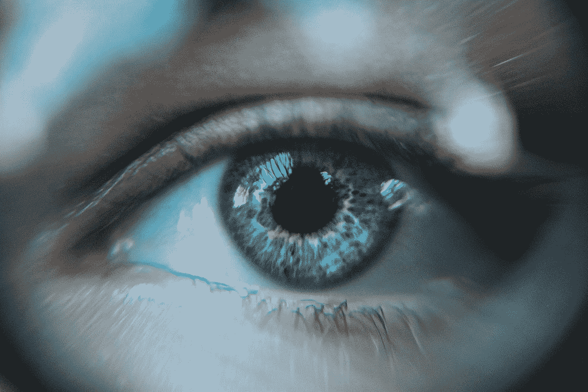
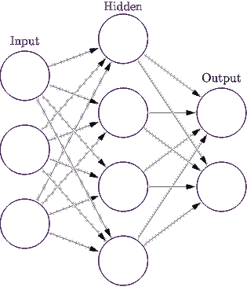
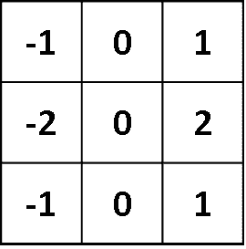
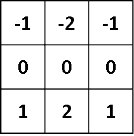
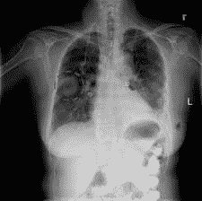
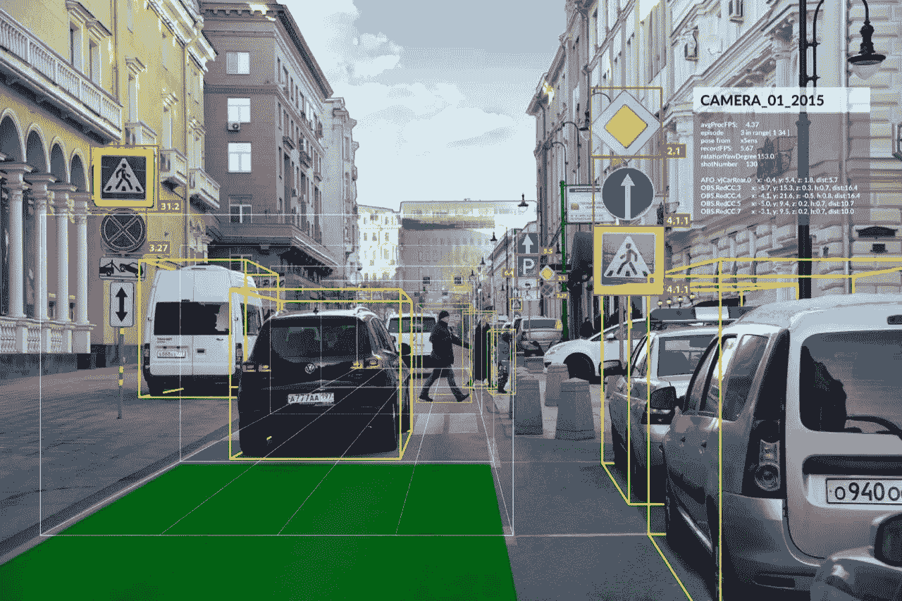

# 视觉的力量——赋予计算机眼睛

> 原文：<https://towardsdatascience.com/the-power-of-vision-giving-computers-eyes-a92b86868345?source=collection_archive---------34----------------------->

## 眼睛是灵魂的钥匙。但是如果那些眼睛属于一台电脑呢？

Source: [Josh Calabrese](https://unsplash.com/@joshcala)

**给我出个谜语。**

> 读起来像一个字母，写起来有三个，我有一个我看不见的双胞胎兄弟。

**答案？**

> 眼睛。

我们的眼睛在我们的生活中扮演着非常重要的角色，因为它给了我们视觉的天赋。视觉对我们的学习至关重要。它是加深我们对世界理解的关键。

但是，如果我们希望计算机也能深刻理解这个世界，我们该怎么做呢？

我们通过计算机视觉赋予它眼睛！

Source: [Daniil Kuželev](https://unsplash.com/@kuzelevdaniil)

等一下。什么是计算机视觉？

计算机视觉是一个跨学科的研究领域，在这个领域中，我们训练计算机对数字图像或视频有更深入的理解。它是人工智能中机器学习的子集。它负责自动驾驶汽车、机器人、无人机、安全、医学成像和视障人士的治疗。

**它是如何工作的**

这项令人惊叹的技术背后是神经网络。或者更具体地说，卷积神经网络(CNN)。CNN 主要用于对图像进行分类和聚类。它们可以用来识别人脸、街道标志、肿瘤和许多方面的视觉数据。CNN 推动了计算机视觉的进步。其中比较著名的 CNN 是 AlexNet。Alex Krizhevsky 设计的 AlexNet 包含八层——前五层是卷积层，其中一些是 max-pooling 层(减少参数，以便更容易识别特征)，最后三层是完全连接的层。

卷积神经网络由 3 个主要层组成:

1.  输入层:获取输入数据
2.  输出层:产生处理过的数据
3.  隐藏层:提取数据中的模式。这些层的数量取决于数据的复杂程度。

Source: [https://en.wikipedia.org/wiki/Artificial_neural_network#/media/File:Colored_neural_network.svg](https://en.wikipedia.org/wiki/Artificial_neural_network#/media/File:Colored_neural_network.svg)

神经网络的组成在其结构中具有许多层，这些层具有许多互连的节点。每个节点都有自己的角色。当图像被输入到神经网络中时，每个节点负责图像的某个部分，并且根据它是否满足标准来激活它。

例如，你将一朵玫瑰的图像输入网络。

神经网络将扫描每个像素，使用线性代数中的核计算每个像素的颜色梯度。他们测量左边像素和右边像素的色差来判断是否是边缘。

This kernel would measure the vertical edges in the image. The pixel being scanned would be the one directly in the middle. Source: [Github](https://www.google.com/url?sa=i&source=images&cd=&ved=2ahUKEwizoLuX4-_lAhUBXawKHeQdCxEQjRx6BAgBEAQ&url=https%3A%2F%2Fmlnotebook.github.io%2Fpost%2FCNN1%2F&psig=AOvVaw2MYX9Od_UuWRo_tJGhT6LH&ust=1574029555293277)

This kernel would measure the horizontal edges in an image. Source: [Github](https://cdn-images-1.medium.com/max/600/0*4Ov9yGk2MCi8C1C1)

如果两边像素的颜色梯度差异很大，图像就能判断出这是一条边缘。

第一个隐藏层将扫描粗糙的边缘和曲线，每个节点负责图像的某个部分。网络继续通过更多的回旋，很快网络将能够识别特定的物体，如玫瑰，最后的回旋将它放在一起。

与人类的眼睛相比，计算机处于劣势。我们经历了多年的进化，教会我们如何识别图像并理解它们。电脑没有。但幸运的是，由于云上的大量数据，我们可以在几个小时内轻松获得训练图像来教计算机。

# **计算机视觉的应用**

计算机视觉的应用是无止境的，但这里有一些更值得注意的。

**疾病诊断**

使用计算机视觉，我们实际上可以诊断许多类型的疾病。例如，我们可以扫描某人肺部的 x 光片来检测肺癌。这被称为**计算机辅助诊断(CAD)** 最常用的放射科医生。为了检测肺癌，放射科医生必须仔细检查患者的每张 x 光片，以找到肺部的特定部位，即癌症。如果患者真的被发现患有癌症，这是低效的，并且花费治疗时间。使用计算机视觉，我们可以向网络输入标记的数据，教它如何检测肺部的癌症。

Source: [NIH](https://www.nih.gov/sites/default/files/news-events/news-releases/2017/20170927-lung-mass.jpg)

**自动驾驶汽车**

自动驾驶汽车使用 YOLO(你只看一次)技术来实现其自动驾驶技术。建立这些网络的最大困难是，它不仅需要了解对象，还需要了解对象是做什么的。因此，当网络检测到行人时，它还必须明白，根据交通规则，行人有先行权，汽车不应该碾过他们。

Source: [Your Keyboard Basket](https://www.analyticsinsight.net/wp-content/uploads/2019/01/Object-Detection.jpg)

计算机视觉最突出的例子之一是在自动驾驶汽车中。我们都知道**特斯拉，**全球无人驾驶汽车的领先品牌。它的突破性技术允许汽车自己停车、驾驶和转换车道。

最近，一篇关于 **YOLO 纳米**的论文发布了。 **YOLO 纳米**是 YOLO 技术的一个版本，它将 CNN 分解成更小的部分，以便它们以更快的速度处理图像。当汽车行驶时，他们摄取的图像由一个复杂的网络处理，每张图像都必须通过这个网络。这需要几秒钟，但对于在路上行驶的自动驾驶汽车来说，*时间太长了。* **YOLO 纳米**将 CNN 分解成*更小的网络，因此每一段被标记的数据只需通过一个短网络。*这将处理时间减少到了*几毫秒*，让汽车在更短的时间内做出决定。

就目前而言，人工智能对于普通大众来说是一个灰色地带。例如，对于自动驾驶汽车，如果客户不知道车辆做出决定的确切原因，他们在车内不会感到安全。所以为了保证客户愿意使用带 AI 的产品，我们必须向他们承诺透明。

## 给我解开这个谜。

> 医学影像和汽车的未来是怎样的？

## 答案？

> 计算机视觉。

这是显而易见的，但谁会知道我们的视觉，一些我们往往认为理所当然的东西，可以在我们的生活中发挥如此重要的作用？