# 数据科学中可视化的力量

> 原文：<https://towardsdatascience.com/the-power-of-visualization-in-data-science-1995d56e4208?source=collection_archive---------4----------------------->

## 一张照片真的胜过千言万语。

> “可视化实际上是关于外部认知的，即如何利用大脑以外的资源来增强大脑的认知能力。”— **斯图亚特·卡**

这篇文章关注数据可视化的重要性。科学、工程、商业和日常人类活动中产生的信息量和复杂性正以惊人的速度增长。好的可视化不仅呈现数据的可视化解释，而且通过提高理解、交流和决策来实现。

在大学的入门级课程中，几乎每个数据科学家都会学习可视化的重要性，但只有极少数人掌握了这一主题。由于其固有的主观性，它通常被认为是显而易见的或不重要的。在本文中，我希望消除一些这样的想法，并向您展示可视化是非常重要的，不仅仅是在数据科学领域，对于交流任何形式的信息也是如此。

我的目标是通过多个例子向读者展示一个设计良好的可视化在传达一个想法或一条信息方面的影响。此外，我将讨论制作有效可视化的最佳实践，以及如何着手开发他们自己的可视化和可用来做这件事的资源。

我希望你喜欢这个视觉之旅，并在这个过程中学到一些东西。

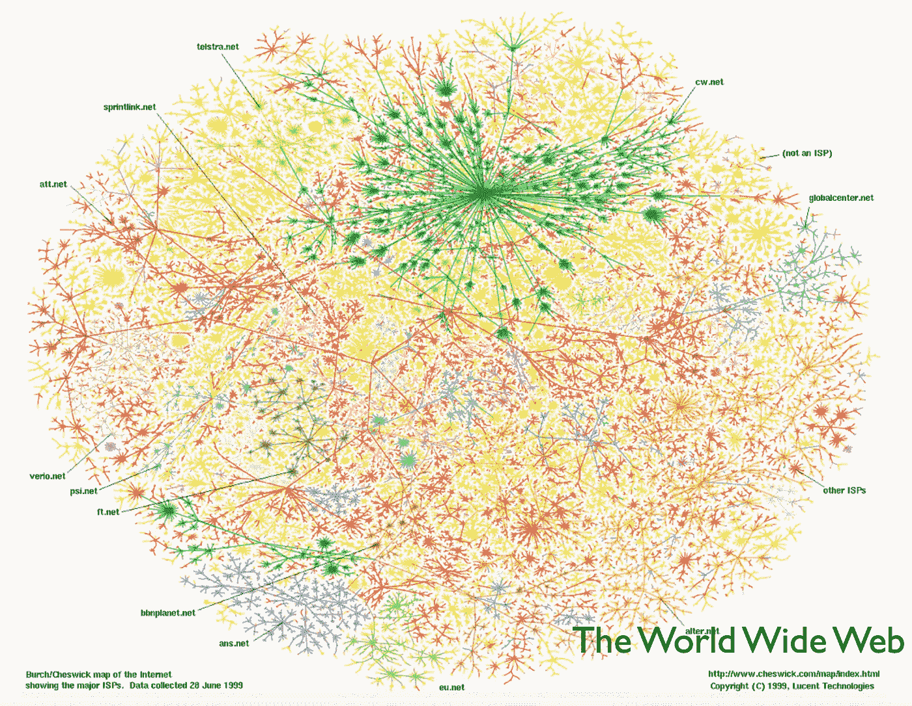

# **什么是可视化？**

美国传统词典将可视化定义为:

**①**心理视觉图像的形成。

在使用数据进行可视化的环境中，有必要给这个定义添加一些内容，这样它就变成了:

**形成心理视觉图像，通过数据的图形表示来传达信息。**

如果你正在从事数据科学方面的职业，这是你可以掌握的最重要的技能之一，并且它可以转移到几乎任何学科。让我们想象一下，你正试图说服你的经理投资一家公司，你向他们展示了一个充满数字的电子表格，向他们解释为什么这是一个如此好的投资机会。如果你是经理，你会如何回应？

如果以视觉形式呈现，信息往往更容易消化，特别是如果它利用了人类可以直观理解的模式和结构。如果你想要一个快速简单的可视化，几乎不需要任何努力，你可以使用饼状图或条形图。就开发可视化而言，这通常是大多数人所能达到的极限，而且通常是他们在专业领域所需要达到的极限。

另一个抑制我们使用可视化的因素是我们可用的数据量。我如何知道可视化是否是传达信息的合适方法？

这是一个很难回答的问题。一项设计研究建议我们根据任务的清晰度和信息的位置来评估使用可视化的可行性。

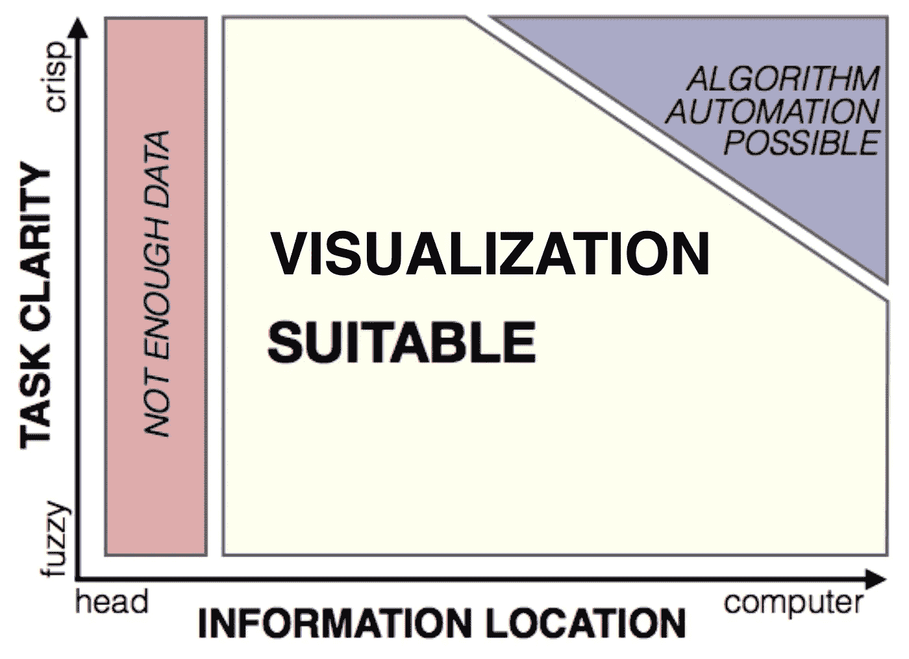

Design Study Methodology: Reflections from the Trenches and the Stacks, Michael Sedlmair, Miriah Meyer, and Tamara Munzner. IEEE Trans. Visualization and Computer Graphics, 2012.

如果我们在此图的右上角，开发和编程交互式可视化就变得可行，这是数据科学家现在正在进入的领域，因为信息爆炸导致数据规模持续增长。

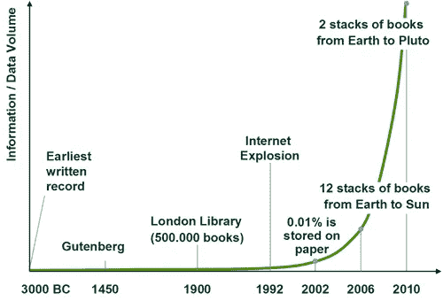

Information Explosion.

我们现在生活在一个数据驱动的世界，而且它很可能变得更加数据驱动。这在多个领域都很明显，比如在开发大规模传感器网络以及与世界互动的人工智能代理(比如自动驾驶汽车)方面的重要进展。

在一个数据至高无上的世界里，拥有开发清晰有效的可视化的能力正成为一项越来越必要的技能。

# **好的和坏的可视化效果**

几千年来，人类一直在创造可视化，虽然穴居人的绘画没有我们现在所拥有的那么壮观，但欣赏一些早期的可视化是多么强大，以及它们对现代世界有多么大的影响仍然是很好的。

以列奥纳多·达·芬奇为例，他是一位意大利学者，不仅是第一个提出诸如飞机、直升机和坦克等令人难以置信的发明的人，而且还非常擅长绘画。他的工程和解剖图，就像下面的这些，非常逼真，但也很容易理解。

几百年前，当我们没有计算机来为我们画图时，熟练的绘画对于可视化是非常必要的。花一点时间欣赏伽利略在农历不同阶段对月亮的素描。

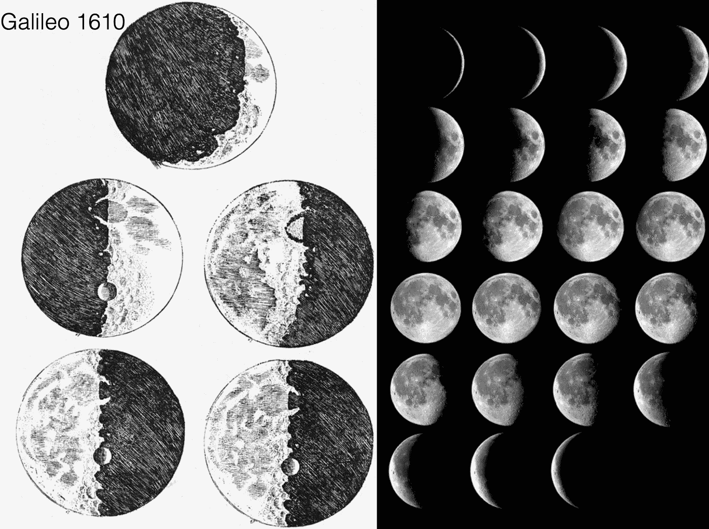

我们并不经常真正盯着古代的月球图画，所以在现代世界中，真的还需要这些类型的可视化吗？如果有，我们能不能不把它留给艺术家、平面设计师之类的人？

答案显然是肯定的。即使在 10 年或 15 年前，学习像化学这样的东西是非常困难的，尽管能够在你的大脑中描绘分子，但仍然很难在复杂的科学词汇和你脑海中正在发生的事情之间进行翻译。如今，人们可以在 Youtube 上键入几个词，然后观看化学任何方面的可视化或可视化漫游。同样的想法也适用于科学中的任何抽象概念。

所以现在我们已经说服自己，可视化对于传达信息非常有用，也可以用来以一种更易理解的方式解释复杂的想法。

有哪些好的可视化例子？

我目前住在波士顿，所以以下几个可视化与波士顿市有关。这些只是一些我认为很好的形象化，由于它们的主观性质，你可能不同意我的观点。

在波士顿，我们有一个名为 t 的地下地铁系统。与任何城市地铁系统一样，有许多不同的线路，它们去往不同的方向，由于距离较长，一些线路比其他线路花费的时间更长。

下面的可视化图不仅以同心球体的形式捕捉到了从市中心到每个站点所需的时间，还捕捉到了每条线路的正确方向。看着这个图表，很快就能算出该走哪条线，往哪个方向走，以及到达那里需要多长时间。

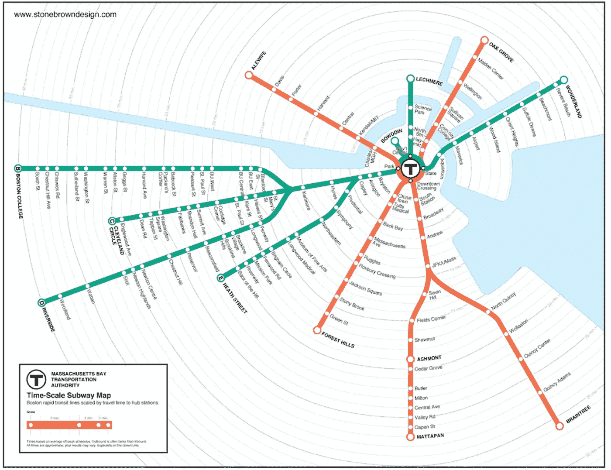

这第二个图像显示了上个世纪在马萨诸塞州出生的个体的移动。我们看到，在 1940 年，82%出生在马萨诸塞州的人预计会生活在马萨诸塞州。现在快进到现代，我们看到这个数字已经下降到 64%，我们可以对这些人迁移到哪里有一个合理的想法。

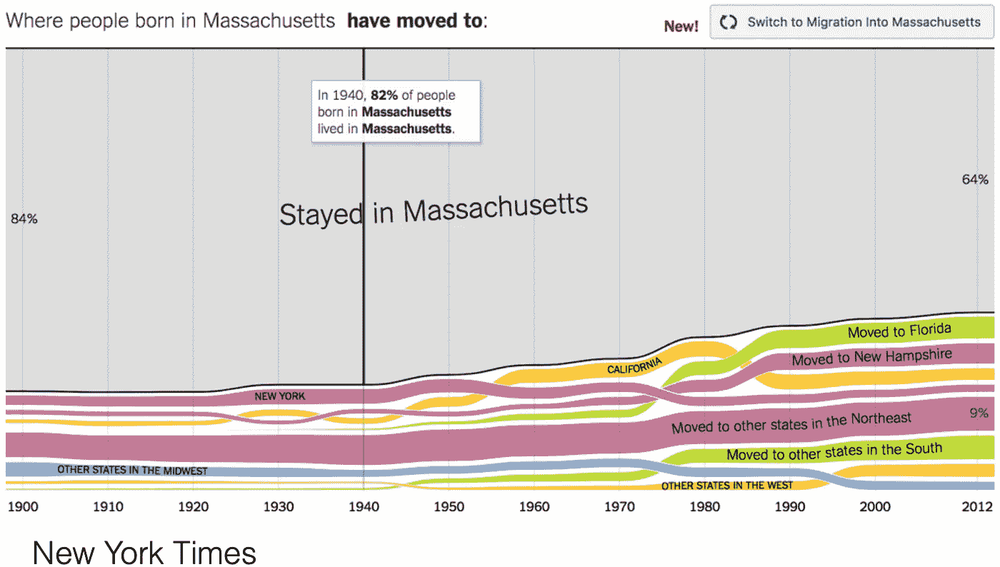

有史以来最著名的可视化作品之一是由约瑟夫·密纳德创作的，它描绘了拿破仑在 1812 年向俄罗斯进军的旅程。

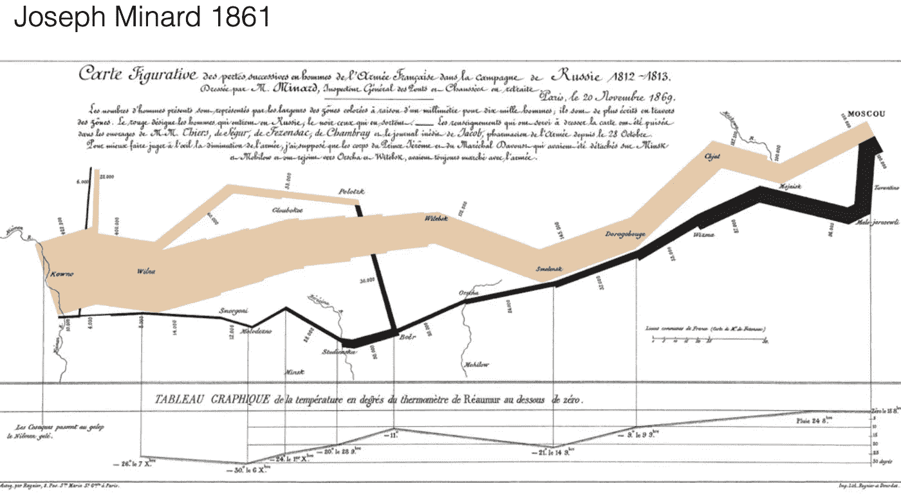

这幅插图描绘了拿破仑的军队离开波兰和俄罗斯边境。一条粗带显示了他的军队在前进和撤退时在特定地理点的规模。它以二维方式显示六种类型的数据:拿破仑军队的数量；走过的距离；温度；经纬度；行进的方向；和地点，但没有提到拿破仑。密纳德的兴趣在于士兵们的辛苦和牺牲。这种用于说明流量的带状图后来被称为[桑基图](https://en.wikipedia.org/wiki/Sankey_diagram)。

您可能已经注意到上述所有可视化的一个趋势是，它们以相对简单的方式传递多种类型的数据。以一种可理解的方式做到这一点并不是一件容易的事情。

现在让我们考虑将一个差的可视化转换成一个更适合其目的的可视化。这是用地铁地图最容易做到的，所以我将考虑伦敦的地铁地图，我们将看到为什么它被改变，以及他们的新设计如何改进了原来的设计。

这是 1927 年伦敦地铁的原始地图。正如你可能已经注意到的，这张图的主要问题是有一大群密集的地铁站，因为它们离得很近。这是因为地图是根据车站的地理位置绘制的。然而，当离开城市很远时，地图上还有大量的空间没有使用。

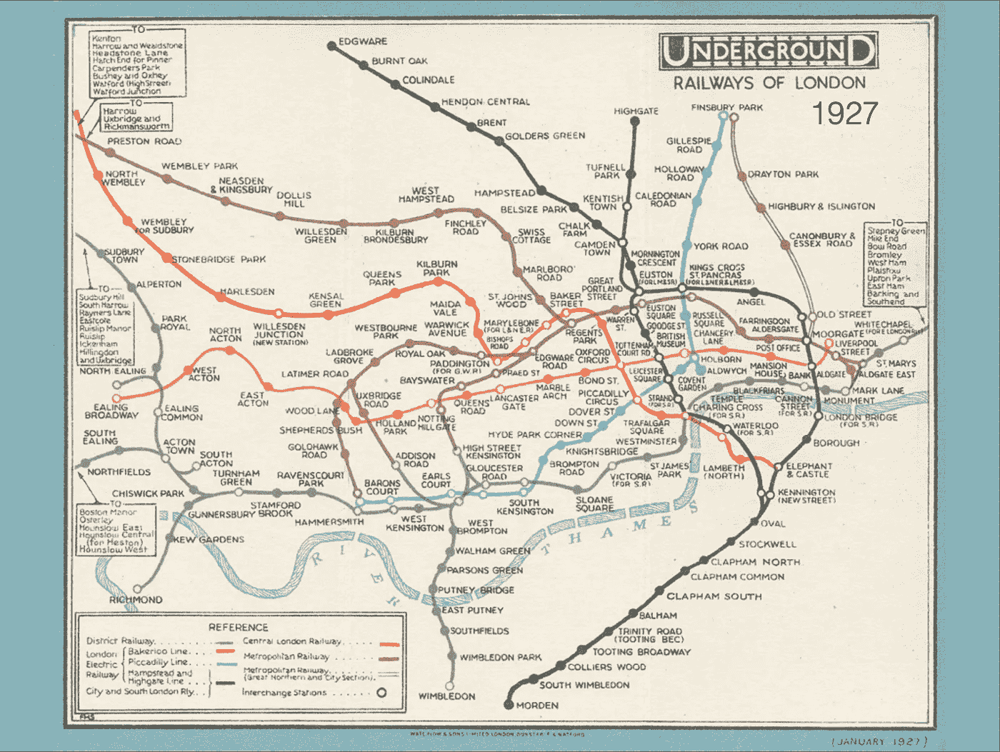

1933 年，哈里·贝克提出了一个新的伦敦地铁地图设计。贝克认为，地铁乘客不关心地理位置的准确性，他们最感兴趣的是如何从一个车站到另一个车站，以及在哪里换车。他从电气图中获得灵感，决定用单独的颜色显示每条线路，并像在电气图上一样显示它们与其他线路的连接。该图保留了每条线的方向信息，但距离信息丢失了，因为 Beck 认为这是不必要的。

作为一个曾经住在伦敦并使用现代版地图相对轻松地四处走动的人，我可以保证它的辉煌。

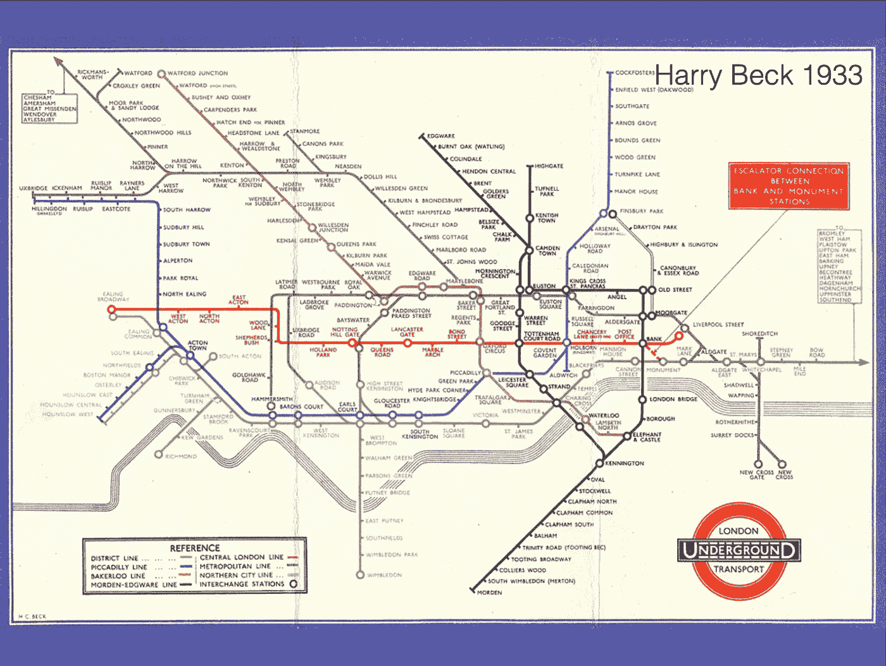

我们可以看到发生在纽约地铁地图上的非常相似的争论。这些你觉得哪个更好？

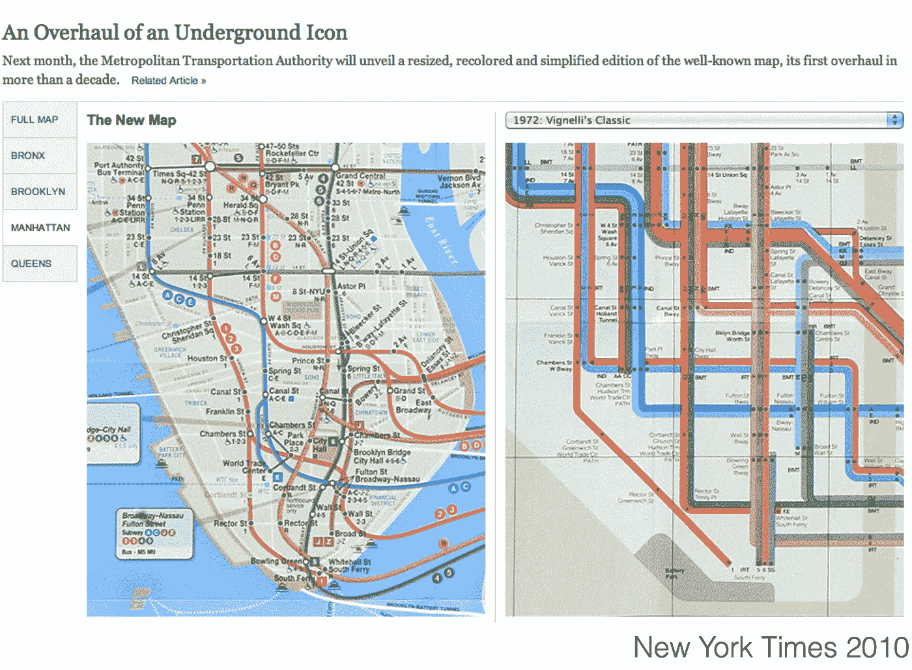

尽管我们已经查看了多张地铁图，但显然没有一个明确的解决方案可以适用于所有情况。毕竟要看什么数据和受众最相关。哈里·贝克认为，乘客并不关心距离或地理信息，他们只知道如何从 A 站到 B 站，以及需要做哪些换乘。也许这个想法对纽约人不适用，因为他们比伦敦人更关心距离和地理位置。

# 安斯科姆的四重奏

正如格特鲁德·安斯库姆在如今广为人知的**安斯库姆四重奏中所展示的那样，数字可能会令人难以置信地产生误导。**四元组是一组四个数据样本，它们具有完全相同的均值、方差、相关性和线性回归线。

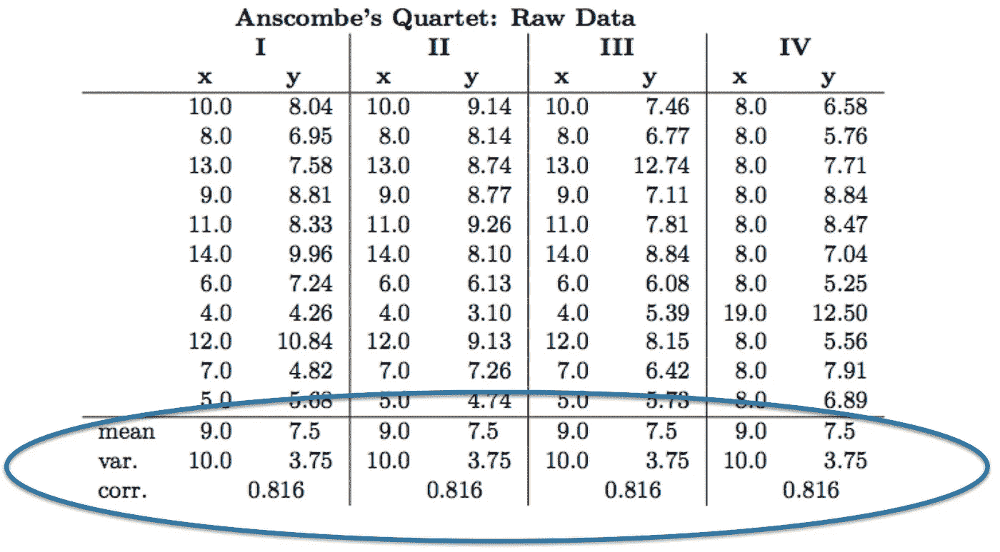

Anscombe’s Quartet in tabular form (Anscombe, 1973).

然而，从结果的直观表示中可以清楚地看出，四组数据的分布是完全不同的。

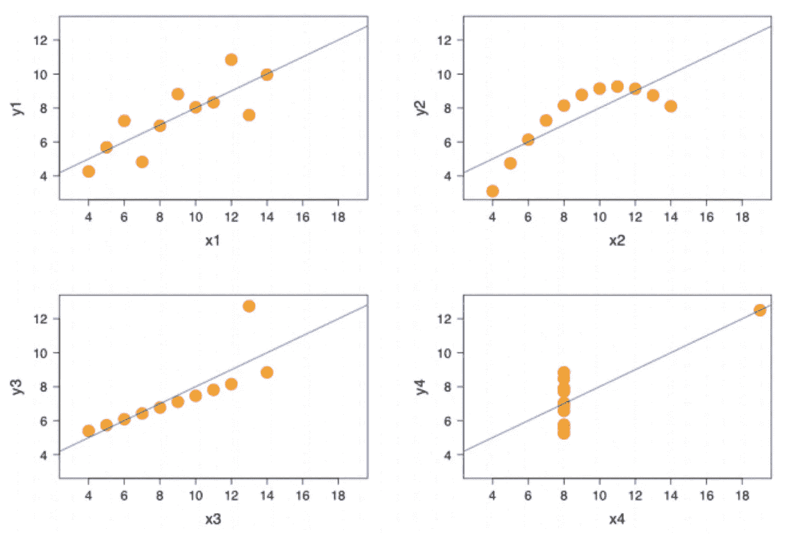

Anscombe’s Quartet in visual form (Anscombe, 1973).

为了强调这一点，我开发了六个我自己的数据图，它们都有相同的均值、方差、相关性和线性回归线。正如你在下面看到的，这些又是完全不同的。

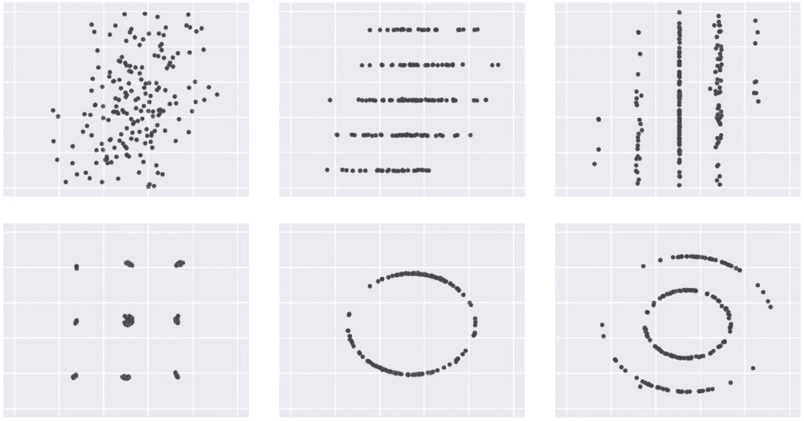

这种可以用可视化来代替量化指标来使数据结构更清晰、更有意义的想法自然会让我们陷入误导性的可视化领域。正如我们从安斯科姆的四重奏中看到的那样，数字可以用来误导我们对数据结构的理解，反之亦然，可视化可以巧妙地扭曲数据中的潜在结构。正如我们将会看到的，这是一个非常普遍的现象，尤其是在政治和科学辩论这样的领域。

# **误导性的可视化**

人们利用统计数据误导个人的例子不胜枚举。事实上，这是政治中极为常见的策略。这方面最著名的例子之一可能与乔治·布什总统提出的减税计划有关，在该计划中，通过扭曲条形图的轴线，使 5%的增幅看起来大得多。

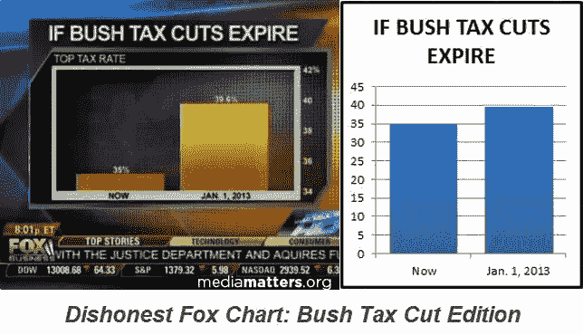

(Left) The visualization shown to viewers, and (right) a less deceptive visualization.

这些欺骗策略通常涉及到测量轴的扭曲，如上例所示。这是另一个与失业有关的轴扭曲的例子(讽刺的是，也与美国政治有关)。

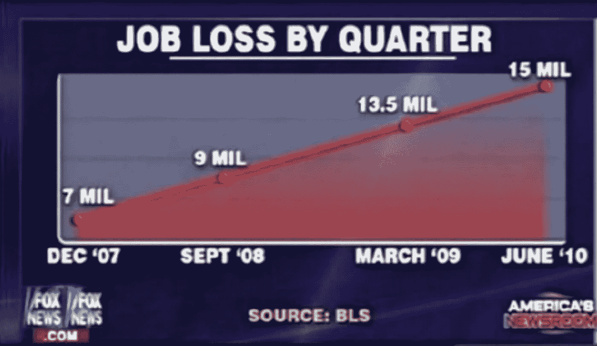

现实中，剧情应该是这样的。

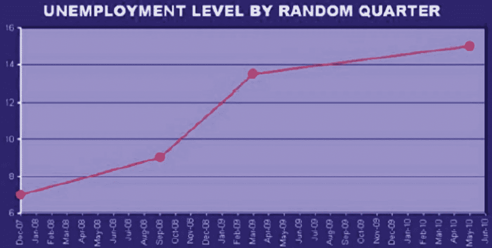

人们通过使用可视化被欺骗的另一种方式是通过省略数据。

我本人是一名环境科学家，所以我非常清楚人们可以用精心制作的可视化来支持的欺骗。这是一个证明全球变暖是一个神话的主要例子(澄清一下，事实并非如此，自 20 世纪 90 年代以来，这一观点没有受到环境科学家的质疑)。

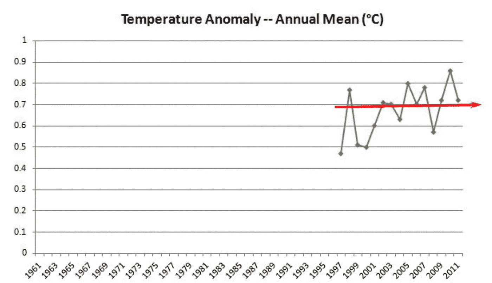

下图显示了一个不太具有欺骗性的图表。

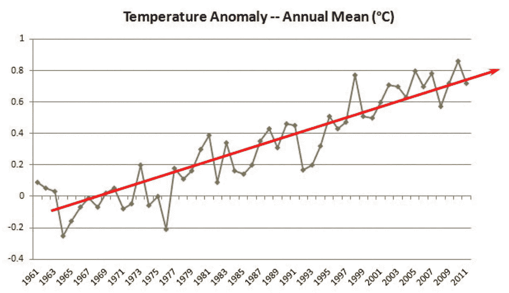

到目前为止，我们刚刚讨论了被主动设计来欺骗我们的视觉化。万一不小心弄好了呢？

## 当心彩虹

彩虹彩色地图可能是我每天遇到的最令人讨厌的可视化。作为一名环境科学家，我在任何地方都能看到这些。不仅仅是因为色盲的人(比如我自己)在区分许多颜色上有问题，而且给一种颜色分配一个量化的值是没有意义的。

彩虹色图在感知上是非线性的。谁决定了蓝色在数量上比黄色或红色更低？转变何时发生，有多突然？

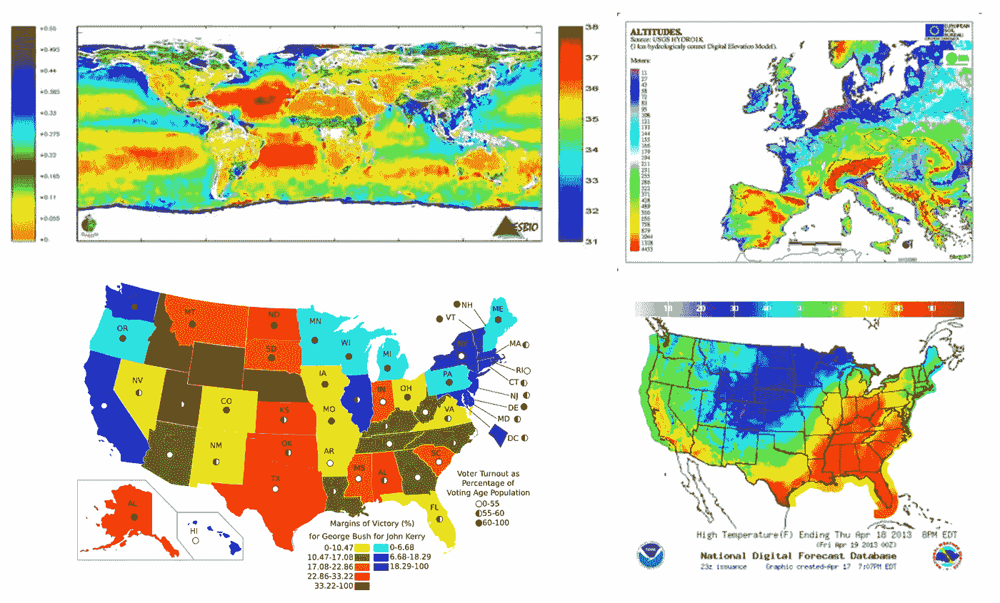

Rainbow color maps.

解决这个问题的最好方法是坚持使用两种颜色，并用颜色的线性变化来表示数量值。在这种意义上，该图可以是彩色的，但是该图的定量性质由颜色的亮度来描述，较暗的区域通常表示较高的值。这个想法如下图所示。

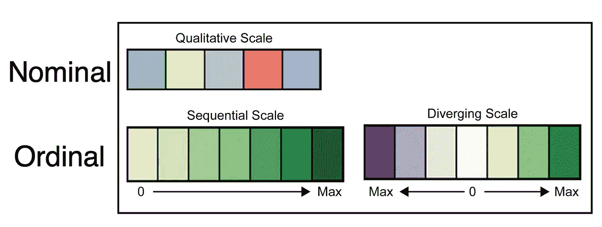

这基本上使它们与下图中的热图或等值线图相同。

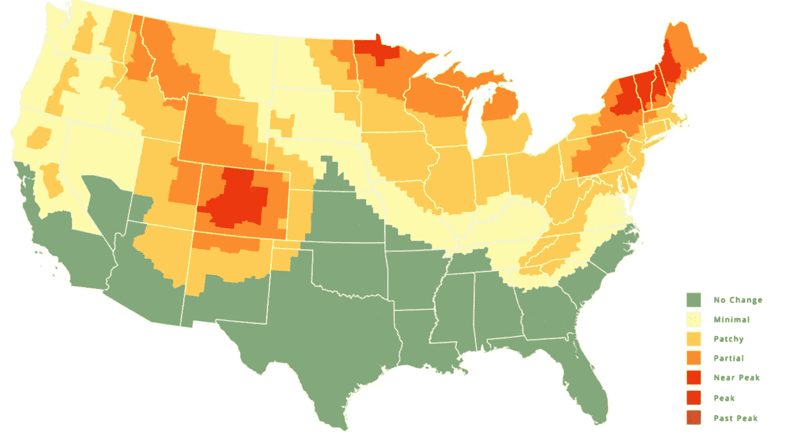

[Smoky Mountains](https://smokymountains.com/fall-foliage-map/)

一个很好的例子是 2016 年总统大选后的美国投票。

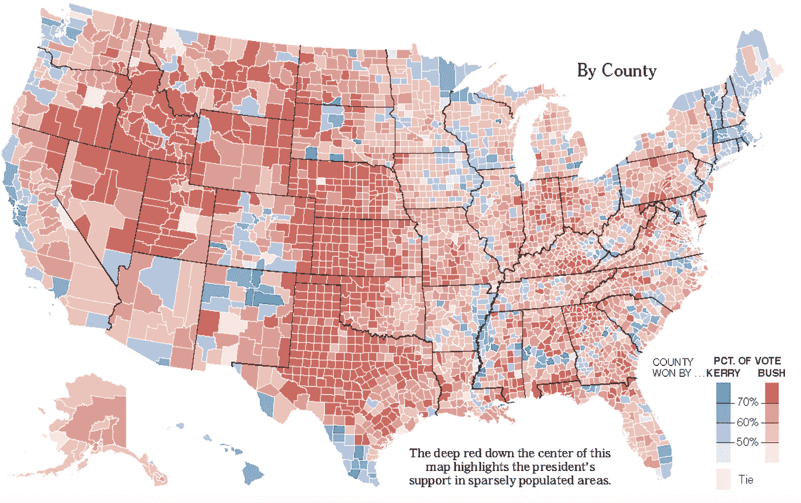

## 色盲

记住这样一个事实总是好的，即相当数量的人是色盲，避免使用对这些人来说有问题的颜色组合。以下面的可视化为例。

[Catalogtree](http://www.catalogtree.net/projects/the_fortune_500_cosmos?t=fortune_500)

对于患有红绿色盲的人来说，这个图表中使用的颜色是一个可怕的组合。最好注意至少使用红色和绿色的组合，因为这种类型的色盲是最普遍的。

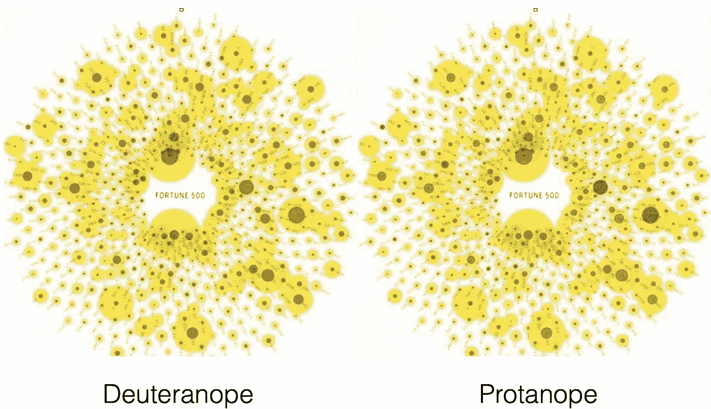

如果你有兴趣了解更多关于色盲的知识，有一个很棒的网站可以模拟色盲。

 [## 科布利斯-色盲模拟器

### 如果你没有色觉缺陷，很难想象色盲是什么样子…

www.color-blindness.com](http://www.color-blindness.com/coblis-color-blindness-simulator/) 

## 边缘捆绑

边缘捆绑背后的思想实质上是在从一个节点到另一个节点的所有路径周围缠绕一条弹性带。这被用在网络图上，它的优点是使视觉效果看起来不那么杂乱无章，而且更令人愉悦，正如我们在下面看到的。

这种方法的缺点是，在捆绑之后，您不能跟踪确切的链接或路径，这意味着我们的可视化不能反映底层数据(我们丧失了一些图形完整性)。

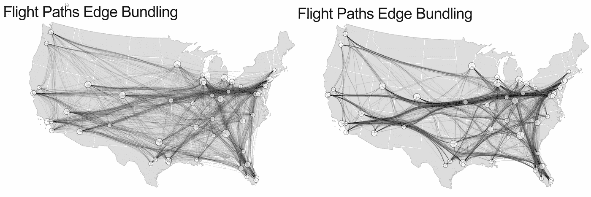

# 可视化过程概述

既然我们已经看了一堆可视化，并且理解了好的和坏的可视化之间的区别，现在是讨论什么是好的可视化的好时机。

## 可视化目标

本质上，可视化有三个目标:

*   **数据探索** —发现未知
*   **数据分析** —检验假设
*   **展示** —交流与传播

基本上就是这样。然而，这些术语非常模糊，因此很容易理解为什么个人很难掌握通过可视化交流的艺术。因此，有一个模型来帮助我们实现这些目标是很有用的。

## 五步模式

可视化通常被描述为以下五步模型，这是一个遵循相当合乎逻辑的进展的过程。

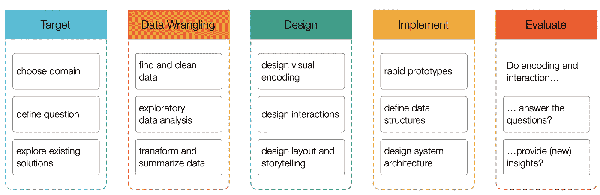

首先，需要分离出一个特定的目标或问题作为评估的主题。

其次是数据争论，这是数据科学家在处理数据时做的 90%的事情。该程序包括将数据转换成可行的格式，执行探索性的数据分析以了解他们的数据集，这可能涉及各种汇总或绘制数据的方法。

第三个阶段是设计阶段，涉及到开发一个你想用数据讲述的故事。这与我们定义的目标紧密相关。我们想要传达的信息是什么？这也很可能取决于你的受众是谁，以及分析的客观性水平——例如，一个政治对手很可能想要发送一个夸大的数据信息，以便让他们的对手看起来很糟糕。

第四步涉及可视化的实现，例如通过使用 [D3](http://d3js.org/) 对交互式的基于网络的可视化进行编程。这是过程的一部分，涉及一些编码，而设计阶段涉及思考、绘图、构思等等。

第五个阶段本质上是一个回顾阶段，你观察你的实现并决定它是否发送了你想要传达的信息，或者回答了你想要回答的问题。

实际上，这是一个非线性过程，尽管它经常被描述为一个非线性过程。这是这个模型的一个更现实的形式。

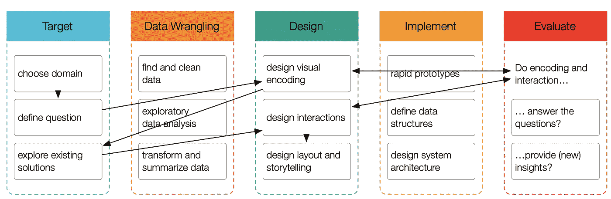

看起来很简单，对吗？好吧，事实上有很多方法可以把事情搞砸，而且经常是在没有意识到的情况下。以下是三个最常见的问题:

**领域情况—** 你是否正确理解了用户的需求？也许正在解决的问题是错误的。这是一个与目标阶段相关的问题。

**数据/任务抽象—** 你向他们展示的是正确的东西吗？也许使用了错误的抽象。这也是与目标阶段相关的问题。

**视觉编码/互动—** 你展示数据的方式有效吗？也许使用了错误的习语或编码。这是一个与设计阶段相关的问题。

**算法—** 你的代码有没有破解？你的代码太慢了吗？是否可扩展？这是实现阶段的问题。也许使用了错误的算法。

解决您的代码正在崩溃的事实可能是显而易见的，但是您如何评估我们刚刚解决的更主观的问题，例如领域情况或使用的可视编码？我们可以倾向于评估指标。

我们可以依靠定性和定量指标。定性指标通常对可视化最有用，因为可视化是为了向人们传达信息而开发的，可以使用的一些指标示例如下:

*   观察研究(“大声思考”)
*   专家访谈(又名设计评论)
*   小组讨论

这些定性程序的想法是，个人应该能够看到可视化和理解你试图传达的信息，而不需要任何额外的信息。这些类型的研究和指标通常用于市场营销和网页设计等领域，因为它们可以洞察个人将如何解释和回应他们的想法或设计。

# **经验法则**

爱德华·塔夫特是开发有效可视化领域的先驱，并就该主题写了多本书(我将在文章结尾引用)。

以下是他关于有效视觉化的三条规则:

*   图形完整性
*   最大化数据-油墨比率
*   避免图表垃圾

## 图形完整性

在讨论误导性的可视化时，我们已经讨论过这一点。总的来说，试图用统计数据误导个人是不好的做法，而且对社会有些危害。

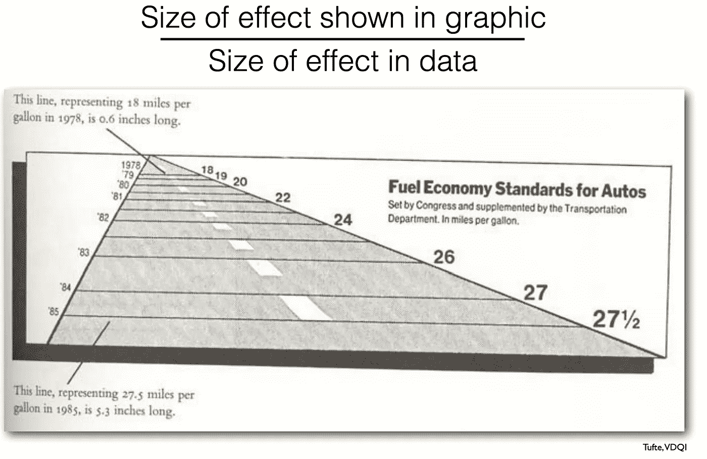

## 最大化数据-油墨比率

这条经验法则是关于清晰和简约的。一般来说，3D 绘图往往不太清晰，在某些情况下可能会产生误导。检查下面两个图表之间的差异，并决定你认为哪个更好。

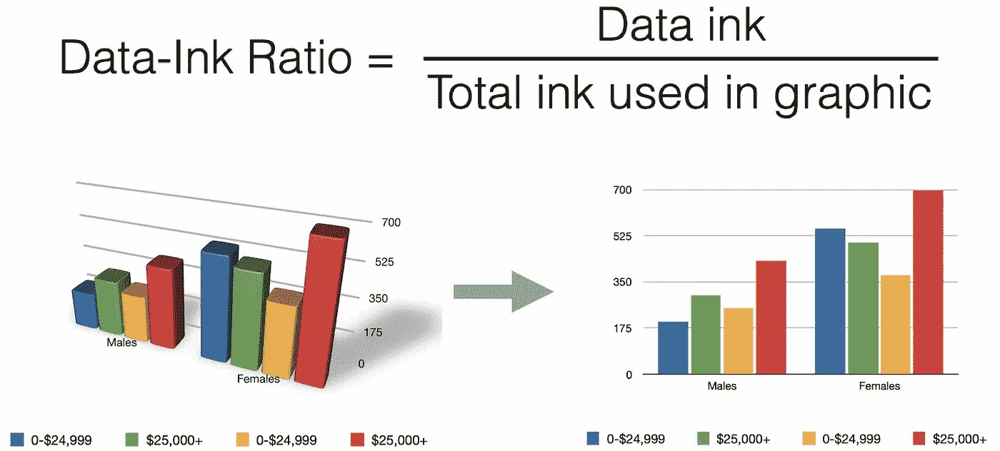

## 避免图表垃圾

无关的视觉元素会分散人们对所传达信息的注意力。

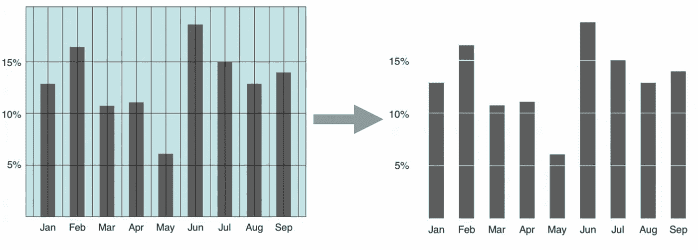

# **互动可视化**

这个主题可能会变得非常复杂，所以我将在以后的文章中讨论开发可视化。不幸的是，D3 可视化不能通过媒体运行，所以你可以访问链接来查看可视化的效果。

这里有一些我最喜欢的视觉化图像，可以吊起读者的胃口。

## 《权力的游戏》中的位置

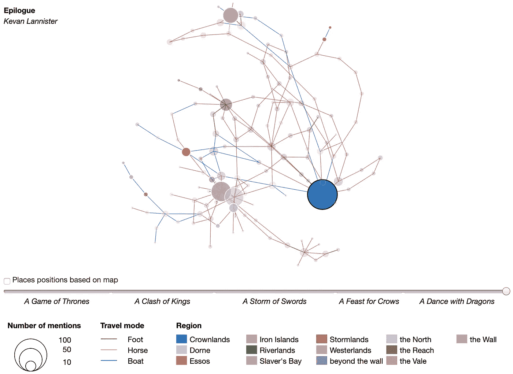

Location names discussed in the Game of Thrones saga. [Source](http://www.jeromecukier.net/projects/agot/places.html)

## **美国枪支死亡人数**

Gun deaths in the United States. [Source](https://guns.periscopic.com/?year=2013)

## **英国的道路安全**

这种可视化是建立在 deck.gl 上的，玩起来非常有趣——在这个网站上还有许多其他的交互式可视化，我建议去看看。

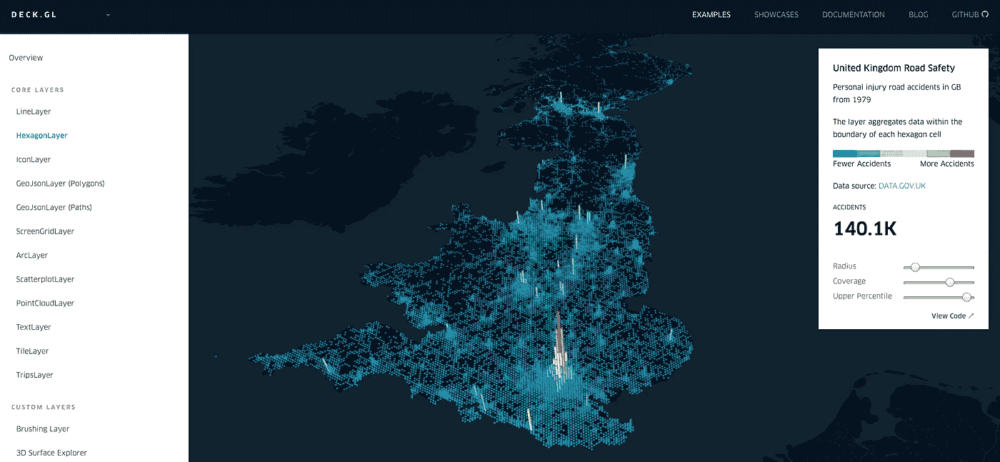

Road Safety in the U.K. [Source](https://deck.gl/#/examples/core-layers/hexagon-layer)

## 通往各州首府的道路

这是一幅交互式彩色地图，显示了美国以及通往各州首府的所有道路。

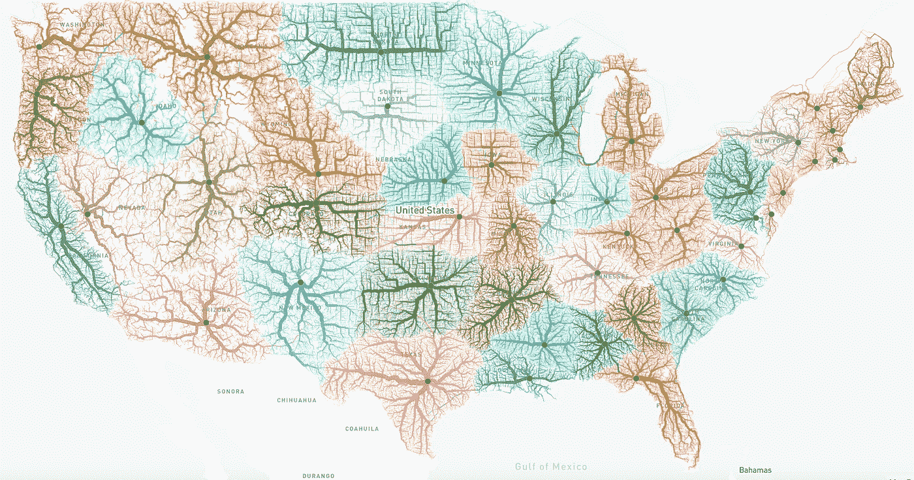

[Moovellab](http://roadstorome.moovellab.com/)

一个类似的可视化也可以从相同的网站显示罗马之路。

## 美国贸易赤字

这是一个美丽的形象化的形象化的美国从 2001 年到 2013 年的贸易逆差。

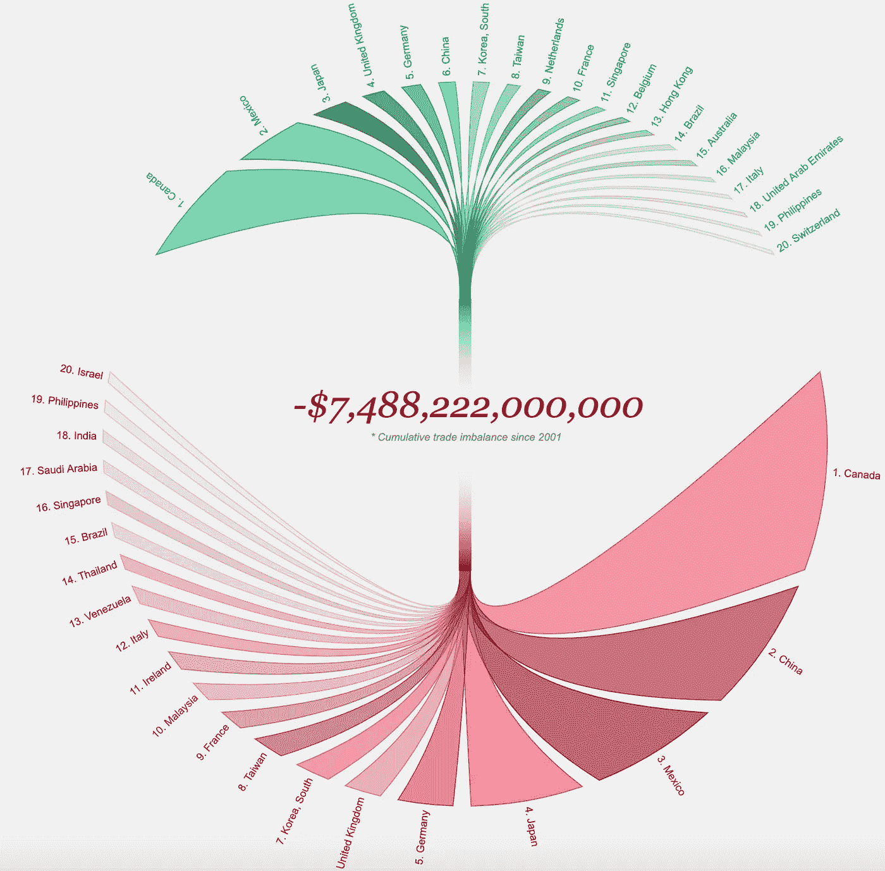

## 链接爵士网络图

这个交互式图表展示了爵士乐中的一些著名人物，以及他们是如何影响其他艺术家的。

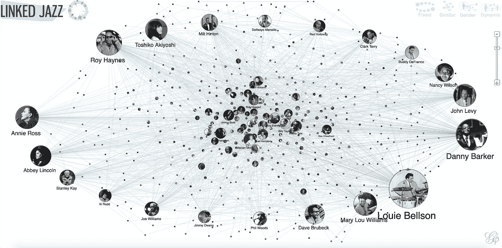

[Jazz network graph](http://linkedjazz.org/network/).

要获得更多可视化效果，请查看 GitHub 上的 d3 图库。

 [## d3/d3

### 用 SVG、Canvas 和 HTML 赋予数据生命。:bar _ chart::chart _ with _ upward _ trend::tada:-D3/D3

github.com](https://github.com/d3/d3/wiki/Gallery) 

# 最终意见

对于那些对看到更多可视化感兴趣的人，我在下面有多个书籍和网站的参考，如果你认真发展你的可视化技能，无论是以视觉思维的形式还是使用 D3 开发交互式可视化，你可能会感兴趣。

作为对您坚持阅读本文的奖励，以下是入选“信息是美丽的大奖 2018”的可视化内容。这种可视化以 Instagram 标签的名字来重命名伦敦的地铁站，而 insta gram 标签通常与该地点相关联。

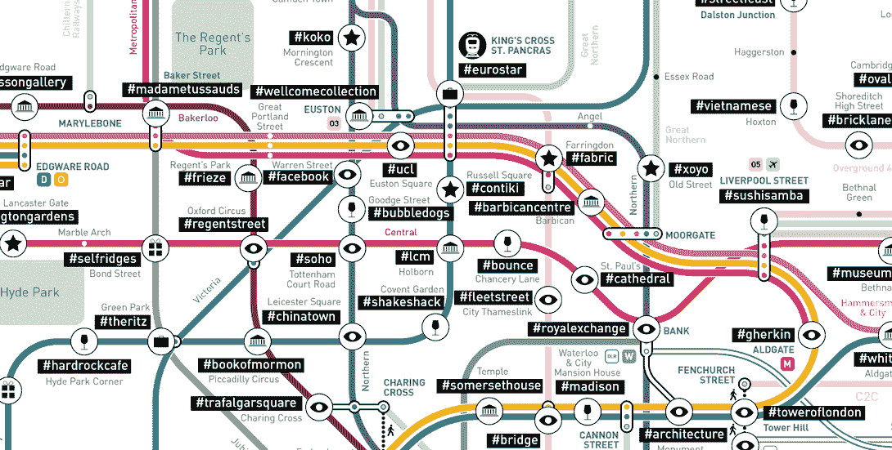

[#tagsandthecity](https://www.informationisbeautifulawards.com/showcase/2615-tagsandthecity)

我给你留了一个有趣网站的链接，里面有一些有趣的糟糕的可视化例子。本文中使用的一些可视化效果来自这个网站。

 [## WTF 可视化

### 毫无意义的想象。如果想讨论某个特定的可视化有什么问题，请发微博给我们…

即 wtf](https://viz.wtf/) 

感谢您的阅读！

## 时事通讯

关于新博客文章和额外内容的更新，请注册我的时事通讯。

 [## 时事通讯订阅

### 丰富您的学术之旅，加入一个由科学家，研究人员和行业专业人士组成的社区，以获得…

mailchi.mp](https://mailchi.mp/6304809e49e7/matthew-stewart) 

# **延伸阅读**

本节包含一个有用的资源列表，重点介绍数据可视化的创建。

## 书

[1] [设计的视觉思维](http://www.amazon.com/Visual-Thinking-Kaufmann-Interactive-Technologies/dp/0123708966)，科林·威尔，摩根·考夫曼(2008)

[2] [网络互动数据可视化](http://shop.oreilly.com/product/0636920037316.do)，斯考特·玛瑞，奥赖利(2017)

[3] [可视化分析与设计](http://www.amazon.com/Visualization-Analysis-Design-Peters-Series/dp/1466508914)，Tamara Munzner，CRC 出版社(2014)

[4] [《功能艺术:信息图形和可视化简介](http://www.amazon.com/The-Functional-Art-introduction-visualization/dp/0321834739/)，Alberto Cairo，New Riders (2012)

[5] [信息设计](http://www.amazon.com/Design-Information-Isabel-Meirelles/dp/1592538061)，伊莎贝尔·梅雷莱斯，罗克波特(2013 年)

## **爱德华·塔夫特**

[1] [定量信息的可视化显示](https://www.edwardtufte.com/tufte/books_vdqi)。

[2] [预见信息](https://www.edwardtufte.com/tufte/books_ei)。

[3] [视觉说明](https://www.edwardtufte.com/tufte/books_visex)。

## D3

D3.js 是一个基于数据操作文档的 JavaScript 库。D3 帮助您使用 HTML、SVG 和 CSS 将数据变得生动。

[1] [官方 D3 站点](http://d3js.org/)
【2】[官方 D3 API 参考(版本 4)](https://github.com/d3/d3/blob/master/API.md)
【3】[官方 D3 API 参考(版本 3 . x)](https://github.com/d3/d3-3.x-api-reference/blob/master/API-Reference.md)
【4】[D3 教程由斯考特·玛瑞(D3 版本 3)](http://alignedleft.com/tutorials/d3/)
【5】[杰罗姆·库基尔的 D3 备忘单](http://www.jeromecukier.net/wp-content/uploads/2012/10/d3-cheat-sheet.pdf)

# Web 开发

[1][JetBrains 的 web storm](https://www.jetbrains.com/webstorm/)—智能 JavaScript IDE ( [对学生免费](https://www.jetbrains.com/student/))。
【2】[雄辩的 Javascript 书](http://eloquentjavascript.net/)
【3】[DevDocs](http://devdocs.io/)， [Mozilla 开发者网](https://developer.mozilla.org/en-US/) —主流 web 技术的统一文档。
【4】[Github(Git repository hosting service)](https://github.com/)—软件开发的版本控制系统。([免费的学生专用库](https://education.github.com/pack))

## （舞台上由人扮的）静态画面

[Tableau 软件](http://tableau.com/)是一个让你创建交互式数据可视化的工具。([学生免费](http://www.tableau.com/academic/students))

## 数据源

[Data.gov](http://www.data.gov/)
[Census.gov](http://www.census.gov/)
[Data verse 网](http://thedata.org/)
[气候数据来源](http://www.realclimate.org/index.php/data-sources/)
[气候站记录](http://www.metoffice.gov.uk/climatechange/science/monitoring/subsets.html)
[CDC 数据(疾病控制与预防)](http://www.cdc.gov/nchs/data_access/data_tools.htm)
[世界银行目录](http://data.worldbank.org/data-catalog)
[免费 SVG 地图](http://www.d-maps.com/index.php?lang=en)
[英国国家统计局](http://www.statistics.gov.uk/default.asp)
[state master](http://www.statemaster.com/index.php)

## 网站和博客

[流动数据](http://flowingdata.com/)
[视觉复杂度](http://www.visualcomplexity.com/vc/)
[守护数据日志](http://www.guardian.co.uk/news/datablog)
[结果](http://www.nytimes.com/section/upshot)

## 其他软件工具包

[plot . ly](https://plot.ly/)
[Wolfram Mathematica](http://www.wolfram.com/mathematica/)
[Prefuse](https://github.com/prefuse/Prefuse)(Java)