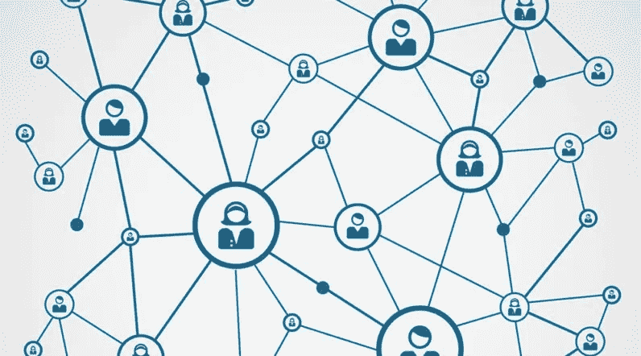
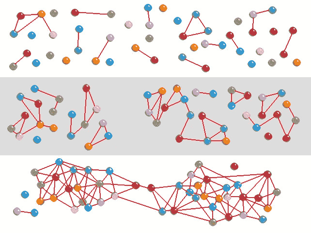
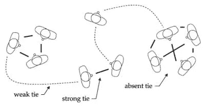
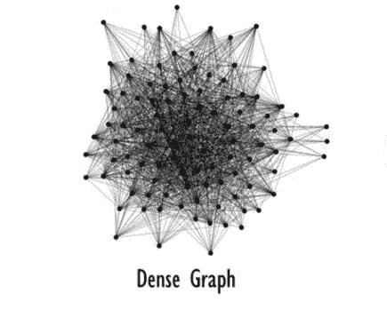
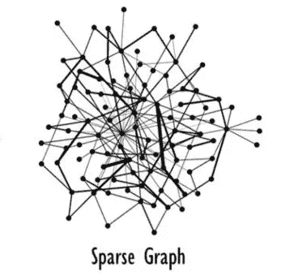
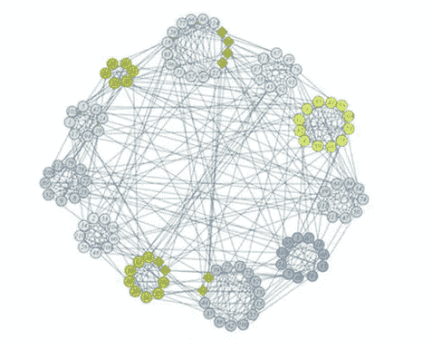
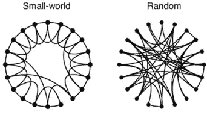
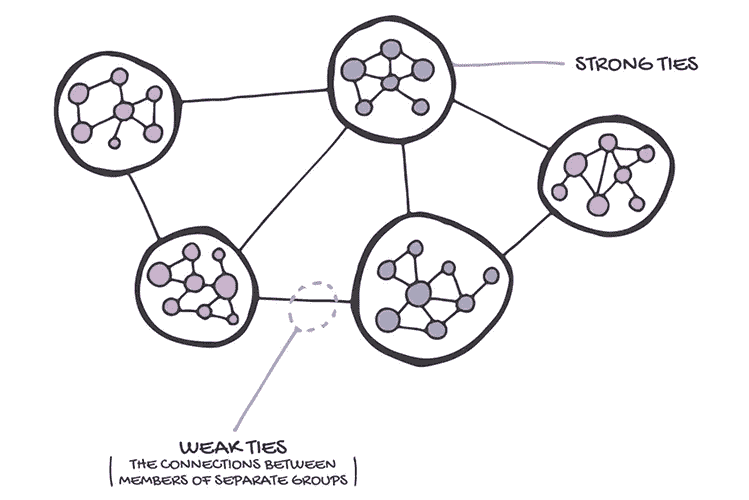
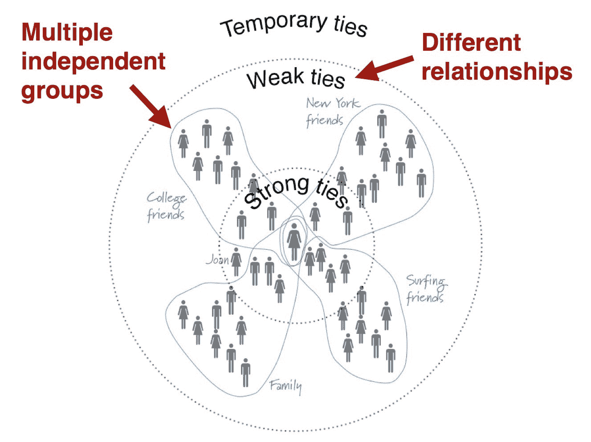

# 弱关系的力量

> 原文：<https://towardsdatascience.com/the-power-of-weak-ties-f1049c93f3a3?source=collection_archive---------9----------------------->

## 社会网络中弱关系的影响——图论观点

[http://bitcoinwiki.co/wp-content/uploads/censorship-free-social-network-akasha-aims-to-tackle-internet-censorship-with-blockchain-technology.jpg](http://bitcoinwiki.co/wp-content/uploads/censorship-free-social-network-akasha-aims-to-tackle-internet-censorship-with-blockchain-technology.jpg)

# 什么是社交网络？

我们都知道“社交网络”这个术语是指社交网站，比如脸书和推特。在这些网站上，人们能够与网站上的其他用户交流并形成社会联系。当人们使用这些网站时，模式往往会出现，因为用户基于预先存在的人际关系，以及通过在线互动期间新创建的关系聚集在一起。虽然这些网站确实具有社交网络的特征，但社交网络不一定是网站。

**从最普遍的意义上来说，社交网络是人们之间建立联系的方式。**网络中的人，或者说行动者，被认为是节点(圈)，他们之间的连接，或者说是边(线)，代表着互动或者关系产生的纽带。这些网络可能来自任何社会行为，如在线交流、面对面交流，甚至更抽象的联系形式，如认识一个人，因为他们是你的亲戚。

[https://en.wikipedia.org/wiki/Social_network#/media/File:Network_self-organization_stages.png](https://en.wikipedia.org/wiki/Social_network#/media/File:Network_self-organization_stages.png)

社交网络是用于社会学和心理学等社会科学以及统计学和数学等定量领域的强大工具。检查网络的一般结构，如密度和组件数量，以及通过中心性等指标检查单个节点对网络的贡献，可以提供对复杂社会现象的许多见解。

# 什么是弱领带？

既然我们知道了什么是图，我们就可以研究图中的连接类型。这些可以分为*缺席关系*、*弱关系*和*强关系*。

[https://en.wikipedia.org/wiki/Interpersonal_ties](https://en.wikipedia.org/wiki/Interpersonal_ties)

**缺失连接**，顾名思义，是图中不存在的连接。因此，如果在一个图中，人 A 和人 B 不相连，那么边 A-B 就是不存在的纽带。

强关系则是另一个极端。这些是人与人之间的纽带，彼此紧密相连。在现实世界中，这可能包括你日常交往的亲密家人和朋友。你可能和这些人有很多共同点，你很可能和他们有很多共同点。你的强关系很可能类似于下面的**密集图**。

[https://blog.metaflow.fr/sparse-coding-a-simple-exploration-152a3c900a7c](https://blog.metaflow.fr/sparse-coding-a-simple-exploration-152a3c900a7c)

最后，你的**弱关系**介于缺席和强关系之间。这些是人们之间的联系，他们彼此认识，但不是特别熟。在现实世界中，这些人是你一个月接触一次的人，你可能不常见到他们。你和你的弱纽带可能没有太多共同点，你的弱纽带大部分也不会认识。因此，你的弱关系图很可能类似于下面的**稀疏图**。

[https://blog.metaflow.fr/sparse-coding-a-simple-exploration-152a3c900a7c](https://blog.metaflow.fr/sparse-coding-a-simple-exploration-152a3c900a7c)

# 弱关系的好处

既然已经了解了不同类型的联系，那么说弱关系是最重要的可能看起来有违直觉。毕竟，与你关系最密切的人不是最愿意帮助你的吗？

## 真实世界的图表

为了理解弱联系的力量，我们必须看看现实社会图的结构(网络拓扑)。下面是一个真实世界网络的例子，代表一个美国大学足球网络。

[https://www.nature.com/articles/srep05739/figures/2](https://www.nature.com/articles/srep05739/figures/2)

很快，我们注意到这样一个现实世界的网络是由密集连接的人群或社区组成的。然后，这些社区通过相对较少的边相互连接。我们可以把每个社区中的边缘看作是紧密的联系。这些人很可能在同一个团队，彼此关系非常密切。连接每个不同社区的边可以被认为是弱联系。这些很可能是较弱的联系，因为球员不太可能与其他球队的人频繁互动。

## 小世界网络

模拟这种网络的一种常见方法是将它构建在一个[小世界网络](https://en.wikipedia.org/wiki/Small-world_network)中。小世界网络有几个定义性特征，使它们具有上述外观:

*   大多数节点互为*而非*邻居
*   特定*节点的邻居很可能是彼此的邻居*
*   节点可以通过少量的边互相到达

In small-world networks, we see sparse connections between communities. Each community experiences a high degree of clustering, or equivalently, the graph overall has a high level of modularity. Random graphs are far less modular and experience less clustering.

这些特征导致由少量边连接的密集连接的社区的形成。这种网络自然出现在许多现实世界复杂系统的建模中，如我们大脑中的神经元和社交网络。

## 弱关系的影响

如果没有薄弱的联系，各社区之间就不会有任何交流。每个人在更大的图中只拥有他们自己的小中心的本地信息。如果没有薄弱的联系，人们将无法获得与全球体系相关的信息，这可能对他们不利，因为他们错过了并非源自其特定社区的趋势。事实上，如果大型社区之间的关键链接被移除，弱连接的移除可能会对整体网络功能产生灾难性的 T2。这与移除强连接形成对比，移除强连接会导致网络功能的退化更加可控，且通常更小。

幸运的是，我们的社交网络确实允许我们有这些微弱的联系。这就是人们如何能够通过使用 Twitter 等平台快速扩大对世界事件的了解，以及我们如何能够通过脸书等平台与远方的亲戚重新联系。这就是“[六度分离](https://en.wikipedia.org/wiki/Six_degrees_of_separation)”现象的由来，因为大多数社区可以通过少量的边彼此到达，这些边代表弱联系。

[https://blog.headresourcing.com/networking-and-the-strength-of-weak-ties/](https://blog.headresourcing.com/networking-and-the-strength-of-weak-ties/)

# 一个例子——求职

我们可以在很多情况下观察到这种现象，比如找工作。你身边的人，比如你团队中的同事，人脉有限。他们可能认识很多和你一样的人，在有限的公司范围内，和你在同一个地区。所以，在找新工作的时候，他们的帮助可能是有限的。然而，你的弱关系，最有可能在其他地理区域、工作岗位和公司，有更广泛的影响。他们可能会向你推荐其他地方的公司和不同的职位。这可能包括远方的家庭成员、老朋友和你过去的同学。

[https://www.swiveltime.com/2013/08/your-network-of-cousins.html](https://www.swiveltime.com/2013/08/your-network-of-cousins.html)

研究甚至表明，大部分工作帮助都来自弱关系。这主要是由于一个简单的事实，即弱关系比强关系多得多。虽然单个弱联系可能比单个强联系更弱，但在总体意义上，我们的弱联系已被证明更有用。