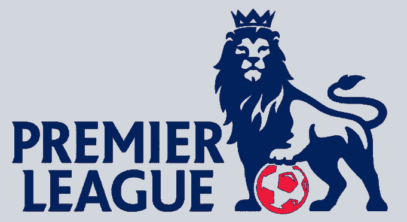
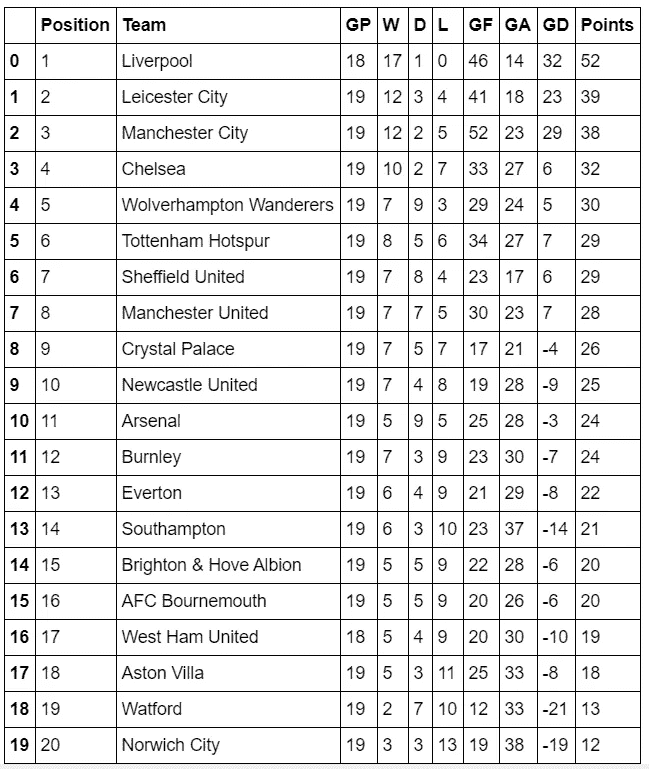
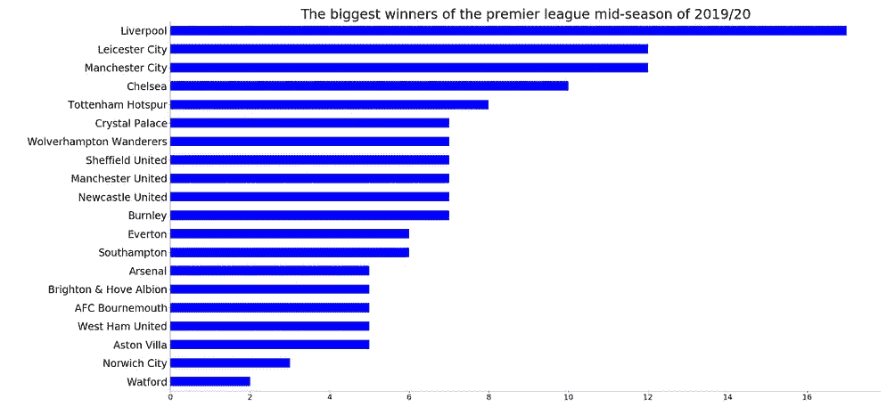
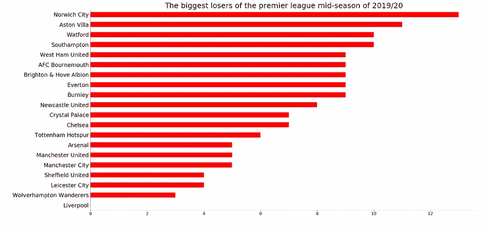
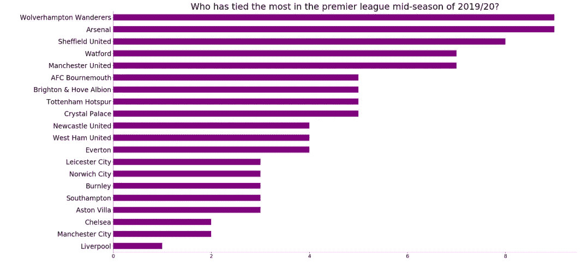
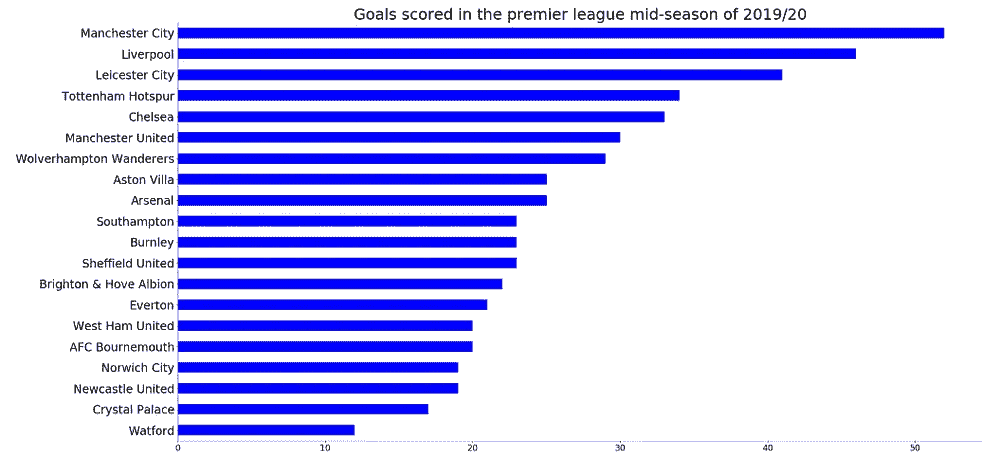
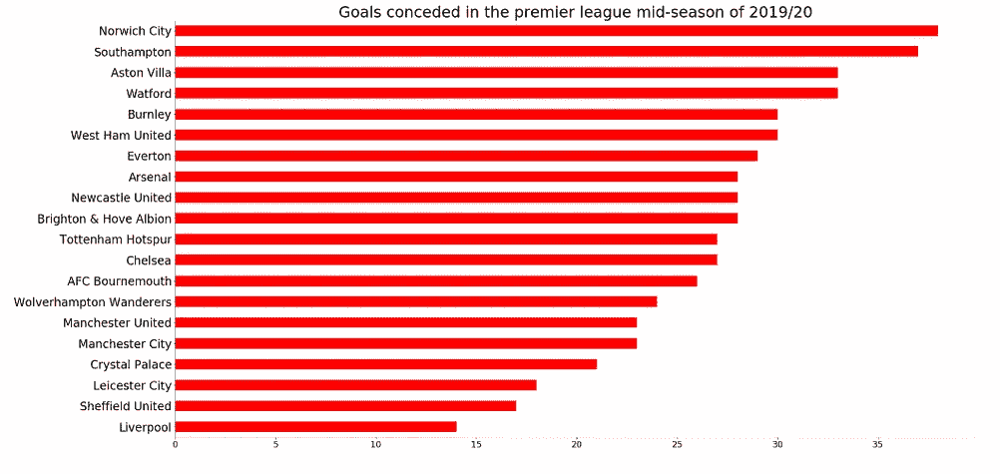
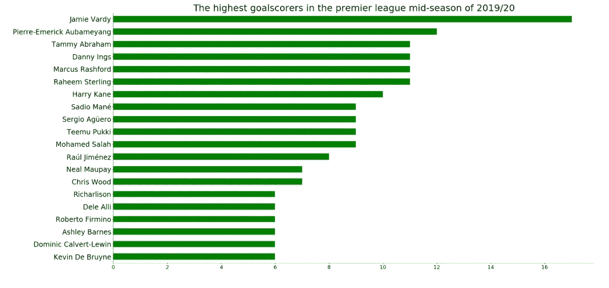
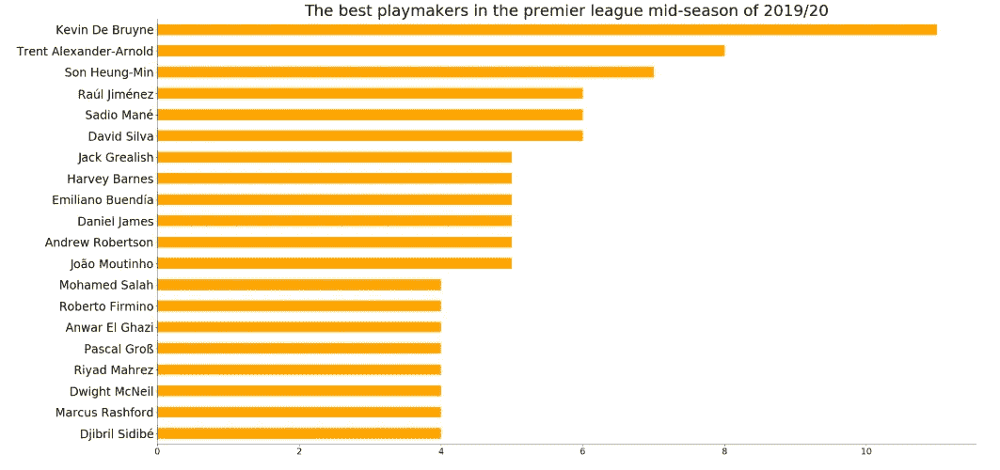
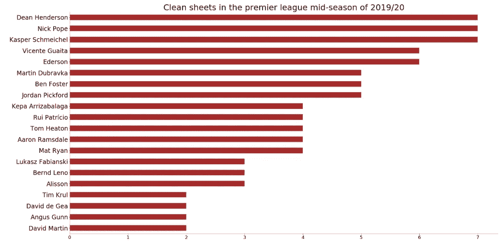

# 迄今为止的英超联赛

> 原文：<https://towardsdatascience.com/the-premier-league-so-far-5bf1d95afbc8?source=collection_archive---------24----------------------->

Photo credit: [https://www.stickpng.com/img/sports/soccer-football/premier-league-logo](https://www.stickpng.com/img/sports/soccer-football/premier-league-logo)

## 对世界上最有趣的足球联赛的赛季中期分析

杰米·瓦尔迪进球不断，他的状态非常好。阿森纳球迷在阿森纳官方电视上展示了他们歇斯底里的最佳状态，因为这支球队正在经历一段时间以来最糟糕的赛季。切尔西出人意料地发展得很好，尽管他们不能在转会窗口签下任何人。

曼城在一支被认为是冠军的球队中表现得相当不错。曼联和阿森纳一样，并没有真正做好。尽管他们在大型比赛中表现出色，但在小型比赛中却搞砸了。

托特纳姆热刺队在解决如何正常运转的问题上有一些问题，但何塞穆里尼奥已经来拯救他们，并且有一些改善的迹象。一支让我惊讶的球队是谢菲尔德联队。尽管刚刚获得晋升，但他们已经成功展示了让他们一直保持在前 7 名的表现。

最重要的是，利物浦通过提供一个非常有统治力的表现，已经走上了成功的大道。尤尔根·克洛普用这支球队创造了一个王朝。不管他们面对谁，他们总是赢。范·迪克在后面看起来很稳固。中场很容易为进攻的三人组提供惊人的传球，从而带来重要的进球。

目前是赛季中期，对各队赛季中期表现的分析已经进行。

# 英超赛季中期积分榜分析

收集数据是为了分析球队在赛季中期的表现。使用英超的网站，最近的排名是通过这个[链接](https://www.premierleague.com/tables)得到的。

The Premier League mid-season table of 2019/20.

不出所料，利物浦领先一场比赛。莱切斯特城位居第二，这要归功于杰米·瓦尔迪的高产和布伦丹·罗杰斯的顶级执教。曼城不在最佳状态，排名第三。切尔西出人意料地排名第四。狼队证明了自己是一支顶级球队，排名第五。热刺，第六。曼联和阿森纳分别是第八和第十一。倒数三名包括阿斯顿维拉、沃特福德和诺维奇城，他们分别排名第十八、十九和二十。

## 最大的赢家对最大的输家

The graph on the left shows which teams have won the most games. The graph on the right shows which team has lost the most games.

在 18 场比赛中赢了 17 场后，利物浦成为最大赢家。莱斯特城在积分榜上排名第二，曼城以 12 胜排名第二。切尔西 10 胜，排名第四。托特纳姆热刺排名第五。

诺维奇城在积分榜上垫底，它输掉最多的比赛 13 场并不奇怪。同样处于降级区的阿斯顿维拉排名第二，已经输了 11 场比赛。沃特福德和南安普顿以 10 负并列第三。西汉姆联、亚冠伯恩茅斯、布里顿霍弗阿尔比翁、埃弗顿、伯恩利都是 9 负，排名第五。

## 谁最爱分享积分？

A graph showing which teams share points the most in the premier league mid-season of 2019/20

事实证明，当狼队和阿森纳面对对手时，他们更愿意给对手一分。他们都平了 9 场比赛。谢菲尔德联队排在第二位，已经 8 场平局。沃特福德和曼联以 7 平排名第四。

## 进球与失球

The graph on the left shows how many goals the teams have scored. The graph on the right shows how many goals the teams have conceded.

拥有强大攻击力的曼城队迄今为止已经打进 52 球，是赛季中期进球最多的球队。利物浦以 46 球排名第二。莱斯特城进了大约 41 个球，排名第三。热刺和切尔西分别以 34 球和 33 球排名第四和第五。

对于诺维奇城来说，垫底一定很艰难。他们已经设法丢了 38 个球，这使他们成为最大的失球球队。南安普顿在莱斯特城 9:0 大胜后排名第二，总共丢了 37 个球。阿斯顿维拉和沃特福德都丢了 33 个球，排名第三。伯恩利和西汉姆联各丢 30 球，排名第五。

# 玩家分析

使用这个[链接](https://www.premierleague.com/stats)从英超联赛网站收集关于球员表现的信息。

## 最高得分者——聊天***被撞！

The highest goal scorers of the premier league mid-season of 2019/20

杰米·瓦尔迪。真是个畜生！本赛季他一直是致命的，已经记录了 17 个进球，这使他成为最高的射手。阿森纳的奥巴姆扬以 12 个进球排名第二。塔米·亚伯拉罕、丹尼·英斯、马库斯·拉什福德和拉希姆·斯特林都曾 10 次进球，他们都名列第三。

## 顶级组织者—我能为您做些什么？

The best playmakers in the premier league mid-season of 2019/20

组织进攻之王凯文·德布劳内有 11 次助攻，这让他第一次成为众人瞩目的焦点。第二名是神童特伦特·亚历山大·阿诺，他有 8 次助攻。儿子 7 次助攻排名第三。马内、戴维·席尔瓦和劳尔·希门尼斯以 6 次助攻排名第四。

## 干净的床单——谁最能扭转局面？

Clean sheets in the premier league mid-season of 2019–20

谢菲尔德联队的迪安·亨德森、伯恩利队的尼克·波普和莱斯特城队的卡斯帕·舒梅切尔都以 7 次零失球并列最干净球门不失榜首。文森特·瓜尔塔和埃德松以 6 场零封对手的成绩排名第四。上赛季的最佳门将艾利森至今已经有 3 场比赛没有失球。

# 结论

没有人知道在这个赛季剩下的时间里会发生什么。英超是一个充满娱乐的联赛，有很多悬念。这种悬念的一部分来自于前四名的争夺和降级区的争夺，这可能会持续到最后一个比赛日。

## 有趣的事实:

这是我的第 19 篇文章，我正在分析英超赛季的前 19 场比赛。

**用于执行该项目的完整版代码可以在这里看到******。****