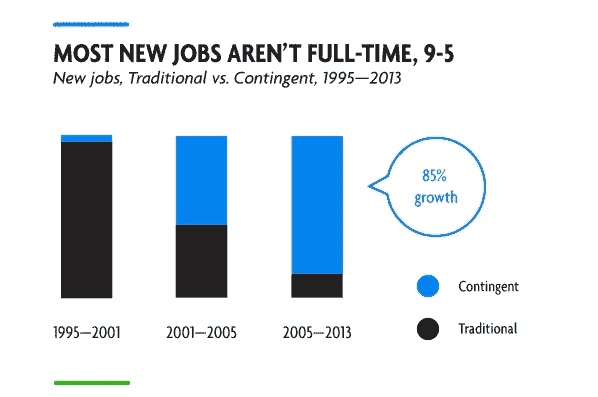
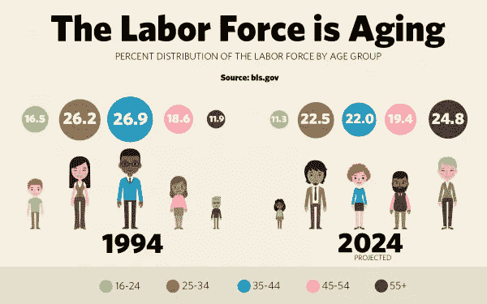
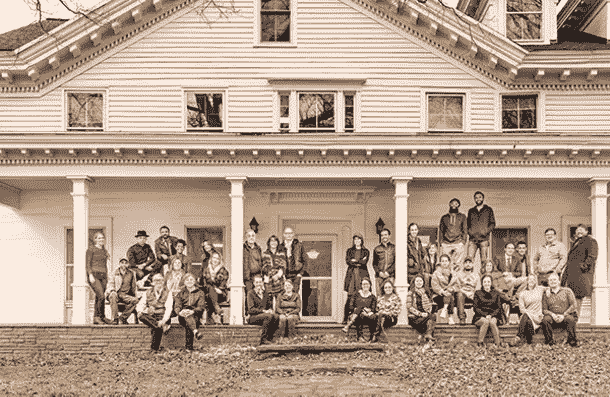

# 有准备的头脑:我们当前的问题

> 原文：<https://towardsdatascience.com/the-prepared-mind-our-current-problem-46c5101965ff?source=collection_archive---------29----------------------->

为了解决我们现在和未来的邪恶问题，我们需要接受一个奇怪的、违反直觉的讽刺:随着各行各业的组织不断创造和采用人工智能等技术，员工需要通过提高他们的主观智能来保持相关性。

As production work and other jobs automate, the skills people need to stay relevant are becoming elusive.

# **我们目前的问题**

**几代人以来支持组织和加强美国劳动力的结构在各个领域都在逐渐削弱。我对大师级工匠以及他们如何掌握技艺的研究有助于将这个新的困境联系起来，并可能成为寻求初步解决方案的地方。**

现在，把变化的速度、指数增长和不可逆转的灾难称为适应的必要催化剂已经是老生常谈了。我们都知道明天的工作将与今天的大不相同——我们只是认为明天将永远留在“明天”无论如何，在这些重复出现的报告之间，一个真正的新变化出现了——一方面创造了巨大的机会，另一方面阻止了员工利用它。

为了充分理解这一困境，我们需要了解它是如何形成的。支撑和延续美国悠久传统的三个主要结构正在弱化:教育；劳动力培训；传统的朝九晚五的工作，以及随之而来的对发展的设想。这些传统的衰落侵蚀了经济的不同领域。所有这三个领域都随着技术变革而磨损、扩散并融合在一起，产生了一个全新的问题:就业市场与劳动力的技能和需求不匹配。

> 根据全球咨询公司麦肯锡的说法，即将到来的工人向新职业的转移“可能是自 20 世纪初劳动力从农业转移以来从未见过的规模。”

这种动态让美国工人进退两难。就业报告不断显示新工作的爆发，但一系列面向未来的稳定机会对大多数人来说并不广泛。事实上，我的研究表明，那些在未来几年最能适应和茁壮成长的人，将是那些学会学习的人，以及像大师级工匠那样思考的人。然而，美国的晋升制度从来没有为这些要求做好准备。

**稳定，那是什么？**

前几代人可以期待一条结构化的、可预测的职业发展道路，这条道路可以持续他们的大部分甚至全部职业生涯。获得特定学位后，你被归类到当前的工作中，并在公司或行业内努力提升。不再是了。今天，一名员工的平均任期刚刚超过四年。越来越多的公司雇佣兼职或合同工。

在科技的推动下，音乐已经变得越来越主流。据估计[从 2005 年到 2015 年，经济中增加的 94%的工作是临时的、合同的、独立的或自由职业的](https://dataspace.princeton.edu/jspui/bitstream/88435/dsp01zs25xb933/3/603.pdf)。最近的一项[玛丽斯特/NPR 民意调查发现，大约 20%的美国人的工作是非传统的](https://www.npr.org/2018/09/26/651647131/poll-nearly-6-in-10-to-closely-watch-kavanaugh-ford-hearing-many-undecided-on-tr)——这个数字在未来十年可能会上升到 50%。

Since 1995, the percentage of workers engaged in part-time or freelance work has almost doubled. *Image Credit:* [*Laura Zulliger*](https://payable.com/blog/what-is-a-1099-independent-contractor)

**技能的半衰期**

稳定还有另一个敌人:与特定职业相关的技能正以前所未有的速度过时。据估计，[如今技能的“半衰期”约为 5 年，而且还在迅速缩短](https://www.d2l.com/wp-content/uploads/2019/01/The-Future-of-Skills-Whitepaper-1.pdf)。随着每个工作职能越来越需要数字技能，员工将不得不更加频繁地更新和投资于他们的技能组合。因此，四年制学位的下降有利于有针对性的、灵活的学习选择。

随着多达 45%的工作活动通过现有技术实现自动化，员工面临着巨大的压力，他们要么用机器完成工作，速度更快，成本更低，要么决定彻底改变职业。培生，一家教育技术公司，估计今天 10 个工人中有 7 个从事到 2030 年不确定性增加的职业。在麦肯锡看来，工人向新职业的转移“可能是自 20 世纪初劳动力从农业转移以来从未有过的规模。”

On the one hand, the line worker building a car and replaced by a robot feels like their job has been stolen. On the other hand, every robot has to be designed, built, maintained, programmed, and updated. That new reality creates countless new opportunities — for those uniquely qualified to seek them out. Image Credit: [LiveMint](https://www.livemint.com/Industry/7IYFzsalBxBcWXPfZSoN7H/Maruti-to-increase-dependence-on-robots.html)

**雇主投资下降**

常识告诉我们，发现这些趋势的组织会希望增加内部培训，以保持员工的相关性。有些是。像[脸书](https://www.hrdive.com/news/facebook-converts-internal-employees-into-ai-talent/439376/)、[苹果](https://www.nytimes.com/2014/08/11/technology/-inside-apples-internal-training-program-.html)、[沃尔玛](https://www.chicagotribune.com/business/ct-wal-mart-academy-employee-training-20170516-story.html)和[集装箱商店](https://standfor.containerstore.com/training-and-intuition-go-hand-in-hand)这样的雇主只是少数几个在内部员工培训方面有显著做法的组织。其他如 General Assembly、galiled 和[各种各样的编码训练营](https://www.cio.com/article/3222718/the-10-best-coding-bootcamps.html)正在试验新的方法来培训员工的技能，以满足特定公司的新需求。

美国政府发布的最新年度参与度报告表明，90%的领导者认为能力建设是他们组织的十大优先事项；8%跟踪项目的投资回报；而且，四分之一的员工从培训中得不到任何东西。

内部培训项目越来越难找了。最近的一项研究发现，全美雇主付费培训下降了 28%。根据美国政府的另一项年度敬业度分析，[90%的领导者认为能力建设是他们组织的十大优先事项；8%跟踪项目的投资回报；而且，四分之一的员工从培训中获得了任何东西](https://www.hr.com/en/resources/free_research_white_papers/the-state-of-employee-engagement-in-2018-mar2018_jeqfvgoq.html)。

培训机会的缺乏对低技能和教育程度较低的工人造成了不成比例的影响，他们最容易受到自动化的影响，而那些工人将从预先了解特定类型的培训将导致的结果中受益最多。但毫无疑问，缺乏技能提升不仅仅会影响制造业。这种困境将触及法律、医疗保健、精神病学、教育等各行各业。

**投资错误的技能，错误的时间**

对于我们大多数人来说，在一个我们所做的许多事情都被自动化的环境中，我们的生活和职业发展将需要不同的技能——特别是想象力和深度学习的能力。最近一份关于 2030 年职业的报告显示，80%的顶级职位需要创造力、对系统的理解和判断力。越来越明显的是，员工需要开始寻找他们自己的培训途径，如果不是直接创造他们想要的工作的话。

从 21 世纪初开始，美国就业市场进入了动荡的十年。从图中可以看出，在不同时期，消失的工作岗位比创造的多得多——最糟糕的是在 2008 年经济衰退后。自 2010 年以来，这些剧烈波动开始趋于平稳，导致今天对技术工人的需求上升。*图片来源:新美洲和彭博*

我们当前的系统不是为面对适应性挑战的即时有效性而构建的。根据乔治城大学教育和劳动力中心主任安东尼·卡尔内瓦莱博士的说法，美国每年在培训上的支出仅为 80 亿美元，而高等教育支出为 5000 亿美元，这使美国成为一个教育国家，而不是一个培训国家。

成人培训项目的效果参差不齐，常常令人失望。一个原因是，他们几乎总是在追逐一个问题，而不是阻止一个问题，这使他们显得格格不入，并被视为无关紧要。另一个原因是，即使我们知道我们尝试过的再培训工人的方法并不那么成功，但在组织内部或更广泛的社会范围内，几乎没有政治意愿认为“再培训”是一种解决方案。

当面对这一挑战时，我们往往选择简单的方法，或者选择我们熟悉的挑战，把棘手的问题留给下一次领导层的变动。一些最有前途的、创新的资格认证和成人学习方法——如“[纳米学位](https://www.udacity.com/nanodegree)”、虚拟和增强现实、替代 MBA 项目、编码训练营和 MOOCs(大规模开放在线课程)——吸引了已经精通数字技术或受过高等教育的人。换句话说，在为未来的工作对员工进行再培训方面，有很多有效的方法。对于中低技能的成年雇员来说，提高技能的挑战尤其严峻。这一群体很少得到雇主的支持，在前进、跟上市场趋势和寻找机会方面面临许多障碍。因此，他们必须靠自己驾驭这个领域，尽管他们的资金缓冲、时间安排的灵活性、核心技能以及对追求新技能培训回报的信念都很少。

**不稳定的中产阶级**

市场任何部分的波动对中低收入人群的打击最大，使他们面临最大的贫困风险。在美联储最近的一份报告中，研究人员发现，数百万家庭经历了明显的逐月薪酬波动。我们很多人已经在那里了。报告数据显示，40%的家庭没有应急储蓄，44%的受访成年人表示，如果不卖东西或借钱，他们无法支付 400 美元的应急费用。

如上所述，长期支撑经济的支持结构(如教育、朝九晚五的工作日和劳动力培训)没有跟上工作性质的变化。随着越来越多的员工选择独立工作，以及传统就业中人员流动的增加，许多人的安全网仍然建立在雇主提供的福利上。工人们努力寻找负担得起的医疗保健，开设退休账户，许多人完全没有残疾或失业保险。

背负着这种经济不稳定的工人几乎没有时间考虑自我发展。为了学习而放弃收入是不可能的。他们可能没有多少积蓄来投资创办小企业、进行不确定的求职或投资职业重心。令人遗憾的是，抓住这种机会很快就成了提升个人职业前景的方式。

**关注差距:教育**

世界经济论坛预测，今天进入小学的 65%以上的 T4 儿童最终将从事今天甚至不存在的工作。学校是如何为这样的世界培养明天的成年人的？

> 在 2016 年的一项调查中，44%的成年人表示，如果不卖东西或借钱，他们无法支付 400 美元的紧急费用。

我们的基础摇摇欲坠。劳工经济学家最近的一项研究发现"[每千名工人中多一个机器人，就业与人口的比率就会降低约 0.18-0.34 个百分点，工资也会降低 0.25-0.5 个百分点。](https://papers.ssrn.com/sol3/papers.cfm?abstract_id=2941263)“尽管学生们对自己的前景很乐观，对自己的能力很有信心，但大多数雇主发现应届大学毕业生对就业准备不足。约三分之一的受访者表示，对培训和教育的发展速度不足以满足 2026 年的需求没有信心。一些最悲观的答案来自一些最受尊敬的技术分析师。一个主要的担忧仍然是员工在现实世界中应用知识、批判性思维和沟通的能力。这些只是被认为越来越重要的“软技能”中的一小部分。

专注于培养人工智能(AI)和机器似乎无法复制的独特人类技能:许多专家在回答中讨论了他们认为机器和自动化可能无法复制的人类才能，并指出这些应该是教育和培训计划开发和培养的技能，以准备人们成功地与人工智能一起工作。在一个日益活跃的经济中，大多数学校继续一如既往地教学:学生们在自己的课桌前独立工作，而不是合作进行创造性的项目。

该研究的受访者认为，未来的员工将学会深入培养和利用个人创造力、协作活动、抽象和系统思维、复杂沟通以及在不同环境中茁壮成长的能力。

在 2017 年出版的一本名为“*防机器人:人工智能时代的高等教育*”的书中，东北大学校长约瑟夫·e·奥恩(Joseph E. Aoun)要求大学改革他们的整个教育方法。他举例说明了一个名为“人类学”的新学科，他认为这将有助于学生为与自动化机器并存的工作做好准备。人学研究将强调三个核心技能:数据素养、技术素养和人文素养。Aoun 还呼吁更多的经验和应用学习，包括定期实习和工作经验。

如果 Aoun 是对的，学校应该走多远？投资于编码和计算机科学技能可能是谨慎的，但由于我们无法计划即将到来的变化，但我们可以为变化本身做好准备。如果学校调整他们的课程来强调计算机或 IT 技能，而计算机本身在这么短的时间内完成这些工作，这些技能不会过时吗？时机和相关性当然是大问题。但教育需要持续一生，而不是针对某项工作或某项特定技术的半衰期。换句话说，成年工人应该接受与年轻人在小学接受的同样深入的学习。

> 如果在我们的余生中，你看不到自己在做什么，你将永远不会进步。

为了让这种改变真正发挥作用，这些小学学习必须真正深入，并培养变革和创新的能力。但是在强调标准化考试的小学里，失败通常被认为是不可接受的，这阻碍了创新思维。《从我们的头脑中走出 T4:学会创新》和其他关于教育改革书籍的作者肯·罗宾逊爵士说，目前的体系是为了“教育 T2 人，让他们失去创造力”。“如果你没有做好犯错的准备，”他在 2006 年的一次 TED 演讲中说，“你永远也不会有任何创新。”这种情绪得到了美国最后一位旋转木马工匠阿特·里奇的呼应，他说“如果你在有生之年看不到自己在做什么，你就永远不会进步。”令人惊讶的是，一些对教育现状最直言不讳的批评者是教师自己。不管怎样，我们的学校继续把课桌整齐地排成一排，分发基于记忆的工作表，强调学生是一个要被填满的空容器，而不是一个完整的、有洞察力的、有创造力的人。

**注意差距:企业家精神**

随着技术继续以这样或那样的方式进行创造性破坏，并不是每个人都需要成为企业家才能获得成功。然而，他们需要有企业家精神。我们刚刚描述的经济中的动荡变化将需要更多的人自我导向，寻找他们自己的机会，并通过这些机会规划他们自己的道路。职业社交网站 LinkedIn 的创始人雷德·霍夫曼称这种必要的心态为“你的创业”

对于记忆教育和组织一致性的制度化思维来说，美国的超独立性感觉像一个遥远的神话，但钟摆正在摆回来。麦肯锡的苏珊·伦德说:“朝九晚五的工作是一种历史怪癖。”。“1900 年，45%的美国人是个体经营者。如今，随着优步、TaskRabbit 和 Airbnb 等新的就业和财富创造平台的崛起，我们似乎正在回归这种状态。”

未来十年，老年人在劳动力中的比例不断上升，这带来了双重挑战:随着技能越来越快地过时，越来越多的成年工人需要再培训。但大多数再培训项目仍未证明有效。

Image Credit: [NY public library](https://www.nypl.org/blog/2016/12/20/aging-american-workforce)

尽管有许多文章写道，美国经济正在转向(或似乎回归)创业未来，但趋势与美国工人的偏好之间存在脱节。[一份经济创新集团(EIG)](https://eig.org/news/joint-economic-committee-hearing-decline-economic-opportunity-united-states-causes-consequences-2) 的报告发现，实际上，创业数量、寻找工作机会的人数以及换工作的人数都在下降。

EIG 将这种现象称为“经济活力”的消退，它影响了多种人口统计数据。EIG 联合创始人约翰·莱蒂耶里表示，就连千禧一代似乎也不愿意冒险，“他们将成为历史上最缺乏创业精神的一代”。在美国参议院 2016 年[的一项民意调查中，千禧一代压倒性地回答说，创业对经济至关重要，他们认为在初创公司工作的人是成功的。然而，当被问及获得成功的最佳途径时，大多数人选择了在一家公司就业，并以此作为最佳选择。这种保守的偏好并非巧合。与前几代人相比，千禧一代背负着更多的学生债务，面临着不断上涨的住房成本，对未来的信心也更少。](https://www.sbc.senate.gov/public/_cache/files/0/d/0d8d1a51-ee1d-4f83-b740-515e46e861dc/7F75741C1A2E6182E1A5D21B61D278F3.lettieri-testimony.pdf)

> 在关于未来工作的政策辩论中，专家们强调机会、培训和技能。他们划分，因此很少提及金融稳定，人们需要探索这些机会。

没有人怀疑我们所处的局势是复杂和棘手的。员工不愿意冒险的原因有很多，但也有可能的是，如果他们负担得起，并且对自己的未来有足够的心理安全感，他们中的很多人会变得更大胆。很少有人把这个问题联系起来。

在政策讨论中，这些相互冲突的趋势——职业不稳定和收入波动——继续被视为完全独立和不相关的。关于未来工作的对话强调机会、培训和技能；与此同时，人们探索这些机会所需的金融稳定性却很少被提及。

如今的就业市场充斥着这些非常危险的坑坑洼洼，可以总结如下:

工作不那么确定和结构化

技能更快地失去相关性

工资变得非常不稳定

雇主提供较少的福利、培训和职业发展援助

传统的安全网不适合工人面临的混乱和不稳定的根源。

**未来的工匠和女工匠**

从所有这些竞争趋势中可以明显看出，在未来的世界中，追求风险和拥抱惊喜可能是最安全的路线。要让更多的人愿意与这种不确定性共舞，就必须打下更坚实的基础。此外，教育需要通过[基于模拟的学习](https://www.ncbi.nlm.nih.gov/pmc/articles/PMC2966567/)优先考虑个人的创造力、适应性和创业精神；重新投资于在职培训，而不仅仅是课堂或在线学习；更新安全网，为人们提供承担风险的稳定性、时间和资源。

当我们等待我们的政治领导人赶上这一现实时，个人可以带头超越自己。事实上，对于经济下滑的支撑结构来说，鼓舞人心的局外人已经存在——而且人们正在寻找的工作并不都是高科技。自动化的好处是真实的(如果过去的趋势保持不变，自动化将产生和它淘汰的一样多的新工作)，但是有很多人在电脑屏幕之外寻找生活和有趣的工作。许多消费者都在寻找像工匠大师一样思考的企业家制造的产品。

**保持手工在线**

Charles & Hudson / Flickr / Creative Commons

2010 年，Etsy 联合创始人兼首席营销官马特·斯汀奇科姆(Matt Stinchcomb)成功完成了一件看似不可能的事情:他和他的合作伙伴从快乐、生态和更紧密联系的角度出发，而不仅仅是从经济角度出发，提出了一个创建持久企业的想法。最初是一个购买手工制品的市场，现已成为一个建立更紧密联系的人类规模经济的平台。然而，到 2010 年，他发现自己对自己的工作不再抱有幻想。

寻找我们内心的指南针。 Matt 搬到柏林住了几年，负责管理他们的国际业务。他的商业伙伴离开了，公司任命了新的首席执行官 Chad。乍得要求马特接管营销，再次。“我讨厌它。我对电子邮件打开率不太感兴趣，我更感兴趣的是我们可以通过该平台建立的真实联系，从营销的角度来看，这很难量化。”

> “我儿子的出生让我开始质疑自己这辈子到底在做什么。我们和 Etsy 一起做了很多伟大的事情，但我知道我需要做一些服务来让这个世界变得更好。我考虑竞选公职，经营一家非营利组织……我探索了恐惧让我无法融合自己和我的企业的一些方式，我提出了一个建议，说‘如果我们真的想成为影响的引擎，就需要有人负责*管理* it。不是某个人的工作。"

我们的*内在指引*将我们锚定在哪里。它包括目的、原则、激励、道德、个性、动机、身份、价值观、信仰、背景和使命。这些元素是你身份的核心。它们提供意义、动力、注意力和方向。你的身份塑造了你的作品。

创建我们自己的地图。 Matt 想更深入地思考，我们如何将业务作为影响的引擎，并在整个公司内开展工作，不仅为每个人提供工具，还为系统中的每个人提供最大化利益的*愿望*——他想精心打造业务。

2015 年，Etsy.com 上市，马特看到了一个向不同实体预捐赠股票的机会。首席执行官让马特负责新企业的战略，这导致了 Etsy.org(后来的好工作研究所)。马特利用空间和风险来重新想象商业是如何实践和教授的。他认为有必要“改变我们的教学内容、教学方式、教师和学生……我在所有那些营销书籍中读到的东西实际上并没有什么帮助。这是我在佛教书籍中读到的东西，或者是永恒的书籍，或者只是我从*做*中学到的东西。”

恐惧让马特不敢拥抱风险。“我总是喜欢思考这样一个观点，即一切照旧正在毁灭世界。不寻常的业务可以拯救世界。”由于没有受过正规的商业教育，他在提出替代方案时感觉自己像个骗子。最终，当他朝着不同的方向前进时，他愿意被误解和挑战。

> “恐惧并不在于你不是一个有直觉的人。害怕的是你实际上听从了你的直觉。我个人的感觉是脱离了自然，脱离了社区。这就是最初让我开始探索佛教的原因。我探索的越多，我就越不愿意处于这种分离的状态。我必须克服这些恐惧，才能将这两件事联系起来。”

我们构建的*工具、技能和能力*，通过使我们的体验变得可行来帮助我们。它们包括想法、概念、模型、方程式、理论、类别、启发法、图表、计划、配方、标准、准则和原型。理解抽象需要想象力。这些元素帮助你组织你的理解和保存知识。

**行走疆土。**对 Matt 来说，成功的关键是一些由来已久但经常被遗忘的基本原则:与特定问题(或媒介)的深层联系、对自己创造力的信心、通过试错进行自我管理，以及在工作中不断调整和学习的能力。以类似的方式，无数有创造力的企业家使用 Etsy 和 Ebay 等服务来创建，然后扩展他们的业务。

我们拥有的经验，我们应用的知识，帮助我们到达我们想去的地方。它包括悟性、诀窍、实用性、技能、理解力、感觉、本能、技术、方法和外表。所有的技能，即使是最抽象的，都是从身体练习开始的。有了这些基本原则，你就能在你的创造性媒介中体验和塑造品质，从而产生结果。

photo by Franco Vogt

Matt 能够静下心来倾听一个他觉得自己可以关注的问题。在他的职业生涯中，Matt 发现了一个问题，即*商业不寻常*，他正从多个角度看待这个问题。他经历过这个问题，首先是作为 CMO 和 Etsy 的联合创始人，其次是领导 Etsy 的基金会，最近是他的最新企业 Good Work Institute。没有死角。我们的工作经历就像波浪，让我们越来越接近一个我们迫切需要解决的问题。通过挖掘他内心的指南针，创建他自己的地图，并在这个领域中行走， [*好工作协会*](http://goodworkinstitute.org/) 进行着一些不同于平常业务的事情。

**自动化世界中的人类技能**

从[主持葬礼](https://www.bbc.com/news/av/world-asia-41033669/robot-priest-the-future-of-funerals)、[评估法律案件规则](https://www.bbc.com/news/technology-41829534)、[协助手术](https://www.mayoclinic.org/tests-procedures/robotic-surgery/about/pac-20394974)和[艳舞](https://www.vox.com/2018/1/9/16870894/ces-2018-pole-dancing-robots-giles-walker-strip-club-las-vegas)机器人无所不为，很容易就能感觉到每个人都即将被取代。然而，无论是现在还是在可预见的未来，技术都有明显的局限性。

自动化的趋势是把事情做得更便宜、更小。因此，机器擅长处理数据和执行日常任务。然而，他们缺乏人类固有的特质，如幽默、同理心、社交能力、沟通、领导和激励他人。机器在一系列其他品质方面也不是特别好，这些品质通常被认为是工艺，预计对工艺的需求也会越来越大。这些包括深厚的专业知识、创造力、艺术性、适应性和导致创新的个人创造力。工匠大师致力于提高标准。

对于今天的员工来说，怎样才能消除恐惧，将威胁转化为机遇？迈出第一步需要心态的转变——将技术不仅仅视为必须操作的机器，而是必须掌握的挑战。而且更进一步，机器正在解决的问题需要对工人有很大的吸引力，因此在任何情况下解决它的强迫性和驱动力都有助于我们坚持解决最棘手的问题，使任何帮助工人的技术成为实现更大目标的手段。人们所关注的问题，如果是适合他们解决的问题，就会成为他们个人表达的媒介——就像工匠大师处理木头或石头的特性一样。

西门子美国公司的学徒们提供了一个例子，他们解释说他们的目标不仅仅是“按下按钮”的“机器操作员”相反，他们希望学会成为真正的“机械师”——能够理解大局、给机器编程、解决问题、运用判断力，并准确理解他们的编程将如何影响生产的员工。这种端到端的视角让我们回到了过去的手工工艺，并摆脱了那种让工人与机器竞争、以更低成本完成工作的生产线专业化。端到端的思考需要开放性、洞察力、自我管理以及寻求和发现问题的能力。

作为一名制造业工人，学会像工匠一样思考可以应用于亚马逊、沃尔玛和其他公司的仓库工人。故事并没有就此结束。随着技术的进步和工作性质的改变，学徒和工匠师傅都需要不断发展，承担风险，重新学习和适应。但是太多的人不会，除非我们现在就开始改变我们的教育、工作场所培训和员工支持系统。

***克里斯汀·哈斯克尔博士是华盛顿州立大学的领导力顾问和兼职教授。她帮助忙碌的领导者对他们的学习和发展负责。她以“工作的未来需要手艺”为题写作。分享大师级工匠和女性在个人和专业掌握方面的经验，将于 2019 年底推出。报名参加她的(半定期)简讯*** [***这里***](https://christinehaskell.us5.list-manage.com/subscribe?u=863809b243f4f1929d6f96e5f&id=b47d74ac85) ***。***