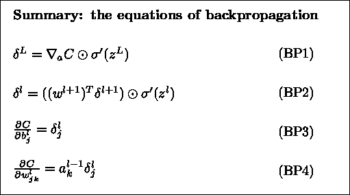
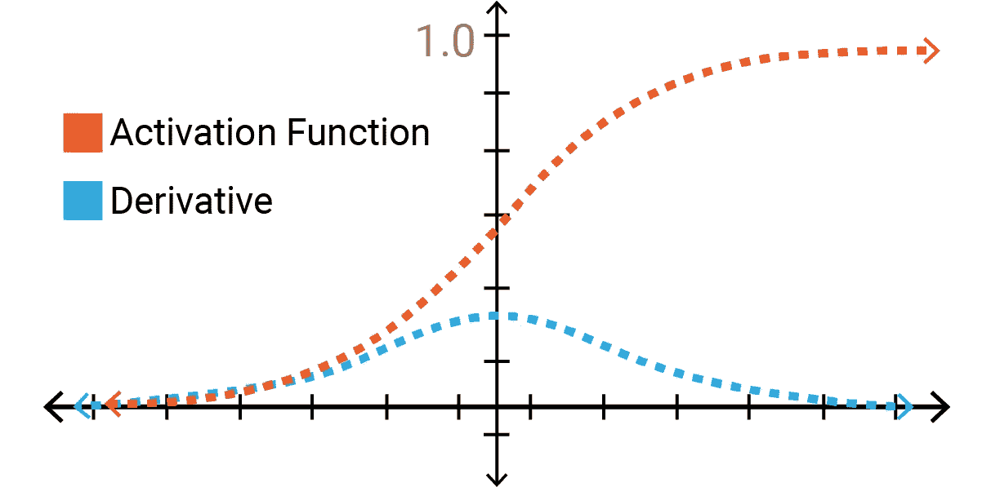
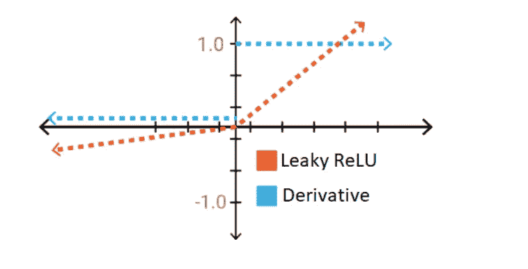
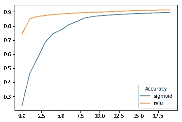
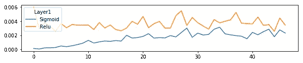
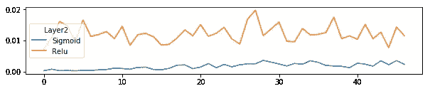
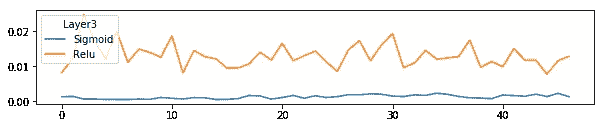
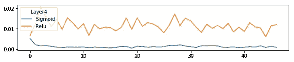
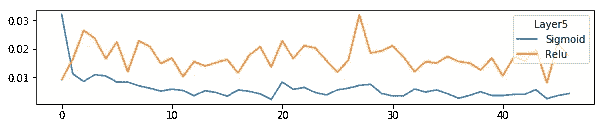

# 消失梯度的问题

> 原文：<https://towardsdatascience.com/the-problem-of-vanishing-gradients-68cea05e2625?source=collection_archive---------22----------------------->

使用基于梯度的优化方法训练深度神经网络时会出现消失梯度。这是由于用于训练神经网络的反向传播算法的性质造成的。

## 这篇博客将涵盖哪些内容？

1.  **解释消失渐变的问题:**我们会明白为什么会存在消失渐变的问题。我们还将研究为什么这个问题在使用 sigmoid 激活函数时更容易观察到，以及 RELU 如何减少这个问题。
2.  **使用 TensorFlow 的比较研究:**我们将使用 sigmoid 和 RELU 激活函数在时尚 MNIST 数据集上训练 MLP 分类器，并比较梯度。

在我们能够理解为什么消失梯度的问题存在之前，我们应该对反向传播算法的方程有一些理解。我将不推导反向传播方程，因为它超出了本文的范围。不过我附了一本著名的[书](http://neuralnetworksanddeeplearning.com/chap2.html)的截图。

## **反向传播算法**



Source: [http://neuralnetworksanddeeplearning.com/chap2.html](http://neuralnetworksanddeeplearning.com/chap2.html)

**观察:**

1.  从等式 1 和 2 可以看出，输出层中的误差取决于激活函数的导数。
2.  从等式 2 中，我们可以观察到在前/隐藏层中的误差与权重、来自外层的误差以及激活函数的导数成比例。来自外层的误差又取决于其层的激活函数的导数。
3.  从等式 1、2 和 4 中，我们可以得出结论，任何层的权重梯度都取决于激活层的导数的*乘积。*

## 渐变消失的问题是什么？

考虑 sigmoid 函数及其导数的图形。观察到对于 sigmoid 函数的非常大的值，导数取非常低的值。如果神经网络有许多隐藏层，随着我们乘以每层的导数，早期层中的梯度将变得非常低。结果，早期层的学习变得非常慢。



Source: [https://codeodysseys.com/posts/gradient-calculation/](https://codeodysseys.com/posts/gradient-calculation/)

另一方面，RELU 函数的导数要么为零，要么为 1。即使我们将许多层的导数相乘，也不会出现与 sigmoid 函数不同的退化(假设 RELU 不在死区中工作)。然而，如果仔细观察等式 2，误差信号也取决于网络的权重。如果网络的权重总是小于零，梯度会慢慢减小。



Source: [https://mc.ai/comparison-of-activation-functions-for-deep-neural-networks/](https://mc.ai/comparison-of-activation-functions-for-deep-neural-networks/)

现在我们已经理解了消失梯度的问题，让我们训练两个不同的 MLP 分类器，一个使用 sigmoid，另一个使用 RELU 激活函数。

让我们开始吧。

**导入库**

```
import tensorflow as tf
import numpy as np
from tensorflow import keras
import matplotlib.pyplot as plt 
from tqdm import tqdm
```

**下载数据集**

我们将使用时尚 MNIST 数据集。它由 10 个不同产品类别的 70000 幅灰度图像组成。每个产品类别有 7000 个样本。你可以在这里阅读更多关于数据集[的信息](https://github.com/zalandoresearch/fashion-mnist)。

我们将使用 Keras 下载时尚 MNIST 数据集。

```
fashion_mnist = keras.datasets.fashion_mnist
(x_train, y_train), (x_test, y_test) = fashion_mnist.load_data()
print(x_train.shape)
print(y_train.shape)
print(x_test.shape)
print(y_test.shape)(60000,28,28)
(60000,)
(10000,28,28)
(10000,)
```

## 预处理

因为我们将使用 MLP 分类器，我们需要将 28*28 的灰度图像展平为 784 长的矢量。

```
x_train = x_train.reshape(60000,-1)
x_test = x_test.reshape(10000,-1)
```

图像的像素值介于 0 和 1 之间。我们将定义一个函数，通过移除平均值并缩放到单位方差来标准化数据集。

```
def normalize(x_train, x_test):
  train_mean = np.mean(x_train)
  train_std = np.mean(x_train)
  x_train = (x_train - train_mean)/train_std
  x_test = (x_test - train_mean)/train_std  
  return x_train, x_test
```

产品类别从 0 到 9 进行标记。我们将定义一个实用程序来将这些值转换成一个热编码。

```
def convert_to_one_hot(labels):
  no_samples = labels.shape[0]
  n_classes = np.max(labels) + 1
  one_hot = np.zeros((no_samples, n_classes))
  one_hot[np.arange(no_samples),labels.ravel()] = 1
  return one_hot
```

接下来，我们通过将原始值传递给上面定义的效用函数来预处理数据集。

```
x_train, x_test = normalize(x_train, x_test)
y_train = convert_to_one_hot(y_train)
y_test = convert_to_one_hot(y_test)
```

# MLP 分类器

我们将使用张量流训练一个 MLP 分类器。我们将创建一个包括输入层和输出层的 6 层网络。我们将训练两个不同的模型，一个使用 sigmoid 激活函数，另一个使用 RELU 激活函数。在反向传播算法的每次迭代中，我们将存储关于每层权重的损失梯度。最后，通过一些可视化，我们将比较

1.  最终层相对于早期层的梯度
2.  sigmoid 激活函数与 RELU 激活函数的梯度

让我们建立模型。

## **定义占位符**

首先，我们定义输入和目标的占位符。

```
def get_placeholders(input_size, output_size):
  inputs = tf.placeholder(dtype=tf.float32, shape=[None, input_size], name="inputs")
  targets = tf.placeholder(dtype=tf.float32, shape=[None, output_size], name="targets")
  return inputs, targets
```

## **致密层**

我们将定义一个函数来创建一个完全连接的层。每层的权重以格式*“kernel/<layer _ num>”*命名。这将有助于以后提取梯度。稍后将详细介绍。

```
def dense_layer(input, hidden_units, layer_no, activation_fn= tf.nn.relu):
  weights_name = "kernel/{}".format(layer_no)
  bias_name = "biases/{}".format(layer_no)
  weights = tf.get_variable(weights_name, shape=[input.shape[1], hidden_units], initializer = tf.contrib.layers.xavier_initializer(seed=0))
  biases = tf.get_variable(bias_name, shape=[hidden_units], initializer = tf.zeros_initializer())
  output = tf.add(tf.matmul(input, weights), biases)
  if activation_fn:
    return activation_fn(output)
  else:
    return output
```

## **前向网络**

接下来，我们定义一个函数来创建网络的正向传递。我们将激活函数应用于每个隐藏层。输出图层不通过激活函数，因为输出图层的 softmax 激活将包含在损失定义中。

```
def build_network(features, labels, hidden_units, num_layers, activation_fn):
  inputs = features
  for layer in range(num_layers-1):
    inputs = dense_layer(inputs, hidden_units[layer], layer+1, activation_fn)
  logits = dense_layer(inputs, 10, num_layers, None) 
  return logits
```

## **损失和优化器**

因为我们想要在 10 个不同的产品类别之间进行分类，所以我们将 softmax 激活应用到输出层以获得最终的概率。我们将使用*交叉熵*损失作为衡量标准来确定我们的网络有多好。Tensorflow 提供了一个方便的实用程序来使用*TF . nn . soft max _ cross _ entropy _ with _ logits _ v2 一起计算这两者。*

```
def compute_loss(logits, labels):
  loss = tf.reduce_mean(tf.nn.softmax_cross_entropy_with_logits_v2(labels = labels , logits= logits))
  train_op = tf.train.AdamOptimizer(0.001)
  return loss, train_op
```

如果你仔细观察，我们没有在优化器上添加*最小化*操作。*最小化*操作在内部执行两个操作。首先，它根据权重和偏差计算损失的梯度。其次，它使用上面计算的梯度更新权重和偏差。

由于我们希望每次迭代的梯度值来研究梯度消失的问题，我们将定义两个独立的操作，一个是计算梯度，另一个是应用梯度。当我们训练我们的模型时，我们将再次讨论这个问题。

## **精度**

我们还将定义一个实用程序来计算模型的准确性。 *tf.argmax(logits，1)* 将返回概率最大的索引。由于标签是一位热编码的， *tf.argmax(labels，1)* 将返回值为 1 的索引。我们比较这两个值来确定正确的预测和准确性。

```
def compute_accuracy(logits, labels):
  correct_predictions = tf.equal(tf.argmax(logits,1), tf.argmax(labels,1))
  accuracy = tf.reduce_mean(tf.cast(correct_predictions, tf.float32))
  return accuracy
```

## **网络中的权重**

我们将定义一个函数来返回网络中所有权重的名称。还记得我们将权重的名称定义为*内核/ <层编号>吗？* Tensorflow 在内部将“:0”附加到变量名称上。你可以在这里了解更多信息[。](https://stackoverflow.com/questions/40925652/in-tensorflow-whats-the-meaning-of-0-in-a-variables-name)

```
def get_weights_name(num_layers):
  return ["kernel/{}:0".format(layer+1) for layer in range(num_layers)]
```

## 火车模型

我们将定义一个函数来训练模型。我们将使用 sigmoid 和 RELU 激活来训练我们的模型。

```
def train_model(features, labels, hidden_units, epochs, batch_size, learning_rate, num_layers, activation_fn):
  tf.reset_default_graph()
  input_size = features.shape[1]
  output_size = labels.shape[1]

  *# get the placeholders* 
  inputs, targets = get_placeholders(input_size,output_size)

  *# create a dataset*
  dataset = tf.data.Dataset.from_tensor_slices((inputs, targets))

  *# make the required batches* 
  dataset = dataset.batch(batch_size)

  *# initialize the iterator for the dataset* 
  iterator = dataset.make_initializable_iterator()

  *# get the next batch*
  x_batch, y_batch = iterator.get_next()

  *# forward network*
  logits = build_network(x_batch, y_batch, hidden_units, num_layers, activation_fn)

  *# compute the loss*
  loss, train_op = compute_loss(logits, y_batch)

  *''' instead of directly using the minimize function on the optimizer,* 
 *we break the operation into two parts*
 *1\. compute the gradients*
 *2\. apply the gradients*
 *'''*
  grads_and_vars_tensor = train_op.compute_gradients(loss, tf.trainable_variables())
  optimizer = train_op.apply_gradients(grads_and_vars_tensor)

  *# compute the accuracy of the model*
  accuracy = compute_accuracy(logits, y_batch)

  init_op = tf.global_variables_initializer()
  saver = tf.train.Saver()

  with tf.Session() as sess:
    sess.run(init_op)
    def_graph = tf.get_default_graph()
    gradient_means = []
    losses = []
    accuracies = []
    train_samples = features.shape[0]

    iteration = 0
    *# get the name of all the trainable variables*
    trainable_variables = [var.name for var in tf.trainable_variables()]
    for epoch in range(epochs):
      epoch_loss = 0
      total_accuracy = 0
      *# run the iterator's initializer*
      sess.run(iterator.initializer, feed_dict={inputs:features, targets:labels})
      try:

        while True:
          gradients = []
          batch_loss, grads_and_vars,  _ , batch_accuracy = sess.run([loss, grads_and_vars_tensor, optimizer, accuracy])
          if iteration % 100 == 0:

            *# create a dictionary of all the trianbale variables and it's gradients*
            var_grads = dict(zip(trainable_variables, [grad for grad,var in grads_and_vars]))

            *# get the gradients of all the weights for all the layers*
            weights_grads = [var_grads[var] for var in get_weights_name(num_layers)]

            *# take the mean of the gradients at each layer*
            mean_values = [np.mean(np.abs(val)) for val in weights_grads]
            gradient_means.append(mean_values)

          epoch_loss += batch_loss
          total_accuracy += batch_accuracy*batch_size
          iteration += 1
      except tf.errors.OutOfRangeError:
        pass
      print("Total Iterations {}".format(iteration))
      acc = total_accuracy/train_samples
      accuracies.append(acc)
      losses.append(epoch_loss)
      print("Epoch: {}/{} , Loss: {} , Accuracy: {}".format(epoch, epochs, epoch_loss, acc))

  return losses, accuracies, gradient_means
```

由于函数非常大，我们将把它分解成更小的部分来理解。

**将数据输入模型**

首先，我们使用数据集和迭代器向网络提供数据。如果你想了解更多关于数据集和迭代器的细节，你可以参考[这篇](/building-efficient-data-pipelines-using-tensorflow-8f647f03b4ce)博客。然后，我们使用之前定义的例程来定义逻辑、损失、优化和准确性操作。

```
inputs, targets = get_placeholders(input_size,output_size)
dataset = tf.data.Dataset.from_tensor_slices((inputs, targets))
dataset = dataset.batch(batch_size)
iterator = dataset.make_initializable_iterator()
x_batch, y_batch = iterator.get_next()

logits = build_network(x_batch, y_batch, num_layers, activation_fn)

loss, train_op = compute_loss(logits, y_batch)
accuracy = compute_accuracy(logits, y_batch)
```

**优化操作**

如果您还记得，我们没有将最小化操作添加到优化器中，因为我们需要梯度的值。我们可以使用 *tf.compute_gradients 计算 Tensorflow 中的梯度。*我们可以使用 *tf.apply_gradients 使用上述梯度更新权重和偏差。*

```
grads_and_vars_tensor = train_op.compute_gradients(loss, tf.trainable_variables())optimizer = train_op.apply_gradients(grads_and_vars_tensor)
```

**训练模型**

```
with tf.Session() as sess:
    sess.run(init_op)
    def_graph = tf.get_default_graph()
    gradient_means = []
    losses = []
    accuracies = []
    train_samples = features.shape[0]

    iteration = 0
    trainable_variables = [var.name for var in tf.trainable_variables()]
    for epoch in range(epochs):
      epoch_loss = 0
      total_accuracy = 0
      sess.run(iterator.initializer, feed_dict={inputs:features, targets:labels})
      try:

        while True:
          gradients = []
          batch_loss, grads_and_vars,  _ , batch_accuracy = sess.run([loss, grads_and_vars_tensor, optimizer, accuracy])
          var_grads = dict(zip(trainable_variables, [grad for grad,var in grads_and_vars]))
          weights_grads = [var_grads[var] for var in get_weights_name(num_layers)]
          mean_values = [np.mean(np.abs(val)) for val in weights_grads]
          epoch_loss += batch_loss
          total_accuracy += batch_accuracy*batch_size
          iteration += 1
          gradient_means.append(mean_values)
      except tf.errors.OutOfRangeError:
        pass
      print("Total Iterations {}".format(iteration))
      acc = total_accuracy/train_samples
      accuracies.append(acc)
      losses.append(epoch_loss)
      print("Epoch: {}/{} , Loss: {} , Accuracy: {}".format(epoch, epochs, epoch_loss, acc))

  return losses, accuracies, gradient_means
```

我们使用下面的代码计算了每一次迭代中每一层的梯度平均值。

```
var_grads = dict(zip(trainable_variables, [grad for grad,var in grads_and_vars]))weights_grads = [var_grads[var] for var in get_weights_name(num_layers)]mean_values = [np.mean(np.abs(val)) for val in weights_grads
```

我们首先创建一个包含所有可训练变量和梯度的字典。接下来，我们只提取权重的梯度，并计算每层的平均值。

## 运行模型

我们已经定义了运行模型所需的所有例程。让我们定义模型的超参数，并运行 sigmoid 和 RELU 激活函数的模型。

```
features = x_train
labels = y_train
epochs = 20
batch_size = 256 
learning_rate = 0.001num_layers = 5
hidden_units = [30,30,30,30]
input_units = x_train.shape[1]
output_units = y_train.shape[1] *# run the model for the activation functions sigmoid and relu*
activation_fns = {"sigmoid":tf.nn.sigmoid,
                 "relu":tf.nn.relu}loss = {}
acc= {}
grad={} for name, activation_fn in activation_fns.items():
  model_name = "Running model with activation function as {}".format(name)
  print(model_name)
  losses, accuracies, grad_means = train_model(features = features,
              labels = labels, 
              hidden_units = hidden_units,                                 
              epochs = epochs, 
              batch_size = batch_size, 
              learning_rate = learning_rate, 
              num_layers = num_layers, 
              activation_fn = activation_fn)
  loss[name] = losses
  acc[name] = accuracies
  grad[name] = grad_means
```

让我们使用一些可视化工具来比较这两个模型的精确度和梯度。

# 形象化

**精度**

```
def plot_accuracy(accuracies, title):
  for name, values in accuracies.items():
    plt.plot(values, label = name)
    plt.legend(title=title)plot_accuracy(acc, "Accuracy")
```



我们可以看到，用 RELU 函数训练的模型比用 sigmoid 训练的模型更准确。还可以观察到，sigmoid 模型需要更多的时间来实现高精度。**为什么？**由于渐变消失的问题，早期层的学习速度较慢。

## 梯度

让我们绘制每一层的梯度。

```
def plot_gradients(grads):
  sigmoid = np.array(grads['sigmoid'])
  relu = np.array(grads['relu'])
  for layer_num in range(num_layers):
    plt.figure(figsize=(20,20))
    plt.subplot(5,1,layer_num+1)
    plt.plot(sigmoid[:,layer_num], label='Sigmoid')
    plt.plot(relu[:,layer_num], label='Relu')
    plt.legend(title='Layer{}'.format(layer_num+1))plot_gradients(grad)
```



从上面的图表中我们可以得出两个主要结论

1.  与最终层中的梯度相比，早期层中的梯度幅度非常低。这解释了渐变消失的问题。
2.  与 RELU 模型相比，sigmoid 模型的梯度值非常低。

# 摘要

在这篇博客中，我们讨论了渐变消失的问题，以及当我们使用 sigmoid 函数时如何缓解这个问题。我们还讨论了 RELU 函数如何帮助大大减少这个问题。

感谢阅读博客。希望你喜欢这篇文章。请在下面的评论中留下你的建议。

这篇文章的全部代码可以在[这个](https://github.com/animesh-agarwal/deep-learning-hyperparameters-tuning/blob/master/Vanishing%20Gradients/Vanishing_Gradients_with_TensorFlow.ipynb) Jupyter 笔记本中找到。

# 参考

1.  [https://en.wikipedia.org/wiki/Vanishing_gradient_problem](https://en.wikipedia.org/wiki/Vanishing_gradient_problem)
2.  [http://proceedings.mlr.press/v9/glorot10a/glorot10a.pdf](http://proceedings.mlr.press/v9/glorot10a/glorot10a.pdf)
3.  [https://adventuresinmachine learning . com/vanishing-gradient-problem-tensor flow/](https://adventuresinmachinelearning.com/vanishing-gradient-problem-tensorflow/)
4.  [https://stack overflow . com/questions/40925652/in-tensor flow-0-in-a-variables-name 的含义是什么](https://stackoverflow.com/questions/40925652/in-tensorflow-whats-the-meaning-of-0-in-a-variables-name)
5.  [http://neuralnetworksanddeeplearning.com/chap2.html](http://neuralnetworksanddeeplearning.com/chap2.html)