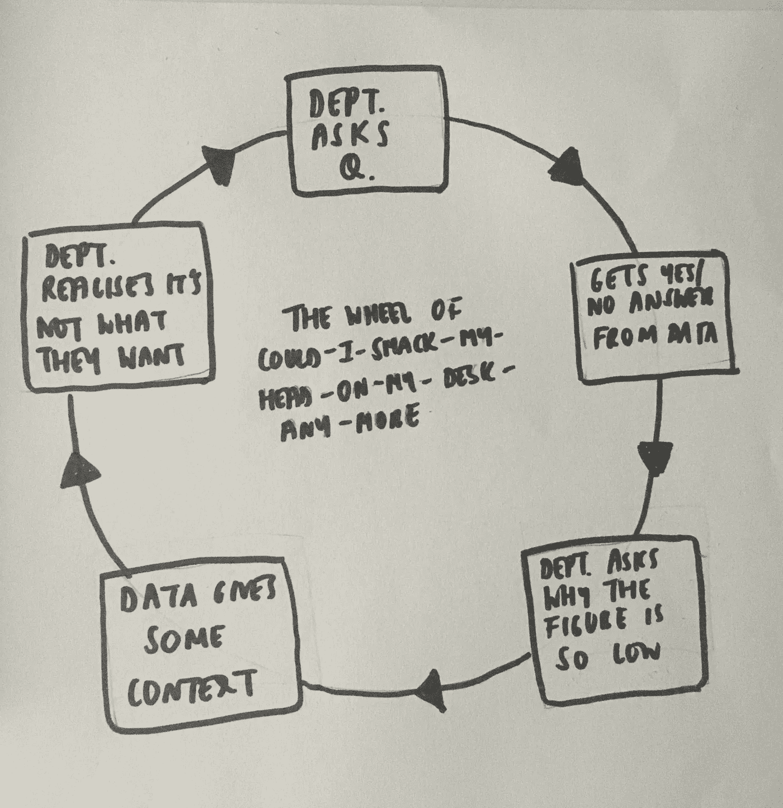
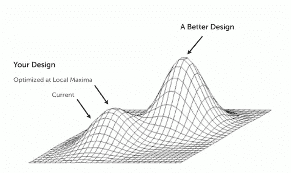

# 数据的问题

> 原文：<https://towardsdatascience.com/the-problem-with-data-a7e54926bb06?source=collection_archive---------38----------------------->

## 作为分析师，我对数据的抱怨

Photo by [Nick Hillier](https://unsplash.com/@nhillier?utm_source=unsplash&utm_medium=referral&utm_content=creditCopyText) on [Unsplash](https://unsplash.com/s/photos/data?utm_source=unsplash&utm_medium=referral&utm_content=creditCopyText)

数据。数据。数据。我们有这方面的数据吗？我们能检查数据吗？我需要备份我的议程。这些数字看起来很差。隐藏数据。

今天，我们看到这四个字母的单词受到了前所未有的关注:用最合理的猜测实现业务绩效最大化。也许有些人会感到惊讶，但统计分析已经存在了相当一段时间。20 世纪以来，人们。2005 年，O'Reilly 先生决定给这个术语改头换面，诞生了“数据科学”。营销——1，社会——零。

人工智能和机器学习等术语已经被贬低到了创造数据淘金热的地步，许多公司都在争先恐后地想要分一杯羹，因为担心这会削弱他们的竞争优势。不幸的是，这种争夺导致了对这个不断发展的领域的错误理解，导致人力资源部门和老派数据人员的招聘少得可怜。

围绕水晶球时尚的长期错觉也导致了公司对基本数据需求的忽视。确保数据是任何决策过程的核心，应该是任何领导者的首要任务；毕竟，如果没有利益相关者的支持，拥有花哨的算法又有什么用呢？你知道他们说…【to】跑之前先走。

## 不要滥用“数据驱动”这个术语

这是给你的快速数据 101:

**数据驱动**——数据*就是*产品。

**数据通知** -(大多数公司如何运营)*嗯，这是一个有趣的见解。我会记住的。*

我认为，数据驱动并不是简单地对产品查询提供一个是/否的答案，来决定功能/设计的构建。相反，产品本身应该具有内在的底层数据依赖性。一个例子是网络安全平台，使用机器学习和自然语言处理来对抗电子邮件威胁。或者是一款教育科技应用，其中的推荐算法为学生提供个性化课程。

公司滥用了数据驱动的含义，而更多的时候，不仅仅是数据驱动。工作流通常在下游，而不是上游，这使得数据功能看起来更像是支持，而不像是咨询部门。很多时候，数据缺乏解决其他部门要求的问题的上下文，这导致了经典的“我可以拍我的头”循环:

the analyst’s wheel of doom

相反，对双方来说，预先确定问题的背景会更有成效。

这确保了:

1.  提出了正确的问题
2.  您的数据同事可以提供超出当前问题范围的额外价值；产品/营销/其他可能需要转向

数据*就是*，并且在未来几年将无处不在。随着这种情况的发生，对其他部门提高数据流畅性以处理基本查询的期望只会越来越高。反过来，它也可以打击房间里的大象，也就是说，数据往往在替罪羊的产生中扮演主角，这通常是作为被动参与者的结果。项目时不时会出问题，但如果你是自己拉数据的人，就更难推卸责任了…

## 数据的局限性

Photo by [Franck V.](https://unsplash.com/@franckinjapan?utm_source=unsplash&utm_medium=referral&utm_content=creditCopyText) on [Unsplash](https://unsplash.com/s/photos/obstruction?utm_source=unsplash&utm_medium=referral&utm_content=creditCopyText)

可悲的是，这个世界并不像我们希望的那样二元。无论是设计、产品还是营销，其核心数据都是为了降低风险和进行优化。在采取行动之前，每一个选择都经过分析、计算和逻辑推理。这导致我们过于依赖数据来做决定。这是一种极度规避风险的创新方式，更不用说数据无法提供答案的基本灰色领域了。

我说的这些温暖的石墨区域是什么意思？尽管齐心协力，指针就是不动，结果高管们把香蕉丢在了自己的闺房里。产品可能会经历动荡；客户不再喜欢它，一些有想象力的人决定是时候改变一下平台的核心了。

但是你什么时候决定做出这些改变呢？当优化达到极限时。当一个产品在每个可能的 KPI 上都明显走下坡路时。

数据是回顾性的，看用户如何在产品的现有范例中操作。因此，产品的范围限制了用户的行为。假设你房间的墙壁是黑色的。公平地说，这是明显的冒犯，所以你很少花时间在那里。*是血腥的墙壁*。*把它们染成蓝色。*你现在更喜欢它了，所以你在房间里多呆了 5 分钟。哇哦。但是如果你改变的不是墙壁呢？如果你决定变得疯狂，把你的房间变成一个迪斯科舞厅:闪光灯，爆米花机，沙坑，等等。你现在会在房间里做什么？

您选择构建的内容会改变客户与 it 的交互方式。因此，使用现有的客户数据来确定下一步要建造什么是一种相当有限和有缺陷的思维方式，尤其是如果你的房间一开始就没有任何有用的东西。如果你的基线已经有点糟糕，持续的 A/B 测试是没有意义的。有点像在闪粉里滚屎。它可能会变得有趣，但仍然是垃圾。

我们可能对下面的经典图表很熟悉。数据可以优化产品的性能(通过你选择的 KPI 来衡量),使其达到局部最大值，但不是全局最大值。只有创造性的解决方案才能做到这一点，但会增加业务风险。这可能是真的，但是我们经常没有意识到迭代优化也是在创纪录的时间内达到全局最大值的机会成本。

[image source](https://www.slideshare.net/andrew_null/metrics-driven-design-by-joshua-porter)

我们面临的现实是，总会有 A/B 测试没有考虑到的另一种变化。这里的要点是，你不需要等到优化达到极限，因为现实世界的问题从来都不是线性的。从来没有一个“正确”的时间来做出直觉驱动的决策。

商业战略在直觉驱动和数据驱动的决策中找到了自己的位置。处于超越其他公司而非创新阶段的单体公司只是进行小的调整和优化，完全由数据驱动。但当历史数据很少时，年轻的公司能够承担得起冒险，以免受到那些期望在 6 个月内获得 10 倍回报率的风投们的审查。

突然之间，把生意赌掉似乎不那么不负责任了…