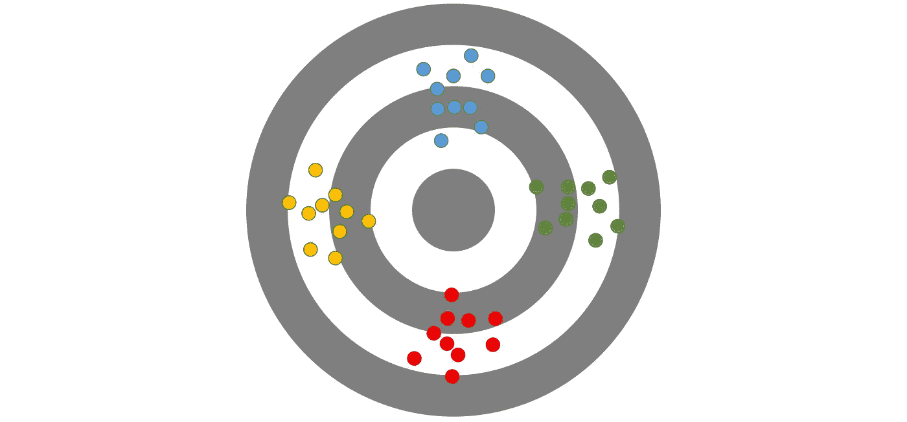
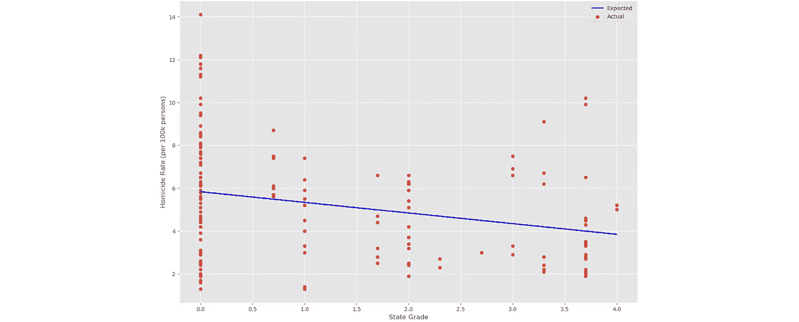

# P 值的问题是

> 原文：<https://towardsdatascience.com/the-problem-with-p-values-f056245f78a3?source=collection_archive---------23----------------------->

## 对 p 值及其操纵潜力的简单解释。

p 值是最强大的统计指标之一，但经常被误解和误用。为了理解这一统计数据的影响范围和局限性，我们必须对它是什么和不是什么有一个共同的理解。有鉴于此，让我们从一个例子开始讨论，这将有助于建立对它的直观理解。

## 什么是 p 值？

美国法律体系的一个基本基石是无罪推定。“排除合理怀疑”证明有罪的责任在州政府身上。在民事案件中，举证责任要低得多，其标准被称为“证据优势”从实践的角度来看，我们可以将这些负担分别解释为 99%和 51%的确定性水平。在实践中，我们通常不能以这种方式量化证据的强度，但让我们假装我们可以。

通过建立假设检验，我们可以评估每个新证据的重要性。零假设，或默认假设，是证据是无意义的；另一个假设是证据是有意义的。我们反向工作，根据证据计算零假设为真的概率。考虑经典电影《我的表弟文尼》中的一个例子。

文尼·甘比尼(乔·佩西)正在为两名被指控抢劫商店并枪杀店员的客户辩护。对他们不利的证据主要基于三名目击证人的证词，他们指认了被告和他们的汽车。在无罪推定下，三个证人错误指认嫌疑人的可能性有多大？唯一的解释就是文尼所描述的:

> 有没有可能，两个被告进入商店，从货架上挑选了 22 件特定的商品，让店员拿钱，找零，然后离开，然后两个不同的人，开着一辆相似的车，进去，开枪打死店员，抢劫他，然后离开？

不是不可能，只是可能性很小。那就像是百万分之一的坏运气。百万分之一的概率就是我们所说的 p 值:当零假设为真时，发现观察到的证据的概率。p 值越低，证据的重要性越大。显著性(或置信水平)计算为 1 减去 p 值。在这种特殊情况下，这些值是:

*   p 值:0.0001%
*   置信度:99.99%

当检察官试图让陪审团相信 p 值很低时，被告的律师会试图证明 p 值很高。

## 什么不是 p 值？

这里需要注意的是，置信水平并不意味着有罪的可能性；这需要对全部证据进行评估。当辩方陈述案情时，它旨在表明，在一个客户是无辜的世界里，对其客户不利的证据更可信。虽然我很想用 Vinny 精湛的盘问来说明这一点，但如果你没看过，我不想破坏你的电影！所以，让我们用一个不同的例子。

考虑一个犯罪现场，调查人员发现了被告的 DNA 和指纹。如果被告没有犯罪，找到这样的证据是非常不可能的；所以 p 值会很低，我们对证据的置信水平会很高。但是如果我们后来发现犯罪现场是被告的家呢？突然间，证据变得更可信了。事实上，如果调查人员在嫌疑人自己的家里没有发现这样的证据，那才奇怪。给定证据的 p 值上升，置信水平下降。

## 科学和研究中的 p 值

从科学的角度来看，研究人员充当检察官，试图证明某一特定现象的存在，例如二氧化碳水平对全球平均温度的影响。任何给定实验的无效假设是不存在关系，另一个假设是更高的 CO2 水平导致更高的温度。与法律检察官不同，这些研究人员可以精确测量 p 值，科学界决定结果是否足够重要，可以添加到更大的证据中。换句话说，作品能出版吗？

正如人们所料，这激励研究人员寻找更高的置信水平和更低的 p 值来证明他们的工作并获得报酬。合法出版物的公认置信度为 95%(p 值为 5%)。当发现结果仅在 94%的置信水平下显著时，会发生什么？

## p-黑客

放弃不是一个选项。获取更多的数据可能会非常昂贵。这种情况有可能导致一些不道德的行为。当处理具有数百或数千个输入的模型时，是否可以简单地忽略一些影响结果的精选特征？怎么会有人知道？

答案很简单:同行评议。其他研究小组重复这项工作来验证结果，作为各自领域的专家，他们将能够识别这些类型的缺点。这是否会使所有结果完全无效？不一定。没有必要把孩子和洗澡水一起倒掉。只有一个问题:绝大部分研究资金用于支持新的研究，很少用于复制。根据[美国国家科学、工程和医学科学院](https://sites.nationalacademies.org/sites/reproducibility-in-science/index.htm):

> 科学和大众媒体都表达了对再现性和可复制性的关注。随着这些问题的曝光，国会要求国家科学院、工程学院和医学院进行一项[研究](https://www.nap.edu/resource/25303/R&R.pdf)，以评估与可重复性和可复制性相关的问题的程度，并提供提高科学研究的严谨性和透明度的建议。

报告确实提供了一些可行的方案来解决这个问题，但是更重要的一点是这个问题还没有解决。

这是否意味着科学研究不可靠，不可信？绝对不行。仅仅因为复制和再现性的挑战没有被解决，并不意味着没有管理这个问题的方法。美国国家科学院的研究还指出，“研究综合和元分析…是评估研究机构可靠性和有效性的有价值的方法。”

## 为什么要进行元分析？

为了理解这个问题的答案，考虑一个有四个玩家的飞镖游戏。这个特殊的游戏很简单:第一个击中靶心的人获胜。下图显示了每位玩家的飞镖落点:

正如我们所看到的，每个玩家的投掷都有很大的偏差，他们中没有一个人可能很快赢得比赛。然而，考虑一个观众观看这场比赛，并研究每个球员如何投掷。通过考虑所有的偏见，那个人在后续比赛中击中靶心的机会要高得多。

元分析也是同样的工作方式。通过对给定主题的大量研究子集进行评估，考虑所有偏差，我们可以建立模型，提供足够的现实近似值。然而，这些近似值在结果中通常具有较高程度的差异，因此尽管它们是有帮助的，但它们不是永久的解决方案。

## 其他考虑

这里值得注意的是，p-hacking 并不总是故意的。如果一个特定的数据点使得结果不那么可靠，那么这个数据点本身实际上是有效的吗？或者只是噪音，无论如何都应该省略？答案很简单:视情况而定。谁将使用这项研究？这是一个可以在未来实验中控制的变量吗？我们是在试图理解历史数据，还是在为未来打造一个工具？这些问题不容易回答。突然间，研究人员不得不表现得像一个商人，试图做出一个最能满足所有利益相关者的决定。

实现这一点的一种方法是故意破解 p 值，然后回过头来理解结果的适用性是如何受到限制的。这些限制必须充分记录在结果中，以避免误用。不幸的是，这种细微差别往往在这些发现被面向消费者的媒体出版物发现时就消失了。即便如此，也不能保证研究人员已经充分考虑了所有的限制。

## 回归模型中的 p 值

暂且把 p-hacking 问题放在一边，还有一件事需要注意:p 值可以帮助我们理解变量之间是否存在关系，但它们不能告诉我们这些关系的强度。

考虑一下我最近进行的一项关于州枪支法对凶杀率影响的分析。作为最初数据审查的一部分，我想知道吉福兹法律中心分配的等级是否与凶杀率充分相关。p 值为 0.14%(置信水平:99.86%)，很明显存在关系。只有一个问题:看看当我们用散点图绘制分数和谋杀率时会发生什么。

Source: [What can Machine Learning Tell Us About America’s Gun Laws?](/what-can-machine-learning-tell-us-about-americas-gun-laws-da01d9fb7413)

很明显，随着年级升高，杀人率下降，但也有很多例外。为了量化关系的强度，我们使用 r 平方分数。这个分数告诉我们州枪支法可以解释凶杀率变化的百分比。这里，r 平方值仅为 6.73%。

我已经能看到标题了:“新研究发现枪支法超过 99%有效。”不要！我不是这么说的！过度依赖 p 值来传播结果，而没有适当考虑其他指标，往往会导致研究被广泛滥用。

## 外卖食品

p 值本身没有任何问题。它们是帮助我们理解证据重要性的宝贵工具。然而，过度依赖单一指标或单一研究来支持更广泛的假设是危险的。此类研究的消费者必须保持更广阔的视角，媒体机构必须避免炒作任何单个研究的结果。最终，p 值是有用的工具，但这取决于我们是否正确地使用了这个工具。