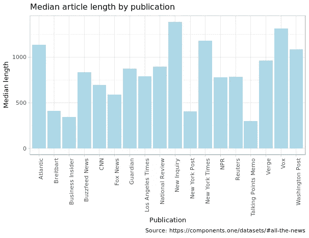
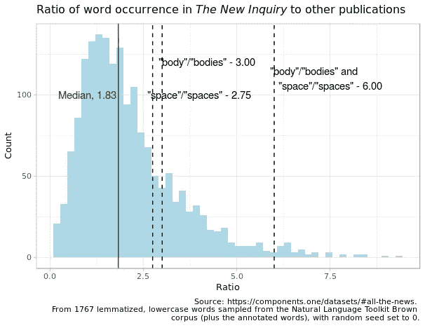
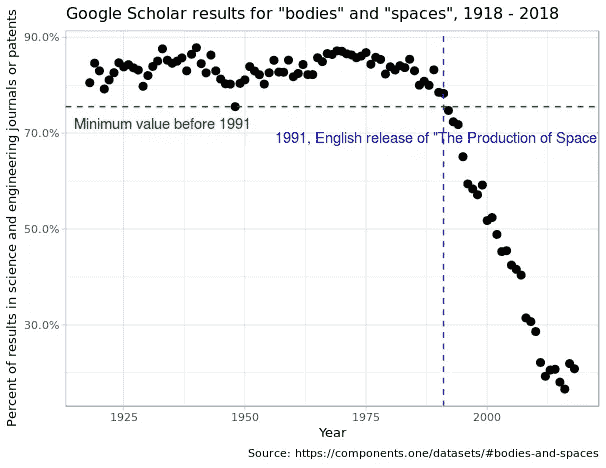
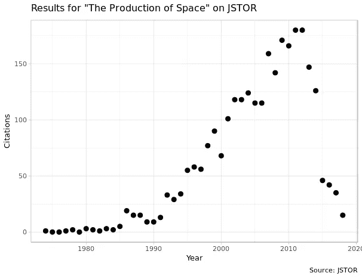
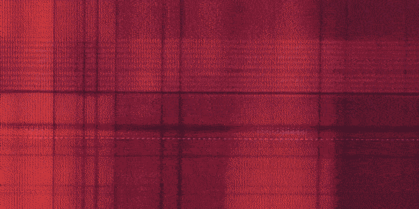

# “空间”的生产

> 原文：<https://towardsdatascience.com/the-production-of-space-2a06e14c4601?source=collection_archive---------20----------------------->

## 在 80，000 个谷歌学术结果和 180，000 篇文章中搜索一个智力比喻的来源

*原载于* [*组件*](https://components.one/posts/the-production-of-space) *。*

经济衰退后的几年，一群新毕业的常青藤联盟毕业生发现自己被文学界拒之门外，并在网上出版了《新调查》( New Inquiry)杂志(New Inquiry ),该杂志曾被《纽约时报》( New York Times )(纽约时报)(纽约时报)(纽约时报)(纽约时报)(纽约时报)(纽约时报)(纽约时报)(纽约时报)(纽约时报)(纽约时报)(纽约时报)(纽约时报)(纽约时报)(纽约时报)(纽约时报)(纽约时报)曾)(纽约时报)(纽约时报)(纽约时报)(纽约时报)(纽约时报)(纽约他们可能一直在敲哈珀的门，但他们几乎不会说 glossies 的温和方言。《新调查》充斥着晦涩难懂的巴黎语言，好像是毕业后被流放的学者写的。多年来，这份刊物(似乎)成为媒体研究、批评理论和文学领域最大的论坛之一。来自新学校的学生和他们的教授终于在网上有了自己的家。

现在，在《泰晤士报》称其为“文学幼兽”的摇篮八年后，《新调查》将自己定位为曾经拒绝其作家的同一机构的不可忽视的农场联盟，将他们安置在像《纽约客》*(一个是职业作家)和《新共和》*(作为出版社)这样的地方

Lol。读者，我发誓我试着用不同的方式写这两段。看在上帝的份上，有没有办法砍掉一些这种新的？也许可以参考一些其他的杂志？但是他们去了那些地方工作，去了解新的事物。也许我可以谈论一些地方，而不是新的调查？但那才是我发现这篇文章基础的地方。也许其他东西可以代替新学校？但很少有地方能让人联想到新学院几十年来发展起来的钢铁般的多音节词，该学院也位于曼哈顿，与该出版物有着更密切的关系。

写完那篇文章后，我在谷歌上搜索了“新学校”“新调查”，想看看这种关系有多紧密。第二个图像结果是文本的截图，链接到一个页面，开始是，“瑞秋·罗森菲尔特是 *The New Inquiry* 的联合出版商，Verso Books 的创意总监，新学院创意出版和批判新闻部的副主任，以及 2017-2018 年 NEW INC .的成员，”NEW INC 是新博物馆的一个项目。

*A plausible explanation behind the inclusion of certain words in* The New Inquiry *is that, as its essays tend to run longer, it’s more likely to include* any *words. This could help explain why its median ratio is 1.83:1, meaning that of the sampled words, half of them are used 1.83 more times frequently than in other publications on average, and half of them are used less than 1.83 times more frequently. (This calculation is Boolean: if the word occurs in an article, it has a value of 1\. There is no measure of the number of occurrences.) Both “body”/”bodies” and “space”/”spaces”, however, are even more frequently used. At their respective ratios of 3:1 and 2.75:1, they’re 1.75 and 1.52 median absolute deviations away from the median, arguably hugging the threshold of significance. Both terms used together have a ratio of 6:1, 4.94 deviations away, and placing the two terms together in 97th percentile of word ratios. But I can hear you huffing with opprobrium that I’ve mixed like with unalike — this is a graph for the ratios of single words, but “body”/“bodies” and “space”/“spaces” together are two words. This would never pass peer review! It’s true, and to perform an analysis of all the possible two word combinations that appear in the publication relative to others would have my computer running for days. But methodological purity aside, whatever unalike things have been imposed on the graph above, the fact is that the appearance of “bodies” and “spaces” together in the same text is 500 percent likelier to occur in* The New Inquiry *than anywhere else sampled, a ratio that sits snugly between “homogenize” (with a ratio of 5.89:1), “complicity” (5.96:1), “commune” (6.05:1) and “interchange” (6.10:1).*

这篇文章的基础如下:

一天晚上，我去了*的新调查*的网站，逛了逛，没有别的原因，只是想看看这个地方在做什么，然后意识到我一直在“身体”这个词上徘徊。到处都是尸体！它们在文章中，在字幕中，在出版物的推文中。它们出现在这样的场景中，“当桑德拉·布洛克在*重力*中脱衣服时，她展示的与其说是一个身体，不如说是一台机器。这就是工作流影院[。]”或者“拒绝医学检验参数的身体是不吉利的身体。”或者，“‘治愈文化’(自闭症群体使用的一个术语，用来描述将自闭症身体作为医学康复对象的机构和话语的机器)促使国家保护自己免受自闭症化身对其公民的神经未来构成的假定威胁。”

偶尔，这些身体会与另一种元素融合，成为更伟大的东西——不仅有身体，还有身体和空间，这两个小名词结合在一起时会发出核聚变的智力能量。“手杖本身是一个被设计的物体，是设计在身体和空间/场所之间，以及在非标准和标准身体之间产生的不同(通常是对立的)关系的一个明显标志。”或者，“与莫塔和鲁宾-利维的没有身体的性化空间不同，Grindr 提供了平铺在智能手机屏幕的无空间中的性化躯干:没有空间的身体，纯粹的网格，没有大量、无摩擦、平滑的色情脉冲。”

我和朋友提起过这件事。他们有没有注意到这一类作家中“身体”和“空间”的优势？一个人回复我说:

> *Pitchfork:食人王 PU$$Y 凭借他的热门单曲“Goop on Ya Grinch”【7.6】*
> 
> *—芥子虎(@ JucheMane)*[*2017 年 4 月 14 日*](https://twitter.com/JucheMane/status/852949235981012994?ref_src=twsrc%5Etfw)

“身体”和“空间”传统上在科学、医学和数学领域被一起使用。有闵可夫斯基小体、细胞体、凸小体和多泡小体；有细胞外空间，空泡空间和 Banach 空间。至少在英语世界，在 20 世纪的大部分时间里，这些术语很少出现在科学期刊或专利申请之外的同一份文件中。

牛津大学音乐教授加西娅·乌祖尼安(Gascia Ouzounian)将“空间”具体开始向人文学科大规模迁移的时期确定为 1974 年，当时法国马克思主义哲学家亨利·列斐伏尔(Henri Lefebvre)发表了《空间的生产》,并“帮助推出了一种空间性的概念，其范围包括身体、行动和建筑环境。”*太空的制作*1991 年被翻译成英文；对其翻译的评论通常承认其不可穿透。地理学家蒂姆·昂温(Tim Unwin)写道:“列斐伏尔论点的复杂性及其难以捉摸的特点，使得在任何特定时刻都很难准确解释他的意思。”。“这不仅是因为他在整本书中以不同的方式发展了类似的概念，还因为他的句子结构经常不透明……在一个层面上，列斐伏尔的项目是让人们重新思考他们对社会的时间解释的想法。他使用的语言的复杂性迫使读者重新思考……重要的不是他写了什么，而是这本书在读者中引起的反应。”

列斐伏尔不仅仅支持任何一个单独的主题，他最终想把对空间的思考融入到批判性的话语中。他那个时代的马克思主义是资本和劳动之间公认的辩证法，但是它缺少了一个重要的部分:空间呢？工人和资本之间不只是简单的关系，而是工人、资本和生产所依赖的土地、工人居住的城市、他们工作的办公室等等之间的关系。其中每一个都由另一个生产，并产生另一个:资本创造工人的条件，工人再生产资本，资本生产空间，空间生产工人和资本的条件，等等。“因为……每种生产模式都有自己特定的空间，”列斐伏尔写道，“从一种模式到另一种模式的转变必然需要新空间的产品。”这些生产方式的本质，资本自我复制的方式，可以从“解码”这些空间中得到。空间“代码”实际上包含了空间包含的一切:“空间代码不仅仅是阅读或解释空间的一种手段:更确切地说，它是生活在那个空间中，理解它，并生产它的一种手段。因此，它将语言符号(单词和句子，以及通过符号化过程赋予它们的意义)和非语言符号(音乐、声音、召唤、建筑结构)结合在一起。”

列斐伏尔相信他所谓的“瞬间”的潜力——超越资本的意识和超越的短暂事件。这些时刻可能包括对资本如何运作的突然感知，对列斐伏尔来说，这可能意味着对空间生产的揭示。为了在他的理解范围内冒险举一个小例子，我将提供一个我最近的“时刻”:今年冬天，我去一个叫 The Bean 的地方喝茶，这是纽约市的一家咖啡连锁店，试图将自己标榜为酷星巴克。事实上，我去那里喝茶，看了《T2》的影评《T3》。我喝了一杯茶，把这篇文章加载到浏览器上，开始阅读，然后意识到我不能，因为就在我打开它的时候，艾薇儿·拉维尼的“复杂”从咖啡馆的扬声器里爆发出来，这让我无法集中注意力。我的第一反应是举起我的双手，你怎么就不能在这个该死的镇上得到任何和平和安静。但在这一刻，我意识到无法专注于像马克思主义空间分析这样的东西并不是咖啡馆的错误，而是资本运作的自然产物。音乐——以及之前和之后的每一首歌——是一种中和了所有批判性思维的声音，实际上与这些时刻相反。豆子正是我们目前的生产模式(流行音乐的各种认知效果在其中变得如此重要)将产生的空间类型，也正是这种空间将继续延续这种模式。这不是咖啡馆或其工作人员故意做的事情，这只是资本在 2019 年碰巧产生的那种空间——它的空间后代。

对列斐伏尔来说，我在咖啡馆的活动有三个空间平面。首先是咖啡馆的物理空间，它嵌套在城市的物理空间中(包括列斐伏尔所说的“摩天大楼傲慢的垂直度”)，等等。这是欧几里得空间。在我自己的大脑中有一个区域，在那里我微弱的想法与声音发生碰撞。这是精神空间。然后是实体网络带来了咖啡馆——拥有咖啡豆的有限责任公司或私募股权公司，为有限责任公司提供信贷的银行，起草法律允许有限责任公司保护所有者免于责任的政治机构，将茶从国外带到我在曼哈顿的杯子的供应链，将艾薇儿·拉维尼放在扬声器上的音乐制作和传播系统，等等。这是抽象空间。

位于并产生这个空间的，当然是身体。列斐伏尔写道:“理论思维……重新接纳了身体和空间，在空间中，以及作为空间的生成器(或生产者)。根据列斐伏尔的观点，人体本身是理解空间的必要条件，无论是通过构建空间还是成为空间的一部分。而身体就是*所经历的*这个空间。它让我感受到扬声器里的音乐，让我坐的椅子充满了为我周围的人创造空间的东西，等等。正如昂温引用列斐伏尔的话写道，“……他渴望将身体重新纳入他的分析框架。他特别担心“西方哲学已经*背叛了*肉体；它积极参与了隐喻化的伟大过程，这个过程使*抛弃了*身体；而且它已经*否定了*身体。"

列斐伏尔认为，这三种类型的空间被错误地局限于应该调和的遥远学科。数学家之类的研究欧几里得空间，心理学家之类的研究精神空间，抽象的材料留给社会学家和理论家以及其他人。相反，正如资本主义实际上是资本、劳动和空间之间的三分法一样，空间也包含三个关键的组成部分，正确地研究它需要同时考虑这三个部分，并理解身体在创造、被创造和体验这些空间中的作用。

“认识论-哲学思维未能为一门很长时间以来一直在努力涌现的科学提供基础……这门科学是——或将会是——一门关于空间的科学

这就是列斐伏尔想要太空产品做的事情——为一个新的科学领域奠定基础。

An approximate proportion of academic articles on Google Scholar that both contain “bodies” and “spaces” in a scientific, mathematical or medical context, or in a patent. Behind this graph is something of a mess: article text can’t be pulled from behind journal paywalls, so the only text available to analyze are brief Scholar previews (e.g., “…many lesbian spaces (like the Michigan Womyn’s Music Festival) have excluded lesbian-identified male-to-female transsexuals. Through an analysis of historical inclusion and socio-political exclusion, this essay examines the relationship between ‘birth bodies,’ gender and…”), titles (e.g., “The materiality of gender: looking for lesbian bodies in transgender history”) and publication names (e.g., “Journal of lesbian studies, 1999 Taylor & Francis”). This isn’t quite enough text for topic modeling or any type of custom classification system that is both reliable and doesn’t consume massive resources. The best, quickest solution is to search for specific words, prefixes and suffixes that identify the subject matter of the article. If any of the available preview text, article title or journal name contained any in a somewhat slapdash list of words (in this case, ‘sulfate’, ‘sulfide’, ‘equation’, ‘differential’, ’embryo’, ‘patent’, ‘ology’, ‘cell’, ‘medicine’, ‘math’, ‘ceous’, ‘medical’, ‘surgery’, ‘surgical’, ‘milli’, ‘centi’, ‘giga’, ‘methyl’, ‘iod’, ‘immuno’, ‘osis’, ‘particle’, ‘convex’, or ‘electro’), the article was classified as belonging to a discipline other than the humanities or social sciences. That includes partial words, so “math” captures “mathematical”, common in journal names. Which is to say, this list is hardly complete; the only way to classify these texts with any certainty would be to do so manually. That means that **more articles of the scientific/patent variety have been left out, not the other way around**: the actual results of this graph, if performed with total accuracy, would look much starker, with larger values on the y-axis before 1991.

去年，有人在 Twitter 上问大英图书馆参考服务，该服务最受欢迎的书是什么。这是*空间*的制作，从 1997 年到 2018 年 4 月[请求了 701 次](https://twitter.com/BL_Ref_Services/status/983993287093743618)。在弗吉尼亚大学的图书馆，我第一次借阅了这本书，由于需求量很大，这本书有四个小时的使用限制。

列斐伏尔不是第一个在非科学语境中使用“身体”的人，他也不是第一个在这些语境中使用“空间”的人——在这方面，他在 20 世纪 70 年代的法国哲学中有很多同伴。但是不管它对地理和城市研究领域的影响如何(从大卫·哈维等有影响力的地理学家对它的处理来看，这种影响是巨大的)，也不管它的因果关系有多深，《空间的产生》是一部大型的、有影响力的作品，是在一场语言运动中，一种新的写作方式在一代知识分子和学者中生根发芽。在他的书的 1991 年英译本出版后(大约在那个时候，像朱迪斯·巴特勒这样的人也使用了类似的术语)，在传统术语使用领域之外的人们大量采用了“身体”和“空间”的用法。在论文发表 20 年后，在谷歌学术，带有“正文”和“空格”的论文更可能来自人文和社会科学期刊，而不是医学、生物学、数学或专利。

曾经有一段时间，这种发展会让我觉得诺姆·乔姆斯基的一句话是确凿的证据，这句话多年来代表了我对学术左派语言的大部分立场:

> *“如果你观察正在发生的事情，就很容易明白发生了什么。假设你是某所精英大学的文学学者或人类学家或其他什么人。我的意思是，如果你认真工作，那很好，但你不会因此获得任何大奖。另一方面，你看看大学里的其他人，你会看到物理系和数学系的这些人，他们有各种各样复杂的理论，当然我们无法理解，但他们似乎理解这些理论，他们有原则，他们从原则中推导出复杂的东西，他们做实验，他们发现它们要么有效，要么无效。这真是令人印象深刻的东西。所以我也想变成那样。所以我想有一个理论。在人文学科，在文学批评和人类学等等，有一个领域叫做“理论”。我们就像物理学家一样:他们说不明白，我们也能说不明白。他们有大词，我们也会有大词。他们会得出深远的结论，我们也会得出深远的结论。我们和他们一样享有盛名。现在如果他们说，好吧，看，我们在做真正的科学，而你们没有，这是白人男性性别歧视，你知道，布格瓦-不管答案是什么。我们和他们有什么不同？好吧，这很吸引人。”*

这没有错。乔姆斯基断言，非科学学者已经采用了数学和科学的语言，这从字面上看是正确的:列斐伏尔认为他的工作是一门新科学的开端，随着时间的推移，“身体”和“空间”在整个非科学领域的采用表明，这种语言的采用正是所发生的事情。弗雷德里克·詹姆逊(Frederic Jameson)在他的短文《论行话》(on 行话)中，自己也承认了这一点:他写道，为了要求写作清晰，他回避了这样一个问题:“为什么在所有其他科学都变得越来越专业化、外行人不可能接触到的时候，研究像资本主义这样复杂的社会会变得更容易。”

但尽管没有错，我对这一立场的支持——哲学家和学者的难懂语言几乎总是脱离现实的遥远抽象，没有任何用处——即使没有完全解开，也足以让我更加同情詹姆逊。我们*应该*猜测事物的结构，而那些结构通常呈现出违反直觉的形式。讨论它们的出发点通常是一种基于经验和感知的哲学，这种哲学将具有不同于乔姆斯基在他的书中采用的残酷而平淡的风格，尽管这些书有巨大的价值，但通常相当于列举美国的轰炸战役。我敢肯定，我们中的大多数人在某个时候通过发现乔姆斯基形成了自己的政治身份，认识到这种类型的工作的重要性，但它的潜力是有限的(特别是在美学上)。詹姆逊的告诫是，为了在一个资本主义已经殖民了生活的每一个元素的时代把握资本主义，一个人必须从本质上理解所有领域的一切——人类的性欲、潜意识、空间等等——我在其中生活的每一天，对我来说似乎都更加合理。

因此，乔姆斯基的漫画实际上可能提出了一个他不想问的问题:在这一代知识分子中——当代马克思主义者、后现代主义者、批判理论家、所有与他们相邻的事物以及他们的每一种组合——为什么*没有更多的科学？或者更准确地说，这些数字去了哪里？《T4 资本论》的乏味在很大程度上要归功于马克思的长篇算术。在真正的经验主义方面的少数连续努力，如皮埃尔·博迪厄的《区别》和托马斯·皮凯蒂的《21 世纪的资本》都受到了如此的称赞(和引用),人们不禁要问为什么他们的数据收集和验证方法没有被更多地采用。为什么我们总是以抒情的科学姿态结束，而不是科学？*

我给六个人看了“身体”和“空间”的增长图，并询问他们的解释。每个答案都包含不同的细节，但每个答案都以同样的告诫结束，即完全回答这个问题非常困难，需要对这些词的发展进行彻底的知识史研究，这样做可能会花费一篇论文的工作量。

不过，这不是一篇论文；这是几千字对几幅图的沉思，我承认这是为了尽可能地避开没有提到这个和那个的指责。在这张图表背后有无限可能的原因。一个是美国的科学和经济部门被企业利益所控制，这些企业不太愿意接触女权主义学者，也不知道如何让实验发挥作用。另一个原因是所有领域的专业化程度越来越高，这使得任何人都不愿意从事与博士项目的超专业重点不直接相关的工作。我们可以列出其他人，但我们会在这里一周。

但是，虽然“身体”和“空间”增长的具体、直接原因可能会占用一个会议，但任何涉及人的情况的现实是这样的，用乔姆斯基可能想要的常识性术语来表述:

人类是拟态生物；我们复制其他人做的事。正是这种趋势催生了一千种新事物。在过去的一个世纪里，我们逐渐形成了基于图像和名人的身份，我们——将名人的行为与名人的奖金联系起来——模仿名人的行为。随着越来越多的人模仿一种特定的行为，其他人不是模仿名人的行为，而是模仿群体的行为，趋势就形成了。学者也是人，因此他们容易模仿名人的行为。因此，它们受制于趋势。几十年来，由于美国学者的庆祝冲动在美国没有什么可信的对象可以模仿，他们把目光投向了巴黎，这是世界上仅有的几个知识分子受到好莱坞级别关注的地方之一，他们模仿了他们。他们可以用特定的词语来表达他们的智慧，我们也可以用特定的词语来表达我们的智慧。

1974 年，在 *New York Review of Books，*中，经济学家 Robert Heilbroner(the New School lol)写了一条警告，我认为这条警告与这类词语的使用有关:“马克思主义没有权利，也肯定不是理解现实的*唯一*模式，包括它比任何其他方式都更生动地揭示了现实的一个方面，即资本主义的历史和存在本质。”

科学术语的采用散发出一种客观性和不变性的感觉，即事实上没有其他理解现实的方法，正如没有细胞外空间就没有理解有机体的可行方法一样。它给人一种经验工作已经完成的印象。通常情况下，它不会。往往不能，也往往不需要。但有时可以，有时应该。

*画面由* [*石南*](https://www.hmmease.com) 组成