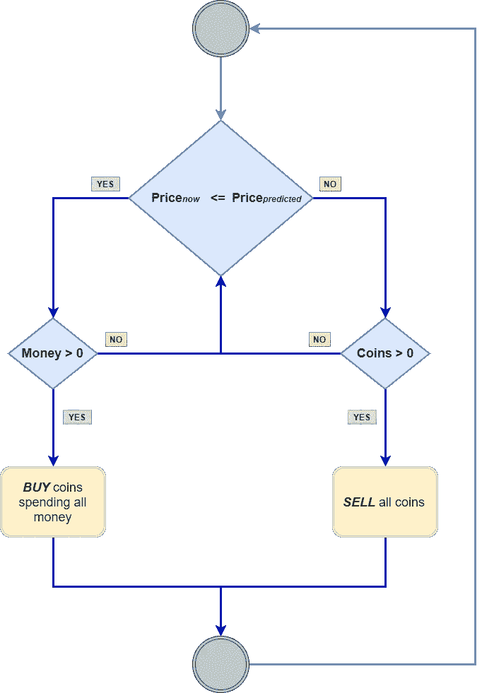

# 基于神经网络的加密货币盈利能力预测

> 原文：<https://towardsdatascience.com/the-profitability-of-cryptocurrency-forecasting-using-neural-networks-a73af24feb09?source=collection_archive---------21----------------------->

## 利用 LSTM 网络预测以太坊加密货币

Photo by [André François McKenzie](https://unsplash.com/@silverhousehd?utm_source=medium&utm_medium=referral) on [Unsplash](https://unsplash.com?utm_source=medium&utm_medium=referral)

# 介绍

加密货币市场已经迅速建立，其不稳定性给研究带来了重大挑战，需要对其行为进行严格检查[1，2]。如今，加密货币在投资部门和市场从业者的日常生活中占据了重要位置[3]。

本文介绍了一个关于预测和交易加密货币的决策支持系统，并试图利用深度学习对以前开发的此类系统进行简单的盈利能力分析。特别是使用深度学习算法来预测以太坊加密货币在短期内的收盘价。

数据从 Poloniex 交易所(ETH/USD 时间序列)收集，并通过长短期记忆网络进行分析。这种深度学习模型是在之前的研究中经过严格的基准测试和各种指标下的性能评估后与其他模型区分开来的。实验表明，上述模型可以用于以科学有趣的方式实时预测以太坊收盘价，并且具有有希望的准确性。

# 实验

下面显示了预测系统的简单盈利能力分析。为了评估预测的有效性，随机选择了三个时间范围。下行周期、上行周期和包含两者的周期是有区别的。下行期包含 2018 年 7 月 26 日至 2018 年 8 月 13 日的时间序列数据。上行期包含 2019 年 6 月 09 日至 2019 年 6 月 23 日的时间序列数据。混合时段包含从 2019 年 7 月 13 日到 2019 年 9 月 20 日的时间序列数据。

通过开发交易模拟，使用预测系统(即主动交易)与被动交易策略(即买入并持有)进行交易的利润得到测试。购买并持有是一种简单的投资策略，个人购买股票/加密货币硬币并长期持有，目标是它们在很长一段时间内逐渐增值[4]。

考虑两个代理，一个使用主动交易策略( **a** )，一个使用买入并持有策略( **b** )。他们每个人都以 1000 美元开始。代理人 **b** 以每个时间段开始时花光所有钱的价格购买硬币。他在期限结束时以这个价格卖掉所有买的硬币。代理人 **a** 根据其预测系统的决定买卖硬币。他根据每 30 分钟对下一个 5 分钟实施的算法的预测来购买或出售加密硬币。这种简单的方法基于以下流程图:

Trading Decision Flowchart

## 下行期

代理人 a 总共做了 292 笔交易，现在他拥有 732.36 美元。他用主动交易的利润是负的-267.64 美元。经纪人 **b** ，使用简单的买入并持有策略，已经做了 2 笔交易，一笔在期初，一笔在期末，现在他拥有 608.55 美元。他的利润为负-391.45 美元，比代理商的 **a** 低 123.81 美元。

Downward Period — Trading Simulation

## 上升期

代理商 a 总共完成了 271 笔交易，现在他拥有 1447.99 美元。他使用主动交易的利润是 447.99 美元。代理人 **b** ，使用简单的买入并持有策略，已经完成了 2 笔交易，现在他拥有 1365.86 美元。他的利润是 365.86 美元，比代理商的 **a** 低 82.13 美元。

Upward Period — Trading Simulation

## 混合期

代理人 **a** 总共做了 1429 笔交易，现在他拥有 1088.95 美元。他使用主动交易的利润是 88.95 美元。代理人 **b** ，使用简单的买入并持有策略，已经完成了 2 笔交易，现在他拥有 801.53 美元。他的利润是负的-198.47 美元，远远低于代理人的利润。

Mixed Period — Trading Simulation

## 原型系统

一个利用预先训练和加载的 LSTM 神经网络进行预测的原型实时“交易”模拟系统正在 Heroku 上运行。请随意合作和/或提供建议。当然，专业的市场从业者确实知道这种系统的优点和缺点。

# 结论

这项研究绝不是提供一个完整的实际预测盈利的加密货币系统。然而，这是科学实验，仍然需要用来自社交媒体和/或其他来源的更多外源数据而不是实际价格数据来校准。该系统的盈利性分析还应考虑所使用的交易平台的交易费用。最后但同样重要的是，上述研究提出了一个决策支持系统，而不是一个你应该完全盲目跟随的系统。好吧，即使在金融界，人们说“过去的表现不是未来结果的指标”，这也不应该阻止人们开发和试验这样的模型和系统。

***注来自《走向数据科学》的编辑:*** *虽然我们允许独立作者根据我们的* [*规则和指导方针*](/questions-96667b06af5) *发表文章，但我们不认可每个作者的贡献。你不应该在没有寻求专业建议的情况下依赖一个作者的作品。详见我们的* [*读者术语*](/readers-terms-b5d780a700a4) *。*

# 参考

[1] Dark，c .，Emery，d .，Ma，j .，Noone，c .:加密货币:十年——公告–2019 年 6 月季度。公报(2019 年 6 月)。

[2] Farell，r .:对加密货币行业的分析。沃顿研究学者杂志。论文 130 (5)，1–23(2015)。

[3]朱迪奇，g .，米尔恩，a .，维诺格拉多夫，d .:加密货币:市场分析和前景(2019)。

[4]买入并持有定义，[https://www.investopedia.com/terms/b/buyandhold.asp](https://www.investopedia.com/terms/b/buyandhold.asp)。