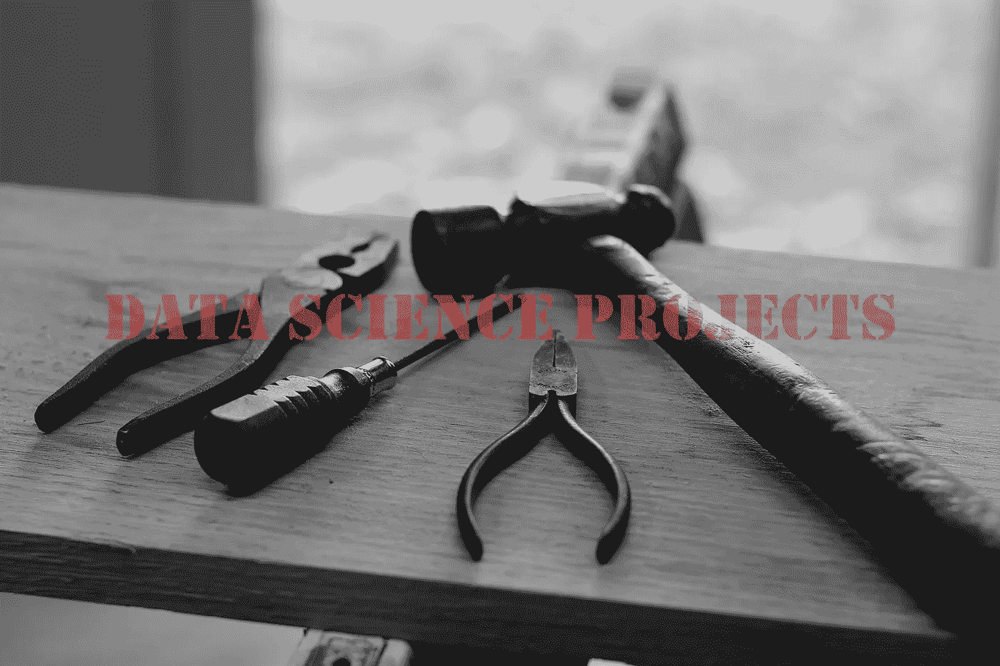

# 获得数据科学工作应该做的项目

> 原文：<https://towardsdatascience.com/the-projects-you-should-do-to-get-a-data-science-job-457d3fe7d660?source=collection_archive---------9----------------------->

我相信未来工作质量的最佳预测者是以前的工作质量。许多数据科学经理也持有这种观点。并非每个人都从事过数据科学工作，但每个人都可以将数据科学项目放在一起，以展示他/她的工作质量。如果你制作了很棒的项目，并在你的 github 和简历上展示出来，你将极大地提高你获得工作的机会。

项目之所以伟大有几个原因:

*   它们表明你是一个主动的人，并且愿意解决大问题
*   它们表明，您可以将数据科学技术应用于您每天遇到的实际问题
*   他们允许你“展示”你理解一个概念，而不是“讲述”
*   你可以完全控制你项目的主题，所以你可以迎合他们来说明特定的技能
*   基于项目的学习是实际获得数据科学技能和学习新工具的最快方法之一
*   *如果它们强大而有意义，它们可以和在职经历一样好，甚至更好

**更多关于这个的最终想法*

在本文结束时，我希望您理解如何选择项目以及它们的生命周期是如何工作的。我还希望你探索我推荐的 4 个项目，为自己的成功做好准备。

*本文详述了我最受欢迎的 YouTube 视频之一。如果你感兴趣，你可以在这里查看:* [*获得数据科学工作应该做的项目*](https://www.youtube.com/watch?v=yukdXV9LR48)

## 你如何选择一个项目主题？

数据科学项目最重要的一点是，它应该对您来说是独一无二的。项目越具体，你越能解释它的意义，越好。独特的项目很棒，因为它们展示了你的一些个性，很难复制。不幸的是，我遇到过在 github 上复制项目或者使用大部分代码而不注明出处的候选人。

我认为你应该从事符合以下类别之一(或两者都符合)的项目:

**(1)它们对你来说是有趣的或重要的** —如果你对你项目的主题感兴趣，你会更倾向于去做，并且做得很好。当你接受采访并被要求谈论工作时，这一点就很明显了。当候选人对一个项目感到自豪时，你可以看到当被问到这个项目时，他们明显变得兴奋起来。

他们的目标是你希望进入的行业或工作，做这样的项目可以证明你为什么要申请一个特定的职位。它们也说明你对你可能从事的领域有所了解([本文](/the-most-overlooked-skill-for-data-science-job-applicants-in-2019-ef9244fef4b3)解释了为什么这很重要)。

碰巧的是，我的大部分项目都是关于体育的。这是我的工作和激情的交集。在我看来，这是最好的情况。

## 数据科学项目的组成部分是什么？

所有数据科学项目都应该有一些共同点。你的项目应该大致遵循下面的生命周期，你应该能够详细讲述每一步。

**第一步:计划并确立项目的理由**——这是启动一切的步骤。你并不总是知道你会发现什么，但是你应该试着用你的分析来回答一个问题或者解决一个问题。在开始第二步之前，有一个你想解决的具体问题。

*(例如，是否有可能以足够的准确度预测 NBA 比分，以创造下注优势)*

**第二步:数据收集**——网上有很多查找数据的好地方(kaggle、google、reddit 等。).你既可以从这些地方选择一个数据集，也可以自己查找数据。我发现，如果候选人从 API 中提取数据，或者用其他更独特的方式收集数据，他们就会与众不同。拥有别人不知道的数据增加了你的独特性和“惊喜”因素。

*(例如使用 python 从 basketball 引用中抓取数据)*

**第三步:数据聚合&清理** —这一步通常被忽视，但却是最重要的一步。格式化和清理数据的方式会对分析结果产生很大影响。您应该能够解释您在处理空值、选择包含或移除某些功能以及处理异常值时所做的决定。

*(例如，删除了明星球员因负荷管理而休息的比赛，这是一个较新的现象，会扭曲我们的历史结果)*

**第 4 步:数据探索** —在分析的这一部分，重要的是表明你理解数据的细节。您希望深入了解每个特性的分布，并评估这些特性之间的相互关系。为了显示这些关系，你应该使用像箱线图、直方图、相关图等视觉效果。这一过程有助于你了解哪些变量与你试图回答的整个问题相关。

*(例如，每场比赛得分的直方图、投篮次数等。)*

**第五步:数据分析** —在这里，你开始评估你的数据集的趋势。我建议使用数据透视表来了解不同组之间或不同时间之间是否存在差异。可视化工具也应该在这部分分析中大量使用。与上一步非常相似，这一步有助于您理解要在模型中测试哪些变量。

*(例如，每支球队每场比赛的得分，投篮得分与得分的散点图等。)*

**第六步:特征工程**——你分析的这一部分极其重要(所以它有自己的步骤)；然而，它通常应该与数据分析阶段并行完成。特征工程有两种形式:(1)创建可以提高预测质量的新特征，或者(2)改变数据的性质，使其更适合于分析。

在构建新功能时，您应该富有创造性。您可以使用其他函数的组合，从数值型转换为分类型(反之亦然)，或者将变换函数应用于某个要素。我最喜欢的例子是，如果你有地理数据点，而不是仅仅抛出纬度/经度，你用它们来确定一个共同的位置的距离。

*(例如，计算出的玩家效率等级，一个综合指标，来自现有数据，用于模型中)*

另一种类型的特征工程使数据更适合您的分析。许多人使用主成分分析(PCA)或因子分析来减少数据中的特征数量。对于某些类型的模型，这可以改善结果并减少多重共线性。对于其他分析，您还必须缩放数据。当算法中使用几何距离时，这一点很重要。

*(例如，对具有许多相关变量的数据集使用 PCA，以便我们可以使用线性模型来预测季节点)*

**第 7 步:模型构建和评估** —我将在下一节更深入地探讨这一点，但是您应该比较多个模型，以确定哪一个对您的特定问题具有最佳结果。您希望使用训练和测试数据进行交叉验证，这样您就可以看到哪个模型概括得最好。您还应该特别注意如何评估您的模型。能够解释您选择评估指标的原因。

*(例如，比较随机森林、拉索回归和 SVM 回归预测 NBA 得分)*

**第 8 步:将模型投入生产(可选)** —如果我看到有人通过网页或 API 将他们的模型“活”起来，我总是会印象深刻。这表明他们乐于使用更高级的编程技术或软件包。我比较偏爱 python，所以一般用 flask 来做这个，但是我见过别人用 R Shiny。

*(例如，制作一个网页，在你选择了一个队、一个对手和一个地点之后，给你一个预测的分数)*

**第九步:回顾**——你应该总是回顾项目，看看你本可以做得更好的地方。不是所有的项目都很完美(大多数不是)，所以你应该能够指出面试官可能会在你的分析中戳到的任何漏洞。我还建议你根据当前项目的发现来思考下一个项目。

*(例如，我应该在分析中考虑速度，我想看看我是否能找到裁判通过这种方法影响结果的比赛)*

如果你想了解更多关于如何将数据科学项目从包中分离出来的技巧，请查看:[制作令人难忘的数据科学项目](/make-memorable-data-science-projects-21885c36bec3)。

## 你应该做的 4 个项目

按照上面的生命周期步骤，这些是我推荐的项目。您绝对不应该将自己局限于这些项目，但是做这些项目将会说明您拥有大多数基础数据科学概念的经验。

**项目 1:预测一个连续的结果(回归)** —首先，你应该创建一个有数字结果的问题。然后你应该比较各种线性和非线性回归模型如何回答这个问题(OLS、拉索、支持向量机、决策树、随机森林等)。).你应该能够解释你所使用的技术的优点和缺点。你也应该考虑把它们结合起来(合奏)，看看你得到什么结果。

**项目 2:预测分类结果(分类器)** —这里的步骤与回归项目非常相似。这一次，你要选择一个分类问题来解决(二进制或非二进制)。同样，你应该比较各种算法在回答这个问题上的表现(朴素贝叶斯、KNN、SVM、决策树、随机森林等)。).

**项目 3:根据相似性对数据进行分组(聚类)** —聚类可以帮助您从未标记的数据中找到意义。这是从噪声中建立类别的最有用的方法之一。我建议做一个使用这种技术的项目，以显示你对无监督学习的理解。

**项目 4:使用先进的技术(神经网络、XG 提升树等。)** —欢迎您在之前的任何项目中使用先进的技术，但我相信您应该有一个专门关注这些技术的项目。并非所有的数据科学家都使用深度学习，但你应该熟悉这些概念是如何工作的，以及它们是如何应用的。

在这些项目中，具有最佳精度或 mse 的模型实际上可能不是解决所提出问题的最佳模型。请确保您了解推荐一种算法而不是另一种算法的其他原因。

## 最后的想法*

在我列出的为什么数据科学项目很棒的清单中，我注意到*它们实际上可以和真实的工作经历一样好，甚至更好。*我这样说是因为我看到许多数据科学项目产生流量、收入，甚至成为新企业的基础。项目可以帮助你学习概念和找到工作，但它们也有可能完全取代对工作的需求。