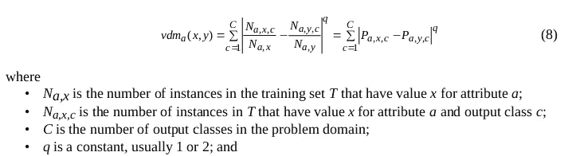
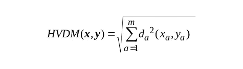
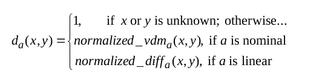

# 处理混合型数据的正确方式。最先进的距离度量。

> 原文：<https://towardsdatascience.com/the-proper-way-of-handling-mixed-type-data-state-of-the-art-distance-metrics-505eda236400?source=collection_archive---------9----------------------->

**有趣的事实:** Scikit-Learn 没有*任何能够处理分类和连续数据的* 距离度量！如果我们有一个混合类型变量的数据集，那么我们如何使用聚类算法，例如 k-NN？

Photo by [Fredy Jacob](https://unsplash.com/@thefredyjacob?utm_source=medium&utm_medium=referral) on [Unsplash](https://unsplash.com?utm_source=medium&utm_medium=referral)

**更新(27/07/19)** —该包已在 PyPI 发布为 [Distython](/distython-5de10f342c93) 。我已经发表了一篇[文章](/distython-5de10f342c93)来解释它是如何工作的。

我在 [IT 创新中心](http://www.it-innovation.soton.ac.uk/)的暑期实习期间遇到的一个大问题是，缺乏既能处理混合类型数据又能处理缺失值的距离度量的现有实现。它开始了我对能够满足这些要求的算法的长期探索。在几篇研究论文之后，我发现了非常有趣的距离度量，当处理混合类型的数据、缺失值或两者兼而有之时，这些度量可以帮助提高机器学习模型的准确性。我在业余时间实现了它们，并在 [Github](https://github.com/KacperKubara/heterogeneous_dist_metrics) 上发布了它们的代码实现，所以你可以通过 Scikit-Learn 轻松使用它们。但是怎么做呢？我将在本教程中解释这一点！

我喜欢数据科学的原因是，它吸引了许多对人工智能和数据科学充满热情的志同道合的人。这就是为什么我想在 Linkedin 上与你联系！您也可以通过我的[个人网站](http://www.kacperkubara.com)留下任何反馈和问题。

# 异构距离度量概述

Photo by [Annie Spratt](https://unsplash.com/@anniespratt?utm_source=medium&utm_medium=referral) on [Unsplash](https://unsplash.com?utm_source=medium&utm_medium=referral)

在我们开始之前，我想推荐看一下[这篇论文](https://arxiv.org/pdf/cs/9701101.pdf)，如果你想更深入地了解我将要谈到的算法。我在这里的主要目标是为您提供对这些算法的直观理解，以便您可以将我的文章用作快速参考表。你可以在文章的最后找到实用的部分，并附上代码。我们开始吧！

## 距离度量

但是等等……距离度量实际上是什么？距离度量测量数据集中两个实例之间的距离。它们根据实例的特征来度量它们之间的相似性。比如，假设某医院的病人有两个属性:*身高*和*年龄*。那么，我们可以说，某个医院的老病人和矮病人会非常相似，而一个年轻的高个子病人不会与老病人和矮病人有那么多相似之处。

距离度量只是算法，它可以根据属性告诉你两个实例之间的相似性。一些最流行的距离度量是欧几里德距离、曼哈顿距离、汉明距离和余弦距离。它们通常用于聚类，例如最近邻算法。

大多数流行的距离度量只能处理一种类型的变量。如果您将它们用于包含混合类型变量或缺失值的数据集，它们会非常失败。幸运的是，研究人员一直在试图解决这个问题，而且很少有有趣的最先进的算法来帮助你克服这个问题。

## 异质欧几里德重叠度量(HEOM)

HEOM 可以处理异构数据以及缺失值。简单地说，它结合了 3 种不同的算法来处理每种情况。

HEOM, overview [1]

HEOM 查看实例的每个属性( *x* 和 *y* )，并根据数据类型进行以下计算:

*   如果分类-如果属性属于同一类，则返回 0，否则返回 1
*   If numerical 使用归一化欧几里得度量计算距离
*   如果缺失—返回 1

然后，我们获得一个存储每个属性的距离的结果向量。为了计算最终结果，可以使用以下等式:

The final result of HEOM [1]

它是每个距离平方的和，并存储在结果向量中。不需要使用平方根，因为它不会改变两个实例之间的相似性(即，如果 ***a > b*** 则这也成立:***sqrt(a)>sqrt(b)***)，并且减少了必要的计算总量。

算法实现可以在我的 Github 库[这里](https://github.com/KacperKubara/heterogeneous_dist_metrics/blob/master/HEOM.py)找到。

## 价值差异度量(VDM)

这一个实际上不直接处理异构数据，但是一些异构距离度量使用它作为他们算法的一部分。这就是为什么对它的工作原理有一个直观的理解是有好处的。这里的数学可能有点复杂，但算法的一般概念并不困难。这个等式是基于条件概率的。对于数据中的特定列(属性)，满足值 ***x*** 和 ***y*** 。

VDM algorithm [1]

其中 ***P a，x，c*** 是在给定列(属性)**和输出类***c.*** 的情况下，出现值 ***x*** 的条件概率如果你仍然感到困惑，请参考[这篇论文](https://arxiv.org/pdf/cs/9701101.pdf)以获得更好的理解！**

**该指标只能处理分类数据，因此特征和结果变量都必须是分类的。稍后，您将看到围绕此问题的一些解决方法，包括离散化线性要素或将其用作更复杂算法的一部分。**

## **异类值差异度量(HVDM)**

**与 HEOM 类似，该指标使用不同的算法处理每种数据类型(分类、数值或缺失)。你可以把它看作是赫姆和 VDM 的结合。对于连续数据，使用归一化距离，它基本上是两个值之间的距离除以 4 *方差。对于 HEOM 也是如此，但唯一的区别是分母(使用方差是更好的选择，因为它处理数据集中的异常值)。对于分类数据，使用归一化 VDM。最终距离如下所示:**

****

**HVDM — final distance [1]**

**这三种情况中的每一种都可以用下面的等式来描述:**

****

**HVDM — distance metric for each case [1]**

**根据这篇论文，归一化的 VDM 有 3 种不同的类型:n1、n2 或 n3。我不会在这里详细讨论——这超出了本文的范围，也没有必要对算法有一个很好的、直观的理解。你要知道的是，论文作者声称 n2 是最准确的。**

# **实用部分**

****

**Photo by [Chris Ried](https://unsplash.com/@cdr6934?utm_source=medium&utm_medium=referral) on [Unsplash](https://unsplash.com?utm_source=medium&utm_medium=referral)**

**我们将使用那个 [Github 库](https://github.com/KacperKubara/heterogeneous_dist_metrics)进行实践。到目前为止，我已经实现了 HEOM，VDM 正在开发中。请随意在 Github 上创建一个 PR 来为项目做贡献。从头开始编写这些算法并确保它们正确运行需要花费大量时间，因此非常感谢您的帮助！**

**要安装存储库，请按照自述文件中的说明进行操作。只需要使用一个简单的命令 *git clone、*和可选的[*pipenv*](https://realpython.com/pipenv-guide/)*install*来安装必要的包。**

**这些指标被设计成可以直接应用于 Scikit-Learn 中的最近邻(和其他聚类算法)类。您可以将它与 Scikit-Learn 类一起用于您的个人项目，只要它们提供一个调用定制度量函数的接口。**

**Importing necessary libraries**

**在上面的代码中，我们导入了必要的库和 HEOM 度量。我们还将使用波士顿房价数据集，因为它同时具有分类和数字特征。**

**Define the indices for categorical variables and NaN equivalent**

**这里，我们导入数据并将其定义为 boston_data。这里重要的部分是我们必须告诉 HEOM 度量什么列是分类的。 *nan_eqv* 在这里用来告诉 HEOM*NaN*是如何表示的。需要注意的重要一点是:最近邻不能直接处理 *np.nan* ，所以我们*必须*声明某些 nan 等价。**

**Introducing missingness to dataset**

**在上面的代码部分中，我们将缺失引入数据(出于示例的目的)并将其指定为 *nan_eqv。***

**Defining heom_metric and neighbor**

**然后，我们定义我们的 *heom_metric* 并提供必要的参数。它必须在*最近邻居*之前定义，因为我们必须提供一个从 *heom_metric* 到*邻居*实例*的可调用度量函数。*这就是将 HEOM 与 Scikit-Learn 一起使用的全部内容。这很简单，不是吗？有关使用 Scikit-Learn 的自定义距离度量的更多信息，可在[这里](https://scikit-learn.org/stable/modules/generated/sklearn.neighbors.DistanceMetric.html)找到。**

**Fitting the data and printing the results**

**在最后一步中，我们拟合模型，并使用 HEOM 作为距离度量函数返回 5 个最近邻。**

**这就是处理具有异构距离度量的混合类型数据集的全部工作。我希望你现在配备了一些新的工具，可以帮助你建立更准确的机器学习模型，也希望你对处理缺失数据更有信心！**

## **参考**

**[1] D. Randall Wilson，Tony R. Martinez，“改进的异质距离函数”**