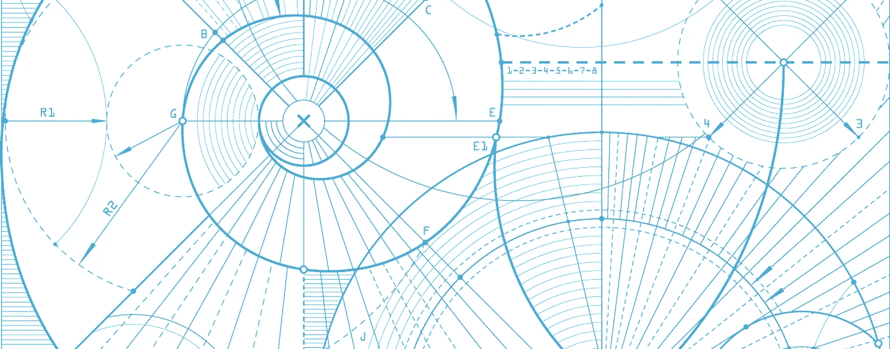
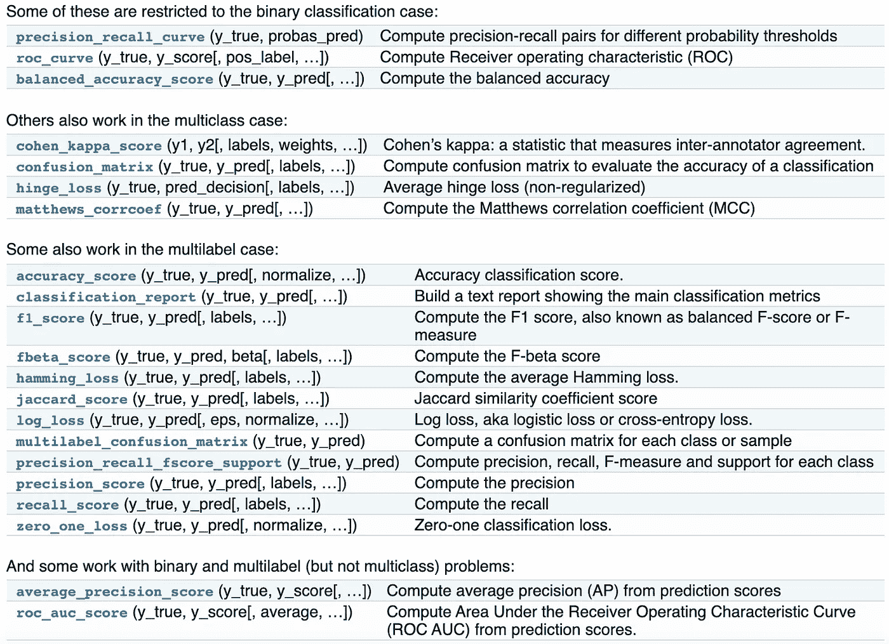
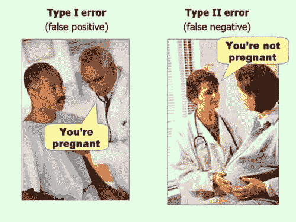
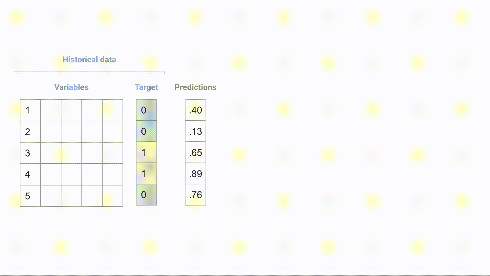
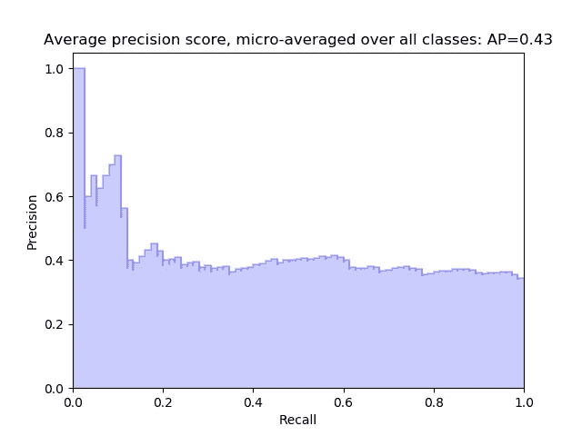
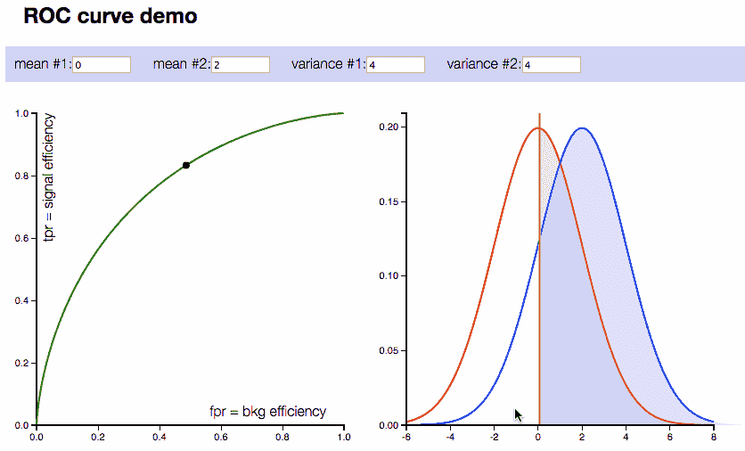
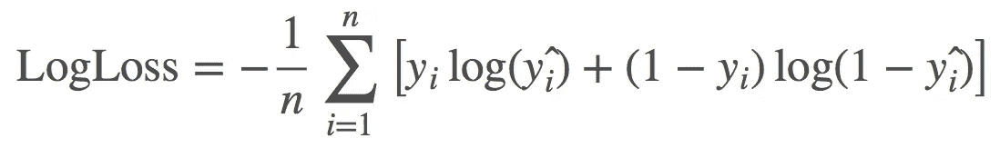

# 使用机器学习指标的正确方法

> 原文：<https://towardsdatascience.com/the-proper-way-to-use-machine-learning-metrics-4803247a2578?source=collection_archive---------11----------------------->

## 对于给定的问题，很难选择正确的精确度。拥有一个标准化的方法是每个数据科学家都应该做的。

## 本文的计划

1.  动机
2.  第一考虑
3.  最大似然模型的精度测量
4.  使用这些方法为您的问题选择正确的 ML 模型

*注意，在本文中我主要关注二元分类问题，但是这种方法与多元分类和回归问题类似。*

# 动机

试着说服某人你的 ML 模型是准确的，应该被信任，因为它的 LogLoss 是 0.34。非数据科学家肯定会呆呆地看着你，而数据科学家会询问更多的信息。

作为一名数据科学家，您知道很难讲清楚(特别是对非数据科学家而言)为什么您的模型应该被信任，因为您无法轻松地将复杂的准确性度量转化为有形的元素。而且那是 100%合法的，模型应该是大家都懂的，至少是他们的准确性。

最重要的是，如果你的方法在科学上是正确的，你的模型应该至少有两个精确度——在*训练*和*验证集*上测量——如果没有更多的话——在*维持、交叉验证*上测量。

精确度有很多衡量标准。准确地说，scikit 上的[21-learn](https://scikit-learn.org/stable/modules/model_evaluation.html#classification-metrics)仅用于分类问题。因此，对于 1 个模型，在训练集和验证集上有 21 x 2 = 42 个值。如果您尝试 5 种不同的模型，您会查看 5 x 42 个值吗？

21 measures of accuracy from scikit-learn documentation for Classification problems

你看到它的走向了:

*   向非数据科学家解释清楚机器学习模型的准确性的困难来自于
*   科学方法的**强制性复杂性****数据科学家要构建一个有效的机器学习模型必须经历的过程**

**因此，你应该问的问题是如何使用这些准确性的衡量标准，在验证你的模型之前你应该检查多少，哪些应该与非数据科学家分享，以说服他们你的模型是准确的，哪些太混乱而不能分享。**

# **第一考虑**

**一些精确度的测量是简单和直接的，一些是非常复杂的。有的是正数，有的是数列，有的是图表！如何正确地选择和验证您的模型以及各种各样的方法…**

**所以…首先要做的是:**

1.  **将你的工具箱缩小到关键指标，然后**
2.  **遵循正确的方法，以适当的方式使用它们**

# **9 个必须知道的准确性衡量标准**

****

**ML models, like statistical models, make 2 types of error. But there’s multiple ways to measure that, from the simple Confusion Matrix to the more advanced LogLoss.**

## **4 项基本措施**

**一个 [**精度**](https://www.wikiwand.com/en/Accuracy_and_precision)**[**精度，回忆**](https://www.wikiwand.com/en/Precision_and_recall)**[**混淆矩阵**](https://www.wikiwand.com/en/Confusion_matrix) 。这些是标准的，你应该已经知道了。它们很容易理解，并且是你必须与业务团队分享的。******

********

****Understanding the Confusion Matrix in a gif :)****

****然而，对于数据科学家来说，它们还不足以在几个模型中找出最佳模型。这是因为这些措施只关注二元结果，而不是模型预测的置信度(即*概率*)。以下措施以不同的方式解决了这一限制。****

## ****4 项中间措施****

****P [**精度召回曲线**](https://scikit-learn.org/stable/auto_examples/model_selection/plot_precision_recall.html) :如果你改变你的模型的阈值概率(一般默认为 0.5)，精度和召回会反方向变化。阈值越高，准确率越高，召回率越低。同样，阈值越低，准确率越低，召回率越高。目标是确定在精确度和召回率之间具有最佳平衡的阈值。****

********

****Looking at the Precision-Recall curve above, some data are easily classified by the model (high Precision), but some are not (low Precision)****

****F 如果对于一个给定的问题，精度比召回重要 5 倍，那么 F-5 分最高的模型(beta=5)应该是这个问题的最佳模型。
*F-beta 评分范围从 0 到 1，1 为完美模型。*****

****ROC 曲线 : ROC 是二战中雷达工程师使用的接收机工作特性的首字母缩写。这个定义在机器学习中已经过时了。ROC 曲线是一种直观显示模型性能的简单方法。如果 ROC 曲线高度向左上方倾斜，这意味着模型非常准确，而直的对角线意味着模型不比扔硬币好多少。****

********

****On the left side: ROC curve. On the right side: predicted probabilities of the ML model. The further away the red and blue curves (positives and negatives) the better the model and the more skewed the ROC curve****

****A **UC:** 曲线下面积的简称，基本上是 ROC 曲线中一个正数所包含的信息。AUC 很棒，因为它使比较多个模型变得简单:你选择 AUC 最高的一个。然而，很难解释 AUC 的价值。75%的 AUC 绝不等同于 75%的准确性(我有时会听到这种说法……)。通常，好的 AUC 值从 0 . 75 开始，但是这取决于问题，看绝对值通常没有帮助。你宁愿用它来比较模型。如果你的模型的 AUC 为 0.57，这意味着你的数据中可能没有信号。
*AUC 范围从 0.5 到 1，1 为完美模型。*****

## ****1 项高级措施****

****L 它为每个预测概率分配一个权重。概率离实际值越远，权重越大。目标是最小化所有误差权重的总和。请注意，如果概率接近 0，而实际值为 1(相反的值 1 和 0 也是如此)，则权重会急剧增加。LogLoss 区分对错误预测过于自信的模型，并大量用于机器学习，因为它具有有用的数学属性。问题是 **LogLoss 的值无法解释**。****

********

****How do you explain a LogLoss value of 0.34 to a business team? You simply cannot.****

# ****正确使用这些方法****

********

****These measures of accuracy will underpin a framework to select and validate the right ML model****

****您可以计算您尝试的所有模型的精确度，找到每个模型的最佳阈值，将它们的混淆矩阵与其最佳阈值进行比较，并最终决定哪个*模型* x *阈值*最适合您的问题。这将需要多次迭代、数千行 Python 代码和大量令人头疼的事情才能完成。****

****或者你可以遵循一个更简单有效的方法。分三步走的方法:****

1.  ******尝试不同的模型，并使用 LogLoss/AUC 对它们进行排序******
2.  ******一旦确定了最佳模型，使用精确度-召回曲线/F-score/ROC 曲线选择最佳概率阈值******
3.  ******解释您的结果，并与混淆矩阵、精确度进行交流&回忆******

****具体来说，****

1.  ******尝试不同的模型，并使用 LogLoss/AUC** 对它们进行排名首先，[机器学习领域没有免费的午餐](https://www.wikiwand.com/en/No_free_lunch_theorem)。您永远不会预先知道哪种算法对特定数据集最有效。尝试不同的模型，这样你就有更大的机会找到解决你问题的最佳模型。
    然后使用 LogLoss 和/或 AUC 对它们进行排序，并确定最佳候选。为什么？LogLoss 和 AUC 是正数，非常适合比较模型。事实上，它们很简单，但同时它们嵌入了许多抽象的数学概念，确保具有最佳 LogLoss 或最佳 AUC 的模型是“好的”。这就是它们在 Kaggle 上被广泛使用的原因。
    当然不要在训练集上看 LogLoss/AUC，在测试集上看它们(或者更好，在交叉验证上；请始终保留一份样本)。请注意，使用 LogLoss 选择最佳模型可以得到比 AUC 更多的校准模型([论文](https://www.cs.cornell.edu/~caruana/niculescu.scldbst.crc.rev4.pdf))。
    *_
    举例:你尝试 5 种不同的模型:XGBoost、RandomForest、SVM、决策树、正则化逻辑回归。微调后，XGBoost 在 5 重交叉验证中具有最佳 AUC。您选择 XGBoost 并转到第二步。*****
2.  ******使用精确召回曲线/F 值/ROC 曲线选择最佳概率阈值** 一旦确定了最佳模型(或 2-3 个候选模型)，使用精确召回曲线(或 F 值或 ROC 曲线)来确定要为您的模型保留的最佳概率阈值。这需要对如何解释精确召回曲线有很好的理解。
    *_
    示例:查看精度-召回曲线，您会注意到，对于 20%的召回，XGBoost 模型达到了 90%的精度。然而，当召回率增加到 50%时，准确率下降了 50%。在这个问题上，假设你专注于高精度。因此，您选择了一个阈值，该阈值给出了 90%的精确度，而您知道您在数据中只捕捉到了 20%的阳性。*****
3.  ******解释您的结果，并使用混淆矩阵、精确度和回忆** 进行沟通，最终得出对业务至关重要的信息。对于模型做出的 100 个预测，有多少个是正确的？使用选定的阈值，模型将永远不会捕捉到多少个案例？…企业可以将数字和美元数字放在它们旁边，甚至获得预期的投资回报。
    *_
    例:90%的精度是指模型预测的 10 个阳性病例中，有 9 个是正确的。假设对于这个问题，一个正确的肯定预测意味着节省 1000 美元，一个错误的预测意味着节省 0 美元。对于在第二步中选择的概率阈值(获得 20%的召回率和 90%的准确率)，根据历史数据，您估计模型平均每月将预测 50 个阳性病例。这转化为
    50 x 90% x 12 个月 x 1000 美元=每年 54 万美元。这是将 ML 转化为商业价值的一种方式💸💸💸*****

# ****附加备注****

1.  ****如果可能的话，获得一个非 ML 基准。衡量现有的基于规则的引擎、专家的判断、简单的策略或简单的统计模型(逻辑回归……)的准确性。这样，你就可以量化 ML 的附加值(有时并不一定更好)****
2.  ****当我说这只是关于准确性时，我撒谎了。选择最佳模型还应考虑模型是否学习了正确的方法，并理解它为什么预测这种特定的方法(使用功能重要性、部分相关性、预测解释等工具)。有时最好选择一个不是最好的模型，但是它有更少的变量，花费更少的时间来获得新数据，并且更容易生产****

# ****文献学****

*   ****[http://arogozhnikov.github.io/2015/10/05/roc-curve.html](http://arogozhnikov.github.io/2015/10/05/roc-curve.html)****
*   ****[https://data wookie . netlify . com/blog/2015/12/making-sense-of-logarithmic-loss/](https://datawookie.netlify.com/blog/2015/12/making-sense-of-logarithmic-loss/)****
*   ****[https://www . machine learning plus . com/machine-learning/evaluation-metrics-classification-models-r/](https://www.machinelearningplus.com/machine-learning/evaluation-metrics-classification-models-r/)****
*   ****[https://machine learning mastery . com/roc-curves-and-precision-recall-curves-for-class ification-in-python/](https://machinelearningmastery.com/roc-curves-and-precision-recall-curves-for-classification-in-python/)****