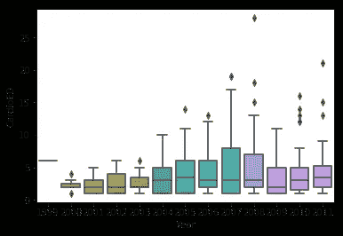

# 检察官的谬论

> 原文：<https://towardsdatascience.com/the-prosecutors-fallacy-cb0da4e9c039?source=collection_archive---------3----------------------->

## 法庭上的条件概率


The lasso of truth

## 假设你因谋杀被捕。

你知道你是无辜的，但犯罪现场的物证与你的描述相符。检察官认为你是有罪的，因为鉴于你是无辜的，找到这一证据的可能性很小，陪审团应该放弃你实际上没有犯罪的可能性。

但是这些数字并不合理。公诉人误用了条件概率，忽略了你，被告，在他们提出证据之前有罪的可能性。

**[**检察官谬误**](https://www.cebm.net/2018/07/the-prosecutors-fallacy/) 是[贝叶斯定理](https://www.youtube.com/watch?v=LIQrs3dviIs)在法庭上的误用。鉴于所有的*证据*，控方、法官和陪审团没有问被告无罪的概率，而是错误地问如果被告无罪**证据*出现的概率是多少(一个小得多的数字):***

> ***p(被告有罪|所有证据)***
> 
> ***p(所有证据|被告是无辜的)***

# ***贝叶斯定理***

***为了说明为什么这种差异可以拼出生或死，再想象一下你自己是被告。你想向法庭证明你说的是真的，所以你同意测谎。***

***巧合的是，发明测谎仪的同一个人后来创造了神奇女侠和她的真理套索。***

******

***Coincidence?***

***威廉·莫尔顿·马斯顿在 1922 年詹姆斯·阿方索·弗莱被指控谋杀的案件中首次展示了他的发明。***

******

****Frye being polygraphed by Marston****

***对于我们的模拟，我们将从本文[中选取一个更现代的测谎仪的平均值](https://www.tandfonline.com/doi/full/10.1080/23744006.2015.1060080)(“对于有罪的受试者，CQT 的准确度估计范围为 74%到 89%，假阴性为 1%到 13%，对于无辜的受试者，准确度估计范围为 59%到 83%，假阳性率从 10%到 23%……”)***

******

***请检查一下这些百分比。鉴于[这项研究](http://wwwp.oakland.edu/Assets/upload/docs/News/2014/Serota-Levine-Prolific-Liars-2014.pdf)发现绝大多数人在大多数时候都是诚实的，而且“大谎言”是像“不告诉你的伴侣你真正和谁在一起过”这样的事情，让我们慷慨地假设 15%的人会在测谎仪测试中撒谎，而 85%的人会说实话。***

***如果我们在这些假设下用这个测谎仪测试 10，000 个人…***

******

***`1500 people out of 10000 are_lying`***

***`1215 people out of 10000 are_true_positives`***

***`120 people out of 10000 are_false_negatives`***

***`8500 people out of 10000 are_not_lying`***

***`1445 people out of 10000 are_false_positives`***

***`6035 people out of 10000 are_true_negatives`***

***在应用贝叶斯定理之前，需要知道的重要区别是:***

*   ***真正的阳性者是那些撒谎但没有通过测谎仪测试的人(他们被正确地筛选了)***
*   ****假阴性*是说谎的人，而*击败了*测谎仪(他们被错误地筛查)***
*   ***假阳性者是那些说了实话但无论如何都没有通过测谎的人***
*   ***真正的否定者是那些说了实话并通过测谎的人***

***明白了吗？很好。***

## ***现在:如果你，被告，得到了一个积极的测谎仪测试，有多大可能你真的在撒谎？***

***测谎仪考官真正想知道的不是 P(+|L)，而是测试的准确性；而是 P(L|+)，或者假设测试结果为阳性，你说谎的概率。我们知道 P(+|L)与 P(L|+)的关系。***

> ***P(L|+) = P(+|L)P(L) / P(+)***

***为了弄清楚 P(+)与我们先前对某人是否说谎的了解无关，我们需要使用[全概率定律](https://www.statisticshowto.datasciencecentral.com/total-probability-rule/)计算阳性检测事件的总样本空间:***

> ***p(l |+)= p(+| l)p(l)/p(+| l)p(l)+p(+|l^c)p(l^c)***

***也就是说，我们不仅需要知道假设你*在*说谎时检测阳性的概率，还要知道假设你*没有*说谎时检测阳性的概率(我们的假阳性率)。这两项之和给出了检测阳性的总概率。这让我们最终确定你说谎的条件概率:***

```
*The probability that you are actually lying, given that you tested positive on the polygraph, is 45.68%.The probability of a false positive is 54.32%.*
```

***给定一个积极的测试结果，你实际上在说谎的概率只有 45.68%。那是*比机缘*差。注意它与测试的*准确度*水平(81%真阳性和 71%真阴性)有什么不同。与此同时，即使你说的是实话，你被错误地指控撒谎的风险也接近——事实上，略高于——几率，为 54.32%。不放心。***

******

***事实上，马斯顿是个臭名昭著的骗子。***

***Frye 法院裁定测谎仪测试不能作为证据。直到今天，测谎仪测试在法庭上是不被接受的，因为它们不可靠。但这并没有阻止检察官的谬论以其他更阴险的方式蔓延到法庭。***

***这种统计推理错误在刑事司法系统中猖獗，并破坏了依赖于从指纹到 DNA 证据到手机信号塔数据的一切的刑事案件。更糟糕的是，法院经常拒绝统计学家的专家证词，因为“这不是火箭科学”——这是“常识”:***

*   ***在荷兰，一位名叫[露西娅·德·伯克](https://arxiv.org/pdf/math/0607340.pdf)的护士被判终身监禁，因为她曾接近“可疑”死亡，一位统计专家计算出随机死亡的概率不到 1/3 . 42 亿。受检察官谬误影响的计算是不正确的。真实的数字更像是五十分之一(甚至五分之一)。此外，许多“事件”只是在调查人员知道她就在附近后才被标记为可疑的*。****
*   ***一名英国护士，Ben Geen，被指控为了让病人苏醒的“快感”而诱发呼吸停止，声称呼吸停止是一种罕见的现象，不可能是偶然发生的，因为格林就在附近。***
*   ***在专家错误地将同一家庭中两个孩子死于婴儿猝死综合症的几率引用为 7300 万分之一后，英国的母亲们因谋杀她们的孩子而被起诉***

## ***本·基恩***

***由于信息自由的要求，本·基恩的案例中的数据是可以获得的——所以我简要地分析了它们。***

```
*# Hospital data file from the expert in Ben Geen's exoneration case
# Data acquired through FOI requests
# Admissions: no. patients admitted to ED by month
# CardioED: no. patients admitted to CC from ED by month with cardio-respiratory arrest
# RespED: no. patients admitted to CC from ED by month with respiratory arrest*
```

******

***与 Geen 工作的医院最相似的医院是至少出现一例呼吸骤停的大医院(尽管数据中的“0”很可能意味着“数据缺失”，而不是零事件发生)。***

******

```
*ax = sns.boxplot(x='Year', y='CardioED', data=df)*
```

******

```
*ax = sns.pairplot(df, x_vars=['Year'], y_vars=['CardioED', 'RespED', 'Admissions'])*
```

******

***Pairplots for admissions data and cardiac vs. respiratory events***

***与 Geen 工作过的医院相当的四家医院是 Hexham、Solihull、Wansbeck 和 Wycombe。Solihull 的数据(心脏和再灌注)非常异常:***

************************

***在考虑了数据中的差异后，我们可以计算出，平均而言，没有伴随心脏事件的呼吸事件发生的频率大约是心脏事件的 5 倍(平均每次呼吸入院有 4.669 例心脏入院)。***

******

***不伴心力衰竭的平均每月呼吸停止次数约为 1-2 次，波动较大。这并不特别罕见，当然也不罕见到要把一个护士送进监狱一辈子。(你可以在这里阅读更多关于这个案例和这个数据[，在这里](https://arxiv.org/abs/1407.2731)看我的 jupyter 笔记本[。)](https://nbviewer.jupyter.org/github/lorarjohns/prosecutors_fallacy/blob/master/Prosecutors_Fallacy.ipynb)***

***看起来，常识并不常见——司法系统应该更加认真地对待这个问题。***

****原载于*[*https://www . espritdecorpus . com/posts/the-procurators-fallacy/*](https://www.espritdecorpus.com/posts/the-prosecutors-fallacy/)*。****