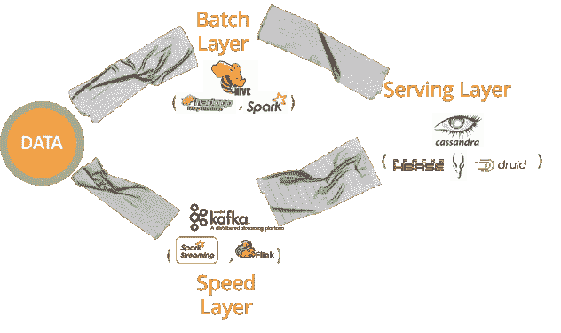

# 公共云没有杀死 Hadoop，但是复杂性可以

> 原文：<https://towardsdatascience.com/the-public-cloud-did-not-kill-hadoop-but-complexity-could-129f7949e589?source=collection_archive---------25----------------------->

作者:蒙特·兹韦本

对于三大 Hadoop 分销商来说，2019 年是艰难的一年。从 1 月份对 Cloudera/Hortonworks 合并的内部乐观和外部怀疑到 5 月份 MapR 的[末日即将来临的信](https://www.theregister.co.uk/2019/05/31/exunicorn_mapr_desperate_for_cash_as_it_faces_threat_of_permanent_closure/)以及随后被 HPE 收购，到 6 月份 [Cloudera 非常糟糕的星期三](https://www.cnbc.com/2019/06/05/cloudera-ceo-reilly-departs-earnings-q1-2020.html)股价暴跌和 Tom Reilly 的离开，消息一直不好。也许最有说服力的内容来自 Cloudera 的季度收益公告，该公告将 Hadoop 的挑战描述为需要云解决方案:

*虽然第一季度一些客户因预期新平台的发布而选择推迟续约和扩展协议，影响了我们全年的前景，但这种客户反馈和热情证实了我们目标市场对企业数据云解决方案的需求。”*

***复杂性杀死了***

**

*Hadoop is complex in the cloud too*

*如此多的文章声称公共云已经杀死了 Hadoop，但是正如我以前在这里写的一样，我对这种分布式技术的未来有一种相反的看法。*

*Hadoop 面临两大挑战:*

1.  *操作复杂性——使基于商用硬件的大规模分布式系统保持活跃、高性能和安全的开发人员负担。*
2.  *开发复杂性—将许多不同的计算和存储组件连接在一起以形成一个功能性解决方案，而不会因数据移动而出现延迟的开发负担。*

*公共云解决了运营复杂性挑战。这对于像 Cloudera、Hortonworks 和 MapR 这样的云计算后来者来说是一个重大的打击。AWS、Azure 和 GCP 几乎消除了操作 Hadoop 生态系统核心组件的操作复杂性。*

*然而，我认为即使在公共云中，成功采用这项技术仍然面临着巨大的挑战。AWS 的产品页面上有数百种计算和存储解决方案。我们的观点是，这个行业留给开发商的太多了。*

***你是想造车还是想开车？***

**

*Using Hadoop is like assembling a car from components*

*Hadoop 是一套非常棒的技术组件！我们用它来建立我们的数据平台。但是，通过我与努力实施 Hadoop 的首席信息官的多次交谈，我开始相信这些组件可能太低级了。打个比喻，当我们需要交通工具的时候，我们是基于我们的交通需求而买车的。我们不购买独立的汽车零件，如喷油器、车轴、发动机和悬挂系统。我们让制造商来组装。*

*同样，当你必须连接 AWS Dynamo 来运行一个应用，AWS Redshift 来分析数据，AWS SageMaker 来构建 ML 模型，AWS EMR 来运行基于 Spark 的 ETL 等等。你在组装“汽车”。这就是所谓的“λ建筑”的管道胶带。*

**

*然而，这导致了复杂性和数据移动。数据移动会导致等待数据被“ETL”时经常遇到的延迟。此外，创建这些体系结构所需的技能稀缺且昂贵。*

*因此，无论是否通过迁移到云来消除运营复杂性(这确实不是一项小任务)，您仍然会受到将所有计算和存储连接在一起的集成复杂性的困扰。*

***预集成打包方法***

**

*我们的观点是，就像交通运输的“汽车”一样，公司需要大规模可扩展的基础设施来组合运营、分析和 ML 工作负载，但他们不应该自己组装这种功能。我们相信 Hadoop 的某些组件非常适合嵌入和集成，使公司能够构建新的应用程序并使其现有应用程序现代化(您可以在 Splice Machine [这里](https://info.splicemachine.com/UndertheHoodWebinarRecording.html)看到我们是如何做到的)。其他人以其他方式将组件集成在一起。但尽管如此，我们认为这种预集成是必不可少的，在这种集成普及之前，Hadoop 仍然很难实现——即使是在公共云中。*