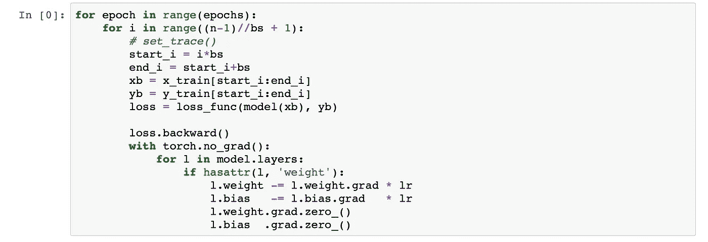
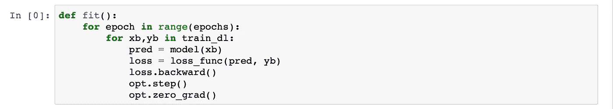

# PyTorch 训练循环

> 原文：<https://towardsdatascience.com/the-pytorch-training-loop-3c645c56665a?source=collection_archive---------8----------------------->

## 设置

现在我们知道了如何执行[矩阵乘法](https://becominghuman.ai/matrix-multiplication-the-pytorch-way-c0ad724402ed)和[初始化神经网络](https://becominghuman.ai/initializing-neural-networks-3a774eb63745)，我们可以继续进行训练。一如既往，我们将从占领 MNIST 开始。

然后定义一个非常简单的模型。

我们将选择交叉熵作为我们的损失函数，准确度作为我们的度量。

我们还将设置开始学习的学习速率和时代数。

# 训练循环

我们现在将从头开始编写训练循环。

然而，这看起来效率并不高。尤其是我们更新权重的部分。不需要遍历每一层并更新它的参数，如果我们能一起更新我们所有的参数就好了。我们希望能够做这样的事情:

为了做到这一点，我们希望我们的模型存储所有层的信息，然后当我们对它调用`.parameters()`时返回它。让我们创建一个虚拟模型如下:

在这个模型中，我们使用了 Python 特殊的名为`__setattr__.`的 dunder 方法，这个方法将在我们每次设置属性时被调用，例如`self.l1 = nn.Linear(n_in, nh)`。

所以现在我们每创建一个层，都会进入这个方法，把层的信息存储在一个叫做`self.modules`的字典里。然后，我们可以使用这个字典来生成我们所有的参数，如下所示。

这就是 PyTorch 在我们从`nn.Module`继承时在幕后为我们做的事情，这就是为什么我们必须首先调用`super().__init__()`。

然后我们可以在模型上调用`named_children()`来获得我们的层。

我们可以使用`model.parameters()`直接更新我们所有的参数。我们的训练循环现在看起来像这样。

## 了解 nn。连续的

如果我们创建了一个层的列表，那么我们不能通过简单地执行`self.layers = layers`来使用`model.parameters`访问它们的参数。我们需要将每个层添加到我们的模块中，如下所示:

PyTorch 使用`nn.ModuleList`做同样的事情。所以我们可以做的是:

然而，这仍然是笨拙的，所以我们可以直接做:

我们现在知道了`nn.Sequential`是如何实现的。

## 了解优化器

让我们进一步改进我们的权重更新代码，这样我们就可以从

只是为了

为此，我们将定义一个**优化器**类，并将这些功能放入其中。

我们的训练循环现在看起来干净多了。

## 了解数据集和数据加载器

我们要改进的下一点是小型批处理。我们分别迭代 x 和 y 小批量，这不好。因此，我们将创建一个数据集，并一起处理它们。

这将我们的循环修改如下:

最后，我们为数据加载器创建一个类，以进一步清理小型批处理过程。

这是可行的，因为`yield`总是返回下一个小批量。我们最后的训练循环就像简单的英语一样容易阅读。

这就是本文的全部内容。

如果你想了解更多关于深度学习的知识，你可以看看我下面的深度学习系列。

 [## 深度学习系列

### 我所有关于深度学习的文章的系统列表

medium.com](https://medium.com/@dipam44/deep-learning-series-30ad108fbe2b) 

~快乐学习

## 参考:

[深度学习从基础做起，fast.a](https://www.fast.ai/2019/06/28/course-p2v3/) i