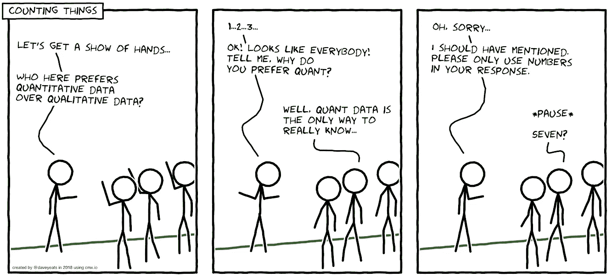
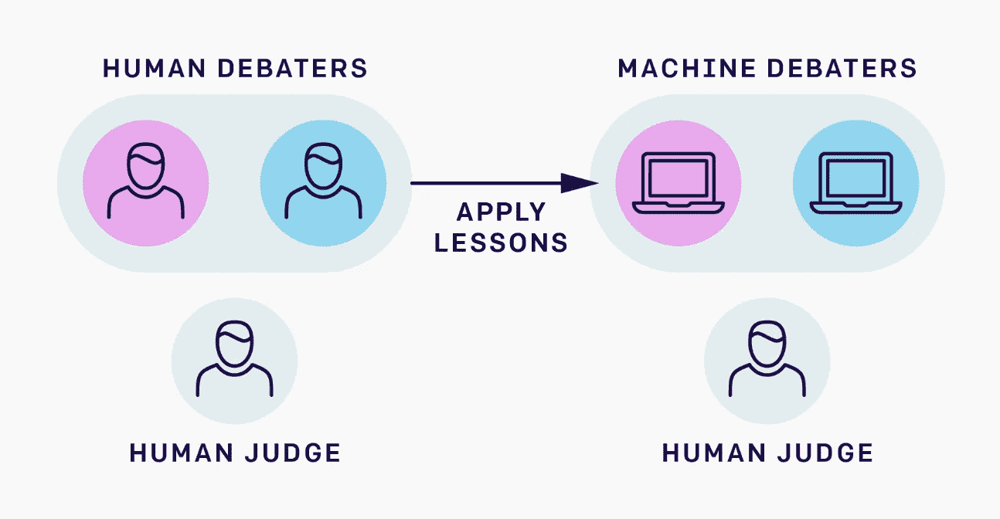

# 定性数据科学家

> 原文：<https://towardsdatascience.com/the-qualitative-data-scientist-e0eb1fb1ceb9?source=collection_archive---------13----------------------->

Photography by [@loicleray](https://unsplash.com/@loicleray)

## 探索定性数据和研究的概念

数据科学被想象成第四种科学范式，这是图灵奖获得者吉姆·格雷说的。他声称科学正在因为信息技术而改变，在某种程度上，我认为他是对的。

因此，通过结合经验、理论、计算和数据驱动，我们有了数据科学。对于一个复杂的领域来说，这似乎是一个直截了当的叙述，但可能需要一些探索。让我们浏览一下一些基本定义和对这个问题的一些想法。

*你可能会发现这些定义是基本的，因此如果你已经熟悉这些概念，你可能希望跳过这一部分。同样，我不会称自己为数据科学家，所以你可能会发现这种观点缺乏或不同。*

**数据科学**是一个多学科领域，使用科学方法、流程、算法和系统从结构化和非结构化数据中提取知识和见解。

那么什么是结构化数据呢？**结构化数据**是指驻留在记录或文件的固定字段中的任何数据。这包括关系数据库和电子表格中包含的数据。例如，谷歌的搜索引擎更喜欢你的数据以特定的方式结构化。

**非结构化数据**是指没有预定义的数据模型或者没有以预定义的方式组织的信息。非结构化信息通常以文本为主，但也可能包含日期、数字和事实等数据。

**半结构化**数据是结构化数据的一种形式，它不遵循与关系数据库或其他形式的数据表相关联的数据模型的正式结构，但仍然包含标签或其他标记来分隔语义元素并加强数据内记录和字段的层次结构。

一种简单的方式是，结构化数据在其预期用途的特定环境中工作*，例如大数据或具有已定义数据类型的小数据集。使用当然会产生意想不到的后果。*

***数据类型**在计算机科学和计算机编程中，或简称为类型，是数据的一种属性，它告诉编译器或解释器程序员打算如何使用数据。*

*在计算机科学中,**编译器**是一种将指令转换成机器代码或低级形式的程序，这样它们就可以被计算机读取和执行。*

***解释器**是一种计算机科学程序，它直接执行用脚本或编程语言编写的指令，而不需要将其编译成机器语言程序(机器代码是严格的数字语言，如 1 和 0)。*

*数据科学是“统一统计学、数据分析、机器学习及其相关方法的概念”，以便用数据“理解和分析*实际现象*”。*

## *定性的质量和定性的定义*

*既然我们有了讨论的基准，让我们看看质量和定性。*

***质量**是一件事物相对于其他同类事物的标准；某事物的优秀程度。尽管可能有其他定义。*

***统计学中的定性数据**也称为分类数据。这是近似或表征但不测量属性、特征、性质等的数据。指事物或现象。定性数据描述，而定量数据定义。定性数据通过非数字属性进行区分，用于根据共享特征对对象组进行分类。*

***定性研究**是一种收集非数字数据的科学观察方法。[1]这种类型的研究“涉及事物的含义、概念定义、特征、隐喻、符号和描述”，而不是它们的“计数或度量”。这种方法经常与社会科学联系在一起，也许特别是社会学和人类学，但是它也用于自然科学或其他领域。*

*你可以看到，定性数据和定性研究的概念有共同点，但也有分歧。例如，被认为是定性研究的采访或图片，即非数字数据，可能会在计算机系统中编号。数字形式的文字、声音、照片将被中央处理器(CPU)作为数字读取。*

*这引发了一些直接的想法或担忧:*

*   *当然，定性研究数据是不稳定的。当以这种数字方式处理时，它很可能变成定量的。这是从方法还是描述的转移？*
*   *鉴于目前的发展，也许非数字的定性区分在某种程度上是错误的？即使是图像标签也是由数字数据组成的。*
*   *为了让你的数据非数值化，你要走多远？这种追求是否有利于合作，值得怀疑。*
*   *无论是在研究中还是在数据中，定性和定量之间的这种区别是一个对立的对，它创造了可能对数据科学的发展富有成效的讨论。*

## *数据科学中定性方法的好处*

*去年 2018 年 4 月 [Robyn Rap](https://medium.com/u/110d0b625b5f?source=post_page-----e0eb1fb1ceb9--------------------------------) 和[张晶晶](https://medium.com/u/7671e55631c9?source=post_page-----e0eb1fb1ceb9--------------------------------)在 Medium 上写了一篇关于 [*定性+定量定性方法如何支持更好的数据科学*](https://medium.com/indeed-engineering/qualitative-before-quantitative-how-qualitative-methods-support-better-data-science-d2b01d0c4e64) 的文章。他们开始讲述机器学习项目中的潜在尴尬，因为你没有想到明显而重要的特征。因此，他们认为，没有定性研究的数据科学家可以对用户行为做出假设，这可能导致:*

1.  *忽略关键参数*
2.  *错过了向使用我们产品的人强调的重要机会，或者*
3.  *曲解数据*

*在这种情况下，他们张贴了一幅漫画来强调他们的观点。在这一点上，我会推荐你使用 HTML 标记来创建你自己的 xkcd 风格的漫画。*

**

*Cartoon created by Indeed UX Research Manager Dave Yeats using [cmx.io](https://www.google.com/url?q=http://cmx.io&sa=D&ust=1524502456911000&usg=AFQjCNGRstZrTgGZHSG2c8FZlixWEDMviA)*

*另一个我之前在我的文章 [*社会科学家和人工智能——为了安全、社会和科学*](https://medium.com/ai-social-research/social-scientists-and-ai-1d9d97a5246?source=friends_link&sk=fb29f5178e3c4b34b7ec56082bfc3e47) 中提到的例子来自 OpenAI。他们在 2 月 19 日发表的名为 [*AI 安全需要社会科学家*](https://openai.com/blog/ai-safety-needs-social-scientists/) 的期刊文章讨论了如何使用特定的定性方法。他们提出的解决方案是用人代替机器学习，至少在 ML 系统能够参与我们感兴趣的复杂辩论之前是这样。在考虑用 ML 替代之前，先试用人类参与者。*

****

*An example debate with two human debaters and a human judge. Only the debaters can see the image. Red is arguing that the image is a dog, Blue is arguing for cat. Image and caption is fetched from the aforementioned journal paper [published in Distill](https://distill.pub/2019/safety-needs-social-scientists/).*

*当然，定性数据远不止是分类数据。定性研究和定量研究有大量的书籍，事实上，科学方法论是非常受人尊敬的。在说定性数据科学家的时候，我并没有声称有这样的事情，然而讨论是我感兴趣的。在这方面，我不能肯定地说什么是对的，什么是错的，只是相对自由地思考这些概念。*

*我在数据科学的深水中潜水，却不会游泳，喘着气，同时似乎在批评专业游泳运动员。我无意无礼。相反，在这个“数据海洋”中，我们必须首先检查水质或检查我们与这些活动的关系。*

*我真的很喜欢趴在齐膝深的水里，看着外面那些人的技术，恐惧地看着未来会发生什么！*

***这是#500daysofAI** 的第 28 天，我真诚地希望你喜欢它。*

*–*

> *什么是#500daysofAI？*
> 
> *我在挑战自己，用#500daysofAI 写下并思考未来 500 天的人工智能话题。这是我发明的一个挑战，让自己一直思考这个话题，分享我的想法。*
> 
> *这是受电影《夏日 500 天》的启发，主角试图找出爱情失败的原因，并在此过程中重新发现他生活中真正的激情。*