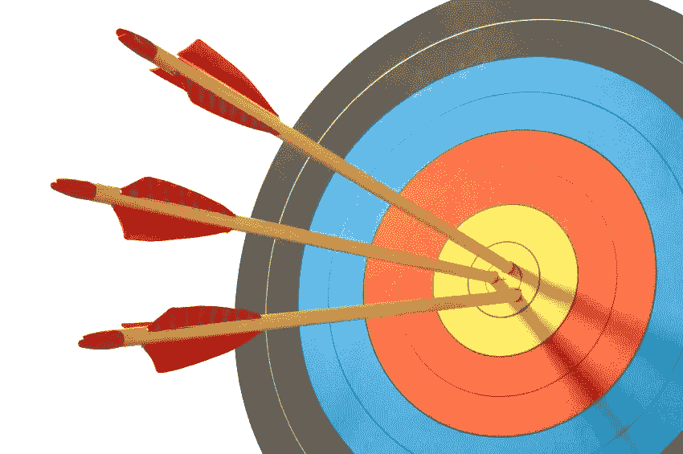
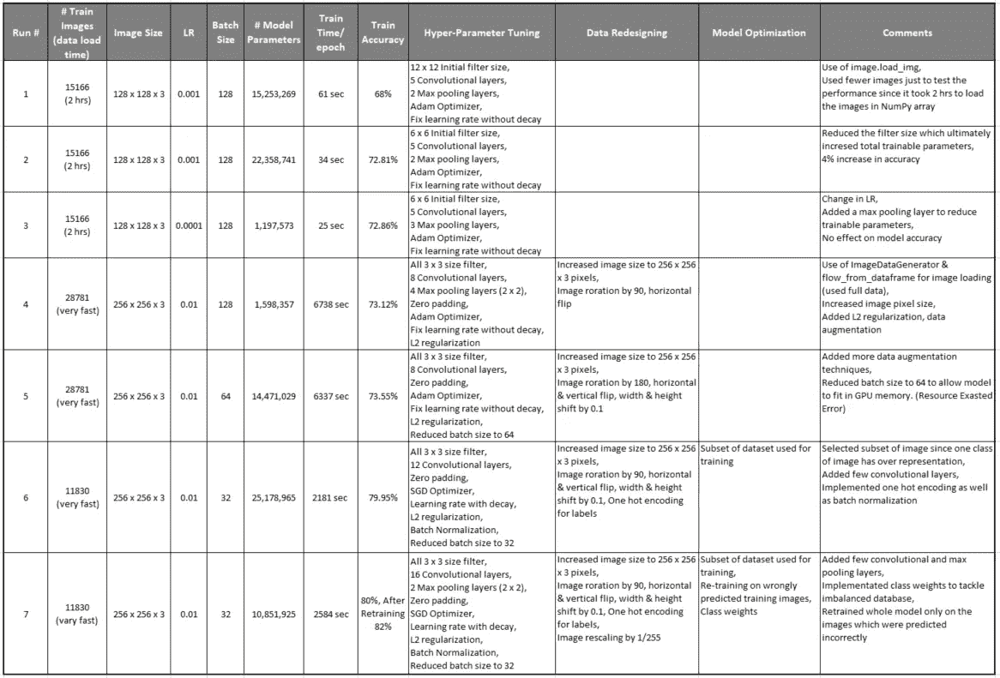
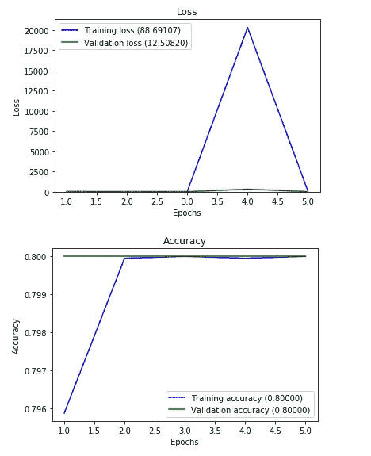

# 对 CNN 模型更高精度的探索

> 原文：<https://towardsdatascience.com/the-quest-of-higher-accuracy-for-cnn-models-42df5d731faf?source=collection_archive---------8----------------------->

## 在本帖中，我们将学习使用数据重新设计、**超参数**调整和模型优化来提高精确度的技术



当涉及深度学习模型时，性能是关键，当资源有限时，这将成为一项艰巨的任务。衡量绩效的一个重要参数是“准确性”。本文旨在通过与数据、算法调整和模型优化相关的各种技术实现更高的精度。我们还将看到在改变诸如学习速率、批量大小、训练图像数量、图像大小和可训练模型参数数量等参数后对准确性的影响。

**看完这篇文章，你就知道**

1.  几种性能改进技术。
2.  各种方式加载图像数据，数据预处理与易于使用的数据管道。
3.  用于复杂图像分类的定制 CNN 模型。
4.  保存模型以备将来使用，并使用保存的模型预测新图像。

首先，我将实现一个我最近发布的代码。(以下链接)这是一个用于糖尿病视网膜病变检测的 TF/Keras 实现。这是一个非常基本的 CNN 模型，精确度非常低。我对这段代码做了一些修改，以获得高精度和快速的训练/数据加载时间。在本文的后面，我将向您介绍性能最佳的代码。

[](https://medium.com/@swan1991m/convolutional-neural-network-cnn-implementation-for-diabetic-retinopathy-detection-with-tf-989ac802ce4b) [## 卷积神经网络在糖尿病视网膜病变检测中的应用

### 本教程的目的是利用 CNN 开发糖尿病视网膜病变自动检测系统。这是…

medium.com](https://medium.com/@swan1991m/convolutional-neural-network-cnn-implementation-for-diabetic-retinopathy-detection-with-tf-989ac802ce4b) 

使用 [ImageDataGenerator](https://keras.io/preprocessing/image/) 、flow_from_dataframe、各种数据扩充技术、L2 正则化、批量归一化、考虑 Keras 中的类权重对数据子集进行一次热编码，实现了性能最佳的代码。让我们看看所有的性能改进技术。

**通过超参数调整提高性能的技术**

1.  L2 正则化>>惩罚模型的复杂性，惩罚大的权重。L2 正则化鼓励权重变小，但不强迫它们精确到 0。
2.  学习率(LR)优化>>从基础 LR 开始，随后在下一个时期降低它。
3.  批处理大小>>通常尝试你的 GPU 可以处理的最大批处理大小，取决于 GPU 的内存。
4.  增加模型容量>>增加模型深度(更多层数)和宽度(每个卷积层中的过滤器数量)。

**通过数据重新设计提高性能的技术**

1.  提高图像分辨率(渐进式调整大小) >>从 128 x 128 x 3 提高到 256 x 256 x 3 或更高的尺寸。
2.  随机图像旋转>>改变图像的方向。
3.  当对象不在图像中心时，随机图像偏移>>非常有用。
4.  垂直和水平移动>>随机垂直或水平翻转图像。(算法应该识别玻璃是面朝上还是面朝下)

**通过模型优化提高性能的技术**

1.  使用子集数据微调模型>>为一些过度采样的数据类丢弃少量数据样本。
2.  类权重>>用于训练高度不平衡(有偏差)的数据库，类权重将在训练期间给予所有类同等的重要性。
3.  使用训练数据微调模型>>使用模型预测训练数据，针对错误预测的图像重新训练模型。

**下表描述了各种车型的性能总结**



最后 4 列显示了我们在定义模型和数据处理过程中应用的所有性能改进技术的亮点。一般来说，在进行性能测量时，建议一次更改一个变量，该表仅显示了我们看到性能有所提高或者我们应用了任何新的调优技术的运行。

所有的测量都是在 NVIDIA Quadro M400 GPU 上完成的。这款 GPU 有 8 GB 内存。GPU 在 Ubuntu 16.04 实例上为 GPU 1.8.0 配置了 CUDA 9.0、cuDNN 7.4、TF。

**这些测量的一些局限性**

1.  由于 GPU 只有 8 GB 的内存，你需要仔细设计数据管道和模型，否则你会经常得到“资源耗尽错误”。您可以通过减少批量大小、在加载数据时减少图像大小，以及通过移除少量 CNN 层或引入最大池层来更改模型中的可训练参数数量，来轻松解决这个问题。在我的实验中，我尝试了所有可能的最大值。
2.  因为大多数代码使用 [flow_from_dataframe](https://keras.io/preprocessing/image/) 功能来加载图像。它限制了我们通过使用基于特征的中心(ImageDataGenerator 提供的 Keras 功能)进行基于特征的归一化和将图像均值设置为 0。为了使用这两个特征，我们需要拟合 NumPy 数组(image.load_img)格式的数据。不幸的是，我使用的 VM 实例需要很长时间将数据读入 NumPy 数组。

**现在让我们看看我们获得 80%准确率的代码**

这段代码使用了 mat-plot、NumPy、Keras、Pillow、H5py 和 Tensor-Flow 等 Linux 包。

我已经从 Kaggle 下载了[数据库](https://www.kaggle.com/c/diabetic-retinopathy-detection/overview)。数据库有几个 zip 文件，我们需要将它们解压缩到包含各自图像的 train/test 文件夹中。列车图像的所有标签都在单独的 CSV 文件中提供。

在下面的代码中，我们将读取一个包含图像标签和名称的 CSV 文件。我们需要做一些健全的检查(添加。jpeg 扩展，删除所有大小为 0 KB 的图像，从数据帧中移除已删除图像的条目)。

让我们将数据库分为训练和验证数据，然后将标签转换为一个热编码标签。我们有目的地在分割数据后进行一次热编码，以保留原始标签格式，以便稍后将标签与预测的标签进行比较。(当我们重新训练错误预测的图像时，这将是有用的)我们还将计算类权重，因为这是一个高度不平衡的数据库。

正如我之前所说，我们将使用 [ImageDataGenerator](https://keras.io/preprocessing/image/) (应用所有图像放大技术、图像旋转、宽度/高度移动和重新缩放)和 [flow_from_dataframe](https://keras.io/preprocessing/image/#flow_from_dataframe) (读取所有图像，设置批量大小和图像大小)

让我们定义模型。该模型由二维[卷积层](https://keras.io/layers/convolutional/)和 Relu 作为[激活函数](https://keras.io/activations/)、[零填充层](https://keras.io/layers/convolutional/#zeropadding2d)和[最大池层](https://keras.io/layers/pooling/)组成。我们还将实现[批量规范化](https://keras.io/layers/normalization/)和 [L2 规范化](https://keras.io/regularizers/)。这是一个 Keras 功能 API 实现。

初始化优化器和损失函数。我们将使用学习率为 0.01 的随机梯度下降(SGD)，它将在每个时期衰减。实际上，SGD 是二维函数，但神经网络可能有数百万个参数，这意味着损失函数可以移动数百万个方向。如果损失函数有局部极小点/鞍点，就会出现“零梯度”，梯度下降就会卡住。如果我们给 SGD 增加动量，鞍点将获得向前运动的速度。增加涅斯捷罗夫的动量将会缩短收敛的路径。

[回调](https://keras.io/callbacks/)将帮助我们保留迄今为止我们训练过的最佳权重和偏差，因为我们将使用多个时段进行训练，每个时段将经历整个训练集。在一定数量的历元之后，总是存在模型过度拟合的可能性，或者准确度可能停止提高，已经保存的权重将是有帮助的。

我们定义的模型如下所示

```
_________________________________________________________________
Layer (type)                 Output Shape              Param #   
=================================================================
input_3 (InputLayer)         (None, 256, 256, 3)       0         
_________________________________________________________________
conv2d_33 (Conv2D)           (None, 254, 254, 16)      448       
_________________________________________________________________
conv2d_34 (Conv2D)           (None, 252, 252, 16)      2320      
_________________________________________________________________
batch_normalization_17 (Batc (None, 252, 252, 16)      64        
_________________________________________________________________
zero_padding2d_5 (ZeroPaddin (None, 254, 254, 16)      0         
_________________________________________________________________
conv2d_35 (Conv2D)           (None, 252, 252, 32)      4640      
_________________________________________________________________
conv2d_36 (Conv2D)           (None, 250, 250, 32)      9248      
_________________________________________________________________
batch_normalization_18 (Batc (None, 250, 250, 32)      128       
_________________________________________________________________
conv2d_37 (Conv2D)           (None, 248, 248, 64)      18496     
_________________________________________________________________
conv2d_38 (Conv2D)           (None, 246, 246, 64)      36928     
_________________________________________________________________
batch_normalization_19 (Batc (None, 246, 246, 64)      256       
_________________________________________________________________
max_pooling2d_5 (MaxPooling2 (None, 123, 123, 64)      0         
_________________________________________________________________
zero_padding2d_6 (ZeroPaddin (None, 125, 125, 64)      0         
_________________________________________________________________
conv2d_39 (Conv2D)           (None, 123, 123, 128)     73856     
_________________________________________________________________
conv2d_40 (Conv2D)           (None, 122, 122, 128)     65664     
_________________________________________________________________
batch_normalization_20 (Batc (None, 122, 122, 128)     512       
_________________________________________________________________
conv2d_41 (Conv2D)           (None, 120, 120, 64)      73792     
_________________________________________________________________
conv2d_42 (Conv2D)           (None, 118, 118, 64)      36928     
_________________________________________________________________
batch_normalization_21 (Batc (None, 118, 118, 64)      256       
_________________________________________________________________
conv2d_43 (Conv2D)           (None, 116, 116, 64)      36928     
_________________________________________________________________
conv2d_44 (Conv2D)           (None, 114, 114, 64)      36928     
_________________________________________________________________
batch_normalization_22 (Batc (None, 114, 114, 64)      256       
_________________________________________________________________
max_pooling2d_6 (MaxPooling2 (None, 57, 57, 64)        0         
_________________________________________________________________
conv2d_45 (Conv2D)           (None, 55, 55, 64)        36928     
_________________________________________________________________
conv2d_46 (Conv2D)           (None, 53, 53, 64)        36928     
_________________________________________________________________
batch_normalization_23 (Batc (None, 53, 53, 64)        256       
_________________________________________________________________
conv2d_47 (Conv2D)           (None, 51, 51, 128)       73856     
_________________________________________________________________
conv2d_48 (Conv2D)           (None, 50, 50, 128)       65664     
_________________________________________________________________
batch_normalization_24 (Batc (None, 50, 50, 128)       512       
_________________________________________________________________
flatten_3 (Flatten)          (None, 320000)            0         
_________________________________________________________________
dense_7 (Dense)              (None, 32)                10240032  
_________________________________________________________________
dropout_5 (Dropout)          (None, 32)                0         
_________________________________________________________________
dense_8 (Dense)              (None, 32)                1056      
_________________________________________________________________
dropout_6 (Dropout)          (None, 32)                0         
_________________________________________________________________
dense_9 (Dense)              (None, 5)                 165       
=================================================================
Total params: 10,853,045
Trainable params: 10,851,925
Non-trainable params: 1,120
_________________________________________________________________
```

是时候在 GPU 上训练模型了

这是培训的进展情况，您可以看到我们完成了 80%的培训和验证准确性。

```
Epoch 1/5
370/370 [==============================] - 1849s 5s/step - loss: 29.1990 - acc: 0.7959 - val_loss: 10.7663 - val_acc: 0.8000
Epoch 2/5
370/370 [==============================] - 2584s 7s/step - loss: 17.5359 - acc: 0.7999 - val_loss: 3.8036 - val_acc: 0.8000
Epoch 3/5
370/370 [==============================] - 2398s 6s/step - loss: 16.2506 - acc: 0.8000 - val_loss: 3.2556 - val_acc: 0.8000
Epoch 4/5
370/370 [==============================] - 2064s 6s/step - loss: 20347.928 - acc: 0.7999 - val_loss: 321.0431 - val_acc: 0.8000
Epoch 5/5
370/370 [==============================] - 2482s 7s/step - loss: 88.7576 - acc: **0.8000** - val_loss: 12.5082 - val_acc: **0.8000**
```

使用下面的代码，我们还可以看到精度和损耗是如何随时间变化的

这是剧情的样子



为了进一步提高准确性，我们将对错误预测的训练图像进行重新训练。为此，我们将加载刚刚保存的模型，稍后我们将使用[预测生成器](https://keras.io/models/model/#predict_generator)在相同的训练图像上进行预测。以这种方式，我们将针对先前模型未预测到的特定图像集来微调模型。

现在我们在 df_filtered 中有了一个新的数据库。我们可以使用之前使用的相同的旧数据管道和模型定义。这种再训练让我达到了 82%的准确率。

**GitHub 资源库**

所有的 iPython 笔记本都可以在[https://github . com/swanandM/Diabetic-Retinopathy-Detection-with-TF](https://github.com/swanandM/Diabetic-Retinopathy-Detection-with-TF)获得

**我们还能做些什么来提高精确度？**

在现实世界中，有时很难依赖单一模型。不同的模型可以具有不同的属性，这取决于它所具有的层数、它被训练的参数数量等。特定的模型可能无法对特定组/类型的图像进行最佳预测。在这种情况下，我们可以结合多个模型来做出最佳预测。

在我的下一篇文章中，我们将通过使用我们已经创建的一些性能最好的模型来实现模型集合。模型集成可用于从这些模型中进行投票，以做出最终预测。

**参考文献**

1.  "提高训练准确度的不同方法" > >[https://towards data science . com/Different-the-way-of-improving-training-accuracy-c 526 db 15 a5 b 2](/different-ways-of-improving-training-accuracy-c526db15a5b2)
2.  “使用 Keras 进行深度学习的图像增强”> >[https://machine learning mastery . com/Image-augmentation-deep-learning-Keras/](https://machinelearningmastery.com/image-augmentation-deep-learning-keras/)
3.  “用深度学习诊断糖尿病视网膜病变”> >[https://deep sense . ai/diagnosis-diabetic-diabetic-retinopathy-with-deep-learning/](https://deepsense.ai/diagnosing-diabetic-retinopathy-with-deep-learning/)