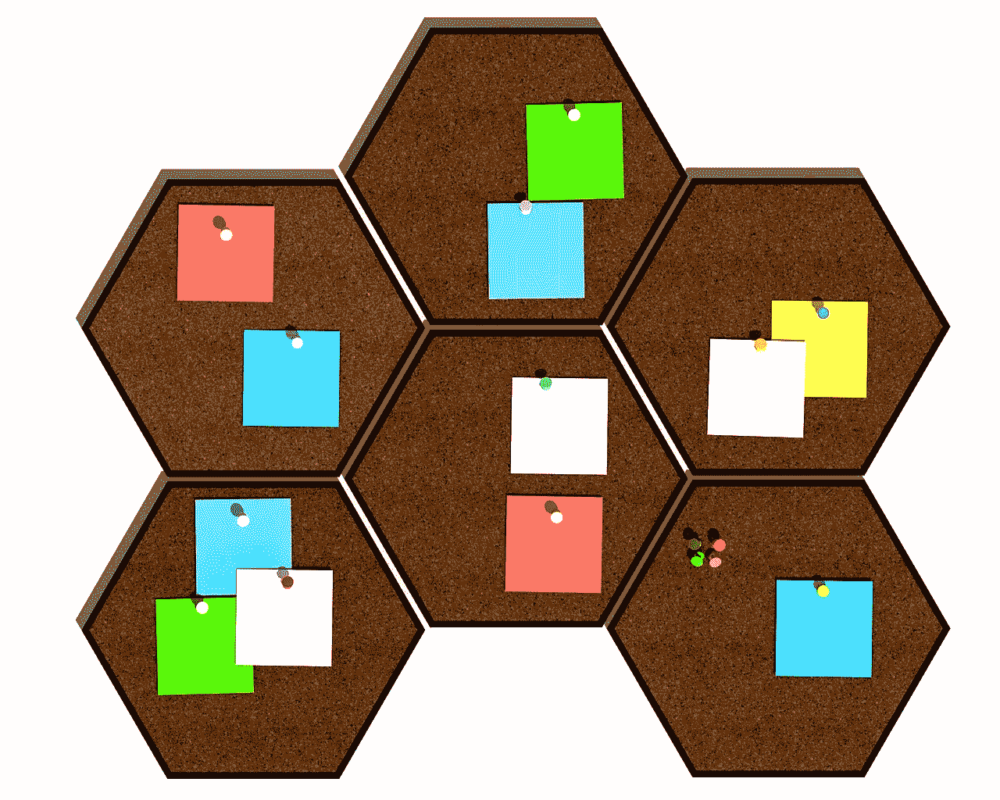
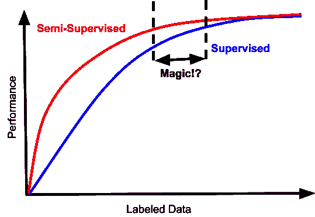
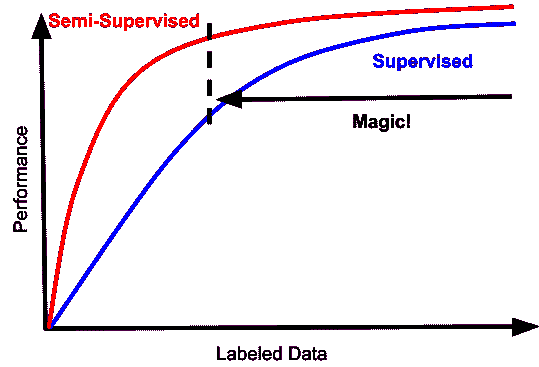

# 悄无声息的半监督革命

> 原文：<https://towardsdatascience.com/the-quiet-semi-supervised-revolution-edec1e9ad8c?source=collection_archive---------6----------------------->

## 是时候掸去未标记数据的灰尘了？

对于机器学习工程师来说，最熟悉的设置之一是访问大量数据，但只有少量资源来注释这些数据。处于这种困境中的每个人最终都会经历这样一个逻辑步骤:当他们只有有限的监督数据，但有大量未标记的数据时，他们会问自己该怎么办，而文献似乎已经有了现成的答案:[半监督学习](http://www.acad.bg/ebook/ml/MITPress-%20SemiSupervised%20Learning.pdf)。

这通常是事情出错的时候。

从历史上看，半监督学习是每个工程师都经历的一个兔子洞，只是为了发现对普通旧数据标记的新发现。每个问题的细节都是独一无二的，但大致来说，它们通常可以描述如下:

在低数据状态下，半监督训练确实有助于提高表现。但在实际环境中，你经常会从“糟糕到无法使用”的表现水平，变成“不太糟糕但仍然完全无法使用”本质上，当你处于半监督学习实际上有所帮助的数据体制中时，这意味着你也处于你的分类器只是简单糟糕并且没有实际用途的体制中。

此外，半监督通常不是免费的，使用半监督学习的方法通常不会为您提供监督学习在高数据领域中提供的渐近属性，例如，未标记的数据可能会引入偏差。参见[第 4 节](http://www.acad.bg/ebook/ml/MITPress-%20SemiSupervised%20Learning.pdf)。深度学习早期非常流行的半监督学习方法是首先在未标记数据上学习自动编码器，然后在标记数据上进行微调。几乎没有人再这样做了，因为通过自动编码学习到的表示往往会在经验上限制微调的渐近性能。有趣的是，即使大大改进的现代生成方法也没有改善这种情况，可能是因为好的生成模型不一定就是好的分类器。因此，当你看到工程师今天微调模型时，通常是从监督数据上学习的表示开始的——是的，我认为文本是用于语言建模的自我监督数据。只要可行，从其他预先训练好的模型中进行迁移学习是一个[更强的起点](https://arxiv.org/abs/1804.09170)，这是半监督方法难以超越的。

所以一个典型的机器学习工程师在半监督学习的沼泽中的旅程是这样的:

1:一切都很可怕，我们试试半监督学习吧！(毕竟那是工程工作，比标注数据有趣多了……)

2:看，数字上去了！不过，还是很糟糕。看来我们终究还是要给数据贴标签了…

3:数据越多越好，耶，但是你试过如果你丢弃半监督机器会发生什么吗？

4:哎，你懂什么，其实更简单更好。我们可以通过完全跳过 2 和 3 来节省时间和大量的技术债务。

如果您非常幸运，您的问题也可能无可否认地具有这样的性能特征:

在这种情况下，有一个狭窄的数据体制，其中半监督是不可怕的，也提高了数据效率。以我的经验来看，很少能达到最佳状态。考虑到额外复杂性的成本，标记数据量的差距通常不是更好的数量级，以及收益递减，很少值得麻烦，除非你在学术基准上竞争。

但是等等，这篇文章的题目不是叫《安静的半监督革命》吗？

一个有趣的趋势是，半监督学习的前景可能会变得更像这样:

这将改变一切。首先，这些曲线符合人们对半监督方法应该做什么的心理模型:数据越多越好。半监督和监督之间的差距应该严格为正，即使对于监督学习做得很好的数据制度。越来越多的情况下，这种情况的发生不需要任何成本，而且非常简单。“神奇地带”起点较低，同样重要的是，它不受高数据范围的限制。

有什么新鲜事？很多事情:许多聪明的方法来自我标记数据，并以一种与自我标记的噪音和潜在偏见兼容的方式表达损失。最近的两部作品举例说明了最近的进展，并指向相关文献: [MixMatch:半监督学习的整体方法](https://arxiv.org/abs/1905.02249)和[无监督数据增强](https://arxiv.org/abs/1904.12848)。

半监督学习领域的另一个根本转变是认识到它可能在机器学习隐私方面发挥非常重要的作用。例如，PATE 方法([用于从私人训练数据进行深度学习的半监督知识转移](https://arxiv.org/abs/1610.05755)，[利用 PATE 的可扩展私人学习](https://arxiv.org/abs/1802.08908))，其中监督数据被假定为私人的，并且仅使用未标记的(假定为公共的)数据来训练具有强隐私保证的学生模型。提取知识的隐私敏感方法正在成为[联合学习](https://federated.withgoogle.com/)的关键促成因素之一，它提供了高效分布式学习的承诺，不依赖于访问用户数据的模型，具有强大的数学隐私保证。

这是一个令人兴奋的时刻，在实践中重新审视半监督学习的价值。看到一个人长期持有的假设受到挑战，是该领域发生惊人进展的一个很好的指标。这种趋势是最近才出现的，我们必须看看这些方法是否经得起时间的考验，但这些进步可能导致机器学习工具架构的根本转变，这种可能性非常有趣。