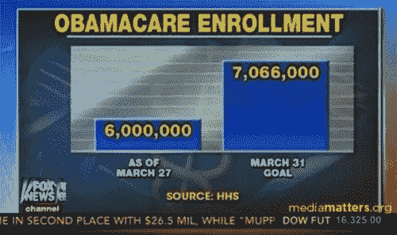

# 数据民主化的真正含义和过程。

> 原文：<https://towardsdatascience.com/the-real-meaning-and-process-of-data-democratization-abd7d7608a1?source=collection_archive---------11----------------------->

## 如何做以及为什么现在就做…

> 场景:印度农村的一个小村庄。当公共记录被宣读时，全村的人都聚在一起听。一名村民在公共记录中被列为将他的犁出租给政府赞助的灌溉项目。“不，”他说，“我没有那样做。那时我在德里参加我表兄的婚礼。”有笑声，也有愤怒，因为人们立即发现他们是如何被欺骗的，公共资金是如何从他们和他们的村庄被抽走的。更多的虚假信息被揭露出来:例如，6 公里运输材料的账单项目，而实际上，实际距离只有 1 公里。一名工人，根据政府记录受雇于一条新运河的建设，站起来问:“什么运河？”参与建房的工人证实，供应和使用了 50 袋水泥，而不是 100 袋。在公众听证会结束时，圣歌响起:“我们想要什么？信息。我们想要什么？信息:理查德·卡兰博士讲的故事

在过去的五十年里，许多国家及其政府已经正式承认了针对这些主张的知情权。越来越多的国家，例如南非，在其宪法中确立了知情权。如果机构努力维护公众的合法性，那么对访问权的正式承认是显而易见的。走向更多民主的道路是数据民主化的道路。获取信息与民主的存在之间存在着非常严格的关联。简而言之:为了做出正确的决定并在选票上正确打勾，公民必须被告知。获取信息对于人们实现参与国家治理的基本权利以及在基于公民知情同意的制度下生活至关重要。在任何国家，特别是在民间社会的政策分析能力不发达的国家，如果不能获得政府信息，就无法有效行使政治参与权。听起来很明显？很好:让我们继续，因为除了谈论我的“雄心壮志”，我还想概括地介绍一点关于数据民主化的理论，回答两个主要问题:为什么是现在？又是怎么做到的？以相反的顺序。

# 数据如何民主化？

我找到的解决方案是建立一个搜索引擎。这显然不是唯一的方法——远非如此。但由于数据科学的出现，这是一个既灵活又强大的领域。

在我选择的这个过程中，我看到了三个主要步骤，我将逐一介绍:

## 1.使数据易于查找

大多数可以被大众化的数据都可以在某个地方找到。但问题是，就数据有用性而言，“某处”或多或少与“无处”是一样的。如果只有政治竞选经理看到这些数据，你就不能称之为民主化。问题在于发布数据的人的错误 KPI(关键绩效指标)。他们中的大多数人关注的是如何将尽可能多的数据推送到互联网上，而不是关注有多少人会看到这些数据。

如果我们最终同意改变这个焦点，我们将如何实现绩效？这就需要一个好的搜索引擎，有好的搜索引擎优化。一个好的搜索引擎是智能的。与只寻找关键字匹配的简单搜索引擎相反，智能搜索引擎通过识别或推断用户想要的结果的性质来解释查询，识别查询中提到的时间和位置等重要参数，并最终考虑搜索的上下文。一旦它可用，它也需要被使用。可以通过多种方式接触用户。统计显示，数据大多是通过谷歌这样的搜索引擎搜索出来的。因此，良好的 SEO 是实现数据搜索便利化目标的关键一步。

## 2.简单、易懂且高质量的数据表示

一旦搜索引擎开始工作并可访问，下一步就是显示结果。这一部分看似简单，实质上也很简单。但是试着设计和构建一些看起来和感觉上用户友好的东西，但是要足够复杂以理解整个画面，你会发现这个任务并不是说起来容易做起来难。事实上，大多数想要实现数据民主化的解决方案都远远不符合这些标准。以下是解决方案在以最佳方式显示数据时面临的主要问题:

*   缺乏直接性是由解决方案处理数据的方式造成的:许多解决方案将数据分组放在表中，因此无法显示单个值，失去了直接性；
*   事实上的不精确扼杀了整个交易。可能很难保证完全精确，但落入这个陷阱是肯定的；
*   不回答问题也是用户可能得到的非常令人沮丧的体验之一；
*   来源是必要的；
*   数据上下文是必须的；
*   代表性的视觉效果(如信息图)对理解有很大的帮助

An example of poor quality data representation

*一篇关于数据表示体验的更深入的文章即将发表……*

## 3.在增加数据量的同时重复前两个步骤

第三步是在两个方面一直被忽视的一步。

要么是一个解决方案冲进来，添加了所有可能的数据，却无法处理这些数据，要么是相反的情况——添加的数据太少，用户无法从产品中获得足够的价值来使用这些数据。

Illustration by [Katerina Limpitsouni](https://twitter.com/ninalimpi)

第一种选择是最常见的。我们看到 Statista.com 有很多很多的数据，管理不善，因此搜索功能和 UX 很差。他们的数据从人均 GDP 到电子竞技专业人士统计的堡垒之夜碎片数量不等。几乎所有事情都是如此(除了少数例外):选择数量会损害质量。

相反的问题就不言自明了。

数据民主化需要找到它的速度平衡:搜索和数据曲线的质量与拥有用户所必需的数量之间的交叉点。

# 为什么现在要民主化数据？

这听起来像是一个荒谬的问题，因为我在引言中提倡数据民主化。我向你保证，我没有改变主意。我只是相信，现在是加快信息传播速度、让更多人看到信息的最佳时机。

**首先，**我们每天都有大量的数据产生，并且越来越容易被使用。政府正在收集比以往更多的数据，并向公众开放，这些数据的质量正在提高，尽管这一积极趋势的速度和程度在很大程度上取决于国家和地区。守旧、腐败的市长和政府官员可能会造成短期封锁，但从长期和大范围来看，这不会造成问题。

由于数据科学的进步，数据解释也在增加。我将发表一篇文章(与几位伟大的数据科学和开放数据专家合作)，介绍如何利用人工智能从数据中获得有趣的见解。

Photo by [Elena Koycheva](https://unsplash.com/@lenneek?utm_source=medium&utm_medium=referral) on [Unsplash](https://unsplash.com?utm_source=medium&utm_medium=referral)

**第二，**我们有资源让人们的目光追随这些数据。用户体验的进步(在其广泛的定义中)使我相信“无聊”是可能的，但对决策数据到达大量受众是重要的。在过去的 10 年里，设计师和工程师的合作已经产生了新类型和新设计的界面，它们更方便，更美观，总的来说，它们提供了更好的用户体验。尽管注意力持续时间缩短了，但我们学会了如何更频繁地获得这种注意力。几乎没有人会在 Instagram 上连续花两个小时，但如果你总结一下每天花在上面的时间，你可能会发现一个不同的故事。告诉我我是否天真，但我认为 Instagram 并没有因为其出色的用户体验而享有特权，其他产品，如代表统计信息的产品，可以提供同等的竞争对手来吸引注意力。

**最后，但可能是最重要的，现在是时候做这件事了。不是明天。我们有即将到来的选举，我们有许多危机和大量的决定要做。如果我们跟着直觉走，而不是跟着数据走，我们在大多数情况下都会失败。**

这里有个问题问你。如果两个候选人竞选连任。更合理的决定是基于新的竞选承诺，还是基于他们在上一个任期内参加会议的记录以及他们的投票历史？

我会选择第二个选项。我相信，如果更多的人选择第二种选择，这个社会将得到更好的代表。

我认为这是一项值得关注的事业。我甚至认为这是一个值得采取行动的原因。

在我最近开始写的一篇公开日记中，我宣布了一个全新项目的开始，我需要一个团队。在我写这篇文章的时候，我已经组建了一个相当大的团队，我正在清除我的想法在我自己和其他人心中的灰尘。如果你觉得你可以做出贡献，请随时给我写信。

This is the HIVERY trademark tagline