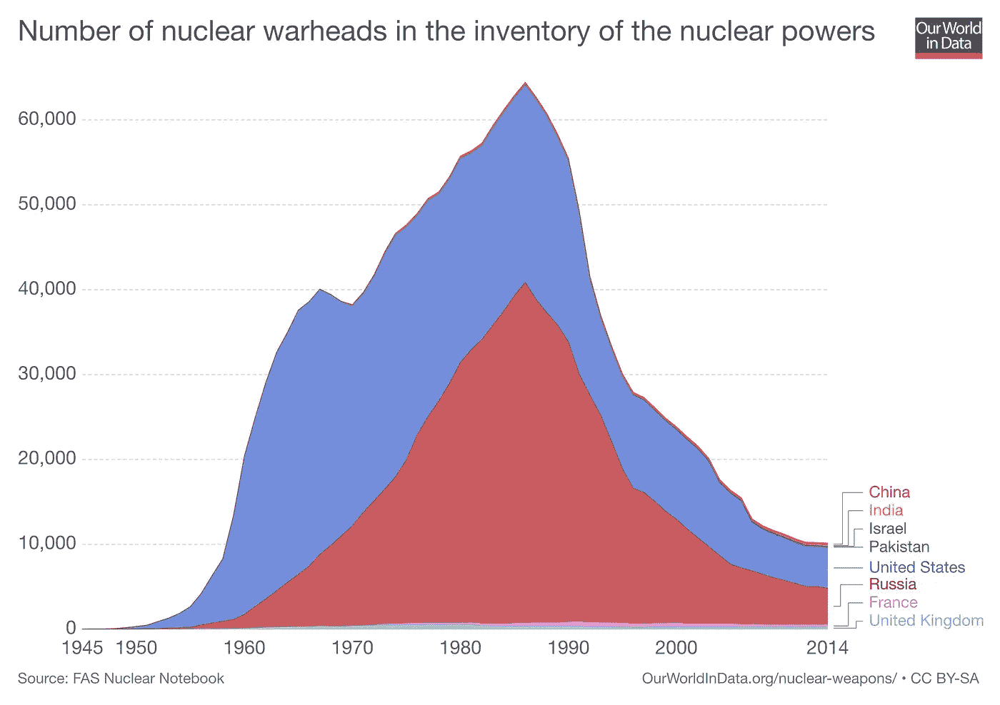
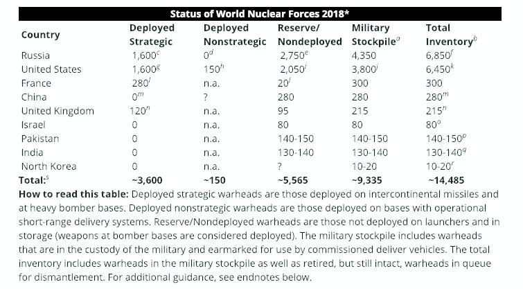
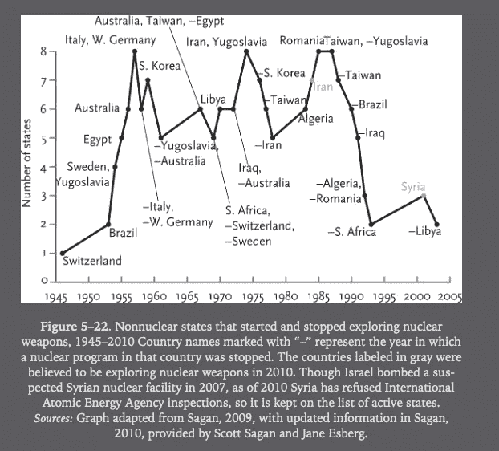
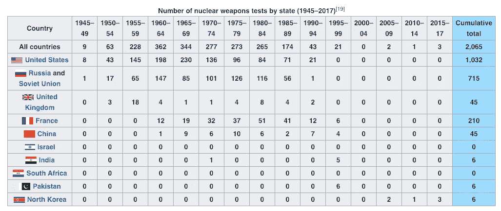
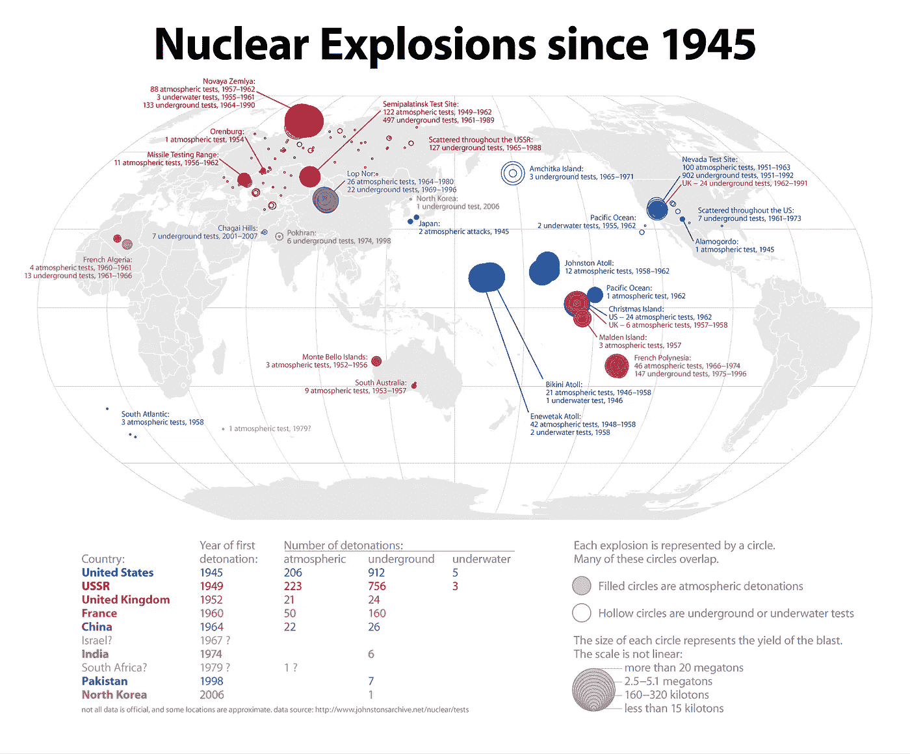
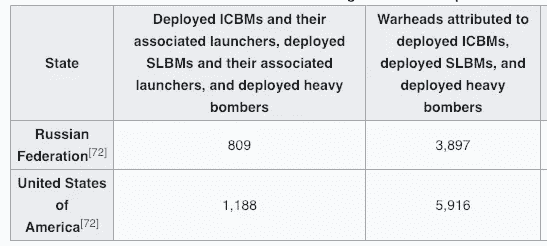
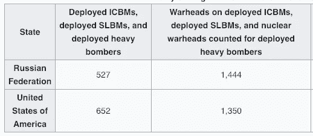
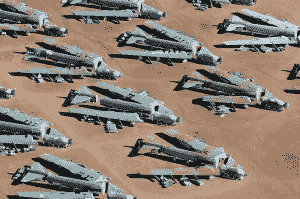
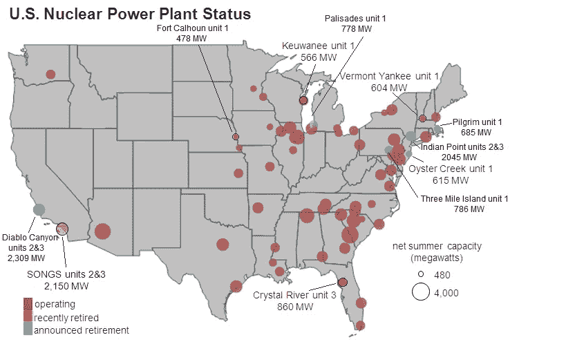

# 全球核武器的现实和俄罗斯核武器如何打开你的灯

> 原文：<https://towardsdatascience.com/the-reality-of-global-nuclear-weapons-and-how-russian-nukes-turned-on-your-lights-6d55e056b516?source=collection_archive---------6----------------------->

India’s Polar Satellite Launch Vehicle (not a nuclear weapon!) launches in 2018 ([Source](https://www.spaceflightinsider.com/organizations/isro/india-returns-pslv-service-launch-cartosat-2f/))

## 探索全球核储备下降的数据和你从未听说过的最有趣的政府项目:现实项目第 3 集

2018 年一个温暖的夏天，我正坐在哈奇纪念馆的草坪上，准备欣赏我最喜欢的交响乐——T2·霍尔斯特的《行星》——这时我看到了由[忧思科学家联盟](https://www.ucsusa.org/)搭建的帐篷。作为一个普遍关心科学现状的人，我走了过去，当我走近时，被一群人吸引住了，他们正围着一个男人讨论核武器的威胁。刚刚读完史蒂芬·平克的[*enlightning Now*，我希望听到更多关于过去 30 年来核武器库存大幅削减的积极消息。](https://www.theguardian.com/books/2018/feb/14/enlightenment-now-steven-pinker-review)

相反，这个人的演讲——正如平克告诉我们对学者的期待——完全是负面的。要点是，人类的愚蠢导致我们制造出能把我们这个物种从地球上抹去的武器，我们处于严重的危险之中。不知所措的是，当那个人停下来喘口气时，我举起手问他是否知道世界上有多少核武器，以及这与过去的数字相比如何。他自信地回答道:“现在比以往任何时候都多，尽管我不知道确切的数字。”

此时，在拥有别人没有的数据所带来的自信(和傲慢)的鼓舞下，我强调了我的事实优势的所有价值:“1985 年，世界上大约有 70，000 件核武器，而今天，在 2018 年，只有不到 15，000 件。这意味着减少了近 80%，此外，今天拥有核武器的国家减少了 4 个。”惊讶之余，这个人要求核实事实，在[咨询了一个可接受的来源](https://fas.org/issues/nuclear-weapons/status-world-nuclear-forces/)后，他承认乐观的数字是正确的。虽然我的本意并不是要方得这个人，但这是意料之外的效果，人群开始慢慢散去，人们对他的宣言的热情也消失了。

虽然我无意中失去了他的所有听众，但他同意与我进行讨论(在我为智力伏击道歉后)，我们进行了富有成效的辩论，双方都做出了让步:我同意零核武器是最佳选择(尽管目前不现实)，他说他将重新构建他的信息，以强调我们在削减核武器方面取得的进展。后来，当我坐在那里听霍尔斯特宏伟作品的[音时，我想到了这次经历教给我的东西:](https://www.youtube.com/watch?v=3OD_HzdZwKk)

1.  即使是专家对世界的看法也是严重错误的。
2.  在缺乏数据的情况下，人们会假设人性最坏的一面。
3.  当你纠正某人时，不要表现得高人一等。记住，在你阅读统计数据之前，你也是无知的。

在这篇文章中，我们将检查世界各地有关核武器的数据。上述基本数据是正确的——在过去 30 年里，核武器数量和拥有核武器的国家数量都大幅下降。然而，也有一些我们应该担心的问题，包括美国和俄罗斯之间的紧张关系，这威胁到军备控制条约和不稳定国家拥有核武器。除了这些数字，我们还将了解兆吨变兆瓦，[你可能从未听说过的最有趣的政府项目](https://www.armscontrol.org/act/2013_12/Looking-Back_The-US-Russian-Uranium-Deal-Results-and-Lessons)，在这个项目中，俄罗斯的炸弹真的打开了你的灯。

本文是现实项目[的第三集，旨在减少对数据世界的误解。你可以在这里找到](/announcing-the-reality-project-e16cc71abb64?source=tag_archive---------2---------------------)[以前的文章](/has-global-violence-declined-a-look-at-the-data-5af708f47fba?source=---------0---------------------)和所有的[文章，通过搜索现实项目标签](https://medium.com/tag/the-reality-project)。

# 事实

本文中我们的数据将来自于[我们数据中的世界:核武器](https://ourworldindata.org/nuclear-weapons)、[美国科学家联合会:世界核力量现状](https://fas.org/issues/nuclear-weapons/status-world-nuclear-forces/)以及*史蒂芬·平克的《我们本性中更好的天使*([引用了斯科特·萨根](https://scholar.google.com/citations?user=93TtAPAAAAAJ&hl=en))。我们还将利用来自军备控制协会和国务院的信息谈论核武器条约。关于[兆吨到兆瓦项目的信息来自军备控制协会。](https://www.armscontrol.org/act/2013_12/Looking-Back_The-US-Russian-Uranium-Deal-Results-and-Lessons)

核武库规模的确切数据是严格保密的，尽管如此，由于国际协议和监控项目，我们可以得到相当可靠的估计。从客观数据来看，我们清楚地看到全球核武器数量呈下降趋势。以下是一段时间以来全球核武器总数(来自《我们的世界》的数据):

Total number of nuclear weapons (deployed, stockpiled, and retired) over time.

全球核储备在 1985 年达到顶峰，此后一直在快速下降。**同样，确切的估计数字有所不同，但美国科学家联合会表示，截至 2018 年，数字从 70，300 增加到 14，485。这代表了核武器总量下降了近 80%!**

今天，有 9 个国家确认拥有核武器(由于技术/材料需求和国际监督，不太可能有更多的国家拥有核武器):

Countries with nuclear weapons and total numbers in 2018

俄罗斯目前拥有更多整体核武器，而美国拥有更多*部署*武器*。核武器的状态和类型与数量同样重要:*

*   部署在洲际弹道导弹或重型轰炸机上，可以瞬间发射
*   **库存**:存放在军队中，并“指定由委托交付的车辆使用”(可能会部署)
*   **退役**:退役，等待拆除。
*   **战略武器**:更大的武器——比如洲际弹道导弹——可以从千里之外的国家发射或者搭载在轰炸机上
*   **非战略(战术)武器**:较小当量，设计用于战场，可能在友军附近使用

军事用途(部署+储存)总数不到 10，000 件，约 1，800 件武器处于高度戒备状态。就所有类型的核武器而言，全球总量已大幅下降。例如，1986 年，俄罗斯拥有 4 万枚核武器，现在不到 7000 枚。美国从 1966 年的 31000 人下降到 2018 年的 7000 人以下。

另一个令人惊讶的消息是，现在拥有核武器的国家越来越少。4 个国家曾经拥有核武器，但现在不再拥有了:南非、白俄罗斯、哈萨克斯坦(拥有 1400 枚核武器)和乌克兰，后者自愿放弃了 5000 枚核武器，这是世界上第三大核武库。此外，许多曾经追求核武器的国家已经放弃了他们的核武器发展。

在下面的图表中，我们看到了各国开始和放弃发展核武器的时间。

Countries that started and then stopped nuclear weapon development (from Pinker with data from Sagan).

不仅拥有核武器的国家正在努力减少核武器数量，而且许多其他国家也认为发展核武器不是他们想做的事情。1990 年，世界上有 13 个国家拥有核武器，现在已经减少到 9 个。这当然是积极的，但三个拥有核武器的国家对此表示担忧。[印度和巴基斯坦已经打了 3 场战争，](https://en.wikipedia.org/wiki/India%E2%80%93Pakistan_relations)而朝鲜完全是个未知数。

核试验的减少甚至比核武器的减少更令人印象深刻。自 1996 年《全面禁止核试验条约》生效以来(该条约尚未生效，但被世界主要大国遵守)，美国和俄罗斯没有进行过一次核试验。此外，自 1999 年以来，只有一个国家，朝鲜，进行过核试验。

Nuclear Weapons Testing ([from Wikipedia](https://en.wikipedia.org/wiki/Historical_nuclear_weapons_stockpiles_and_nuclear_tests_by_country#cite_note-autogenerated11-19) which cites [this SIPRI document](https://www.sipri.org/sites/default/files/files/FS/SIPRIFS0912.pdf))

全世界核试验的累计总数超过 2000 次，但只有 6 次(0.3%)发生在 2000 年之后。我们可以在这张地图上看到这些测试发生在哪里:

Map of Global Nuclear Tests and Explosions [(from Radical Cartography)](http://www.radicalcartography.net/index.html?nuclear)

总之，今天世界上大约有 15，000 件核武器(其中 9，300 件用于军事用途)由 9 个国家持有。四个国家已经放弃了他们的武器，而至少十几个其他国家已经停止发展。自 1999 年以来，只有朝鲜进行过核试验，核试验数量已降至接近 0。最后，对 2020 年的预测表明，世界上总共将有大约 8000 枚核武器。

# 我们是怎么到这里的？武器削减条约

全球核武库规模的下降无疑是积极的，正如任何统计数据一样，理解为什么会出现这种情况是有帮助的，这样我们就可以弄清楚这种情况是否会持续，以及我们可以做些什么来保持这一趋势。

简而言之，核武器的减少是因为旨在减少武库的国际条约。我们没有足够的空间来讨论所有这些问题([查看这里的完整列表](https://www.nti.org/learn/treaties-and-regimes/treaties/))，但是我们将讨论美俄之间的一些问题。这两个国家总共控制了超过 90%的核武器，因此这些协议具有重大影响。

这里是美国和俄罗斯之间削减核武器条约的概述:

Overview of nuclear agreements between US and USSR/Russia [(Source)](https://www.armscontrol.org/print/2556)

从表中我们可以看出，并不是每次谈判都是成功的。然而，已经达成一致的条约是有效的。例如，罗纳德·里根在 20 世纪 80 年代提出的《第一阶段削减战略武器条约》(START I)实现了所有目标，俄罗斯和美国到 2001 年将各自的武器削减至 6000 件。

《第一阶段削减战略武器条约》于 2009 年到期，但在那时,《削减进攻性战略武器条约》已经生效，进一步限制了美国和俄罗斯的库存。令人乐观的是，该条约在参议院以 95 比 0 的投票结果获得通过，这表明双方至少可以同意，我们不需要毁灭的威胁像一把[毁灭之剑](https://www.thoughtco.com/what-is-the-sword-of-damocles-117738)一样悬在我们头上。目前限制核武器的条约，新的削减战略武器条约，于 2010 年获得批准，并于 2018 年完成削减。我们可以通过比较完成前(左)和完成后(右)的核弹头数量来检验该条约的效果:

Number of nuclear weapons in Russia and US before New START (left) and after (right).

根据最终数字(最右边一栏)，但是美国和俄罗斯部署的核弹头数量比条约要求的要少(1550 枚)！新的《削减战略武器条约》将于 2021 年正式到期，并可选择延长 5 年。美国现任总统对《新削减战略武器条约》表示不屑，但是没有迹象表明该条约会提前结束。(关于当前发展的讨论，[参见军备控制协会的本页](https://www.armscontrol.org/taxonomy/term/125)。在目前的政治气候下，[还不清楚未来会出台什么样的军备控制削减措施。鉴于此前努力的成功，进一步削减武器条约必须成为美国和俄罗斯的优先事项。](https://www.armscontrol.org/act/2019-01/news/after-inf-treaty-what-next)

这些条约的核查包括现场视察、信息交流、远程监测和包括卫星在内的监视。为了证明美国遵守了第一阶段削减战略武器条约，365 架 B-52 轰炸机被空运到亚利桑那州，被卸下有用的部件，然后被切成碎片。他们被排除在外 3 个月，让俄罗斯卫星确认销毁。

Destroyed B-52s as part of START I ([source](http://www.amarcexperience.com/ui/index.php?option=com_content&view=article&id=14&catid=9))

其他减少核战争威胁的措施都是在没有双边协议的情况下实现的，包括 1991 年老布什宣布，随着苏联解体，美国将从部署中移除几乎所有的非战略核武器(这些是 T2，也称为战术核武器，旨在用于战场)。按照计划，苏联以牙还牙，米哈伊尔·戈尔巴乔夫承诺从海军部署中撤出所有苏联战术核武器。仅这一项被正式称为[总统核倡议(PNI)](https://www.armscontrol.org/factsheets/pniglance) 的法案就将全球核武器总数减少了约 18000 枚。尽管俄罗斯和美国仍然拥有战略和非战略核武器，但总数处于历史最低点(关于这种情况是否会持续的讨论，[见这里](https://www.heritage.org/military-strength/assessment-us-military-power/us-nuclear-weapons-capability))。

# 兆吨变兆瓦:你从未听说过的最酷的政府项目

有时候，特别是当世界的命运悬而未决的时候，政府可以做一些惊人的事情。一个不太为人所知的案例是 [**【兆吨转兆瓦】计划**](https://www.centrusenergy.com/who-we-are/history/megatons-to-megawatts/) **，其中来自俄罗斯核武器的 500 吨高浓缩铀(HEU)被** [**转化为低浓缩铀(LEU)出售给美国公司，用作核电站的燃料。**](https://www.armscontrol.org/act/2013_12/Looking-Back_The-US-Russian-Uranium-Deal-Results-and-Lessons)

这个惊人计划的总体影响是，500 公吨 HEU——足以制造 20，000 枚核弹头——被转化为 14，000 吨低浓缩铀，用于为美国各地的核反应堆提供动力。(这项为期 20 年的计划对纳税人的成本是 0 美元，因为 120 亿美元的铀被美国浓缩公司买走了。)

在该计划的 18 年中(1995 年至 2013 年)，低浓缩铀燃料提供了美国核反应堆消耗的全部铀的大约 50%，这意味着美国几乎 10%的电力来自旧的俄罗斯核武器！如果你从核电站获得任何电力，那么你的灯实际上是由俄罗斯的核武器点亮的:

Nuclear power plants in the United States [(Source)](http://www.wikiwand.com/en/List_of_the_largest_nuclear_power_stations_in_the_United_States)

兆吨到兆瓦的总收益对两国来说都是巨大的。美国的核反应堆需要燃料，苏联解体后，俄罗斯需要现金。随着该计划在 2013 年成功结束，双方都得到了他们所需要的东西。从那时起，美国已经自愿[将其部分 HEU 转化为低浓缩铀](http://fissilematerials.org/library/2012/01/global_fissile_material_report_5.html)，这样它就不能被用于制造武器；2008 年[签署了一项协议，允许](https://www.armscontrol.org/act/2013_12/Looking-Back_The-US-Russian-Uranium-Deal-Results-and-Lessons)俄罗斯核工业在 2020 年前供应美国铀产品需求的 20%。

除了物质利益之外，兆吨转兆瓦项目的重要性在于，它表明各国能够克服分歧，特别是当这样做符合双方的经济利益时。这也证明了以前的敌人可以携手合作，和平解决争端。当我们思考如何在个人生活中和国际范围内解决问题时，我们应该明智地记住这个计划:妥协意味着双方都没有得到他们想要的一切，但每个人最终都会受益。

# 结论

在可预见的未来，核武器不会消失。虽然在一个完美的世界里没有核武器，但我们生活在现实中，而不是乌托邦。因此，作为一个短期现实主义者和长期乐观主义者，我赞赏我们取得的重大进展——大规模削减核武器数量——同时承认需要继续削减。

此外，虽然我很高兴有一些忧心忡忡的科学家，但我更希望他们在站在显要位置上发表意见之前，先把事实搞清楚。告诉人们这个世界比实际情况更糟糕不会导致行动，而是会导致幻想破灭和事情永远不会变好的信念。值得记住的是，进步从来都不是直接线性的，而是在人类历史的大部分时间里一直呈积极趋势，而且在过去几十年里[已经加速。正如核武器所证明的那样，事情既可能变得更糟，也可能变得更好，而国际努力确实在全球范围内发挥了作用。](https://en.wikipedia.org/wiki/Enlightenment_Now)

一如既往，我欢迎反馈和建设性的批评。可以在 Twitter [@koehrsen_will 上找到我。](http://twitter.com/@koehrsen_will)