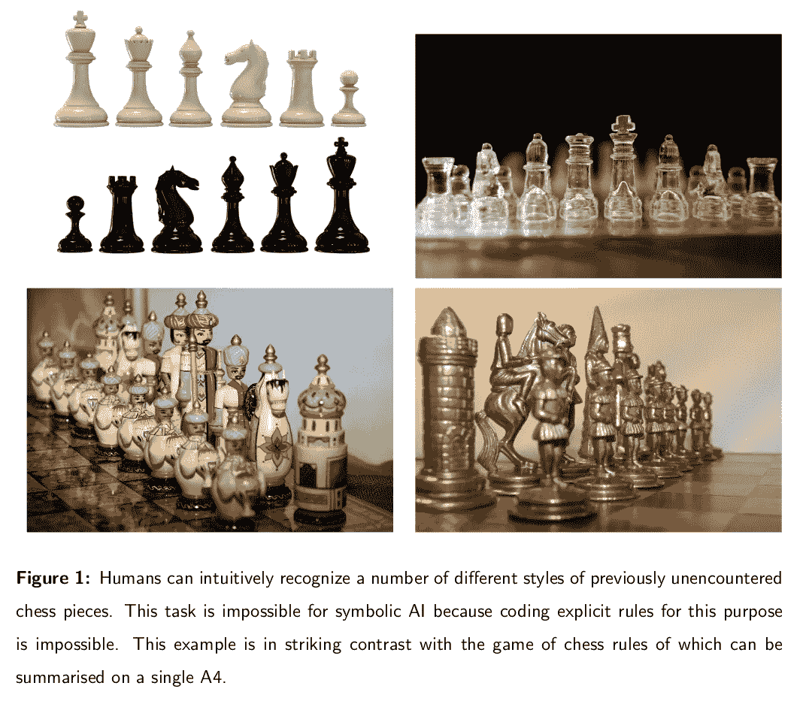
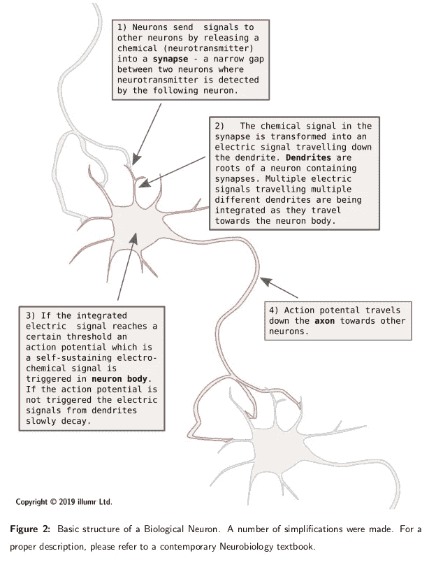
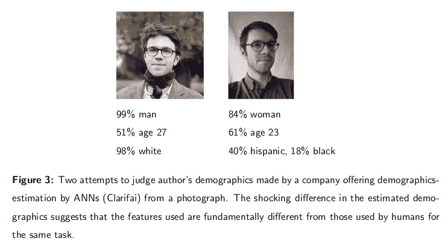

# 生物智能和人工智能的关系

> 原文：<https://towardsdatascience.com/the-relationship-between-biological-and-artificial-intelligence-aeaf5fb93e19?source=collection_archive---------6----------------------->

## [内部 AI](https://medium.com/towards-data-science/inside-ai/home)

智力可以被定义为一种主要的人类能力，它能完成通常对计算机和动物来说很难的任务。人工智能[AI]是一个试图用计算机完成这些任务的领域。人工智能正变得越来越普遍，关于它与生物智能关系的说法也是如此。通常，这些说法意味着某项技术成功的几率更高，基于这样的假设:模仿生物智能机制的人工智能系统应该更成功。

在这篇文章中，我将讨论人工智能和我们对生物学中智能机制的了解程度之间的异同，特别是在人类内部。我还将探索人工智能系统中的仿生有助于其进步这一假设的有效性，我将认为人工神经网络处理任务的方式与生物系统的现有相似性是由于设计决策，而不是潜在机制的内在相似性。这篇文章的目标读者是那些理解人工智能(尤其是人工神经网络)基础知识的人，他们希望能够更好地评估关于人工智能中仿生价值的经常是疯狂的主张。

# 从符号人工智能到机器学习

直到 90 年代初，符号人工智能一直是人工智能的主流方法。它依赖人类程序员编写复杂的规则，使机器能够完成复杂的任务。这种方法在解决许多对智能至关重要的任务方面的持续失败，与机器学习形成了很好的对比——机器学习是人工智能的替代方法，对当前人工智能机器的出现至关重要。

1994 年，国际象棋冠军加里·卡斯帕罗夫被“深蓝”击败。这对当时的 IBM 来说是一个巨大的成功，对人工智能来说也是如此。然而，深蓝虽然能够下世界级的象棋，却不能移动棋子——这项任务需要一个人类助手。我们将通过研究决定棋步和物理移动棋子任务之间的区别，开始探索人工智能和生物智能之间的关系。

虽然国际象棋通常被认为是一种困难的游戏，但它的规则实际上非常简单，可以很容易地放在一张 A4 纸上。“深蓝”被编程为根据这些规则计算许多可能的前进方向。在这些步骤中，深蓝选择了最有利的一步。直到 1994 年计算机才击败人类国际象棋冠军的原因是计算能力的限制。虽然国际象棋的规则很简单，但有很多可能的走法——探索其中的一小部分都需要大量的计算。(深蓝的成功实际上在很大程度上也是由于决定避免探索游戏的哪些方面。不过，这个事实与目前的争论没有任何关系。)在深蓝出现之前，计算机无法在现实时间框架内进行如此多的计算，但如今深蓝的计算能力大致相当于一部普通智能手机。因为规则非常简单，任何具有基本编程技能的人都可以编写一个国际象棋程序，只要有足够的计算能力，通过应用这些规则就可以打败世界象棋冠军。这种方法被称为符号人工智能，因为计算机通过遵循预定义的规则(通常称为符号计算)来达成解决方案。

不幸的是，并不是所有的问题都适合用这种方式解决。移动棋子就是一个很好的例子——我鼓励你停下来看一会儿，想想你需要应用什么规则来选择和移动棋子。你必须从头开始，并识别该作品当前的位置——这是图像识别系统的标准任务，目前图像识别系统正获得如此多的关注。棋子是什么样子的？你能定义规则，让计算机在任何光线条件下从任何角度识别棋子吗？形状新颖、人类可以立即识别的作品怎么样？考虑图 1 中的各种棋子。做出这些定义的困难是符号人工智能最终未能转化为图像识别等“简单”任务的原因，尽管它在国际象棋等“困难”任务中取得了巨大成功。同时，符号人工智能的硬编码规则与生物智能的模糊本质没有任何相似之处。基于机器学习的方法比基于符号人工智能的方法更类似于人类智能，但这真的是其巨大成功背后的驱动力吗？

顾名思义，机器学习是人工智能的一个分支，在这个分支中，机器学习自己解决问题，而不是给定一套如何解决任务的明确规则。这通常是通过在任务中反复尝试来学习新的规则，以及每次成功程度的反馈来实现的。这是人工智能和生物智能当前进展之间的第一个基本相似之处。我们生来就没有识别周围物体的能力，也没有(在很大程度上)被告知允许我们识别这些物体的规则。相反，我们看到了大量有时被贴上标签的物体(想想父母给孩子指出的物体)，并从经验中学习。

从表面上看，机器学习的工作方式非常相似。电脑会看到数百万张各种物体的图片，直到它们逐渐学会什么是狗、帽子、猫等等。看起来像。尽管这种相似性可能看起来微不足道和肤浅，但它是目前推动人工智能成功的最重要的原则。虽然人工智能和生物智能之间的相似性要深得多，但重要的差异仍然存在。允许计算机学习这些强大规则的机器——人工神经网络(ann)——直接受到生物大脑中神经网络的启发。在本文的其余部分，我们将研究这种相似性与这种技术的能力有多相关，以及这些相似性到底有多深。

# 神经元

人工神经网络完成的任务在某种程度上类似于生物智能完成的任务，这两类智能系统的构件也是如此。(出于参考目的，图 2 中提供了生物神经元的基本描述。)人工神经元和生物神经元之间的相似性和差异已经被用来论证人工复制生物智能的方法的有效性。然而，这种观点被大大简化了。在这一节中，我将批判性地逐一评估其中一些主张；然而，我将论证的基本结论是，人工神经元和生物神经元之间的相似性不是人工智能有效性的有效推理路线。

简而言之，这两种类型的神经元整合来自多个其他神经元的信号，用非线性函数对其进行转换，并将其输出到其他神经元。

许多人正确地指出，生物神经元使用离散信号进行操作，而人工神经元传递连续的数值。事实上，动作电位是二进制的——在开和关之间没有任何分级。然而，单个动作电位尖峰通常不会显著影响生物神经元。相反，峰值速率(频率)似乎很重要。频率本身是一个连续的值，与人工神经元传递的信息没有本质区别。因此，这种差异的有效性受到质疑。

两种类型的神经元所应用的非线性类型的相似性也有待商榷。的确，生物神经元的二元激活函数(阶跃函数)很难被传统上用于 ann 的 s 形非线性所复制。然而，如果我们认为人工神经元输出的值类似于生物神经元的放电频率，那么我们必须比较一段时间放电产生的功能。模糊阶跃函数的多次迭代的叠加很好地用 s 形非线性来表示，这表明在激活函数中实际上可能存在某种程度的相似性。

不久前，通过引入一种新的激活函数，人工神经网络的性能有了很大的提高。整流线性函数，也称为 ReLU [7]，由于其优雅的数学属性，有助于神经元在以前不可能的情况下学习。这一发现的作者还称赞了 ReLU 的生物学合理性。那场争论背后的逻辑我一直不清楚。虽然我确实同意，从表面上看，s 形激活函数并不遵循生物神经元的激活函数，但 ReLU 甚至没有停留在生物学上似乎合理的范围内。相反，它永远不会饱和——这意味着更多的输入总是意味着更多的输出，没有任何限制。生物神经元对它们可以发射多少有一个天然的上限——当发射过多时，它们会疲劳甚至死亡。

长期以来，人们认为神经元执行单一的信号处理操作；然而，最近神经科学家揭示，信号的整合和简单逻辑处理实际上在单个神经元内发生多次。发现该处理已经发生在树突上——在来自许多树突的信号合并之前——而不是仅限于细胞体(参见图 2) [17]。这一发现使得神经元进行的计算比几年前认为的要复杂几个数量级。然而，计算并没有不同，只是在一个神经元内执行多次。因此，在以前使用单个人工神经元的地方使用多个人工神经元应该可以解决这个问题。

人们还发现，神经元对刺激的时间模式很敏感，这与莫尔斯电码有点类似，莫尔斯电码将信息编码为时间上的二进制信号。虽然人工神经元不具有任何这种能力，但是任何 n 位时间模式都可以由跨越 n 个神经元的静态模式来等同地表示。因此，复制这一发现只会增加所需人工神经元的数量，而不会增加它们各自的复杂性。

虽然大量强调人工神经元和生物神经元之间差异的论点经不起推敲，但生物神经元的许多方面肯定不会被人工神经元复制到任何程度。当放电时间过长时，生物神经元会疲劳甚至死亡，它们的功能受激素调节，它们循环神经递质，并且它们受盐和钾浓度等的影响。其复杂性令人震惊，我们还远未理解生物神经元是如何工作的。

事实上，只有一小部分计算是由神经元完成的。几十年来，大约占大脑四分之三的神经胶质细胞被认为只是为大脑中的神经元提供支持功能。然而，人们发现它们以一种以前只有神经元才知道的方式接收、处理和分发信号[10]。到目前为止，由神经胶质细胞执行的计算的含义还远未被理解。

此外，丹尼斯·布雷(Dennis Bray)等生物学家长期以来一直认为，计算不是大脑独有的，而是在生物体内无处不在，蛋白质合成和其他细胞过程不能否认计算的地位。然而，这些过程仅限于细胞内，并不能真正直接影响有机体的行为(尽管对其功能至关重要)，因此这对我们理解智力应该没有什么影响。然而，这一观点正受到当前研究的挑战。

去年，一系列发现在科学界引起了轰动，当时发现果蝇细胞可以合成类似病毒的蛋白质，并用它们与其他细胞交流[15]。虽然还不清楚人类是否存在类似的现象，而且这种通信的速度可能非常低，但这是细胞内计算的一个例子，而不是神经元在有机体之间进行通信。这是我们过去认为神经元，或者后来认为大脑的特殊之处。鉴于生物体内计算和交流的巨大复杂性，指望神经元能为我们带来技术进步，以任何程度的准确性对其建模似乎都是徒劳的。

在可预见的未来，人工神经元仍将是一种非常不准确的生物神经元模型，而生物神经元只是用于执行生物智能所需的计算和通信的机器的一部分。这是否意味着人工神经网络实现的人工智能原则上不能实现类似于生物智能的能力？

在结构上，人工神经元是生物神经元的一个极其有限的模型。然而，更详细的神经元模型(如 Numenta)或通过离散尖峰信号进行通信的神经网络(如 SpiNNaker)却未能给 AI 带来任何优势。因此，对人工智能来说，神经元之间的结构相似性可能没有神经元的功能那么重要。事实上，作为执行基本逻辑处理的基本单位，这两种类型的神经元可以被视为非常相似。

我一直把神经网络理解为通用函数逼近器，不管它们是生物的还是人工的(除了逼近器它们还能是什么！).函数逼近器的精确结构不会影响其计算能力，只要它足够通用以逼近期望的函数，并且可以在有限时间内训练。给定足够数量的神经元，人工神经网络可以逼近任何函数[11]。因此，没有理由说它们不能近似生物神经元所执行的功能。这同样适用于任何其他通用函数逼近器，例如不希望与生物神经元有任何相似性的多项式。人工神经网络在人工智能领域比多项式获得更多关注的原因是它们相对容易训练，然而这种情况可能不会持续很久，因为新的研究表明多项式可以在许多 ML 基准问题上击败人工神经网络[19]。带来多项式进步的变化不是它们的结构或计算能力的变化，而是训练它们执行所需功能的新方法。总之，从理论上讲，人工神经网络有可能在基本构件没有相似性的情况下逼近生物功能。剩下的问题是我们能否训练人工神经网络来执行我们感兴趣的功能。

# 网络和学习

到目前为止，我们只讨论了单个神经元的基本特性。然而，神经元组成网络和训练的方式在历史上对其性能的影响比单个单元的结构更大。

第一个实用的人工神经网络是由弗兰克·罗森布拉特在 20 世纪 50 年代提出的，叫做感知器。它不包括任何隐藏层，因此是非常有限的。然而，其并行特性使其能够轻松学习简单的逻辑——对并行输入执行逻辑比串行输入容易得多，因为不需要存储器来存储中间值。深层还没有出现，主要是因为没有人知道如何训练它们。Minsky 和 Pappert 在 1969 年证明了这种基本的人工神经网络体系结构永远不能解决线性不可分的问题(例如，执行像异或这样的逻辑运算),并得出结论，它们永远不能解决任何实际上感兴趣的问题。在他们的书中，他们错误地认为这个问题是所有人工神经网络的通病，这导致了对人工神经网络的兴趣/资助的大幅下降，基本上停止了该领域近二十年的研究。

直到 20 世纪 80 年代才抢救出安的遗物。一个国际研究小组(David Rumelhart、Jeff Hinton 等人)提出了一种训练深度神经网络的方法，称为反向传播。这立即否定了明斯基和帕佩特的猜想，并开始了对人工神经网络的大规模研究。值得注意的是，反向传播可能是人工神经网络中最被广泛批评为生物学上不可信的方面。

反向传播依靠通过深层人工神经网络反向传播误差来校正/训练深层。反向传播算法起源于自动微分，这是牛顿在本质上没有理解智能背后的生物学的时候开发的一种方法。因此，声称生物灵感是它的起源是愚蠢的。

对反向传播的生物学合理性的主要批评集中在向后反馈信号的要求上，已知生物神经元无法做到这一点(这并不完全正确，因为已经报道了一些向后信号的边缘情况)。然而，神经科学家很早就知道，神经元并不是均匀的同质物质，而是在具有反馈连接的结构化集合中重复出现[2]。因此，完全有可能的是，至少在某些大脑区域，神经元成对存在，其中一个向前反馈，而另一个向后反馈，使得反向传播在神经组件中完全可能。这就是说，到目前为止，还没有令人信服的证据证明错误在大脑中的反向传播——如果这是生物神经网络的一个突出特征，我们应该希望这相对容易观察到。

反向传播是深度神经网络的必要进步，因为深度是给 ann 带来的最强大的概念之一。深度允许问题的层次化表示，即先解决较小的问题(例如检测边缘)，然后再处理较大的问题(例如从边缘集合中识别对象)。等级自然也是大脑信息处理的一个显著特征[16]，在生物和人工智能之间提供了一个优雅的排列。

人工神经网络功能的另一大改进是引入卷积作为主要成分之一[13]。卷积本质上意味着在数据中移动过滤器以识别特征。这给人工神经网络的训练带来了很大的优势，因为它大大减少了需要调整的自由参数的数量。有趣的是，有充分的证据表明，类似的原理正在大脑中应用[6]，这也许是让大脑非常有效地处理视觉刺激的关键现象之一。

到目前为止，我们已经看到，对反向传播的生物学不可行性的批评是站不住脚的(尽管到目前为止还没有发现生物神经网络中反向传播的证据)，卷积似乎在生物学上有充分的依据。然而，当代人工神经网络的最后一个方面并不遵循这一推理路线。通过单位矩阵[12]初始化权重是一种有助于训练更深层次网络的技术。它之所以有效，是因为最初深层只是原封不动地传递它们的输入——这是一个比从随机的复杂变换中学习更好的起点。正如你可能预料的那样，这并不适合与大脑进行任何有意义的比较，说明生物学虽然是人工智能架构的有用灵感，但迄今为止并不是人工智能进步的唯一手段。

总之，推动人工神经网络目前成功的主要进步集中在如何训练人工神经网络，而不是它们到底是什么。这些进步主要是务实的工程选择和一些可疑的生物灵感的混合，这也是一个很好的工程选择。

# 智力

到目前为止，人工神经网络与生物神经网络的机制的比较还没有简单的结论。在这里，我将尝试比较人工和生物神经网络产生的智能(高级功能)。为了获得人工神经网络和生物智能之间更深层次关系的真正结论性证据，从一个我们没有明确设计的系统中看到类似生物的行为将是有用的。使用简单神经网络的涌现特性来解释鲜为人知的大脑特性，如大脑区域之间的特殊功能划分，是我自己第一次进入学术研究的议程。

研究人工神经网络的早期动机是它们在某些方面的表现与人类行为的相似性，尽管它们还没有强大到足以解决实际任务。大卫·鲁梅尔哈特和杰伊·麦克莱兰利用这些相似之处，在心理学领域启动了一个完整的研究项目。他们证明，当阅读部分模糊的单词时，人工神经网络和人类以惊人相似的方式推断模糊的部分[14]。后来，Matt Lambon-Ralph 证明了当接触到一种新的语言时，ann 能够以类似于人类儿童的方式学习单词。还有许多其他例子证明了非常简单的人工神经网络和人类行为之间的相似性。

简单人工神经网络和人类的表现之间的相似性并不令人印象深刻，因为这些特定的网络无法解决玩具任务之外的任何问题，因此与人类智能的建模相去甚远。然而，最近，人工神经网络获得了执行一些基本现实任务的能力。对这些的研究表明，当处理相同的视觉刺激时，深度卷积神经网络和人脑的内部状态有相似之处[9]。具体来说，已经证明了两个系统中的表示都是基于分层模式识别的。

然而，这些结果不应该让任何人感到惊讶。神经科学家早就知道，大脑中的视觉处理类似于分层模式识别。Guclu 和 Gerven 的 ann 只是分级模式识别系统的数学规范。因此，这种相似性反映了一种设计决策，而不是一种突现的特性，并且很难用来论证人工神经网络和生物智能之间更深层次的相似性。事实上，大部分涌现的特性为人工神经网络和生物智能之间的功能相似性提供了令人信服的论据。

长期以来，人们一直认为，训练当代人工神经网络所需的数据量与动物能够从很少的观察中学习明显不同。2017 年，谷歌 Deep Mind 在《自然》杂志上发表了一篇论文，吹嘘他们成功地在短短 36 小时内训练了一个名为 AlphaGoZero 的网络，不仅击败了任何人类围棋选手，还击败了 alpha Go——之前最强的围棋选手[18]。然而，对前述《自然》杂志论文的深入研究显示，在这 36 个小时里，AlphaGoZero 玩了 490 万个游戏。这大致相当于以人类的速度不停地走了 559 年，进一步强调了人工神经网络的数据需求与人类学习相同任务的距离有多远。

Dubey 和他的同事在 2018 年很好地证明了类似的问题[3]。与人类相比，人工神经网络需要更长时间的训练来学习玩《蒙特祖马的复仇》(一款老式电子游戏)的基础知识。在混合了游戏中的纹理(例如，天空有地面纹理)后，这个游戏对人类来说不再有意义，而人工神经网络在大约与原始游戏相同的时间内学会了改变的游戏。这个发现暗示了人工神经网络和人类处理新情况的方式之间的显著差异。人类将他们过去的知识应用到新的情况中——例如，他们可能试图爬上游戏中呈现的梯子，尽管与现实世界的梯子存在巨大的视觉差异。然而，这使得人类很难理解看起来像地面的天空。首先，人工神经网络需要更长的时间来学习游戏，因为它们无法应用在不同背景下获得的知识(例如，现实生活)，并且当学习新东西时，它们也不受先前假设的约束。如何让人工神经网络应用在不同背景下收集的知识，还远未明朗。在旨在使人工神经网络能够执行这些任务的迁移学习领域已经取得了一些进展，然而，即使是最先进的系统也深深地局限于特定的任务/环境。

这个问题——缺乏进行传递性推理的能力——在我看来是人工智能进步的最大障碍。Hector Levesque 在他的名为《常识、图灵测试和对真正人工智能的探索》的书中简明扼要地总结了这个问题，他提出了一个问题:鳄鱼在障碍赛中表现如何？虽然找到一个答案对你来说似乎微不足道，但它需要迄今为止在任何人工神经网络中从未见过的传递性推理的数量，除了那些专门为此目的制作的人工神经网络——它们无法以合理的标准执行其他功能。

即使人工神经网络能够进行传递性推理，它们的先验知识仍然会与我们的有根本的不同，很可能导致完全不同的行为。这是基于这样一个事实，即人工神经网络使用的训练集与动物可用的训练集如此不同。Linda B. Smith 一直在带头收集幼儿的头部摄像机镜头[1],这与 ML 对象识别数据集相去甚远。最普遍的物体是脸，和一些抽象的图像，比如在天空下画的墙角或树枝；这与用于训练人工神经网络的互联网图像的一般横截面有着明显的不同。我看到了在这个镜头上训练的人工神经网络的巨大潜力，它的表现方式比以前的任何模型都更接近人类。

传递性推理可能只是一个我们还没有实现的功能。然而，有充分的理由相信，即使是目前人工神经网络在特定任务中的成功，也是以与人类非常不同的方式实现的。考虑我通过 Clarifai 公司提供的人口统计估计产品，从一幅图像中估计我自己的人口统计数据的两次尝试(如图 3 所示)。第一次尝试相当准确，结论是照片 99%可能是男性，51%可能是 27 岁，98%可能是白人“多元文化外表”。第二次尝试的结果是 84%可能是女性，61%可能是 23 岁(感谢 Clarifai！)和 40%可能是西班牙裔“多元文化外表”。我还被认为有 18%的可能是黑人或非裔美国人。

我想在这里提出的论点并不是 Clarifai 的人口统计估计产品不好(我让读者来判断)，而是它估计人口统计的原则必须与人类完成任务的方式有根本的不同。当然，人们估计人口统计的能力各不相同；然而，如果有人像 Clarifai 一样估计第一张照片中的人口统计数据，那么他们在第二张照片中似乎不太可能如此悲惨地失败。

人工神经网络和人类之间用于视觉对象识别的特征的明显差异可能最好由对立的例子来说明[8]。这些例子是对原始图像的微小扰动，诱使人工神经网络将一个物体识别为与扰动前完全不同的东西。对立的例子骗不了人类，因为我们甚至无法察觉这种干扰。事实证明反过来也是一样的。人工神经网络不会被人类的视错觉欺骗[20]。

人工神经网络显示的智能可以非常类似于人类的智能，只要人工神经网络为此目的被成功训练。例如，经过训练来识别图像的人工神经网络将擅长这项任务，就像生物智能一样，但它几乎不会复制我们完成这项任务的方式，因为这不是训练的目标。因此，人工神经网络在接受训练的任务中的表现，绝不会暗示智力基础上的相似性，而是暗示在工程任务中的成功。此外，人工神经网络需要比人类多几个数量级的数据来学习，目前还没有已知的方法来让它们成功地进行传递性推理——这是一项我们几乎一直在进行的任务，对我们有很大的好处。

# 结论

这篇文章从多个角度比较了人工智能和生物智能。我提出了一个观点，即没有理由期望两个不同的通用函数近似器具有不同的计算特性——人工神经元和生物神经元无疑都是如此。因此，我们有充分的理由不用担心生物和人工神经元之间的巨大结构差异对从这种机制中产生的智能行为的影响。似乎更重要的是如何学习所需的功能。在这方面，人工智能和生物智能之间鲜有相似之处，除了两者都能够成功地学习我们感兴趣的许多任务。这两种类型的智能之间缺乏相似之处，这突出表现在人工神经网络被明确训练来模仿生物智能的任何任务的表现上的巨大差异。

关于人工神经网络机制缺乏生物学合理性的广泛传播的批评中，很大一部分似乎源于缺乏最新的神经生物学知识。然而，即使排除了不成立的论点，这两种类型神经元之间的差异仍然非常显著，特别是当我们考虑当代神经生物学揭示的令人困惑的复杂性时。与常识中的描述相反，神经元并不是唯一能够进行计算和交流的细胞，这一事实加剧了这种差异。这种能力可能会扩散到神经系统或大脑之外，而且大部分是未知的。此外，目前科学界甚至对神经元的特性也知之甚少。因此，专注于生物神经元表征的真实性似乎相当幼稚。

当我们观察单个神经元之外的人工神经网络结构时，这个故事变得稍微复杂了一些。推动当前 ML 革命的一些技术进步显然在生物学上是不可信的(单位矩阵权重初始化等。)，同时也是人工神经网络取得当前绩效的关键。另一方面，一些生物学上有充分基础的思想的实现，如层次模式识别，已经对人工神经网络的性能做出了重要和积极的贡献。

在上一节中，我讨论了人工神经网络和动物智能之间的功能差异。有一项长期的研究工作证明了平凡的人工神经网络和人类之间类似的表现模式。然而，目前还不清楚玩具模型在玩具任务上的表现能告诉我们什么是真正的智力。

最近，人们一直在努力找出能够实际解决现实世界任务的人工神经网络和人脑之间的共同模式。在我看来，这些发现到目前为止还没有发现任何相似的模式，这些模式不是在人工神经网络构建过程中做出的简单设计决策。相反，有大量证据表明，这两种类型的智力是根本不同的。学习所需的数据量相差几个数量级，并且没有能力使用先前的知识或执行传递性推理。最后，用来完成任务的特性是完全不同的。

我想用一种不那么糟糕的语气来结束这篇文章。尽管人工神经网络和生物智能在结构和功能上有很大的不同，但有必要记住一些基本原则(平行、层次、非线性等)。)在人工神经网络中的应用导致了他们惊人的成功，而且可能会有更多的成功。

# 承认

我感谢凯特·威尔金森对这篇文章的大量编辑和校对。没有她的帮助，阅读这篇文章将是一种折磨。克里斯詹·卡尔姆博士对这篇文章的评论对文章的科学完整性至关重要；然而，并非本文表达的所有观点都反映了 Kristjan 自己的观点。最后，我要感谢 illumr Ltd，特别是其创始人兼首席执行官杰森·李，赞助这项工作。

# 参考

[1]斯文·班巴赫、大卫·克兰德尔、琳达·史密斯和陈郁。幼儿启发的视觉对象学习。《神经信息处理系统进展》，第 1209-1218 页，2018 年。安德烈·M·巴斯托斯、W·马丁·乌斯利、里克·A·亚当斯、乔治·R·曼贡、帕斯卡尔·弗里斯和卡尔·J·弗里斯顿。预测编码的标准微电路。神经元，76(4):695–711，2012。
[3]拉奇特·杜贝、普尔基特·阿格拉瓦尔、迪帕克·帕沙克、托马斯·格里菲斯和阿列克谢·埃夫罗斯。调查人类玩电子游戏的前科。arXiv 预印本 arXiv:1802.10217，2018。
[4]安德鲁·W·埃利斯，兰邦·拉尔夫，还有一个马修。成人词汇加工中的年龄习得效应反映了成熟系统中可塑性的丧失:来自联结主义网络的见解。实验心理学杂志:学习、记忆和认知，26(5):1103，2000。
[5]埃伯哈德 E 费茨。神经群体中的时间编码？科学，278(5345):1901–1902，1997。
[6] VD Glezer，VA Ivanoff，和 TA Tscherbach。猫视皮层复杂和超复杂感受野作为空间频率滤波器的研究。视觉研究，13(10):1875-1973 年 6 月。
【7】泽维尔·格洛特，安托万·博德斯，约舒阿·本吉奥。深度稀疏整流器神经网络。《第十四届人工智能与统计国际会议论文集》，315–323 页，2011 年。
[8]伊恩·古德费勒、让·普盖-阿巴迪、迈赫迪·米尔扎、徐炳、戴维·沃德-法利、谢尔吉尔·奥泽尔、亚伦·库维尔和约舒阿·本吉奥。生成对抗网络。《神经信息处理系统进展》,第 2672-2680 页，2014 年。
[9]Umut Gülü和 Marcel AJ van Gerven。深度神经网络揭示了跨腹侧流的神经表示的复杂性的梯度。神经科学杂志，35(27):10005–10014，2015。
【10】菲利普·克海顿。胶质细胞:听和对突触说话。自然评论神经科学，2(3):185，2001。
[11]库尔特·霍尼克、麦克斯韦·斯廷奇科姆和哈尔伯特·怀特。多层前馈网络是通用逼近器。神经网络，2(5):359–366，1989。
[12]阔克·V·勒、纳夫迪普·贾伊特利和杰弗里·E·辛顿。一种初始化整流线性单元递归网络的简单方法。arXiv 预印本 arXiv:1504.00941，2015。
【13】Yann le Cun，Yoshua Bengio 等，《图像、语音和时间序列的卷积网络》。大脑理论和神经网络手册，3361(10):1995，1995。
[14]詹姆斯·麦克莱兰和戴维·鲁梅尔哈特。字母知觉中语境效应的互动激活模型:I .对基本发现的说明。心理评论，88(5):375，1981。
【15】Elissa D Pastuzyn，Cameron E Day，Rachel B Kearns，Madeleine Kyrke-Smith，Andrew V .塔伊比，约翰·麦考密克，Nathan Yoder，David M Belnap，Simon Erlendsson，Dustin R Morado 等。神经元基因 arc 编码一种调节细胞间 rna 转移的再利用反转座子 gag 蛋白。单元格，172(1):275–288，2018。
[16]马克西米利安·里森胡贝尔和托马索·波吉奥。皮层中物体识别的层次模型。自然神经科学，2(11):1019，1999。
[17]希拉·萨尔迪、罗尼·瓦尔迪、安东·谢宁、阿米尔·金牙尔和伊多·坎特。新类型的实验揭示了一个神经元作为多个独立的阈值单元起作用。科学报告，7(1):18036，2017。
【18】David Silver、Julian Schrittwieser、、Ioannis Antonoglou、Aja Huang、Arthur Guez、Thomas Hubert、Lucas Baker、Matthew Lai、Adrian Bolton 等人《在没有人类知识的情况下掌握围棋游戏》。自然，550(7676):354，2017。
[19]唐纳德·F·施派特。通用回归神经网络。IEEE 神经网络汇刊，2(6):568–576，1991。
【20】罗伯特马克斯威廉姆斯和罗曼 V 扬波尔斯基。视错觉图像数据集。arXiv 预印本 arXiv:1810.00415，2018。