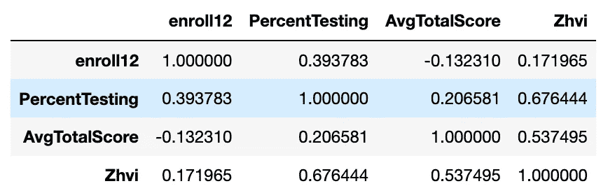
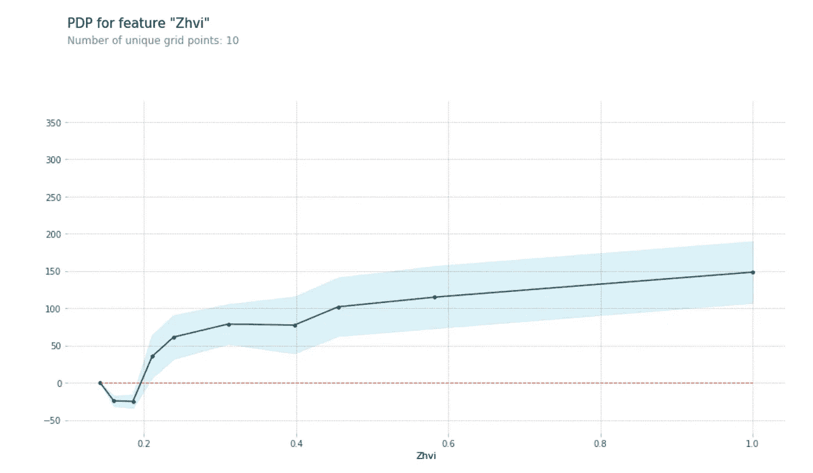
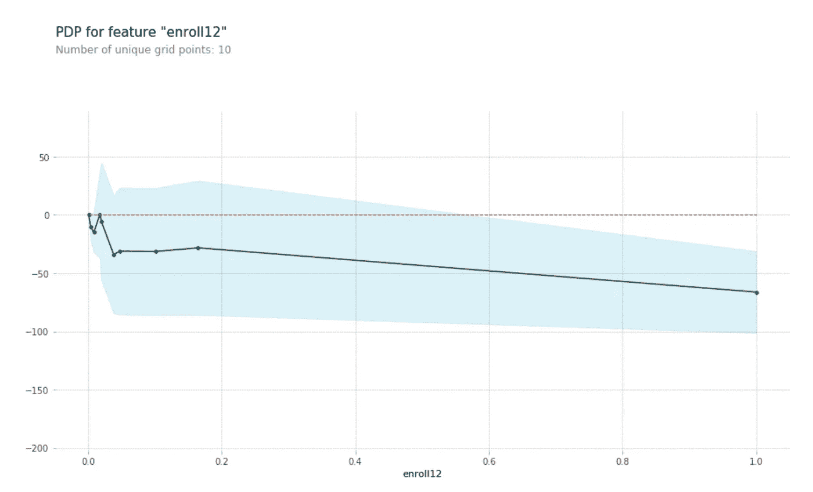

# 财富和教育之间的关系

> 原文：<https://towardsdatascience.com/the-relationship-between-financial-resource-and-education-a94afc644f4?source=collection_archive---------27----------------------->

## 看看财政资源可能在多大程度上影响加州的标准化考试成绩。

Photo by [Robert Bye](https://unsplash.com/@robertbye?utm_source=medium&utm_medium=referral) on [Unsplash](https://unsplash.com?utm_source=medium&utm_medium=referral)

在读了一篇由*Jorge Castaón*撰写的关于[解读大学录取](/analyze-college-education-admissions-967cccc12115)的文章后，我决定看看财政资源尤其是如何影响加州的标准化考试成绩。我最初的假设是，来自更富裕社区的学生可能在标准化测试中表现更好，然而，我真的很好奇，想知道是否有任何公开的数据支持这一假设，或者它是否会揭示完全不同的东西。如果说数据科学教会了我什么的话，那就是我最初对事物如何工作的看似可能的假设实际上有时是错误的，所以我开始寻找一些答案。

**数据**

由于我无法获得每个人的资产净值，我认为另一个衡量财务资源的好方法是住房。住在百万美元房子里的人通常比住在十万美元房子里的人富裕得多。我从 Zillow Research 获得了房屋价值数据，这些数据在这里[可供公众使用](https://www.zillow.com/research/data/)。

虽然肯定不是衡量智力的最佳标准，但像 SAT 这样的标准化考试确实提供了一个很好的衡量教育的综合标准。我从 Data World 获得了加州 SAT 数据，这里[也有公开消费](https://data.world/education/california-sat-report-2015-2016)。

有了这两个数据集，我觉得我有足够的信心来揭示加州财政资源和教育之间的关系。

**方法**

我要做的第一件事是清理和转换数据，使其更有用。这是数据科学项目中非常常见的一步，因为对于您的特定用例来说，数据几乎永远不会处于最理想的状态。这通常也使得在某一列上合并两个数据集变得更加容易，然后我按县进行了合并。组合数据集包含各县、12 年级注册学生人数(注册 12)、实际参加测试的学生百分比(PercentTesting)、zillow 家庭价值指数(ZHVI)和平均总分(ATS ),所有数据均按县汇总。随着这个新数据集的创建，我准备开始生成一些答案！

我首先创建了一个 pearson 相关矩阵，以查看每一列与其他列之间的关系。这产生了一些有趣的结果。正如所怀疑的那样，ZHVI 和安非他明类兴奋剂之间的联系强度很大。这也揭示了 ZHVI 和百分比测试之间的关系，这种关系比 ZHVI 和苯丙胺类兴奋剂之间的关系更强。我会让你思考为什么会这样。😉

Pearson Correlation Matrix

然后，我使用这些数据来训练一个随机森林回归器，它接受注册 12、百分比测试和 ZHVI，并输出预测的 ATS。我得到的是一个样本数据的均方误差为 767.69、r2 值为 0.91 的模型。为了了解哪些特征对预测影响最大，我查看了它们的排列重要性，结果显示 ZHVI 是迄今为止影响最大的人。然后，我为每个特征创建了部分依赖图，以进一步探索每个特征如何影响预测，我将在下面与您分享。

对于那些不熟悉部分依赖图的人来说，它们是一种快速简单的方法，可以直观显示每个特性对预测的影响程度。这非常有用，因为某些特征可能会对预测产生巨大影响，但只是在某一点上，超过该阈值后可能不会有太大影响。

y 轴上是每个特征增加或减少预测 ATS 的量，x 轴上是特征。

我发现三幅图中最有趣的是最后一幅的形状。随着参加考试的学生比例增加，预测的 ATS 减少，然后增加，然后再次减少。

最后，为了测试模型在样本外数据上的表现，我用它来预测前几年 SAT 数据的 ATS，得到的均方误差为 1812.11，r2 值为 0.78。

**总结**

似乎来自加州更富裕社区的学生确实在 SAT 考试中表现更好，然而，我认为经济来源只是更大的一组特征中的一个特征(不幸的是，我们没有这些特征)，可以用来更准确地衡量学生在像 SAT 这样的标准化考试中可能获得的分数。

特别感谢[*Jorge Castaón*](https://medium.com/@jorge_castanon)*启发我写这篇文章。*

**作者克里斯蒂安·约翰逊**

*过分热心的数据科学家*