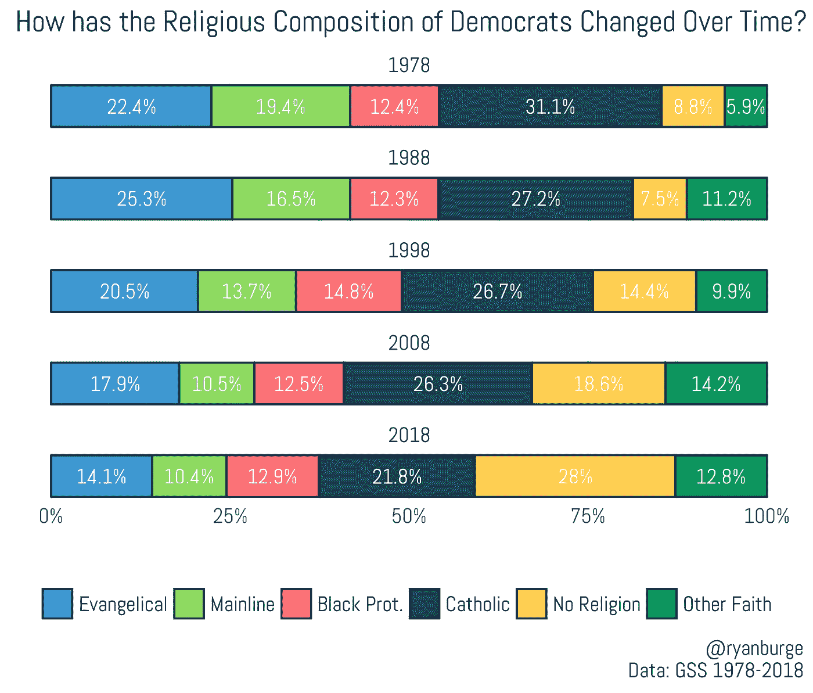
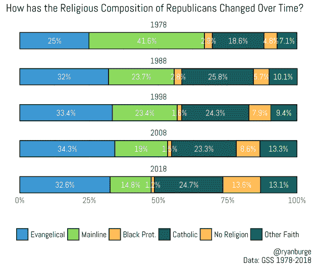

# 两大政党的宗教构成

> 原文：<https://towardsdatascience.com/the-religious-composition-of-the-two-major-parties-8123b4b6e1b0?source=collection_archive---------21----------------------->

我做了很多数据可视化。大多数时候，在我写代码之前，我对计算的结果有一个很好的想法。事实上，有些结果是如此明显，以至于我甚至不把它们放在任何地方，它们就在我的硬盘上，直到它失效。有时我会做一些图表，盯着看很久，仍然会发现第一次检查时没有发现的新东西。这就是周末发生的事情。举个例子，我在想，在 20 世纪 80 年代和 90 年代，我对两大政党的宗教构成了解有多少。众所周知，宗教右翼已经改变了美国政治，但这又是如何改变共和党的构成的呢？而且，现在非宗教人士占人口的四分之一，他们的存在一定会被民主党和共和党感觉到。

所以我只是做了一些简单的分析。

从 1978 年开始，每十年一次，我拿起一般社会调查，然后对共和党和民主党的宗教构成做了一个快照。我确实对传统的 RELTRAD 类别做了一个修改，将犹太人、少数宗教(佛教、印度教徒、摩门教等)和 RELTRAD 中未分类的人合并成一个类别，我称之为“其他信仰”这使得解释图表更加容易。让我们开门见山:这是过去四十年来民主党的宗教构成。

我首先想到的是，1978 年民主党中最大的群体是天主教徒，其次是福音派，占 22.4%。请记住:1978 年，近四分之一的民主党人是福音派新教徒。主流新教徒紧随其后，占 19.4%。黑人新教徒占民主党的 12.4%(基本上没有随着时间的推移而改变)。反对票约占所有民主党人的 9%。

后来事情发生了很大的变化。主流新教徒占民主党人的比例已经减少了一半，从大约 20%下降到现在的 10%。这不是因为主流人群转向共和党，而是因为主流人群完全消失了。信奉天主教的民主党人的比例也减少了基本相同的数量，10 个百分点。此外，民主党在福音派中失去了份额，福音派现在占民主党的 14.1%，高于我现在的猜测，仍然是民主党中的第三大群体。

那是很大的损失。总的来说，这是主流派、福音派和天主教徒之间 27%的损失。收益从何而来？嗯，大部分是非主流。事实上，自 1978 年以来，认为自己一无是处的民主党人的比例上升了近 20 个百分点。与此同时,“其他信仰”的比例也大幅上升，上升了近 7 个百分点。这真的是民主党转变的全部:福音派和主流新教徒和天主教徒的损失，无党派人士和其他人的巨大收益。

共和党怎么样？1978 年，三分之二的共和党人被认为是福音派或主流新教徒。这仍然让我震惊。正如我们之前所写的，我们需要抛弃主流新教徒是“自由”型新教的观点，在他们的全盛时期，主流新教徒成为共和党人的可能性是民主党人的两倍。在图表的右边，我们看到天主教徒占共和党的 18.6%，而非天主教徒约占 5%。

共和党联盟内部的一些变化令人震惊。例如，40%的共和党人是主流新教徒，现在已经减少到 15%。一组输了 25 分。再说一遍，这基本上是因为主流新教徒现在的规模是 1972 年的三分之一。这确实是共和党中支持率下降的群体。增益怎么样？福音派人数有所上升，但没有人们想象的那么多:只有 7.6%。今天，准确地说，三分之一的共和党人是福音派——这意味着这是两个政党中最大的信仰团体。天主教徒的支持率也有显著上升，仅超过 6 个百分点。这与福音派的收获没有太大的不同，但这似乎是一个被媒体揭露的故事。同样值得注意的是，非共和党人现在占共和党联盟的 13.6%。事实上，非主流的共和党人和主流新教徒的比例差不多。回想一下早些时候，民主党从无党派人士那里获得了大约 20 个百分点，但共和党自己也获得了近 9 个百分点。所以，说非主流完全被民主党俘获是不准确的；相反，如果你只看无党派人士，似乎三分之二是民主党人，其余的是共和党人。

令人欣慰的是，美国的两大政党都不是由一个特定的宗教团体主导的。我知道有大量的文章把福音派和共和党联系在一起，但是数据显示今天超过三分之二的共和党人不是福音派。民主党人也是如此。对他们来说最大的群体(无党派人士)如今只占十分之三的民主党人。任何宗教团体的成员都可以在两个帐篷中找到自己的位置。

Ryan P. Burge 在伊利诺伊州查尔斯顿的东伊利诺伊大学任教。可以通过 [*推特*](http://www.twitter.com/ryanburge) *或者他的* [*个人网站*](http://ryanburge.net/) *联系他。帖子的语法可以在* [*这里*](https://gist.github.com/ryanburge/f4aef554c5b6ba40ad5acd36cd901586) *找到。*

*原载于 2019 年 4 月 25 日*[*http://religion inpublic . blog*](https://religioninpublic.blog/2019/04/25/the-religious-composition-of-the-two-major-parties/)*。*