# 推荐系统的非凡世界

> 原文：<https://towardsdatascience.com/the-remarkable-world-of-recommender-systems-bff4b9cbe6a7?source=collection_archive---------2----------------------->

## 推荐系统概述以及它们如何提供一种有效的定向营销形式。

Image by [PatternPictures](https://pixabay.com/users/PatternPictures-622877/?utm_source=link-attribution&utm_medium=referral&utm_campaign=image&utm_content=1128772) from [Pixabay](https://pixabay.com/?utm_source=link-attribution&utm_medium=referral&utm_campaign=image&utm_content=1128772)

> 很多时候，人们不知道他们想要什么，直到你展示给他们看:史蒂夫·乔布斯

以下节选自**克里斯·安德森**:*的《长尾 T3》一书:1988 年，一位名叫乔·辛普森的英国登山者写了一本名为“* ***触摸虚空”*** *的书，讲述了秘鲁安第斯山脉濒临死亡的悲惨遭遇。它得到了很好的评价，但是，仅仅是一个小小的成功，它很快就被遗忘了。然后，十年后，一件奇怪的事情发生了。乔恩·科莱考尔写了'* ***'消失在空气中'*** *，这是另一本关于登山悲剧的书，在出版界引起了轰动。突然* ***碰到虚空*** *又开始卖*。

对'**触摸虚空'**的需求如此之高，以至于一段时间后，它甚至比'**卖得还要少。但是这里到底发生了什么？嗯，事实证明，由于这两本书基于相同的主题，亚马逊建议喜欢《走进稀薄的空气》的读者也会喜欢《触摸虚空》的读者。当人们接受这些建议时，他们实际上喜欢这本书，因此写了积极的评论，这导致了更多的销售，最终导致更多的推荐，从而形成了积极的反馈循环。这就是推荐系统的力量。**

# 推荐系统

推荐引擎试图向人们推荐产品或服务。在某种程度上，推荐者试图通过向人们提供他们最有可能购买或使用的建议来缩小选择范围。从亚马逊到网飞，推荐系统几乎无处不在；从脸书到 Linkedin。事实上，亚马逊收入的很大一部分来自推荐。像 Youtube 和网飞这样的公司依靠他们的推荐引擎来帮助用户发现新内容。我们日常生活中的一些建议示例如下:

*   **亚马逊**

亚马逊使用来自数百万顾客的数据来确定哪些商品通常是一起购买的，并在此基础上提出建议。Amazon.com 的推荐是基于明确提供的评级、购买行为和浏览历史提供的。

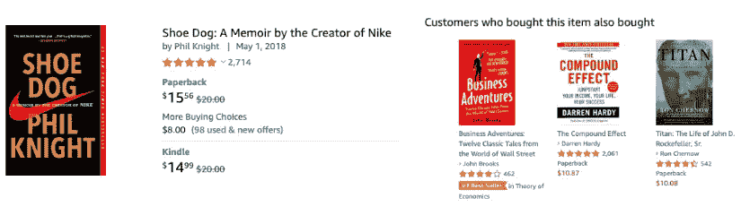

I intended to buy ‘Show Dog’ but ended up buying ‘The Compound effect’ too!

*   **Linkedin**

Linkedin 利用你过去的经历、现在的职位和认可的数据向你推荐可能的工作。

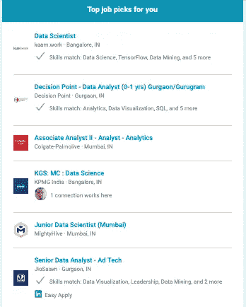

*   **网飞**

当我们在网飞上对一部电影进行评级或设置我们的偏好时，它会使用这些数据以及来自数百名其他订户的类似数据来推荐电影和节目。这些评级和行动随后被网飞用来提出建议。

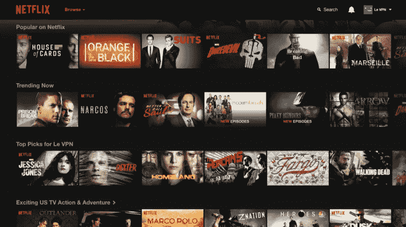

*   **脸书**

推荐系统，如脸书，不直接推荐产品，但他们推荐联系。

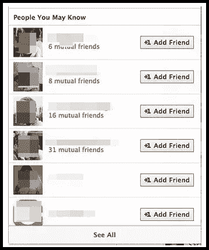

除此之外， **Spotify、Youtube、IMDB、Trip Advisor、Google News、**以及许多其他平台不断给出适合我们需求的推荐和建议。

# 为什么推荐人

今天，网上商店蓬勃发展，我们几乎可以通过点击鼠标获得任何商品。然而，在实体时代，存放商品的物理空间有限，因此店主只展示最受欢迎的商品。这意味着许多产品甚至没有展示出来，尽管它们像书籍或 CD 一样质量很好。简而言之，店主必须预先过滤内容。

然而，网购行业改变了这种情况。因为有无限的空间，预过滤的需要消失了。相反，这导致了后来被称为长尾效应的现象。

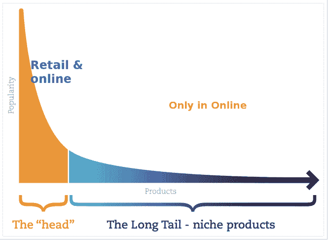

[The Long Tail Phenomenon](https://dataaspirant.com/2015/05/25/collaborative-filtering-recommendation-engine-implementation-in-python/)

效果就是受欢迎的产品很少，线上和线下都可以找到。另一方面，不太受欢迎的产品很多，只能在网上商店找到，最终构成了**长尾**。然而，即使是不受欢迎的产品也可能是好的，在网站上找到这样的产品是一项艰巨的任务，需要某种形式的过滤器。这样的过滤器实际上构成了一个推荐系统。

# 推荐问题的表述

创建推荐系统主要是为了回答以下两个问题中的任何一个:

*   **预测版本**

这个版本处理预测用户-项目组合的评级值。在这种情况下，我们有由用户给出的评级组成的训练数据。目的是利用这些数据，预测用户没有与之互动的项目的评分。

*   **排名版**

老实说，没有必要为了推荐而预测用户对特定项目的评价。在线零售商或电子商务公司并不太关心他们用户的预测。相反，他们更感兴趣的是制作一个有限的清单，列出最好的东西，展示给某个人。此外，客户不想看到系统预测他们对某个项目的评分的能力，他们只想看到他们可能喜欢的东西。

> 推荐引擎的成功取决于它为人们找到最佳推荐的能力，因此专注于寻找人们喜欢的东西而不是预测人们讨厌的东西是有意义的。

# 推荐系统的目标

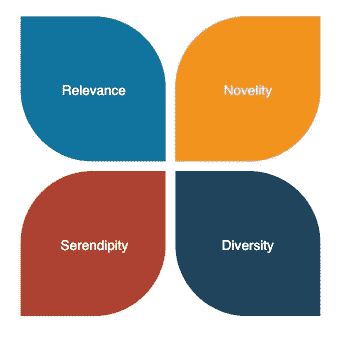

Recommendations will only be valuable if they are relevant

推荐系统的最终目标是增加公司的销售额。要做到这一点，推荐系统应该只向用户显示或提供有意义的项目。 *Charu C Aggarwal* 在他的著作[*推荐系统*](https://www.springer.com/in/book/9783319296579) 中将推荐引擎的预期目标总结为以下四点:

*   **相关性**

推荐的项目只有在与用户相关时才有意义。用户更有可能购买或消费他们感兴趣的商品。

*   **新颖性**

除了相关性，新鲜感是另一个重要因素。如果商品是用户以前没有见过或消费过的东西，推荐商品会更有意义。

*   **意外之喜**

有时推荐一些有点出乎意料的商品也能促进销售。然而，意外之喜不同于新奇。用[作者的](https://www.springer.com/in/book/9783319296579)话说:

*“如果一家新的印度餐馆在附近开业，那么向通常吃印度食物的用户推荐该餐馆是新颖的，但不一定是偶然发现的。另一方面，当向同一用户推荐埃塞俄比亚食物时，该用户不知道这种食物可能会吸引她，则该推荐是偶然发现的”。*

*   **多样性**

增加建议的多样性也同样重要。简单地推荐彼此相似的项目没有多大用处。

# 推荐系统的工作原理

那么推荐系统是如何工作的呢？比方说，亚马逊想向您展示图书类别中的 10 大推荐。在这里，亚马逊的推荐系统将从你的某种数据开始，以便找出你的个人品味和兴趣。然后，它会将你的这些数据与像你一样的其他人的集体行为相结合，向你推荐你可能喜欢的东西。但是这些关于你喜欢和不喜欢的数据从何而来？

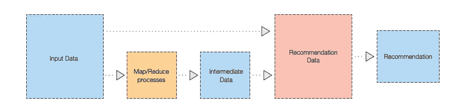

[The flow of data into a recommendation engine](https://d1.awsstatic.com/Marketplace/scenarios/bi/Q42017/BIA13-realtime-product-recommendations-scenario-brief.pdf)

用户偏好数据以两种方式收集:

*   **显式数据**

让用户对一个项目进行一到五颗星的评级，或者对他们看到的内容进行赞或否定的评级，就是一个显式数据收集的例子。在这种情况下，用户会被明确地询问他们是否喜欢某个特定的商品，然后这些数据会被用来建立用户的兴趣档案。

然而，有一个缺点，因为不是每个用户都留下反馈或评级，即使他们留下评级，对不同的人来说也可能意味着不同。例如，3 ⭐️评级可能对一个人来说很好，但对另一个人来说很一般。

*   **隐含数据**

隐含数据来自用户与网站的交互，并将它们解释为感兴趣或不感兴趣的指示。例如，从亚马逊购买产品或观看完整的 youtube 剪辑被认为是积极兴趣的标志。隐式交互可以给你更多的数据来处理，在购买数据的情况下，它甚至可能是更好的开始数据。

# 推荐系统的基本模型

如今，在这个行业中有很多种推荐人。然而，重要的决定是决定哪种类型适合我们的需要，哪种类型的数据可供我们使用。选择主要取决于:

*   我们想要识别的，
*   我们的数据中指定了什么类型的关系？

一些常用的建议方法包括:

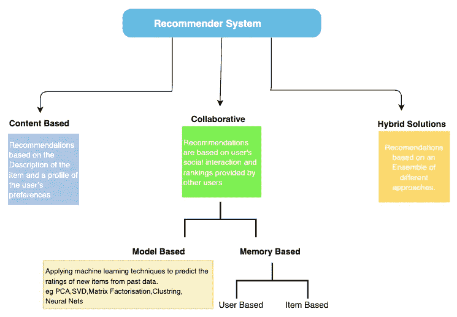

Approaches used for Recommendation systems

让我们对其中的每一项进行简要概述:

## 基于内容的过滤

基于内容的过滤包括根据项目本身的属性推荐项目。基于内容的过滤器所做的推荐使用个人的历史信息来通知所显示的选择。这种推荐器寻找一个人过去已经购买或喜欢的项目或产品之间的相似性，以推荐将来的选项。

[Content-Based Filtering](http://datameetsmedia.com/an-overview-of-recommendation-systems/)

例如，如果用户喜欢“**文学”**类别的书，向用户推荐相同类别的书是有意义的。此外，推荐同一**年**由同一**作者**出版的书籍也是一个好主意。这就是基于内容的过滤的工作原理。

基于内容的方法的优势在于，我们并不真的需要大量的交易来构建我们的模型，因为我们只需要关于产品的信息。然而，缺点是该模型不从事务中学习，所以随着时间的推移，基于内容的系统的性能没有太大的改善。

## 协同过滤

协同过滤使用由许多用户/顾客提供的评级的组合力量来呈现推荐。这意味着根据其他人的合作行为来推荐东西。

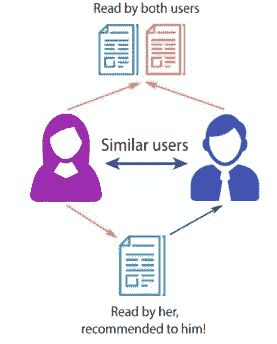

协作过滤有两种方法:

1.  **基于记忆的方法**，也称为基于邻域的协同过滤算法，其中用户-项目组合的评级是基于它们的邻域来预测的。这些邻域可以进一步以两种方式之一来定义:

*   **T3【基于用户的协同过滤:**

找到像你一样的人，并推荐他们喜欢的物品。

*   ***基于项目的协同过滤:***

推荐那些也买了你喜欢的东西的人买的东西。

**2。基于模型的方法**通过将问题视为正常的机器学习问题，使用机器学习方法提取评级数据的预测。可以使用 PCA、SVD、矩阵分解、聚类、
神经网络等技术。

## 基于混合和集成

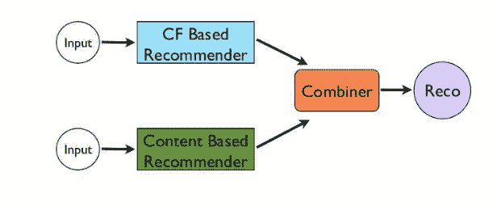

Hybrid filtering

基于内容的方法和协作方法都有各自的优点和缺点，通过将许多算法结合在一起，我们称之为混合方法，可以得到一个更好的系统。混合系统利用项目数据和交易数据来给出建议。

使用混合方法的一个很好的例子是网飞。在网飞，推荐不仅基于人们的观看和搜索习惯(协作系统)，还会推荐具有相似特征的电影(基于内容)。

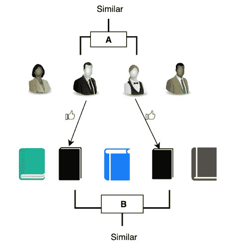

How Hybrid Systems work

# 评估推荐系统:围绕准确性的炒作

> 用户并不真正关心准确性

没有一种简单的方法来衡量推荐系统有多好。这一领域的许多研究倾向于集中在预测用户对他们尚未评价的事物的评价问题上，无论是好的还是坏的。但这与推荐系统在现实世界中需要做的事情非常不同。衡量准确性并不是我们真正想要推荐系统做的事情。那么，在推荐系统领域，为什么 RMSE 和准确性如此重要呢？

这很大程度上要追溯到 2006 年，当时网飞宣布了著名的 100 万美元奖金挑战。这场比赛是为了打破他们 0.9525 的 RMSE，终点线将其减少到 0.8572 或更少。由于该奖项的焦点是 RMSE，人们只关注它，这种影响一直持续到今天。

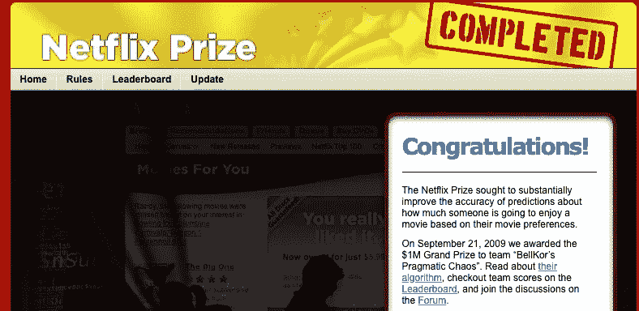

[https://www.netflixprize.com/](https://www.netflixprize.com/)

有趣的是，三年竞赛中产生的大多数算法从未被集成到网飞中。正如[在网飞博客](http://techblog.netflix.com/2012/04/netflix-recommendations-beyond-5-stars.html)上讨论的:

> 你可能想知道两年后赢得 100 万美元的最终大奖合奏发生了什么……我们离线评估了一些新方法，但我们测量的额外精度增益似乎并不证明将它们引入生产环境所需的工程努力是合理的。
> 
> 我们的业务目标是最大限度地提高会员满意度和月度订阅保留率……现在很明显，Netflix 奖的目标——对电影评级的准确预测——只是优化会员娱乐的有效推荐系统的众多组成部分之一。

# 结论

在本文中，我们概述了推荐系统，以及它们如何通过为每个客户创造个性化的购物体验来提供有效的定向营销形式。但是，我们并没有深入研究各种推荐方法。这是因为每种方法都相当广泛，值得单独撰写一篇文章。在下一篇文章中，我将详细讨论推荐方法的工作原理及其优缺点。

链接下一部分: [**现实世界中的推荐系统**](/recommendation-systems-in-the-real-world-51e3948772f3)