# 餐馆指南:如何在 Yelp 上受欢迎

> 原文：<https://towardsdatascience.com/the-restaurant-guide-how-to-be-popular-on-yelp-a77591a13c8c?source=collection_archive---------28----------------------->

## 使用正则化线性模型来确定哪些餐馆应该考虑获得更多的在线牵引力

> 如果有什么能让你永远保持谦逊，那就是餐饮业
> 
> *——安东尼·鲍代恩*

# 动机

餐馆是一个艰难的行业——60%的餐馆在第一年内倒闭，80%在第五年倒闭。因此，出于对食物的热爱，我想发现受欢迎程度的重要预测指标，**就像 Yelp 上的评论数所显示的那样。**具体来说，我开始回答餐馆的问题:

1.  我应该提供(或避免)哪种菜肴？
2.  什么样的社区成功率最高？
3.  食物的美感更重要还是氛围/装饰更重要？
4.  我的评论中的照片重要吗？
5.  价格范围重要吗？

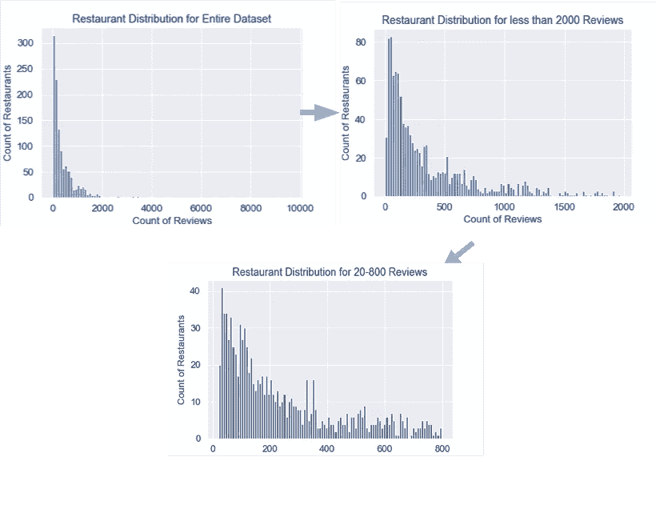

The distribution of reviews counts per restaurant is skewed to fewer than 1000 reviews. I decided to slice the data to only include restaurants with 20 to 800 reviews to my final modeling.

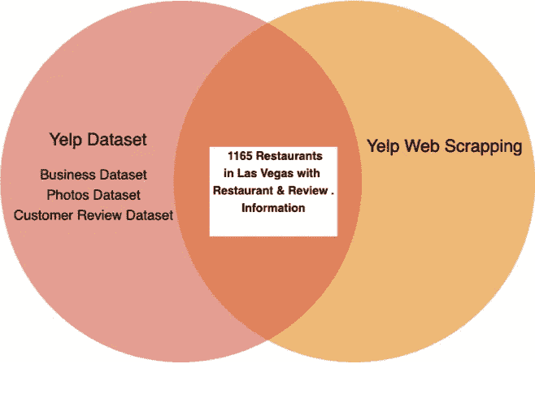

# 数据集和要素

为了回答这些问题，我合并了 Yelp 的几个数据集，并抓取了 Yelp 的浏览页面，以获取关于业务、评论和发布的照片的信息。我只关注了一个城市，拉斯维加斯，因为我想分析一个城市中邻里之间的影响。这在我的数据集中产生了 1，165 个独特的餐馆。

数据严重失真，大多数餐厅的评论数少于 1000 条，少数餐厅的评论数高达 10000 条。为了提高可解释性，数据集被缩减到只包含 20 到 800 条评论的餐馆。这将最终模型拟合的大小减少到原始收集数据的 82%。

# 整个学习过程——OLS、拉索克夫、RidgeCV 或 ElasticNetCV(还有代码！)

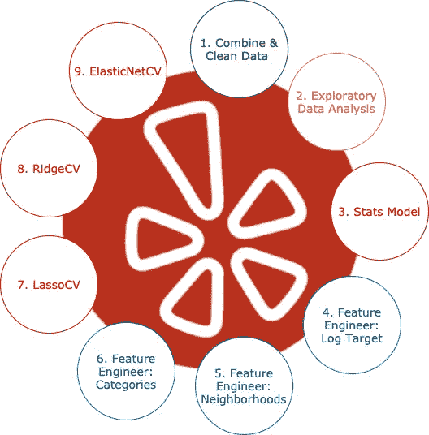

Model of the learning process, if it was linear and not iterative/ repetitive

上图大致模拟了模型审核计数预测所采取的步骤，尽管它更多的是迭代而不是线性。简而言之，在执行特征工程时，我使用简单的线性回归来提供关于预测因子的信息。正则化技术有助于管理不重要的共线要素。思维过程和代码详述如下。

**功能标准化的简单线性回归**在功能工程过程中提供了见解。因为我会经常运行这个函数，所以创建一个函数是有意义的:

```
def split_and_validate(X, y):
    """
    Split data to train, val and test set and perform linear   regression
    """
    columns = X.columns
    X = X.values
    std = StandardScaler()

    # perform a train, val and test set
    X_train_val, X_test, y_train_val, y_test = train_test_split(X, y, test_size=0.2,random_state=42)
    X_train, X_val, y_train, y_val = train_test_split(X_train_val, y_train_val, test_size=.25, random_state=42)

    # fit linear regression to training data
    lr_model = LinearRegression()
    lr_model.fit(std.fit_transform(X_train), y_train) # score fit model on validation data
    val_score = lr_model.score(std.transform(X_val), y_val)
    adjusted_r_squared = 1 - (1-val_score)*(len(y)-1)/(len(y)-X.shape[1]-1)

    # report results
    print('\nValidation R^2 score was:', val_score)
    print('Validation R^2 adj score was:', adjusted_r_squared)
```

*   **Lasso cv(Lasso with K-fold validation)**以特征标准化作为特征选择方法。Lasso 将没有强大预测能力的系数归零，从而将解释集中在几个关键特征上。

```
std = StandardScaler()# Splitting data to train and val
X_train, X_test, y_train, y_test = train_test_split(X, y, test_size=0.2, random_state=42)

# Setting up alpha list and letting the model select the best alpha  
alphalist = 10**(np.linspace(-2,2,200))
lasso_model = LassoCV(alphas = alphalist, cv=5) # setting K-fold 
lasso_model.fit(std.fit_transform(X_train), y_train)# printing coefficients 
list(zip(X_train.columns, lasso_model.coef_ / std.scale_))
```

*   **Ridge(具有 K 倍验证的 Ridge)**通过使系数更接近于零来帮助平滑系数，而不移除它们。但更重要的是，它们对两个高度共线的特征给予了大致相等的权重。

```
std = StandardScaler()# Split data to train and test
X_train, X_test, y_train, y_test = train_test_split(X7, y7, test_size=0.2, random_state=42)# Fit and train model
alphalist = 10**(np.linspace(-1,2,200))
ridge_model = RidgeCV(alphas = alphalist, cv=5)
std.fit(X_train)
ridge_model.fit(std.transform(X_train), y_train)# print coefficients
list(zip(X_train.columns, ridge_model.coef_))
```

*   **ElasticNetCV(具有 K 倍验证的脊)**线性地结合了上述套索和脊方法的 L1 和 L2 罚值。它解决了这两种方法的一些局限性。最终选择了这个模型，对岭模型的权重较高。

```
std = StandardScaler()l1_ratios = [.1, .5, .7, .9, .95, .99, 1]
alphas = 10**np.linspace(-2,2, 200)model = ElasticNetCV(cv=5, l1_ratio = l1_ratios, alphas = alphas, random_state=42)
std.fit(X_train)
model.fit(std.transform(X_train), y_train)
pred = model.predict(std.transform(X_test))
score = model.score(std.transform(X_test), y_test)
model.alpha_mse = mean_squared_error(np.exp(y_test), np.exp(pred))adj_r_squared = 1 - (1-score)*(len(y_test)-1)/(len(y7)-X7.shape[1]-1)print("Alpha:{0:.4f}, R2:{1:.4f},ajd_R2{2: 4f}, MSE:{2:.2f}, RMSE:{3:.2f}"
   .format(model.alpha_, score,adj_r_squared, mse, np.sqrt(mse)))print(f'l1 ratio is {model.l1_ratio_}')
list(zip(X_train.columns, model.coef_ / std.scale_))
```

接下来的部分只深入到我们可以从模型中获得的三个推论，但是我将在摘录部分详细阐述各个系数。

# 我的餐厅应该供应哪些菜系？

一家餐馆可能有不止一个由 Yelp 标记的食物类别。在被分析的 1165 家餐馆中，有 146 种不同的菜系。

使用 Python 的词云，你可以看到一些类别出现了很多次(墨西哥餐馆出现了至少 135 次)，而许多美食看起来很有异国情调，例如活的/生的或马来西亚食物只出现了一次(可悲！).

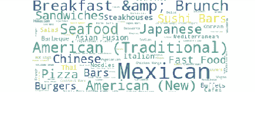

Word Cloud visualizing frequency of food categories in our dataset

有两种方法可以将美食作为特色:

1.  **一个特征**:前 N 大菜系(如前 5、10 大菜系或前 20 大菜系)作为虚拟变量
2.  **多特性**:每种食物本身就是一个虚拟变量，最多有 N 个虚拟变量。

如何确定 N:对每个 N 运行交叉验证模型。下图显示了单特征方法的每个 N，右图显示了多特征方法的每个 N。利用这种可视化，我选择了多特性方法，为每一种受欢迎的菜系创建了 21 个虚拟变量。

这仍然是一个很大的特色，但是因为我运行了一个套索模型，所以我希望删除这 21 个菜系中的一些。

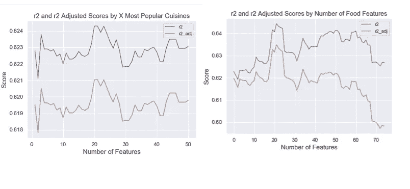

Deciding how to include N cuisines as predictors in my model

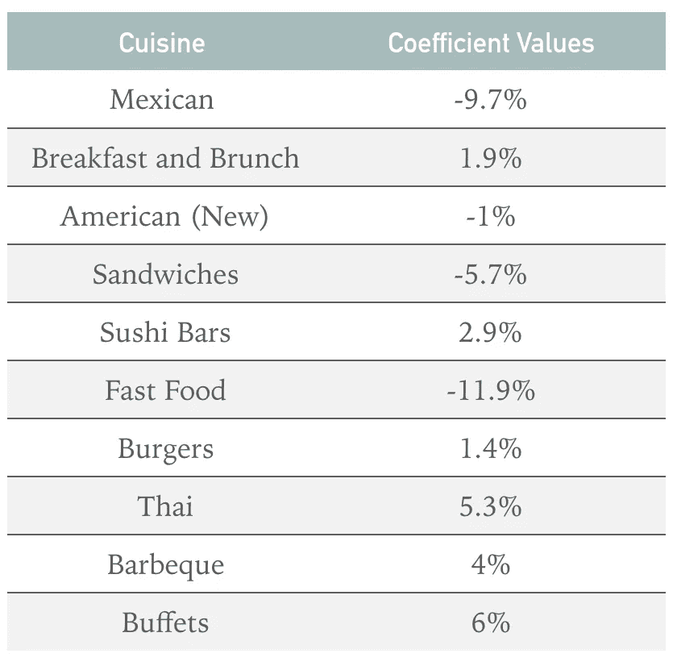

最终评选出 10 大菜系(见表)。关于系数值的注意事项:由于目标变量被记录，如果你的餐馆在 Yelp 上将该菜系作为一个类别，你可以将该值读取为评论数的百分比变化。

墨西哥、美国(新)、三明治和快餐是消极的预测因素，而其余的是积极的预测因素。

不出所料，将你的餐馆定义为快餐会导致 11.9%的预测点评数下降。然而，我感到失望的是，墨西哥食物会导致 9.7%的低评论计数——在这个城市永远不会有足够的墨西哥餐馆！

# 邻里关系重要吗？

在《美食》中使用与上述相同的技术来确定邻里关系是否重要，我失望地发现，它根本没有显著提高模型的 R 平方。虽然零假设没有被拒绝，我认为这是一个有趣的观点。虽然向餐馆老板推荐一个社区很好，但我在这里的唯一建议是:**担心其他事情，位置并不重要！**

# 食物或环境重要吗 Instagram 测试

Yelp 的照片数据集包含带有以下标签的照片标签信息:

*   食物
*   喝
*   里面的
*   在外面
*   菜单

我发现这些标签有助于了解食物/饮料的美学或氛围(内部/外部标签)是否对餐厅的成功更重要。我为拥有超过 10 张照片的餐厅设置了这个指标，以确保相关性(拥有 20 张氛围照片和 10 张食物照片的餐厅比拥有 2 张氛围照片和 1 张食物照片的餐厅传达了更强的美学信息)。

一般来说，餐馆张贴的食物照片比环境照片多:

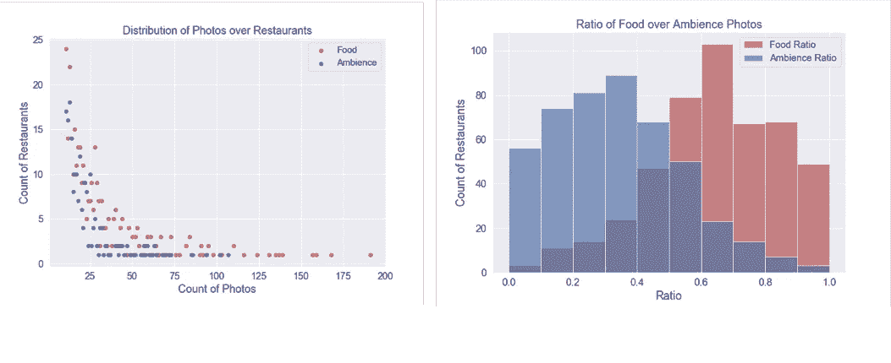

因此，我创建了一个名为 food_70 的虚拟变量来表示餐馆的食物/饮料比率是否至少为 70:100。

下一个特征是照片的计数。虽然照片数量和评论数量之间可能存在反馈循环关系(越受欢迎的餐厅有越多的照片)，但我认为照片较少的餐厅(少于 10 张)的反馈循环关系会更弱。

因此，创建了三个虚拟变量:没有照片的餐馆、有 1-5 张照片的餐馆和有 6-10 张照片的餐馆。

在将这些特征放入模型之前，一些简单的探索性分析显示，评论越多的餐厅，平均而言，食物与氛围的比例越平衡(对于评论少于 50 条的餐厅，接近 1.5:1，而不是 3:0)。

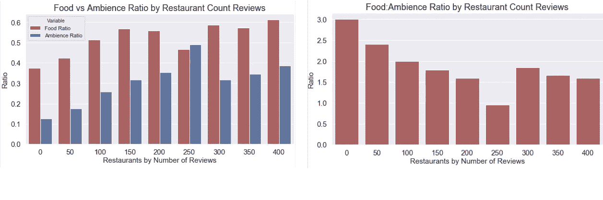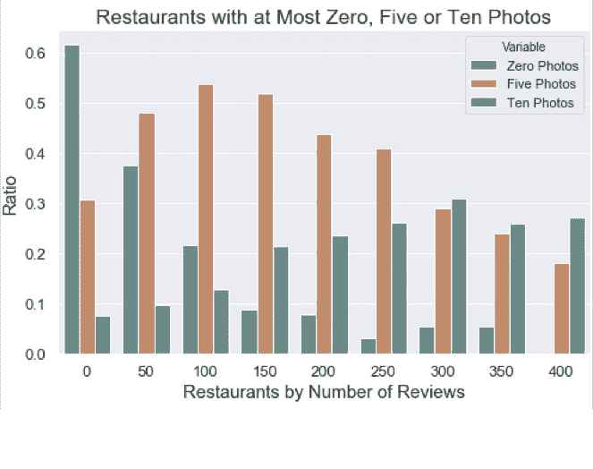

如果你的餐馆没有照片，你获得更少评论的几率会大大增加。

毫不奇怪，没有照片对你的案例获得超过 50 个评论没有帮助。

# 外卖

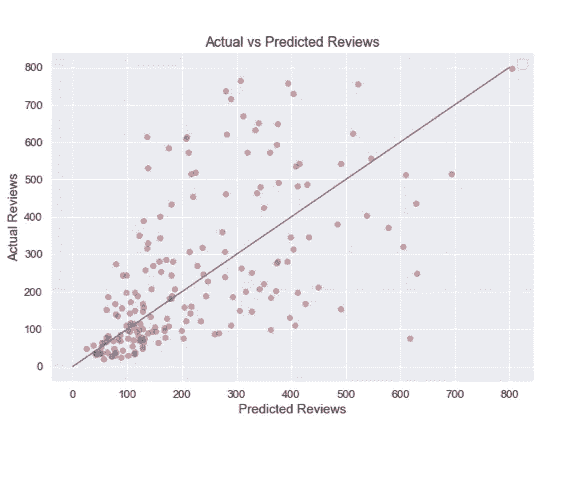

Predicted vs Actual Reviews

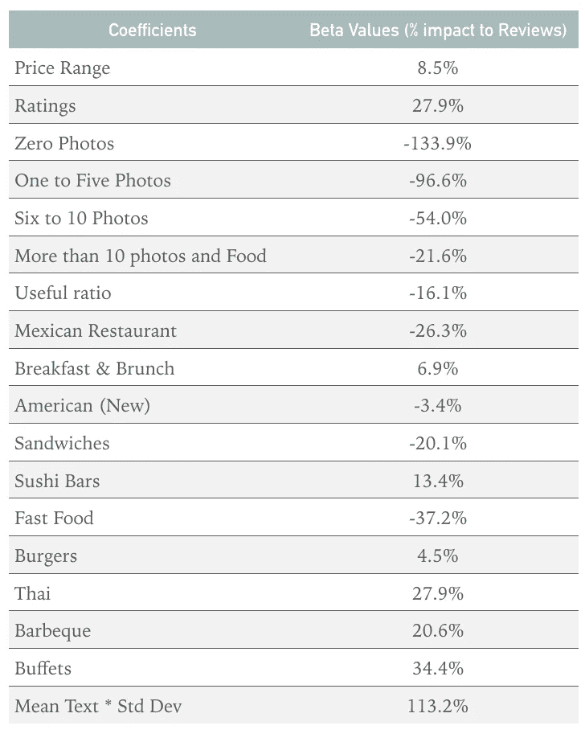

The coefficient table

我使用 R Square 来选择我的最终模型，并获得了 0.50 的分数。当根据实际评论绘制预测评论时，该模型在预测评论数较高的餐馆时仍然表现不佳

贝塔系数表中的一些附加信息:

*   价格范围:价格范围上升到四个美元符号，但它们对更多评论很重要
*   **照片:**没有或少于 6 张照片是受欢迎程度的主要负面预测因素
*   **美食:氛围比**:餐厅一般美食都比氛围照多。但是你希望你的餐厅至少有 30%的氛围(漂亮的装饰很重要！)

鉴于 R 平方得分为 0.5，线性回归可能不是预测评论数的最佳模型。然而，该模型确实给出了在一个新城市开业的餐馆应该考虑什么的有力建议。

在未来的工作中，值得将分析扩展到更多的城市，因为我们知道邻里关系并不重要。感谢阅读！