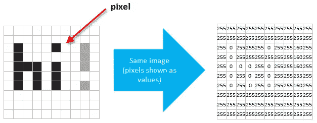
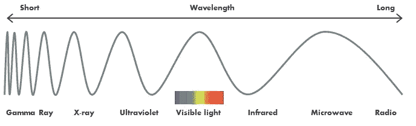
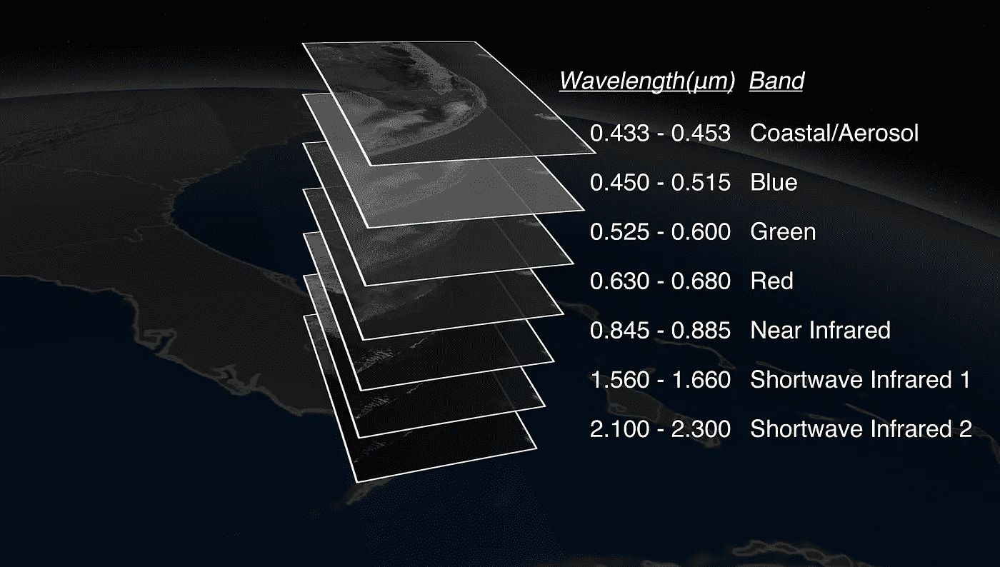

# 精准农业的计算机视觉

> 原文：<https://towardsdatascience.com/the-revolution-of-data-science-b956c5bc3408?source=collection_archive---------23----------------------->

## 基于像素做出决策

Photo by [Chris Ried](https://unsplash.com/photos/ieic5Tq8YMk?utm_source=unsplash&utm_medium=referral&utm_content=creditCopyText) on [Unsplash](https://unsplash.com/?utm_source=unsplash&utm_medium=referral&utm_content=creditCopyText)

如果我告诉你，你看到的一切对一堆数字来说没什么不同，会怎么样？如果我说这一事实对农业综合企业、零售、运输或军事防御等行业有直接影响，你会相信吗？

很像在《黑客帝国》电影中，我们看到的是由大脑处理和解释的原始数据，这一切发生得如此之快，以至于我们甚至没有意识到。在计算术语中，任何图像都可以被认为是一组数据，其中该图像的每个像素保存一个或多个值。像素是图像的组成部分，以特定的顺序排列以表示特定类型的一些信息。就像在海战游戏中一样，图像中的每个像素都有一个特定的坐标，这给图像本身带来了意义。

在上图中，像素值是范围从 0(黑色)到 255(白色)的整数，这意味着可以对该图像(或任何其他图像)进行分析、采样、分类、预测、参数化，或对数据集执行任何其他操作。图像分析是[遥感图像](https://medium.com/@lopezyse/why-does-your-organization-need-to-explore-remote-sensing-technologies-ea86d5079090)的关键学科之一，因为它带来了一些最有价值的见解。更具体地说，**农业**中的遥感图像是受现代卫星扩张影响的现代农业技术中的热门话题之一，其中一些卫星免费提供高分辨率图像。农业行业的技术和数字化正在催生新的可能性，其中一些在几年前是无法想象的。

如今，卫星和无人机(像无人机一样的无人飞行器)正在拍摄比以往任何时候都更精确的图像。时间(图像频率)和空间分辨率(衡量图像的精细程度)在过去几年中呈指数增长，航空航天业将继续以我们甚至无法预测的方式发生变化。我们的能力如此强大，以至于我们真的有能力从外太空发现一枚硬币。随着像素密度(每英寸像素，或 ppi)的增加，我们可以获得更清晰的图像和更重的数字图像文件。相反，随着像素密度的降低，我们会损失精度，但也会降低处理需求。这是当前数字图像分析中的一个基本权衡，图像的可用性增长如此之快，以至于我们似乎跟不上处理它们的能力。

通过在农业等学科中使用遥感图像，我们能够以更高效的方式执行不同的任务:

*   检测植物疾病
*   对土地覆盖(如森林)和土地利用(如农业)进行分类
*   通过识别不同的作物，如大豆、玉米、小麦等，对作物类型进行分类。
*   通过计算特定地区作物的预期产量来估计作物产量
*   识别与健康作物竞争阳光和土壤养分的杂草
*   通过检测水分胁迫监测和预测土壤湿度
*   评估除草剂、杀虫剂和杀真菌剂的有效性
*   识别作物和土壤中的污染物
*   监控播种过程的有效性

但是我们如何仅仅从一幅图像中获得所有这些信息呢？似乎有点太多了，对吧？事实上，遥感影像不仅提供了每个像素的一个值(例如颜色值)，还提供了每个像素的附加值，这带来了许多额外的数据来改进任何分析或决策。为了理解这是如何工作的，我们必须先谈谈光谱图像。

# **看见看不见的**

作为人类，我们只能看到电磁波谱中非常小的一部分(我们称之为“可见光”)，而事实是，几个世纪以来，我们只是通过一把小锁来体验这个世界。

1800 年*威廉·赫歇尔*(发现天王星的同一个人)用棱镜分离阳光，并在每种光色下放置温度计。通过在红灯旁边放置一个额外的温度计，他发现这个额外的温度计具有所有温度计中最高的温度。这就是红外光的发现，世界第一次知道了我们用肉眼看不到的光。仅一年后，*约翰·威廉·里特*在可见光光谱的另一边做了同样的实验(这次在紫光边之外)，发现了紫外光。电磁波谱诞生了。

现代遥感图像可以测量各种波长(远远超过我们已知的“可见光”光谱)，其中许多波长是我们肉眼看不到的。这被称为**多光谱**图像，它是由传感器(例如卫星或无人机中的传感器)产生的，这些传感器测量电磁波谱的几个部分(或波段)内的反射能量。由于不同的物体或条件以不同的方式反射能量(例如植物反射光的方式不同于水)，每个光谱带捕捉不同的属性。

在多光谱图像所代表的图像的每个像素中，可以有大约 10 或 20 个不同的波段测量值。像 Sentinel-2 这样的卫星(为全球范围内的陆地和水域监测提供免费图像)有 13 个光谱带，每个都与电磁波谱的特定波长相关联。

但是如果你认为 13 个波段还不够，那么你可以考虑高光谱。**超光谱**图像可以提供数百种波段测量(是的，数百种图像！)在整个电磁频谱上，这为观察中的细微变化提供了更高的灵敏度。超光谱传感器生成的图像包含的数据比多光谱传感器生成的图像多得多，并且在检测特征差异方面有很大的潜力。例如，虽然多光谱图像可用于绘制森林地区的地图，但高光谱图像可用于绘制森林中的树种。

T2 卫星公司是世界上高分辨率高光谱图像的领先供应商。除了为农业、采矿、建筑和环境测绘领域的企业提供竞争优势之外，Satellogic 还采取了大胆的举措，为开放的科学研究和人道主义事业免费提供超光谱数据。

*Different Landsat bands exploded out like layers of onion skin along with corresponding spectral band wavelengths and common band names. Source:* [*NASA*](https://svs.gsfc.nasa.gov/4040)

# **为什么数据科学是真正的游戏规则改变者？**

由于图像是数据集，您可以考虑对它们进行数学运算。

通过对光谱带进行代数运算，可以将两种或多种波长结合起来突出显示特定的特征，如植被类型、燃烧区域或发现水的存在。还可以将来自不同来源(如不同卫星)的波段组合起来，以获得更深入的见解:想象一下，将不同的光反射波段与土壤湿度以及土地高程特征组合在一起，所有这些都堆叠在同一个数据集中:如果数据集中的每个波段或图像具有相同的行数和列数，则一个波段的像素与另一个波段的像素位于相同的空间位置。由于每个像素都进行了地理编码，我们可以在任何特定位置添加不同的信息层。

好消息是这并不像听起来那么难。[谷歌地球引擎](https://earthengine.google.com/)提供由他们自己的数据中心和 API 支持的数 Pb 的卫星图像和地理空间数据集，一切都在一个用户友好的平台上，让任何用户测试和实现自己的模型和算法。你可以执行数学和几何运算，分类像素或识别物体，同时在云中高速运行。谷歌又一次扩大和简化了几年前极其复杂和昂贵的东西。

此外，多年来遥感图像的可用性大大增加，因此有可能增加时间维度。活跃卫星的数量增加了，它们的重访时间也增加了，因此我们有可能将可靠的时间信息合并到任何模型中。通过对图像进行时间序列分析，我们摆脱了单一时间信息(只是时间上的一瞥)并进入了一个新概念，在这个概念中，属性随着周期而变化，我们可以观察到不同的周期和趋势。

在这种大数据环境中得出结论极具挑战性，因为如果我们没有能力处理这些数据，这些数据就没有任何意义。你如何管理和解释数十亿像素和巨大的数据集？

这就是数据科学正在进行真正的革命，并推动农业等行业的深刻变革。**数据科学**可以被认为是一门相当新的学科，专注于从数据中提取有意义的见解，用于战略决策、产品开发、趋势分析和预测。数据科学的概念和方法源自统计学、数据工程、自然语言处理、数据仓库和机器学习等学科，这些学科在处理实际的数据爆炸方面非常有效。你可以说，数据科学家在数据中游泳时，最擅长做出发现。

但在数据科学的所有子学科中，我认为机器学习值得特别关注。**机器学习**描述了从数据中学习而不是专门为此编程的算法，代表了解决数据丰富问题的最佳解决方案。在可预见的未来，这是数据科学最有可能提供直接和切实利益的领域。

像 [Planet](https://www.planet.com/) 这样的公司利用机器学习将图像转化为可操作的分析信息，以比免费卫星更好的空间和时间分辨率跟踪基础设施和土地使用的变化。

从庞大的机器学习算法宇宙中， [**卷积神经网络**](/intuitively-understanding-convolutions-for-deep-learning-1f6f42faee1)(CNN)是图像处理领域的最先进技术，正被用于农业等领域，以重塑做事的方式。CNN 代表了一种有前途的技术，在精度和准确度方面具有当前的高性能结果，优于其他现有的图像处理技术。

世界上第一个农业机器人 C2-A2 使用 CNN 来保护设备和人员免受所有可能的碰撞。C2-A2 是一个人工大脑，旨在成为自主农业机械的通用控制系统，如收割机、拖拉机或喷雾器。

由于这些学科，人的能力正以惊人的速度得到加强。遥感图像等领域的技术入侵完全改变了我们与世界互动的方式，谁知道这将在哪里结束。在这种情况下，考虑处理极其复杂的输入并自己做出决策的系统并不疯狂，这样可以释放人类的时间和资源来做其他事情。

> 对这些话题感兴趣？在 [Linkedin](https://www.linkedin.com/in/lopezyse/) 或 [Twitter](https://twitter.com/lopezyse) 上关注我