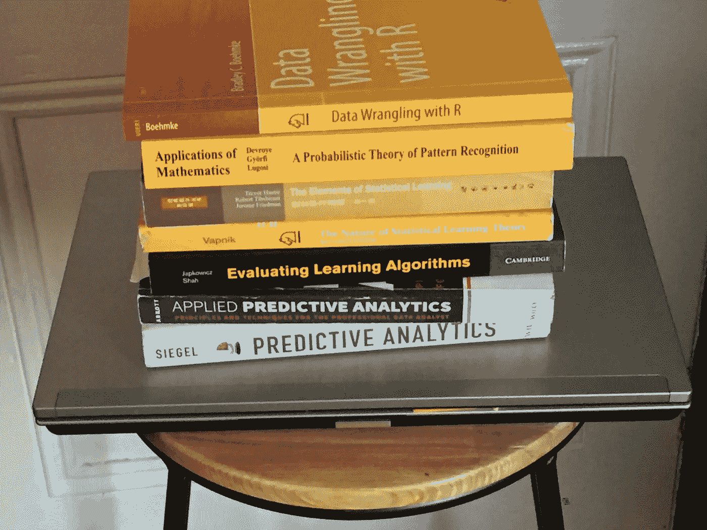

# 适量的建模

> 原文：<https://towardsdatascience.com/the-right-amount-of-modeling-60bb53a1deb?source=collection_archive---------20----------------------->

A tower of Data Science books not quite containing 300 algorithms (photo by author)

一些从业者看重为了给顾客留下深刻印象而做的模特的数量，但是质量当然也很重要。

最近，我遇到了一个不寻常的数据科学演示。做报告的数据科学家已经尝试了 300 多种不同的算法来寻找合适的模型。

我没见过这样的东西，所以我问他们为什么。他们的回答也引起了我的注意——稍微解释一下，这是因为(根据他们的知识)不可能预先知道哪种算法执行得最好，我们只能全部尝试。

似乎有几个原因让我们对如此大量的算法感到担忧。首先，这有可能成为 p 值挖掘的机器学习版本。也就是说，给定足够多的模型，有可能会出现一些极端的结果，这些结果并没有真正反映基础数据的预测能力，也就是说，这些结果只是由于过度拟合而出现的。事实上，顾问们推测一个模型的 AUC 值非常高，与其他模型结果相比是异常值，这与可重复的结果相反。

另一个困难是，许多所谓的不同算法似乎是彼此的近亲，例如，C4.5 和 C5.0 当然是不同的，但差异没有 C4.5 和 GUIDE 或 QUEST 之间的差异大，也没有 C4.5 和被动攻击分类器或基于感知器的分类器(无论是作为单个感知器还是在网络中)之间的差异大。

虽然我的愤世嫉俗者说，他们并不真的相信没有办法确定算法在一开始或多或少可能成功，并试图夸大他们尝试的算法数量，因为他们认为这使他们的工作听起来更令人印象深刻，但对我来说，这至少提出了几个问题。第一——在决定是否足够之前，一个人应该尝试多少种模式？第二，应该从哪里开始？第三——你如何做出有根据的猜测，哪些算法应该优先考虑，哪些应该排除？

作为第一步，数据类型以及您正在研究的是监督学习还是非监督学习是一个显而易见的起点。在这种情况下，这个问题是一个监督分类问题，所以让我们坚持下去，制定一些如何进行的原则。

首先，如果有理由相信支撑线性回归的假设没有被过分违反(在应用任何适当的变换之后)，你的第一选择应该是使用你的回归或基于 GLM 的模型，因为解释和诊断将比你能想到的几乎任何其他 ML 算法都好。

这通常适用于相对较小的数据集，其中对关系有很强的先验理解。例如，我对回归的第一次体验与实验化学数据有关，在这种情况下，事先知道存在线性关系，偏差可以归因于实验或测量误差。

回归模型还有一个优点，即您可以有选择地增加模型的复杂性，例如，通过选择是否包含特定的交互作用，甚至允许一定程度的非线性。

如果需要一个可解释的模型，但在回归环境中无法实现，那么单个决策树可能是有用的，如果担心健壮性或初始准确性，可能需要尝试几个不同的树。

虽然决策树似乎可以通过自动查找交互来减少建模时间，但这有时会适得其反，因为很难在与数据紧密匹配的激进模型和概括良好的模型之间找到平衡。此外，具有许多交互的深树实际上很难解释。

如果决策树或回归模型不能提供所需的准确性，那么你可以考虑一个更不透明的模型，比如一个树的集合——随机森林、GBM 或你的个人喜好。其中最好的一个是符合你个人口味的，因为调整一个对你有意义的算法可能比当场学习一个新算法更快、更有效。

在某些时候，当数据变得足够大，并且特征变得众多而没有明显的强特征时，考虑深度学习或相关方法开始变得有用。再说一次，在哪个精确的点上移动这个舞台是值得的，这既是一个科学问题，也是一个个人品味问题。

当你运行完所有这些算法的时候，你可能已经运行了半打不同的算法，然后你才发现你没有把性能提高到足以保证花费额外的时间来制作更多的模型。

最终，时间就是金钱，因此您希望能够预测哪些模型最有可能与您的现成数据集一起工作。让算法列表尽可能短可以让花在一个问题上的时间尽可能短，并且能够在用相对少量的不同算法生成模型之后提供可信的解决方案，这应该是一个经验丰富、知识渊博的数据科学家的标志。

*罗伯特·德格拉夫是《管理你的数据科学项目***的作者，将于 2019 年 7 月中旬由阿普瑞斯出版社出版。**