# 航天人艾的崛起与崛起

> 原文：<https://towardsdatascience.com/the-rise-and-rise-of-spacemaker-ai-5c800a001caa?source=collection_archive---------6----------------------->

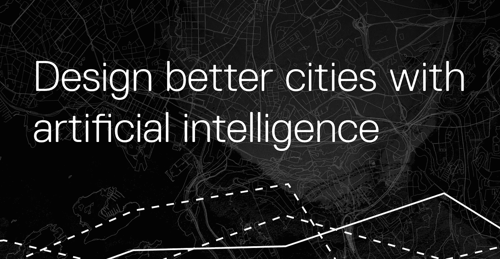

Image is a screenshot of the homepage of [Spacemaker AI’s website June 2019](https://spacemaker.ai/)

## PropTech 创业公司最大化任何建筑工地的价值

当人们问我在挪威看哪家公司时，我毫不含糊地回答:它是航天制造商 AI。毫无疑问。他们所做的令人难以置信的令人兴奋，你有一个很好的理由去检查他们，和他们交谈并找出原因。作为引子，让我直接引用他们的话，说:

> 太空制造商 AI 开发了一项改变游戏规则的 AI 技术，该技术发现了最聪明的方法来最大化任何建筑工地的价值。

这是一个很大的承诺，对不对？事实上，他们正在建设交付能力。航天制造商 AI 仍然是一家小公司，最近雇佣了 100 名员工。它被挪威最大的商业报纸评为[最热门的工作地点。几天前，据宣布，他们刚刚以 2500 万美元完成了首轮融资。正如在](https://www.dn.no/morgendagens-naringsliv/spacemaker/carl-christensen/havard-haukeland/grunderbedriften-har-snart-100-ansatte-pekes-ut-som-det-heteste-stedet-a-jobbe/2-1-577148?fbclid=IwAR2K5NbDjVYFAO1iEPmUJs_MJ6L5Y1R6TOrwCNe4fTCc1agt6am4d9F9Uuw) [TechCrunch](https://techcrunch.com/2019/06/09/spacemaker/?guccounter=1&guce_referrer_us=aHR0cHM6Ly93d3cuZ29vZ2xlLmNvbS8&guce_referrer_cs=W_xjsuXWgk556sngw9yZzA) 中提到的，他们的这轮投资由 Atomico 和 Northzone 牵头。

> 首轮融资是一家公司第一轮重大风险投资融资的典型名称。该名称指的是出售给投资者以换取其投资的优先股类别。

根据 [Shifter](https://shifter.no/proptech-er-hot-tech-bare-jordbruk-og-jakt-er-mindre-digitalisert/?fbclid=IwAR33bjZii96wR0kMxNwJjnjPCwCsTYJNds_woPnM39L_GLFKzqpA63vYAXs) 报道的 [Venturescanner](https://www.venturescanner.com/blog/tags/proptech) 的新数据，房地产技术已经从 2016 年 1137 家公司的 169.9 亿美元增长到 2019 年 1659 家公司的 550 亿美元。那是数字，但是太空制造者 AI 做什么？

> Spacemaker 被描述为“世界上第一款”用于房地产开发领域的人工智能辅助设计和施工模拟软件，它声称能够帮助房地产开发专业人士，如房地产开发商、建筑师和城市规划师，快速生成和评估任何多层住宅开发的最佳环境设计。为了实现这一目标，Spacemaker 软件处理各种数据，包括物理数据、法规、环境因素和其他偏好。
> [-TechCrunch 2019 年 6 月 10 日](https://techcrunch.com/2019/06/09/spacemaker/?fbclid=IwAR1qbR2lIZTjDE8oJF7fMppjBCQiq25fkmVwLRQIpU0DBQkcaUeARqoqM7k)

然而，让我们回溯几年来了解更多关于该公司的情况。

## 航天人艾的故事

根据官方公司注册[显示，太空创客 AI 于 2016 年末](https://www.proff.no/selskap/spacemaker-as/oslo/internettdesign-og-programmering/IF6BP5R0C2C/)由哈瓦德·豪克兰德和卡尔·克里斯滕森创立。Havard Haukeland 拥有建筑师的教育背景，曾在建筑和城市设计领域工作过。卡尔·克里斯滕森拥有计算机工程师的教育背景，另外还有工商管理和经济学硕士学位。

[2017 年末，有一篇文章称他们的数字解决方案是一项为期 4 年的科研项目的一部分](http://www.bygg.no/article/1329223)，该项目得到了阿斯佩林·拉姆、AF Eiendom、Stor-Oslo Eiendom 和 SINTEF 等公司的支持。然后，空间制造商 AI 从挪威研究委员会、创新挪威和 Simula 研究实验室获得了超过 1500 万挪威克朗(180 万美元)的资金，用于开发他们的数字解决方案。

2017 年 10 月，他们在一年内成长为一家拥有 20 名员工的小公司。他们当时正在谈论将人工智能用于城市规划和建筑工地。2017 年 9 月，一群投资者聚集在一起，向该公司投资 2200 万挪威克朗(265 万美元)。除此之外，CBRE 的挪威领导集团决定与 CBRE 一起投资，成为在纽约州注册的最大的商业地产顾问之一。这是他们的解决方案在 2017 年末的样子:

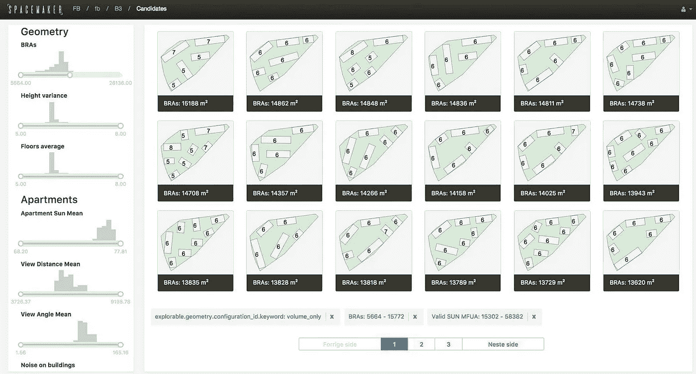

Picture by [DN Norwegian Newspaper from late 2017](https://www.dn.no/handel/arkitektur/spacemaker-ai/trond-riiber-knudsen/kunstig-intelligens-inntar-arkitektkontorene/2-1-188117)

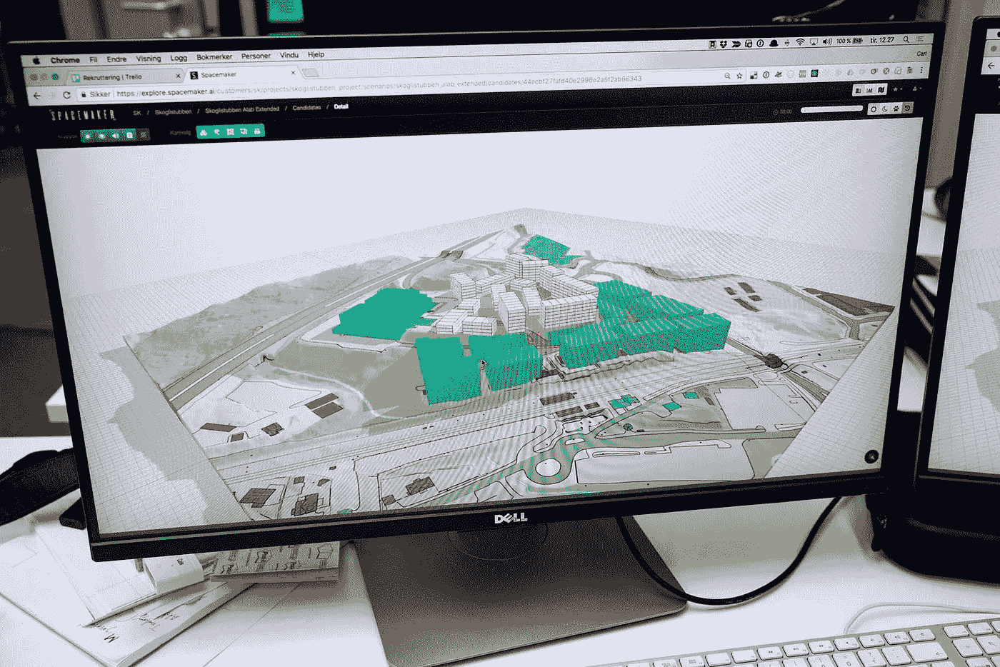

Sketch from the work for an early client taken by [DN Norwegian Newspaper in 2017](https://www.dn.no/handel/arkitektur/spacemaker-ai/trond-riiber-knudsen/kunstig-intelligens-inntar-arkitektkontorene/2-1-188117)

在他们的第一个项目完成仅两周之后，他们声称已经有超过 [100 家客户与他们接洽合作，而 Havard Haukeland 被提名为挪威年度最佳领导人才](https://e24.no/spesial/ledertalentene/2017/havard-haukeland)。

在 2017 年的时候，他们最大投资者的一位首席执行官坚持认为，如果他们敢于取得成功，那就必须是国际性的。他们的解决方案融合了建筑和人工智能领域。他们通过复杂的数学计算，对每个房地产项目的各种因素进行了预先考虑。尽管如此，他们还是承认，并非所有建筑的品质都是可以计算的。

> **“……我们不相信人工智能会取代建筑师。但使用人工智能的建筑师可能会取代不使用人工智能的建筑师。”**
> ——哈瓦德·豪克兰德 2017 年 9 月接受 DN[采访](https://www.dn.no/handel/arkitektur/spacemaker-ai/trond-riiber-knudsen/kunstig-intelligens-inntar-arkitektkontorene/2-1-188117)

2017 年的这个时候，他们还开始与哈佛大学的一名博士生研究员合作。这种合作后来蓬勃发展。Spacemaker 正在进行的另一个研究项目是与 SINTEF 合作的应用数学项目，名为 [OptiSite](https://www.sintef.no/en/digital/applied-mathematics/optimization/optisite/) ，已于 2017-2021 年开始滚动。

> **我们是 Spacemaker 创新项目 OptiSite 的研究合作伙伴。OptiSite 将使 Spacemaker 成为建筑设计和场地规划软件工具的全球领导者。在这个项目中，我们改进和发展优化和人工智能技术，以协助房地产开发。
> -SINTEF，2016 年 3 月 8 日**

据联合创始人[Havard Haukeland](https://medium.com/u/2ab030d90aa4?source=post_page-----5c800a001caa--------------------------------)称，2017 年底，太空创客 AI 被领先的非营利组织 Hello Tomorrow 评为 [500 家最具创新性的创业公司之一，以加速创业和科技创业。大约在这个时候，他们收到了代理公司](https://blog.spacemaker.ai/spacemaker-named-among-worlds-500-most-innovative-science-and-deep-tech-startups-2016618c2c12)[赛车](https://www.racecar.no/project-single/spacemaker-ai)的更名。因此，他们的研究能力和品牌都得到了发展。

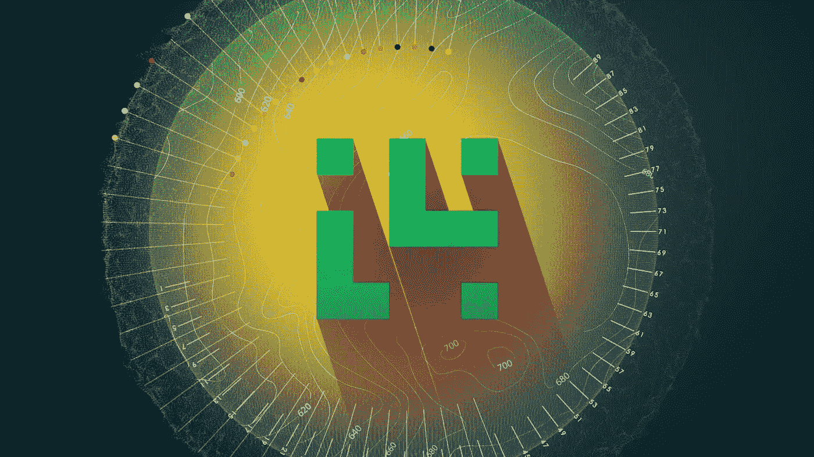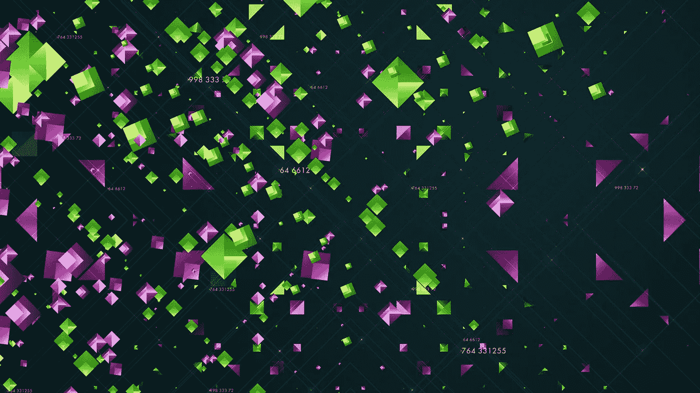

研究从一开始就是公司的核心，而且似乎贯穿了整个运营过程。2018 年年中，太空创客 AI 在美国设立了[办公室，并有了他们的第一位全职员工乔丹·霍夫曼](https://blog.spacemaker.ai/spacemaker-recruitment-trip-to-boston-78b9088b0432)。他的背景是应用数学，这似乎是对公司的一个合适的补充，因为公司在同年早些时候公布了他们的化妆。

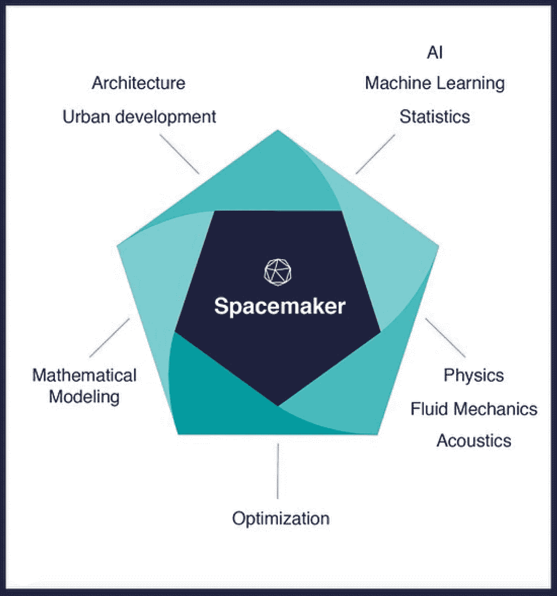

[Spacemaker AI Instagram the 15th of January](https://www.instagram.com/p/Bd-EOm_BoeS/)

从 Magnhild Gjestvang 在官方的 Spacemaker AI 媒体页面上写的博客文章中，还提到他们正在哈佛和麻省理工学院举行会议，既招聘又学习。他们当时被邀请到麻省理工学院做客座演讲，会见那里正在探索复杂的社会技术工程系统的系统设计师。

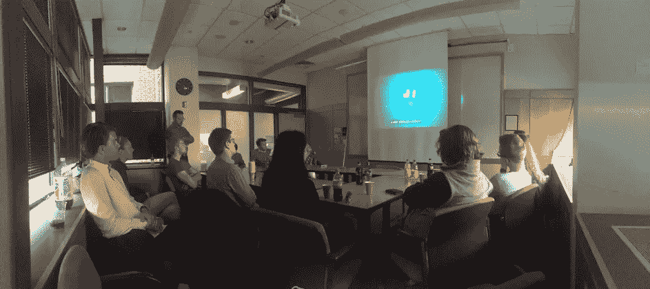

他们还在其他技术大学，如挪威的 NTNU 大学进行了演讲。他们积极地从大学和奥斯陆的其他公司招聘一些最好的开发人员来扩大他们的团队。国际招聘似乎从第一天起就是航天制造商 AI 的一项战略，至少在目前这一点上，它显然对他们有利。

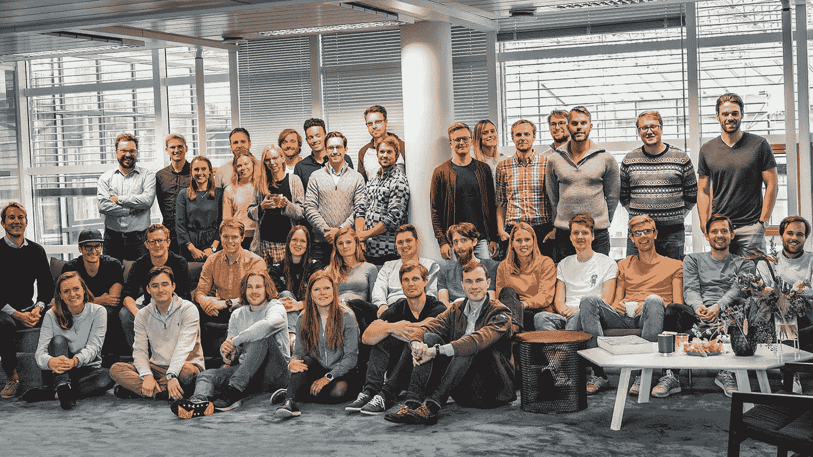

Spacemaker AI January 2019 from [their Facebook page](https://www.facebook.com/spacemakerai/photos/a.120823851913564/282368782425736/?type=3&theater)

他们被宣布为 2019 年挪威 B2B 类别的年度[创业公司，正如前面提到的，他们刚刚获得了](https://www.dn.no/staticprojects/2019/01/grundere/?sector=Fintech#/vinnere/oppstart-b2b)[2500 万美元的首轮融资](https://techcrunch.com/2019/06/09/spacemaker/?fbclid=IwAR1qbR2lIZTjDE8oJF7fMppjBCQiq25fkmVwLRQIpU0DBQkcaUeARqoqM7k)。除此之外，他们最近似乎还雇佣了一些设计人才来继续设计他们的 UX，并对他们的品牌进行更新。

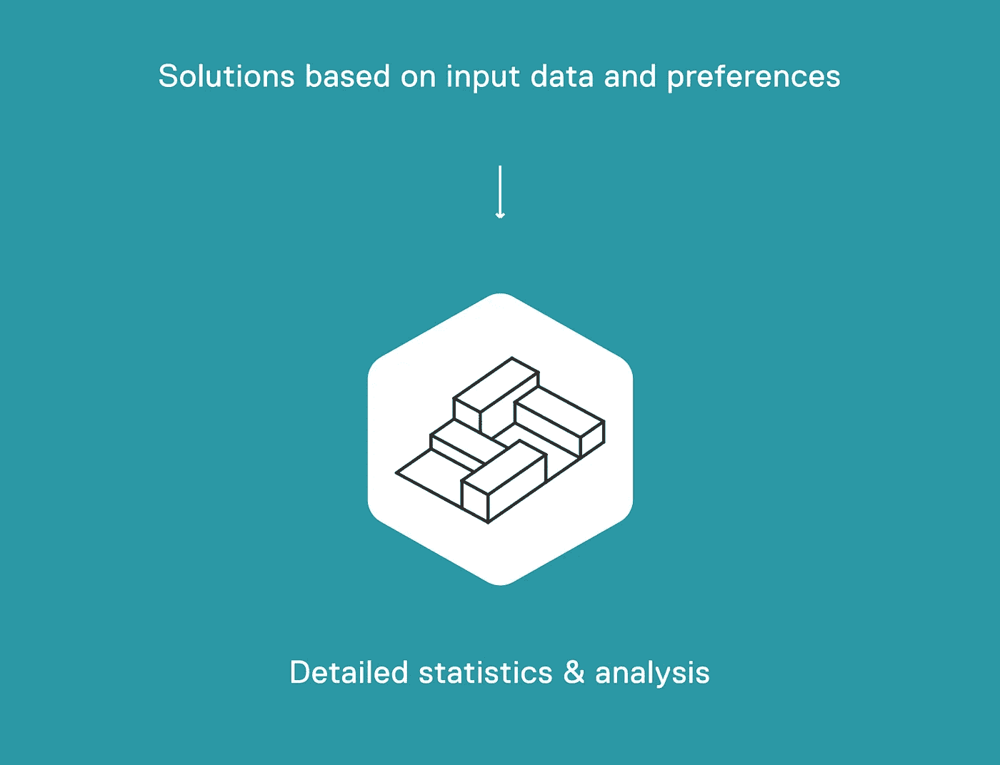

Image is a screenshot of the homepage of [Spacemaker AI’s website June 2019](https://spacemaker.ai/)

## 建筑人工智能

【2019 年 2 月，哈佛大学的硕士研究生和富布莱特研究员斯塔尼斯拉斯·夏鲁在出版物*中写了一篇名为[建筑人工智能](/the-advent-of-architectural-ai-706046960140?fbclid=IwAR3PchMM00pMEgzfLSXs47rOTQTTqSYxIqUgwVUZVBXviVIeCia-PDNqCDc)的文章。他描绘了建筑是如何经历发明和创新的。他把它分成四段序列。*

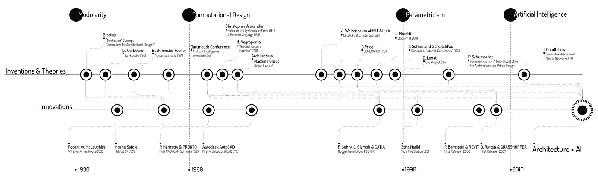

Four-period Sequence of Inventions and Innovations in Architecture made by [Stanislas Chaillou](https://medium.com/u/4c219cc8793?source=post_page-----5c800a001caa--------------------------------)

因此，从模块化网格的简单性和可负担性开始，到计算设计的出现。从模块，这是进一步通过计算设计成为可能。

> **计算设计(1)允许严格控制几何形状，提高设计的可靠性、可行性和成本，(2)促进和简化设计师之间的协作，以及(3)最终实现比传统手绘更多的设计迭代。更多测试&更多选择以获得更好的设计。**
> ——斯塔尼斯拉斯·夏鲁

之后，通过定义某些参数，可以重复设计，自动执行重复的手动过程。后来有了 BIM(建筑信息建模)，建筑中的每一个元素都是参数的函数。然而，斯塔尼斯拉斯认为这种参数化设计忽略了文化和社会因素，并提出这可以通过人工智能来解决。他说:

> **人工智能从根本上说是一种架构的统计方法。人工智能的前提是将统计原理与计算相结合，这是一种新的方法，可以改善参数化架构的缺点。**

2019 年 2 月《移位器上的一篇[文章提到，太空制造商 AI 的首席技术官卡尔·克里斯滕森在麻省理工学院举办了他的讲座。它还提到，太空制造商 AI 有五名全职员工，分别来自麻省理工学院、哈佛大学或耶鲁大学。与一些最重要的研究人员和成熟的行业专业人士一起，空间制造商 AI 正在询问是否有更好的方式来设计我们的城市。](https://shifter.no/mit-har-forelsket-seg-i-spacemaker-her-foreleser-den-norske-grunderen-pa-prestisjeuniversitetet/?fbclid=IwAR1aa_ViVqV62FkeRFVOqZJbJnGotBIS_Ln1MMlW0cXfKHbYUr79NvYJhIM)

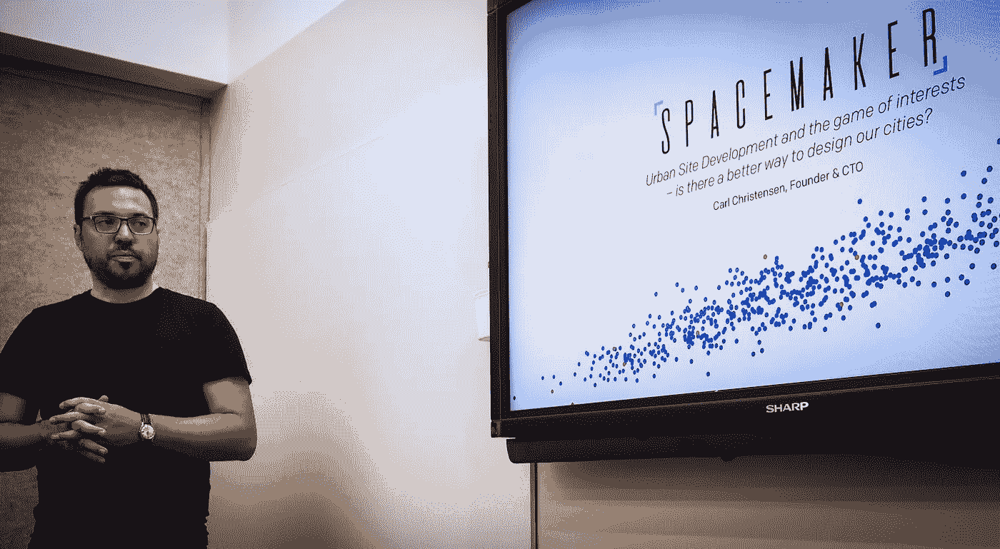

Photo taken by press and [published in Shifter](https://shifter.no/mit-har-forelsket-seg-i-spacemaker-her-foreleser-den-norske-grunderen-pa-prestisjeuniversitetet/?fbclid=IwAR1aa_ViVqV62FkeRFVOqZJbJnGotBIS_Ln1MMlW0cXfKHbYUr79NvYJhIM)

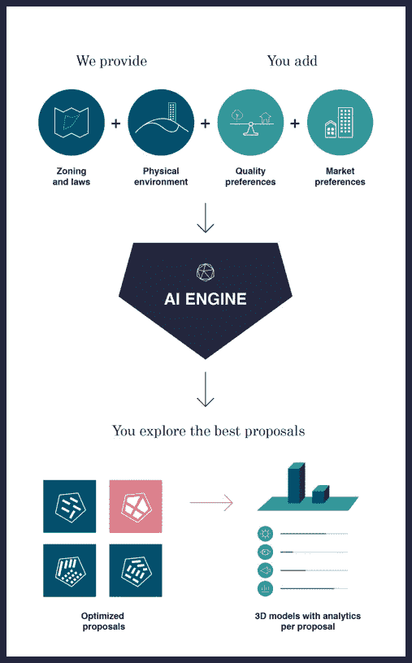

Image from the publication [Shifter February 2019](https://shifter.no/mit-har-forelsket-seg-i-spacemaker-her-foreleser-den-norske-grunderen-pa-prestisjeuniversitetet/?fbclid=IwAR1aa_ViVqV62FkeRFVOqZJbJnGotBIS_Ln1MMlW0cXfKHbYUr79NvYJhIM).

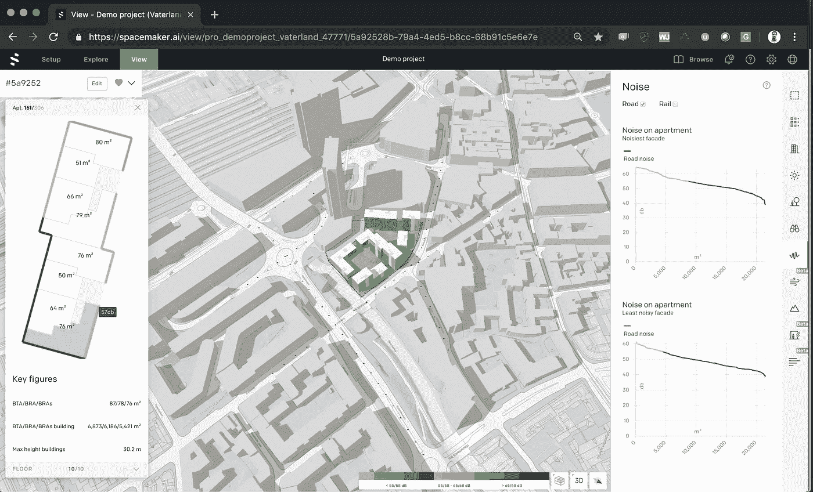

Picture from Demo project as shown by [TechCrunch](https://techcrunch.com/2019/06/09/spacemaker/?guccounter=1&guce_referrer_us=aHR0cHM6Ly93d3cuZ29vZ2xlLmNvbS8&guce_referrer_cs=W_xjsuXWgk556sngw9yZzA) 10th of June 2019

这是我项目#500daysofAI 的第 11 天。我希望你喜欢这篇文章。

> 什么是#500daysofAI？
> 
> 我在挑战自己，用#500daysofAI 写下并思考未来 500 天的人工智能话题。
> 
> 这是受电影《夏日 500 天》的启发，主角试图找出爱情失败的原因，并在此过程中重新发现他生活中真正的激情。

如果你想了解更多，请查看我现有的一些文章:

**1。** [**定义 AI — #500daysofAI**](https://medium.com/@alexmoltzau/500-days-of-artificial-intelligence-1-191cb486921b?source=friends_link&sk=887e8744ed51e477458ae60d2859dbad) :

**2。** [**应用人工智能与可持续城市论文**](https://medium.com/@alexmoltzau/an-essay-on-applied-artificial-intelligence-and-sustainable-cities-463fae866d77?source=friends_link&sk=23a53c2db129bdda4f243bd1cee9188a) :

**3。** [**当前伦理人工智能资助中的一些问题**](https://medium.com/@alexmoltzau/some-current-issues-in-funding-of-ethical-artificial-intelligence-a7be9ca1a178?source=friends_link&sk=70ba1570388643fc8334f305d4ebd706) :

**4。** [**人工智能领域的专利**](https://medium.com/@alexmoltzau/patents-in-the-field-of-artificial-intelligence-2019-52db9b03abe6?source=friends_link&sk=effdefe9c85481794fedad27d053990e) :

**5。** [**AI 为善 AI 为恶——发表于创业**](https://medium.com/swlh/ai-for-good-and-ai-for-bad-71627e3d7849?source=friends_link&sk=7ed4065fd7913db8b71354f3480f2b25) :

**6。** [**阿根廷和乌拉圭的艾治**](https://medium.com/swlh/ai-governance-in-argentina-and-uruguay-aeb68417db93?source=friends_link&sk=d352d3f641fcafc9b45649a9035cf15b) :

7 .**。** [**艾领域的三位作家**](https://medium.com/@alexmoltzau/three-writers-in-the-field-of-ai-44f14c0e3402?source=friends_link&sk=3610e4980c85f65d70e791d5af082248) :

**8。** [**斯堪的纳维亚 AI 战略 2019**](https://medium.com/@alexmoltzau/scandinavian-ai-strategies-2019-16ecec9f17dc?source=friends_link&sk=46ecb92fa21edd4a3268037c7fd7b926) :

**9。** [**社会科学家艾**](https://medium.com/ai-social-research/social-scientists-and-ai-1d9d97a5246?source=friends_link&sk=fb29f5178e3c4b34b7ec56082bfc3e47) :

**10。** [**10 对艾的思考**](https://medium.com/@alexmoltzau/10-thoughts-on-artificial-intelligence-e94c6c533270?source=friends_link&sk=1d9868554318868dce78d1d7e973e58c) :

感谢您的阅读！