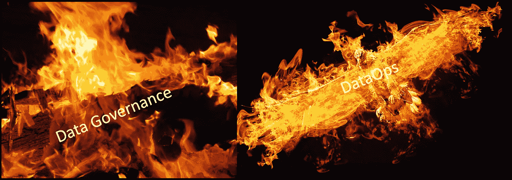
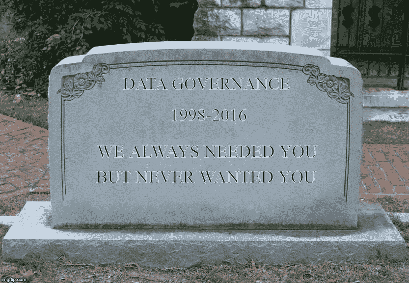
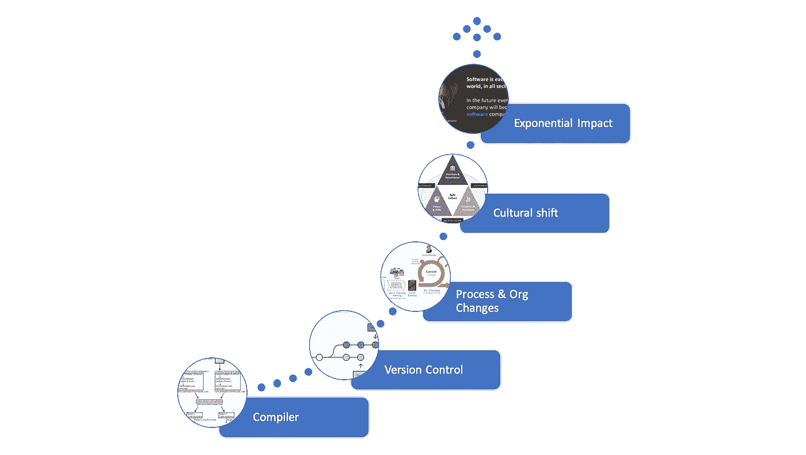
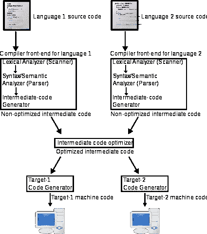
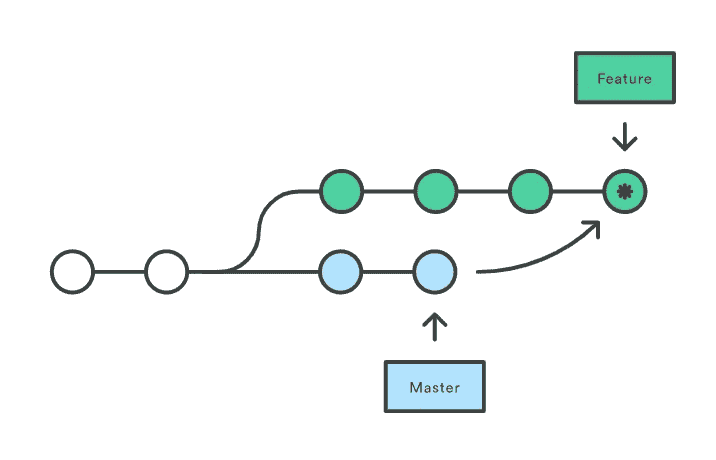
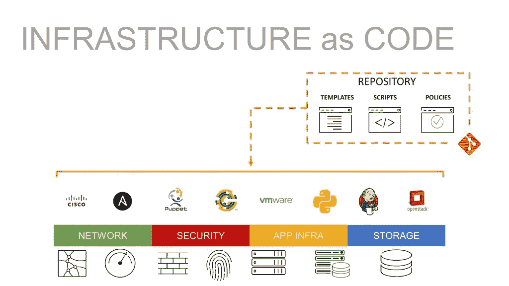
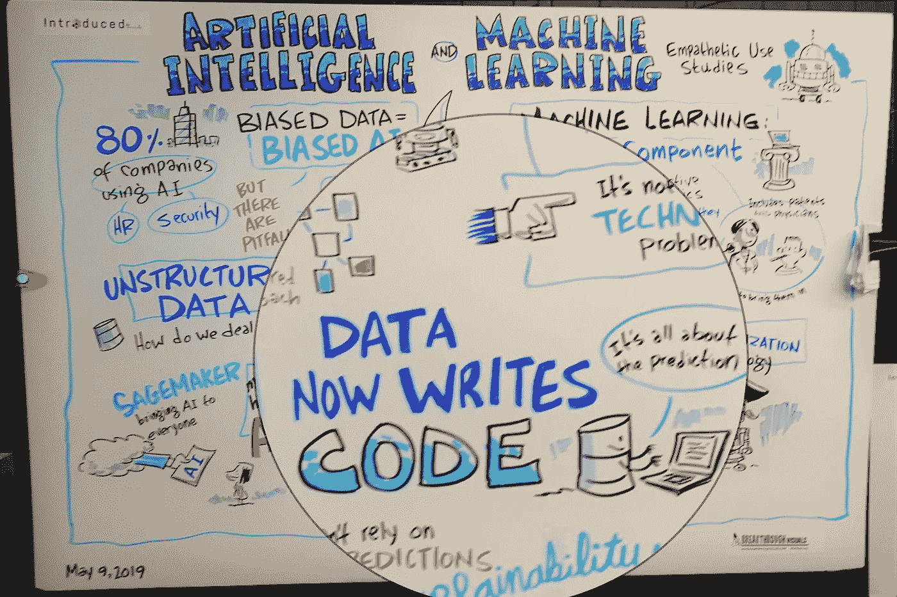
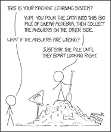
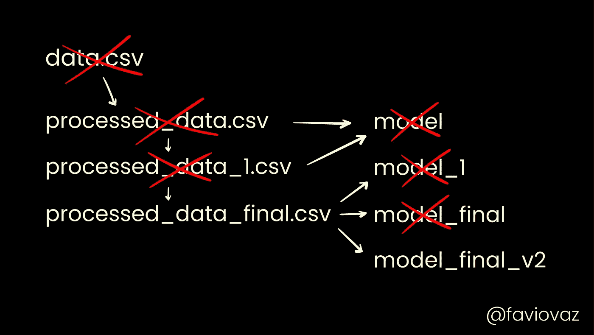
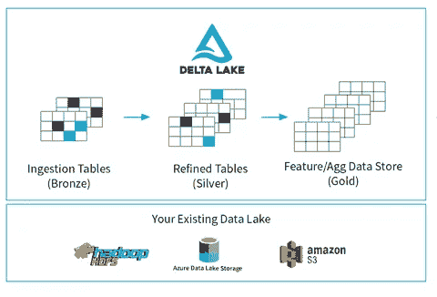

# 数据运营的兴起(从数据治理的灰烬中)

> 原文：<https://towardsdatascience.com/the-rise-of-dataops-from-the-ashes-of-data-governance-da3e0c3ac2c4?source=collection_archive---------0----------------------->

## ML 时代打破了传统的数据治理。让我们将它重建为一个工程学科，以推动数量级的改进。

# 公司知道他们需要数据治理，但是在实现数据治理方面没有取得任何进展

最近，高管们对数据治理感兴趣，因为有这样的文章:

1.  最近的 [Gartner 研究](https://www.gartner.com/smarterwithgartner/how-to-create-a-business-case-for-data-quality-improvement/)发现，组织认为糟糕的数据质量导致每年平均 1500 万美元的损失。
2.  [GDPR 的第一笔巨额罚款](https://www.cio.com/article/3338999/how-data-governance-can-support-data-privacy-compliance.html)是谷歌被法国数据管理局罚款 5700 万美元
3.  Equifax 数据泄露已经[给公司造成了 14 亿美元的损失](https://www.itpro.co.uk/data-breaches/29418/equifax-data-breach-cost-14-billion-so-far)(还在继续)，尽管事实上[数据从未被发现](https://www.cnbc.com/2019/02/13/equifax-mystery-where-is-the-data.html)。

另一方面，绝大多数数据治理计划未能取得进展，Gartner 还将 84%的公司归类为数据治理成熟度低的公司[。尽管](https://www.gartner.com/en/newsroom/press-releases/2018-12-06-gartner-data-shows-87-percent-of-organizations-have-low-bi-and-analytics-maturity)[几乎每个组织都认识到](https://hbr.org/2019/02/companies-are-failing-in-their-efforts-to-become-data-driven)数据治理的必要性，但由于该术语在高管阶层中的强烈负面含义，许多公司[甚至没有启动数据治理计划](https://hbr.org/2019/02/companies-are-failing-in-their-efforts-to-become-data-driven)。

## 当前的数据治理“最佳实践”被打破

以我的经验来看，缺乏进展的原因是**我们一直在以错误的方式进行数据治理，这使得它在到达时就死亡了**。斯坦·克里斯汀斯在[的《福布斯》文章](https://www.forbes.com/sites/forbestechcouncil/2018/03/26/data-governance-is-dead-meetings-and-spreadsheets-killed-it/#68e809772254)中说得很对，尽管事实上这本质上是他的公司的一个广告([一个非常有效的广告](https://www.collibra.com/pressroom/collibra-raises-100-million-led-by-capitalg-and-surpasses-1-billion-valuation/))。我同意他的观点，过去治理失败的主要原因是因为技术还没有准备好，组织无法找到激励人们遵循填补技术空白的过程的方法。然而，我不同意现代数据目录工具提供了我们成功所需的完整技术答案(尽管它们是朝着正确方向迈出的一步)。

## 如果数据目录工具不是答案，那什么是呢？

数据湖工具的最新进展(特别是大规模版本化数据的能力)使我们处于一个转折点，我们可以重新设想我们治理数据的方式(即文化、结构和流程，以实现风险缓解和治理成本降低)。在转型结束时，数据治理将看起来更像 DevOps，数据管理员、科学家和工程师密切合作，在整个数据分析生命周期中编纂治理策略。尽早采纳这些变革的公司将创造巨大的竞争优势。

为了理解我是如何得出这个结论的，我们必须回顾一下软件工程的历史，在软件工程中，两项核心技术创新促成了过程和最终的文化变革，将编码从一种爱好转变为一场席卷全球的革命。然后，我们将看到类似的创新是如何成为 DevOps 运动的主要推动者的，devo PS 运动在云时代同样转变了 IT 基础架构。最后，我们将看到这些创新如何推动数据治理的类似流程和文化变革。建立这个案例需要一点时间，但我还没有找到更好的方法来表达这一点，所以请继续关注我。

# 背景:源代码控制和编译如何创造了软件工程

创建软件工程学科的核心创新是:

1.  将一组输入编译成可执行输出的能力
2.  跟踪输入的版本控制系统

在这些系统出现之前，回到 20 世纪 60 年代，软件开发是一门手艺，一个工匠必须交付一个完整的工作系统。这些创新使得新的组织结构和过程能够应用于软件的创建，编程成为一门工程学科。这并不是说编程艺术不重要，只是这不是本文的主题。

从手工到工程的第一步是通过编译器用高级语言表达程序的能力。这使得编写程序的人更容易理解程序，也更容易在团队中的多人之间共享，因为程序可以被分解成多个文件。此外，随着编译器变得更加高级，他们通过将代码传递给许多中间表示来对代码进行自动化改进。

通过在最终产生系统的代码的所有变更中添加一致的版本系统，随着时间的推移，编码艺术变得“可度量”(按照彼得·德鲁克的名言:“你不能管理你不能度量的东西”)。从那时起，各种各样的增量创新，像自动化测试、代码质量的静态分析、重构、持续集成和许多其他的被添加进来，以定义额外的度量。最重要的是，团队可以针对特定版本的代码归档并跟踪 bug，并且*对他们交付的软件的特定方面做出保证*。显然，已经有许多其他的创新来改进软件开发，但是很难想到在某种程度上不依赖于编译器和版本控制的创新。

# 一切如代码:在别处应用软件工程的核心创新

近年来，这些核心创新被应用到新的领域，导致了一场名为*的运动。虽然我没有亲身经历，但我只能假设软件开发人员在 70 年代用怀疑的眼光看待 SVN 的第一个版本。同样，由“一切如代码”运动所消耗的许多新领域也受到了类似的质疑，有些人甚至声称他们的学科永远不会简化为代码。然后，在几年之内，规程中的一切都被简化为代码，这导致了对“遗留”做事方式的许多倍的改进。*

**

*Turning code into infrastructure using a “compiler” layer of virtualization and configuration management*

*第一个扩展领域是基础设施供应。在本例中，代码是一组配置文件和脚本，用于指定跨环境的基础架构配置，编译在云平台中进行，在云平台中，配置与脚本一起根据云服务 API 读取和执行，以创建和配置虚拟基础架构。虽然代码移动看起来像是一夜之间席卷所有基础架构团队的基础架构，但大量令人惊叹的创新(虚拟机、软件定义的网络、资源管理 API 等。)使“编译”步骤成为可能。这可能始于 VMWare 和 Chef 等公司的专有解决方案，但当公共云提供商在其平台上免费使用核心功能时，它被广泛采用。在这一转变之前，基础设施团队*管理*他们的环境以确保一致性和质量，因为它们很难重新创建。这导致了治理的分层，旨在在开发过程中的各个检查点应用控制。今天，DevOps 团队 e*engineer*他们的环境，控件可以内置到“编译器”中。这极大地提高了部署变更的能力，从几个月或几周缩短到几小时或几分钟。*

*这使得我们能够彻底反思改善基础设施的可能性。团队开始整理从零开始创建系统的每个阶段，使编译、单元测试、分析、基础设施设置、部署、功能和负载测试成为完全自动化的过程(连续交付)。此外，团队开始测试系统在部署前后的安全性(DevSecOps)。随着每个新组件进入版本控制，该组件的演化随着时间变得可测量，这将不可避免地导致持续的改进，因为我们现在可以*对我们交付的环境的特定方面做出保证*。*

# *言归正传:同样的事情也会发生在数据治理上*

*这种现象的下一个消费领域将是数据治理/数据管理。我不确定它的名字会是什么(DataOps、Data as Code 和 DevDataOps 似乎都有点过时)，但它的影响可能会比 DevOps/infrastructure as code 更有影响力。*

## *作为编译器的数据管道*

> *“有了机器学习，你的数据就写出了代码。”— Kris Skrinak，AWS ML 部门主管*

**

*机器学习的快速崛起提供了一种构建复杂软件的新方法(通常用于分类或预测事物，但随着时间的推移，它将做得更多)。这种将数据视为代码的心态转变将是将数据治理转化为工程学科的关键的第一步。另一个人说:*

> *"数据管道是简单的编译器，它使用数据作为源代码."*

*与软件或基础设施相比，这些“数据编译器”有三点不同，但也更复杂:*

1.  *数据团队拥有数据处理代码和底层数据。但是如果数据现在是源代码，就好像每个数据团队都在编写自己的编译器来从数据中构建可执行的东西。*
2.  *对于数据，我们一直通过元数据手动指定数据的结构，因为这有助于编写“数据编译器”的团队理解每一步要做什么。软件和基础设施编译器通常推断其输入的结构。*

**

*We don’t understand how data writes code*

*3.我们仍然没有真正理解数据是如何编写代码的。这就是为什么我们让*数据* *科学家*进行实验来弄清楚编译器的逻辑，然后*数据工程师*随后进来构建优化器。*

*当前的一套数据管理技术平台(Collibra、Waterline、Tamr 等。)是为了支持这个工作流程而建立的，他们做得非常好。然而，他们支持的工作流仍然使得数据治理的定义成为在审查会议中处理的手动过程，这阻碍了我们在开发运维&基础设施作为代码出现后看到的改进类型。*

## *缺失的环节:数据版本控制*

**

*Applying data version control. Credit to the DVC Project: [https://dvc.org/](https://dvc.org/)*

*因为数据是在“真实世界”中生成的，而不是由数据团队生成的，所以数据团队一直专注于控制描述数据的元数据。这就是为什么我们在数据治理(试图管理您不能直接控制的东西)和数据工程(我们实际上是在设计数据编译器而不是数据本身)之间划了一条线。目前，数据治理团队试图在不同的点应用手动控制来控制数据的一致性和质量。对数据引入版本跟踪将允许数据治理和工程团队一起*设计*数据，针对数据版本归档错误，对数据编译器应用质量控制检查，等等。这将允许数据团队*对数据交付的系统组件做出保证*，历史已经表明，这将不可避免地导致数据驱动系统的可靠性和效率的数量级提高。*

# *数据版本控制的临界点已经到来*

*像 Palantir Foundry 这样的平台已经像开发人员对待代码版本一样对待数据管理。在这些平台中，数据集可以被版本化、分支、由版本化代码操作以创建新的数据集。这使得数据驱动测试成为可能，数据本身的测试方式与单元测试对修改数据的代码的测试方式非常相似。当数据以这种方式流过系统时，系统会自动跟踪数据的谱系，就像在每个数据管道的每个阶段产生的数据产品一样。这些转换中的每一个都可以被视为编译步骤，在机器学习算法将最终的中间表示(数据团队通常称之为特征工程数据集)转换为可执行形式以进行预测之前，将输入数据转换为中间表示。如果你手头有 1000 万到 4000 万美元的资金，并且愿意与某个供应商合作，那么 Foundry 中所有这一切的整合是非常令人印象深刻的(声明:我没有太多 Foundry 的实践经验；这些陈述基于我在客户端看到的真实实现的演示。*

**

*The DataBricks Delta Lake open source project enables data version control for data lakes*

*对于我们其余的人来说，现在有开源的替代方案。[数据版本控制项目](https://dvc.org/)是一个针对数据科学家用户的选项。对于大数据工作负载，随着他们的[开源三角洲湖项目](https://docs.databricks.com/delta/index.html)的发布，DataBricks 已经迈出了为数据湖开源真正版本控制系统的第一步。这些项目是全新的，所以分支、标记、血统跟踪、bug 归档等等。还没有添加，但是我很确定社区会在接下来的一年左右添加它们。*

# *下一步是重建数据治理*

*版本控制和数据编译技术的到来促使数据团队开始重新思考他们的流程如何利用这一新功能。那些能够积极利用这种能力来做出保证的人，很可能会为他们的组织创造巨大的竞争优势。第一步是终止基于检查点的治理流程。相反，数据治理、科学和工程团队将紧密合作，在数据被数据管道编译成可执行的东西时，实现数据的持续治理。在这之后的某个地方，将会把从数据中编译的组件与纯软件和基础设施集成为一个单元；虽然我不认为有技术可以做到这一点。其余的将随着时间的推移而出现( [中的](https://medium.com/swlh/flattening-the-mistrust-curve-in-your-data-strategy-with-dataops-db79b63359c)[和](/how-to-do-data-quality-with-dataops-90c1ab94e626) [以及其他](https://medium.com/swlh/a-practical-guide-to-get-started-with-dataops-c0061656b83b) [帖子](https://medium.com/swlh/speed-up-your-data-transformation-with-data-catalysts-741cc1f5412))，实现一种治理文化，减少主要问题，同时加快机器学习计划的价值实现时间。我知道这听起来很疯狂，但这是一个令人兴奋的数据治理时代。*

*如果你已经读到这里，你可能对数据治理感兴趣，所以请留下评论或写下你的想法。*