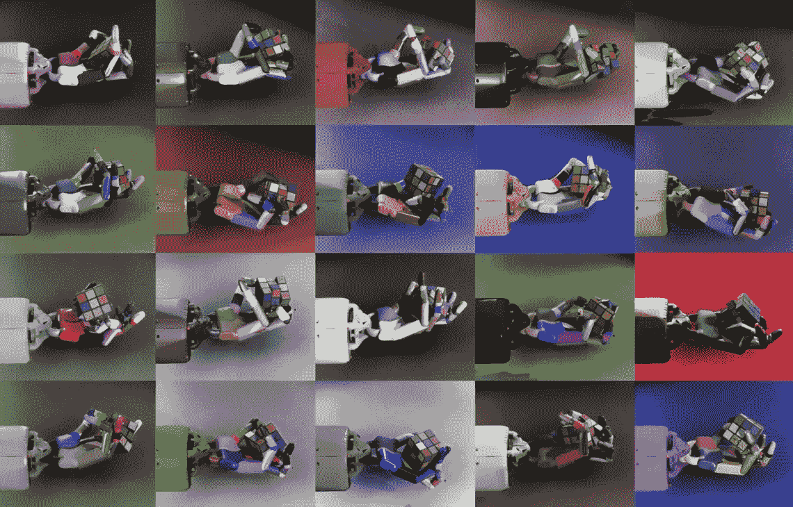
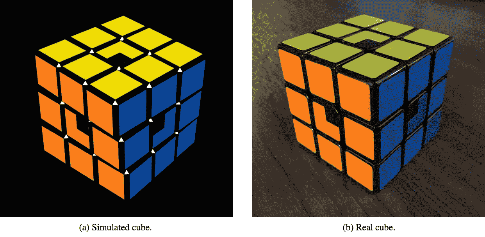
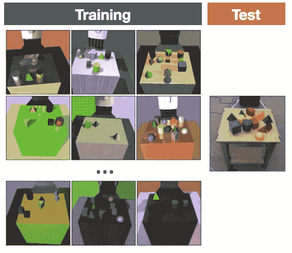
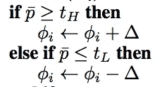
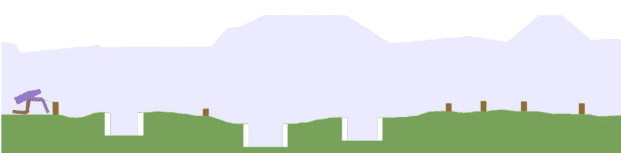
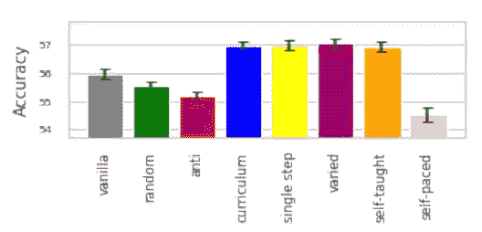
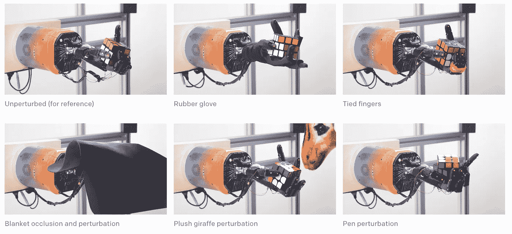

# 元学习的兴起

> 原文：<https://towardsdatascience.com/the-rise-of-meta-learning-9c61ffac8564?source=collection_archive---------3----------------------->

[https://openai.com/blog/solving-rubiks-cube/](https://openai.com/blog/solving-rubiks-cube/)

**元学习**描述了设计与训练深度神经网络相关的更高级组件的抽象。当提到神经网络架构的自动化设计时，术语“*元学习*在深度学习文献中频繁引用“ *AutoML* ”、“*少量学习*”或“*神经架构搜索*”。从标题滑稽的论文中脱颖而出，如“*通过梯度下降学习梯度下降学习*”，OpenAI 的魔方机器人手的成功证明了这一想法的成熟。元学习是推进深度学习和人工智能的最先进的最有前途的范式。

OpenAI 通过展示经过强化学习训练的机器人手的开创性能力，点燃了人工智能世界。这一成功建立在 2018 年 7 月提交的一项[非常相似的研究](https://openai.com/blog/learning-dexterity/)的基础上，该研究让一只机器手按照与视觉提示匹配的配置来定向一块积木。这种**从面向块到解决魔方的演变**是由元学习算法推动的，该算法控制模拟中的训练数据分布，即自动域随机化(ADR)。

# **域名随机化—数据扩充**

域随机化是一种解决 sim2 真实传输的数据扩充问题的算法。函数逼近(和深度学习)的核心功能是从它在训练中所学到的东西中归纳出从未见过的测试数据。虽然不像错误分类那样令人惊讶于几乎不可见的[敌对噪声注入](https://arxiv.org/pdf/1511.04599.pdf)，但深度卷积神经网络在没有特殊修改的情况下，不会在模拟图像(显示在左下方)上训练时推广到真实的视觉数据(显示在右下方)。

“Solving Rubik’s Cube with a Robot Hand” by Ilge Akkaya, Marcin Andrychowicz, Maciek Chociej, Mateusz Litwin, Bob McGrew, Arthur Petron, Alex Paino, Matthias Plappert, Glenn Powell, Raphael Ribas, Jonas Schneider, Nikolas Tezak, Jerry Tworek, Peter Welinder, Lilian Weng, Qiming Yuan, Wojciech Zaremba, Lei Zhang

自然，有两种方法可以将模拟数据分布与真实数据分布对齐。苹果研究人员开发的一种方法叫做 [SimGAN](https://arxiv.org/abs/1612.07828) 。SimGAN 使用对抗损失来训练[生成对抗网络](https://papers.nips.cc/paper/5423-generative-adversarial-nets.pdf)的生成器，以使模拟图像尽可能真实地出现，由鉴别器将图像分类为属于真实或模拟数据集。该研究报告了眼睛注视估计和手姿态估计的积极结果。另一种方法是使模拟数据尽可能多样化，相反，尽可能真实。

后一种方法被称为[域随机化](https://arxiv.org/pdf/1703.06907.pdf)。托宾等人 2017 年的论文中的下图很好地说明了这一想法:

“Domain Randomization for Transferring Deep Neural Networks from Simulation to the Real World” by Josh Tobin, Rachel Fong, Alex Ray, Jonas Schneider, Wojciech Zaremba, Pieter Abbeel

域随机化似乎是弥合 Sim2Real 差距的关键，允许深度神经网络在模拟训练时推广到真实数据。与大多数算法不同，域随机化带有许多需要调整的参数。下图显示了块的颜色，环境的照明，阴影的大小等等的随机化。这些随机环境特征中的每一个都有一个下限到上限的区间和某种抽样分布。例如，当对随机环境进行采样时，该环境具有非常明亮的照明的概率是多少？

在 OpenAI 的原始 Dactyl 研究中，用机械手实现块定向，域随机化数据课程在实验之前被手动编码。这种领域随机化超越了视觉世界，使物理模拟器中的组件随机化，从而产生一种策略，使机器人手能够灵巧而精确地移动。与视觉随机化的想法类似，这些物理随机化包括立方体的大小/质量和机器人手中手指的摩擦力等维度([参见附录 B 用机器人手解魔方了解更多细节](https://d4mucfpksywv.cloudfront.net/papers/solving-rubiks-cube.pdf))。

从 Dactyl 到 Rubik's Cube solver 的关键是域随机化是课程定义随机化的强度是**自动**而不是手动设计的，在 ADR 算法的以下行中明确定义:

Image from “Solving Rubik’s Cube with a Robot Hand”. If the agent’s performance exceeds a parametric performance threshold, the intensity of the randomization is increased (given by delta with phi defining the distribution of the environment parameters)

**设计自己数据的 AI**

人工智能设计自己数据的最好例子之一是由优步人工智能实验室的研究人员开发的[成对开放式开拓者(诗人)](https://arxiv.org/pdf/1901.01753.pdf)算法。

“Paired Open-Ended Trailblazer (POET): Endlessly Generating Increasingly Complex and Diverse Learning Environments and Their Solutions” by Rui Wang, Joel Lehman, Jeff Clune, Kenneth O. Stanley

POET 通过同时优化代理和它学习行走的环境来训练两足行走代理。POET 与 OpenAI 的魔方解算器不同，它使用进化算法，维护步行者和环境的种群。在这项研究中，主体和环境群体的结构是构建复杂性进化的关键。尽管与基于群体的学习来适应一组代理相比，使用强化学习来训练单个代理，POET 和自动领域随机化非常相似。他们都以自动化的方式开发了一系列日益具有挑战性的训练数据集。两足动物的行走环境不会随着手动编码的功能而改变，而是作为步行者在不同环境中的表现的结果，在该开始挑战地形时发出信号。

# 数据还是模型？

元学习的研究通常集中在数据和模型架构上，除了像[元学习优化器](https://arxiv.org/pdf/1707.09835.pdf)这样的例外，它似乎仍然属于模型优化的范畴。数据空间中的元学习，如自动领域随机化，已经以[数据扩充](https://link.springer.com/article/10.1186/s40537-019-0197-0)的形式进行了大量研究。

数据扩充在图像数据的环境中最容易理解，尽管我们已经看到物理数据是如何被扩充和随机化的。这些图像放大通常包括水平翻转和小幅度的旋转或平移。这种增强在任何计算机视觉管道中都是典型的，例如图像分类、对象检测或超分辨率。

课程学习是另一种数据级优化，它涉及数据呈现给学习模型的顺序。例如，让学生从简单的例子开始，比如 2 + 2 = 4，然后再引入更难的概念，比如 2 = 8。课程学习的元学习控制者根据感知难度的一些度量标准以及数据应该呈现的顺序来查看数据是如何排列的。Hacohen 和 Weinshall 最近的一项研究在 ICML 2019 年大会上展示了这一有趣的成功(如下所示)。

“On the Power of Curriculum Learning in Training Deep Networks” by Guy Hacohen and Daphan Weinshall. Vanilla SGD data selection shown on the gray bar on the far left is outperformed by curriculum learning methods

神经架构搜索或元学习模型通常比数据级优化受到更多关注。这是深度学习研究趋势的高度推动。将基础 AlexNet 架构扩展到 ResNet 架构会带来明显的性能优势，该架构率先使用在大 GPU 计算的大数据集上训练的深度卷积网络。ResNet 通过 DenseNet 等手工设计得到进一步扩展，然后被 AmoebaNet 和 EfficientNet 等元学习技术超越。图像分类基准推进的时间线可以在[paperswithcode.com](https://paperswithcode.com/sota/image-classification-on-imagenet)上找到。

元学习神经架构试图描述一个可能架构的空间，然后根据一个或多个客观指标搜索最佳架构。

# 高级元学习者

神经结构搜索已经采用了广泛的算法来搜索结构，随机搜索、网格搜索、贝叶斯优化、神经进化、强化学习和可区分搜索。与 OpenAI 的自动域随机化技术相比，这些搜索算法都相对复杂。自动域随机化的想法似乎可能会随着高级搜索算法的出现而得到改善，例如，像加州大学伯克利分校的研究人员或谷歌的的[自动增强所证明的](https://arxiv.org/abs/1805.09501)[基于人口的搜索在数据增强中是有用的。](https://arxiv.org/abs/1905.05393)

# 元学习的表达能力如何？

在神经结构搜索中经常提出的元学习的限制之一是搜索空间的约束。神经结构搜索从人工设计的可能结构的编码开始。这种人工编码自然限制了搜索可能的发现。然而，要使搜索可计算，有一个必要的折衷。

当前的架构搜索将神经架构视为有向无环图(Dag ),并试图优化节点之间的连接。诸如 Gaier 和 Ha 的“权重不可知神经网络”和谢等人的“探索用于图像识别的随机连线神经网络”的论文表明，构建 DAG 神经架构是复杂的，并且没有被很好地理解。

有趣的问题是，神经架构搜索何时能够优化节点上的操作，它们之间的连接，然后自由地发现像新颖的激活函数、优化器或标准化技术这样的东西，如[批量标准化](https://arxiv.org/abs/1502.03167?context=cs)。

想想元学习控制器能有多抽象是很有趣的。例如，OpenAI 的魔方解算器本质上有 3 个“智能”组件，一个符号化的魔方解算器，一个视觉模型和一个控制机器人手的控制器网络。元学习控制器是否足够聪明，能够理解这种模块化，并设计由加里·马库斯最近发起的符号和深度学习系统之间的混合系统？

元学习数据扩充也非常受限。大多数数据扩充搜索(甚至是自动域随机化)被约束到元学习控制器可用的一组转换。这些变换可能包括图像的亮度或模拟中阴影的强度等内容。增加数据扩充自由度的一个有趣的机会是将这些控制器与能够探索非常独特的数据点的生成模型相结合。这些生成模型可以设计新的狗和猫的图像，而不是旋转现有的图像或使图像变暗/变亮。虽然非常有趣，[但它似乎不像当前最先进的生成模型，如比根或 VQ-VAE-2 在 ImageNet 分类上的数据增强工作。](https://openreview.net/pdf?id=rJMw747l_4)

# 迁移和元学习

“元学习”经常用于描述迁移和少量学习的能力，不同于“AutoML”如何用于描述模型或数据集的优化。这种定义与通过自动域随机化解决的 Sim2Real 的域适应任务非常一致。然而，该定义也描述了学习，例如从[图像网络分类](http://www.image-net.org/)转移到[识别钢缺陷](https://www.kaggle.com/c/severstal-steel-defect-detection)。

魔方求解器的一个有趣的结果是适应扰动的能力。例如，尽管将橡胶手套戴在手上，将手指绑在一起，并且覆盖立方体的遮挡，解算器仍能够继续，(视觉模型必须完全受损，因此必须由 Giiker 立方体的传感器进行感测)。这种转移元学习是用于训练机器人手控制的策略网络中的 LSTM 层的结果。我认为这种“元学习”的使用与 AutoML 优化相比更像是记忆增强网络的一个特征。我认为这表明了统一元学习和为这个术语确定一个单一定义的困难。

# 结论

由于机器人手协调的华丽展示，魔方解算器的成功显然引人注目。然而，这项研究更有趣的组成部分是引擎盖下的元学习数据随机化。这是一种在设计训练数据的同时进行学习的算法。Jeff Clune 的 AI-GAs 中描述的这种范式，即包含元学习架构的算法，元学习学习算法本身，并生成有效的学习环境，将成为深度学习和人工智能进步的巨大机遇。感谢您的阅读，如果您想了解更多关于 OpenAI 的论文，请查看下面的视频！