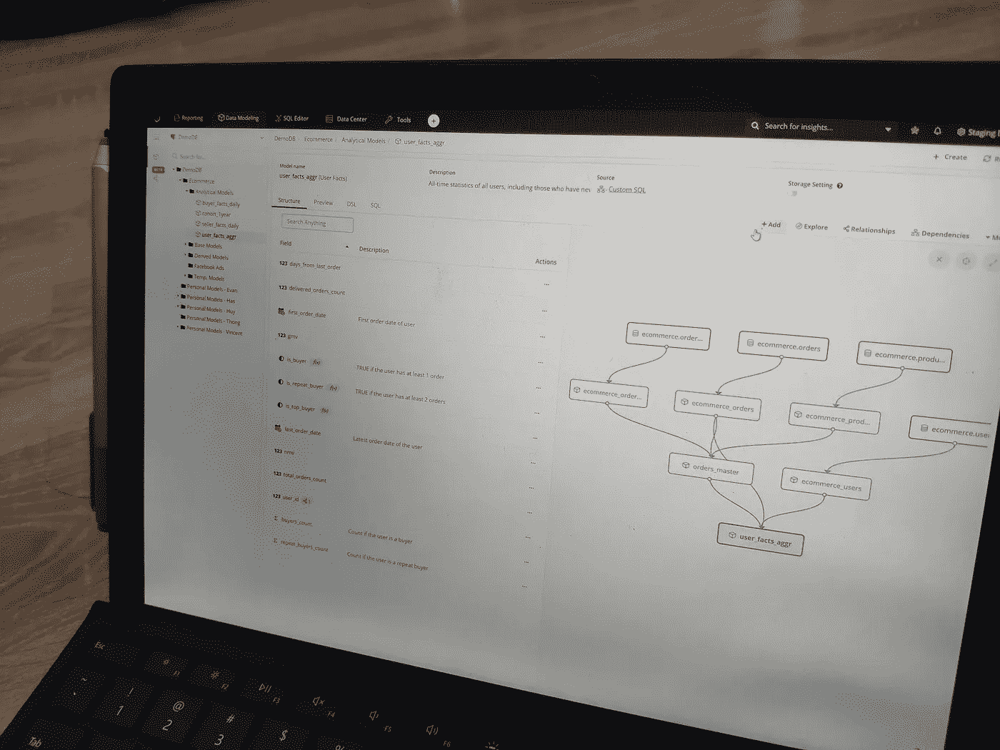

# 基于 SQL 的数据建模和数据操作的兴起

> 原文：<https://towardsdatascience.com/the-rise-of-sql-based-data-modeling-and-dataops-5b8e3270e101?source=collection_archive---------11----------------------->

*更新:对复杂的分析前景感到困惑？查看我们的书:* [*《分析学设置指南》*](https://www.holistics.io/books/setup-analytics/?utm_source=medium&utm_campaign=sql-based-dm) *。*

*原载于 2019 年 11 月 15 日我们的总工程师 Thanh 在*[*https://www . holistics . io*](https://www.holistics.io/blog/the-rise-of-sql-based-data-modeling-and-dataops/)*。*

# 基于 SQL 的 RDBMS 的复兴

如果有一个我们都同意的分析趋势，那就是在过去十年中，我们已经看到了收集的业务数据量的巨大增长。如今，一个典型的企业使用数十个甚至数百个基于云的订阅即服务软件，用于各种目的。与几年前相比，如今普通企业加上更传统的内部企业软件会产生大量数据。

更精明的企业发现了分析数据的巨大价值，以便做出明智的决策，从而导致数据管理系统的需求和供应大幅上升。

直到几年前，传统的数据管理方式(基于 SQL 的 RDBMSs)还被认为是过去的遗留物，因为这些系统无法扩展以处理如此巨大的数据量。相反，HBase、Cassandra 和 MongoDB 等 NoSQL 系统变得流行起来，因为它们将自己标榜为可伸缩和更易于使用。

> 今天，基于 SQL 的数据库系统似乎有所复苏

然而今天，基于 SQL 的数据库系统似乎有所复苏。根据亚马逊首席技术官的说法，其 PostgreSQL 和 MySQL 兼容的 Aurora 数据库产品是“AWS 历史上增长最快的服务”。

基于 SQL 的 MPP(大规模并行处理)数据仓库，过去价格昂贵，只能由大企业购买，现在已经转移到云上，并日益商品化。今天，所有主要的云提供商都有自己的 MPP 数据仓库:谷歌有 BigQuery，亚马逊有 Redshift，微软有 Azure 数据仓库……更不用说雪花——一家独立的数据仓库供应商，最近估值为 39 亿美元。每个人现在都可以建立自己的数据仓库…并按分钟付费，这在十年前是闻所未闻的。

这些发展为数据分析师带来了巨大的能力和前所未有的访问权限，因为他们现在可以执行复杂的分析查询，并在几秒或几分钟内获得结果，而不是像传统的数据仓库那样需要几个小时。

# 用于数据分析的 SQL

对于数据分析，这种复苏的原因很容易理解:

*   NoSQL 不擅长分析查询:缺少连接意味着在这些数据库上编写复杂的分析查询几乎是不可能的。
*   没有标准化的查询语言:每个供应商都创建自己的语言来查询他们的 NoSQL 数据库，这增加了分析师的摩擦和学习曲线。

另一方面，SQL 是无处不在和标准化的。几乎每个数据分析师都熟悉它。

用谷歌自己的话说，他们的大规模可扩展内部数据管理系统 Google Spanner:

> Spanner 的原始 API 提供了 NoSQL 方法，用于单个表和交叉表的点查找和范围扫描。虽然 NoSQL 方法提供了启动 Spanner 的简单途径，并继续在简单的检索场景中有用，但 SQL 在表达更复杂的数据访问模式和将计算推送到数据方面提供了重要的附加值。
> 
> *Spanner 的 SQL 引擎与谷歌的其他几个系统共享一种通用的 SQL 方言，称为“标准 SQL”，包括 F1 和 Dremel 等内部系统，以及 BigQuery 等外部系统……对于谷歌内部的用户来说，这降低了跨系统工作的障碍。针对 Spanner 数据库编写 SQL 的开发人员或数据分析师可以将他们对该语言的理解转移到 Dremel，而不用担心语法、空处理等方面的细微差异。*

随着基于云的 MPP 数据仓库的兴起，SQL 现在已经成为一种非常有吸引力的数据分析方式。利用这一趋势，像 Mode Analytics、Periscope Data 和 Redash 这样的开源工具这样的初创公司变得越来越受欢迎。对于精通 SQL 的分析师来说，他们现在可以利用其全新的基于云的数据仓库的能力来制作漂亮的图表和仪表板，而无需学习任何专有语言或工具。此外，SQL 代码只是文本，因此可以存储在版本控制系统中，管理起来很简单。

# SQL 的问题

然而，使用 SQL 进行数据分析并非一帆风顺。

任何严重依赖 SQL 的工具都是业务用户的禁区，他们不仅仅想查看静态图表和仪表板，但又不懂 SQL 语言。它迫使业务用户退回到老派的电子表格，在那里他们将原始数据导出到 Excel 并自己执行手动计算，从而导致准确性和数据一致性方面的问题。

SQL 也太低级了，当需要更复杂的分析时，查询很快变得复杂。当分析需要几个表时，大多数 SQL 查询读起来都不错。但是，当相关表的数量增加时，数据分析人员不得不跟踪多种类型的连接，并在每次编写查询时为正确的情况选择正确的连接。

这意味着 SQL 不可重用，导致逻辑略有不同的类似代码到处重复。例如，无论何时需要进行与会计相关的分析，都不能轻易地为会计目的编写一个 SQL“库”并将其分发给团队的其他成员以供重用。

# 传统数据建模

向非技术用户提供 BI 的传统方式是在分析师通过[数据建模流程](https://www.holistics.io/blog/holistics-data-modeling-explained/)准备好数据集之后，给他们一个拖放界面。该流程允许分析师在业务逻辑和原始底层数据之间建立映射。通过软件界面向最终用户展示高级业务概念，使他们无需学习 SQL 之类的查询语言就能自己探索数据。

这个过程始于几十年前的 Cognos、SAP BI 等供应商。现代版本包括 Sisense、Tableau 和 PowerBI 等供应商。然而，无论新旧，这些工具都有相同的问题。

> 遗留工具并不是为了利用现代数据仓库而设计的。

首先，数据在变得有用之前被加载到每个供应商的专有数据存储中。这意味着数据现在是重复的，现代强大的 MPP 数据仓库只不过是一个简单的数据存储。原因很简单，因为这些工具不是为利用现代数据仓库而设计的。它们是在数据仓库昂贵的时代设计的，当时每个 BI 工具都很自然地构建自己的数据存储引擎。

第二，数据建模过程主要是基于 GUI 的，这意味着它不容易重用，也不能利用强大的版本控制系统(如 g it)来跟踪变化。

# 基于 SQL 的数据模型方法

这两种方法的优点自然为我们指出了一个新的方向:如果我们能够将 SQL 的强大功能和数据建模的易用性结合起来，会怎么样呢？答案是我们绝对可以！

最近被谷歌以 26 亿美元收购的 Looker 是使用这种方法的先驱。它提供了一种称为 LookML 的数据建模语言，作为客户数据库之上的抽象层。该软件不会将数据加载到自己的数据存储中，也不会使用专有的查询引擎。相反，当非技术用户使用 Looker 浏览数据时，该软件会将建模输入转换为 SQL 查询，然后将该查询发送到客户的数据库。这意味着用户根本不需要了解 SQL，但仍然可以利用现代 MPP 数据仓库的能力！

使用基于文本的建模语言的另一个优点是，现在整个建模层可以存储在一个强大的版本控制系统中，这使得跟踪变更和在出现问题时恢复变得很简单。

# 基于 SQL 的端到端数据管道

基于 SQL 的数据模型方法只是冰山一角。

以 ETL 为例。为了让我们的业务数据出现在数据仓库中并准备好进行建模，我们需要从多个来源导入数据，并将数据转换成适合分析的格式。传统上，这些任务属于一类叫做 ETL 工具的工具。该过程包括三个步骤:

1.  提取-从源中提取数据。
2.  转换—将数据转换为最终可用的格式。
3.  加载—将转换后数据加载到数据仓库中。

随着强大的 MPP 数据仓库的出现，越来越多的数据团队开始转向 ELT 方法，而不是 ETL 方法。这个过程从数据源中提取原始数据，并将它们直接加载到数据仓库中，不涉及任何转换。一旦存储，分析师就可以使用他们最喜欢的工具——SQL——将数据转换成适合消费的最终格式。

因为数据转换现在是用 SQL 编写的，所以很自然地，我们可以对它应用相同的基于 SQL 的数据建模方法！

像 Holistics 这样的工具将 Looker 基于 SQL 的数据建模方法向前推进了一步，将建模进一步扩展到 L(加载)和 T(转换)层，覆盖了端到端的整个分析管道。

这种使用统一的基于 SQL 的建模方法来导入、转换和探索数据的方法揭示了以前没有的多种优势:

*   它使数据分析师能够**从端到端**拥有整个数据分析管道，显著缩短每次分析的洞察时间，同时保持相同的要求:即符合当前的行业标准 SQL。
*   数据上下文被保留。这意味着分析的最终结果可以追溯到它们的来源，**使得调试数据准确性问题变得微不足道。**
*   它**打破了数据利益相关者**如数据工程师、数据分析师、数据科学家和业务用户之间的自然孤岛，从而改善了组织的数据文化。

# 数据操作驱动的运动

当您开始将数据建模视为使用 SQL 的另一种逻辑编码时，数据分析和软件工程之间的相似之处变得越来越明显。软件工程的目标是通过交付软件来交付价值，而分析的目标是通过交付可探索的数据集和可视化来交付价值。这两个过程都需要编写逻辑代码(前者使用编程语言，后者使用 SQL 建模语言)，然后将代码部署到“生产”环境中。

软件开发世界已经经历了几十年的过程实验。一个相对现代的运动是 DevOps 运动，它对改进软件开发起到了很大的作用。这个运动结合了自动化和连续交付，以帮助无数的组织加速软件交付，同时增加他们软件的可靠性和质量。

我的论点是，如果我们复制 DevOps 中表达的思想，我们可以显著改进数据分析过程。举几个例子:

*   **将分析视为代码** —如果我们将分析逻辑视为代码，我们现在可以将它们放入我们的源代码控制系统，实现强大的跟踪、调试和(最重要的是！)自动化。
*   **数据的单元测试** —通过在每个转换步骤中引入自动化测试，数据的准确性和质量可以得到极大的提高。
*   **集中式数据维基** —构建集中式数据维基允许组织中的每个人在一个地方发现和探索数据。

# 一种新的分析范式

SQL、数据建模和 DevOps 是三个古老的概念，彼此之间几乎没有什么关系。然而，当结合起来时，我们有了一个全新的思考分析的范式，这在我们 60 年的行业中是前所未有的。

我们称之为数据操作范例。这是 Holistics 背后的指导范式，这是一个统一的分析平台，我们在过去两年中一直在努力。我们对它的未来感到无比兴奋。