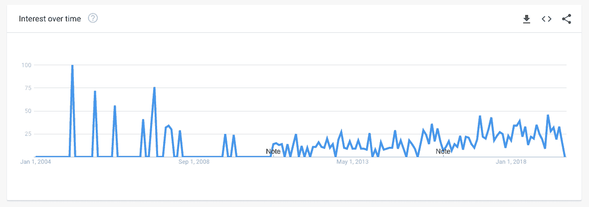
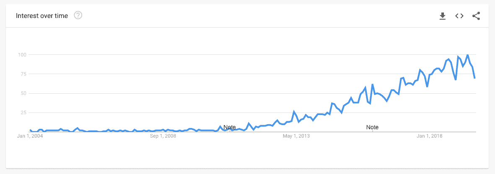

# 数据战略家的崛起

> 原文：<https://towardsdatascience.com/the-rise-of-the-data-strategist-2402abd62866?source=collection_archive---------8----------------------->

*本文原载于* [*丹工作室网站*](https://www.dainstudios.com/2019/08/14/51980/) *。*

你有没有注意到越来越多的工作职位前面都有数据这个词？早在 2012 年,“数据科学家”这个职位就被《哈佛商业评论》评为“21 世纪最性感的工作”。从那以后，正如正确预测的那样，大量带有“数据”一词的衍生产品和新的职位头衔被传播开来，成为无价的“[数据科学独角兽](/whats-the-secret-sauce-to-transforming-into-a-unicorn-in-data-science-94082b01c39d)”的雄心与正在进行的人才大战和公司和猎头的疯狂争夺相匹配，这些公司和猎头急于发现并抓住一只独角兽。

Figure 1: Data Scientist Searches on Google 2004–2018

Figure 2: Data Strategist Searches on Google 2004–2018

随着数据科学独角兽似乎非常罕见和无价，公司通过几个人寻求相同的专业知识或技能。

除了高级科学学位、SQL、R、Python、机器学习等的常见要求之外，数据科学职位描述中常见的一组技能如下:

> "*将业务问题转化为分析解决方案和见解的能力*"

技术人员可能会对这个短语嗤之以鼻，认为它是无用商业术语的典型例子。这对于数据科学家的工作来说是如此的重要，为什么要把它放在工作描述中呢？原因很简单，那就是它是一种真正的技能，虽然它可以被训练和发展，但这种技能比人们想象的要罕见。有多少有博士学位的数据科学家有商科学位？有几个，但也不常见。

上面的定义实际上代表了数据战略家的主要技能。为了说明这在实践中意味着什么，让我们看一个电子商务的例子:

你能帮助我们更好地了解我们的客户吗？

这个问题的答案可能很棘手，需要大量的经验和信心。让我们看看接下来会发生什么:

数据科学家:*你可以在 AWS 上部署一个神经网络，为不同的用户群训练一个分类器。*

客户:嗯，好的。但是我们需要什么样的数据呢？

数据科学家:*一个由大约几千个观察值组成的标签数据集——当然是平衡类。*

委托人:*？？？*

在这些句子的所有单词中，对于希望简单了解客户的经理来说，只有几个是可以理解的。其余的也可能是一种神秘的外星语言。这个简单的例子说明了这个问题，并展示了翻译角色的必要性。这位数据科学家使用的术语是那些拥有高级科学学位的人可能理解的，但对于他们直接报告的大多数经理和商人来说是无法理解的。

让我们打电话给数据战略家，看看他们是怎么做的:

你能帮助我们更好地了解我们的客户吗？

数据战略家:*好，让我们看看。那么你已经有了什么样的数据，如果有的话？*

客户:*我们有谷歌分析数据、我们网站上的用户行为和购买数据、数据库中的产品评论和评论数据以及社交媒体数据。[1]*

基于这些数据集，我们可以尝试用几种不同的方式来回答这个问题。我们可以做的一件事是获取行为数据，并对其进行情感分析——客户对你的特定产品的感受。这很好，因为这个项目的一部分可以用来分析产品评论文本数据。我们可以在这里更进一步，看看是否有一些模式——也许是不同用户的组。通过使用这样的模型，我们可以开始了解客户反馈中是否存在共同的模式，并自动标记负面反馈，并将其转发给支持人员。这很有可能会成功，我有 80%的信心我们会有相关的结果。

客户:*哦，这听起来很有趣。我们还能做什么？*

数据策略师:*如果我们有关于客户的良好数据集，我们可以尝试预测他们流失的概率，或者换句话说，放弃他们的提供商的概率。然后，我们可以利用这些预测来锁定那些可能会因为特价商品而流失的用户，从而让他们留在我们的平台上。这可能有点棘手，在很大程度上取决于你拥有的数据量——我认为这有 50%的可能性，可能需要更多的工作、专业知识和领域知识来建立一个客户流失模型。*

你能猜到哪一个会产生更大的商业影响吗？

以下是造成差异的几点:

*   这两个对话的第一个显著区别是，后者是一个真实的对话。客户端和数据策略师之间有来有往，感觉更像是一种协作。
*   数据战略家试图先取得理解。
*   数据战略家立即将工作与业务目标联系起来。
*   第二种情况也开始考虑代码的可重用性。
*   最后，这位战略家提供了几种方法比较的一些指标——重要性、复杂性和成功的可能性。

所有这些都定义了新的数据战略家角色。这也符合数据科学领域最近不断增长的专业化和发展的成熟性。最近的文章，一些关于 HBR 和 T2 的文章，说明了这一点。

在接下来的博客文章中，我们将探讨**数据战略家**的新兴角色，以及我们期望这一角色如何推动商业洞察和发展。

[1]当然，并不是所有的客户都能立即获得如此全面的信息，但为了便于说明，我们假设他们都有。

[2]他们使用“数据翻译器”这个术语。