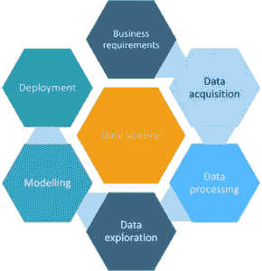
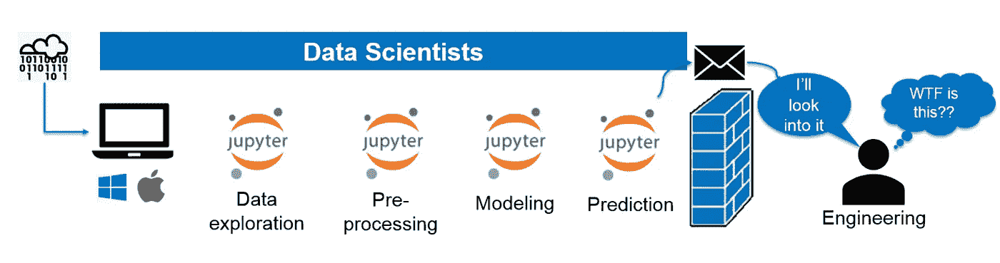
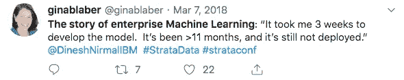
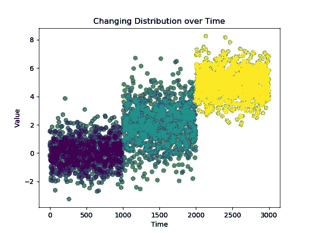

# “MLOps”一词的兴起

> 原文：<https://towardsdatascience.com/the-rise-of-the-term-mlops-3b14d5bd1bdb?source=collection_archive---------4----------------------->

## 正确操作的机器学习是新的圣杯

> “MLOps(机器学习和“信息技术操作”的复合物)是数据科学家和信息技术(IT)专业人员在自动化和产品化机器学习算法的同时进行协作和沟通的[一种]新学科/焦点/实践。”— [妮莎·塔拉加拉](https://www.aitrends.com/machine-learning/mlops-not-just-ml-business-new-competitive-frontier/) (2018 年)

*对于感兴趣的人，* [*我还将在 2022–23*](https://info.nycdatascience.com/waitinglistforupcomingclass?hs_preview=CfYnYAcl-80863152231)*的生产课上教授机器学习！*

Torrey Pines Gliderport in San Diego for intro aesthetic

对机器学习生命周期的理解是不断发展的。几年前，当我第一次看到说明这个“循环”的图形时，重点放在通常的疑点上(数据准备和清理、EDA、建模等等)。较少注意到更难以捉摸和不太有形的最终状态——通常称为“部署”、“交付”，或在某些情况下只是“预测”。

当时，我认为很多新兴的数据科学家并没有真正考虑到最后一个术语的范围(我当然没有)。“预测”不仅仅意味着`.predict()`，它还意味着真正的规模、生产级部署、监控和更新——一个真正的*循环。由于缺乏将这一模糊概念变为现实所需的工程技能，数据科学家被困在了笔记本中。模型作为`.pickle`文件存在于数据科学家的本地机器上，性能用 Powerpoint 报告，ML 生命周期被打破。*

[A Straightforward, but Incomplete Data Science Lifecycle](https://d1jnx9ba8s6j9r.cloudfront.net/blog/wp-content/uploads/2018/12/Data-Science-Life-Cycle-R-for-Data-Science-290x300.png) with the word “Modeling” spelled incorrectly

虽然端到端的 ML 生命周期一直被称为一个实际的“周期”，但迄今为止，在企业层面上实际管理这一端到端过程的成功有限，我认为原因如下:

*   数据科学家通常不是训练有素的工程师，因此并不总是遵循良好的 DevOps 实践
*   数据工程师、数据科学家和负责交付的工程师各自为政，这在团队之间造成了摩擦
*   无数的机器学习工具和框架导致整个行业缺乏标准化
*   目前还没有一个单一的托管解决方案可以满足工程师和数据科学家的需求，而不会受到某种方式的限制(订阅特定的语言、框架、提供商等)
*   总的来说，生产中的企业机器学习还不成熟

我确信还有更多的原因和大量的次级原因也有助于此——但这些高层次的问题导致了不幸的结果。企业中的机器学习速度慢，难以扩展，自动化程度低，协作困难，交付商业价值的实际可操作模型很少。

My boss made this gem

因此，我们需要良好的“mlop”——机器学习操作实践，旨在标准化和简化生产中机器学习的生命周期。然而，在我进入场景或任何更多定义之前，我想多谈一点关于*为什么*我们需要更好的 MLOps。

## 机器学习有些成熟，但部署实践和业务影响还不成熟

在学术领域，机器学习取得了突飞猛进的发展。在 NLP 这样的困难任务中，算法显示出了比以前工作的巨大进步(即使这只是谷歌扔给它更多的数据+计算)，据说 [arXiv](https://arxiv.org/) 上的机器学习论文数量每 18 个月翻一倍。

这种兴奋很容易让你失去对可交付成果的关注——有形的影响。[这项来自 2018 年的 Databricks 调查](https://databricks.com/blog/2018/12/06/cio-survey-top-3-challenges-adopting-ai-and-how-to-overcome-them.html)显示，尽管大多数公司都在采用或投资人工智能，但他们也普遍提到了他们解决方案中的困难,“人工智能”项目平均需要 *6 个月*才能完成。

We’ve all been there

如果你不小心的话，你可能最终会让数据科学家通过电子邮件把 Python 笔记本和模型发给工程师，进行生产部署和代码重写。对于 Docker 来说，也许这种记录不良的 Python 代码效率太低或不完整，但也将花费大量时间来翻译成 Java。没有大量的文档，工程师不知道 wtf 在那个`.pickle`文件中，没有模型、度量和参数的版本控制，每个人都感到困惑和愤怒，因为现在他们陷入痛苦的会议中，试图在应该花费几天而不是几个月的事情上保持一致。

不仅如此，一旦解决方案*在生产中*，就没有用于改进和更新的内在反馈系统。对于某些系统，随着时间的推移，模型性能可能会受到影响，并且监控并不总是标准的做法。数据科学家也没有真正接受过编写良好测试用例的训练，所以如果从 Jupyter 到生产的模型更新偶尔会破坏应用程序或提供不正确的预测，我也不会感到惊讶。

Model Drift — the importance of monitoring for change in distribution

我想说明的是，这些问题并不普遍，确实存在大量定制解决方案。然而，单一的一套实践和端到端解决方案尚未浮出水面，无法满足数据科学家、工程师和企业的需求。

## 输入机器学习操作(MLOps)

我将最纯粹的 MLOps 定义为自动化生产 ML 生命周期的真正实例。MLOps 的[维基百科页面的第一段也说明了一切。MLOps 是对当前企业将机器学习投入生产所面临的困难的合理反应。在软件工程中，我们有 DevOps，为什么没有 MLOps 呢？好的 DevOps 确保软件开发生命周期是高效的，有良好的文档记录，并且易于排除故障。是时候我们为机器学习开发一套类似的标准了。](https://en.wikipedia.org/wiki/MLOps)

[A slightly better infographic for the machine learning lifecycle](https://docs.microsoft.com/en-us/azure/machine-learning/team-data-science-process/media/lifecycle/tdsp-lifecycle2.png)

行业已经开始触及它的临界点，技术正在快速发展以满足需求并改变生产中 ML 的当前标准。mlflow 和 kubeflow 等开源框架竞相成为开源领域的标准，而新的创业公司则在这些解决方案上贴上 ui，试图将“专有”的 MLOps 产品推向市场。

## MLOps 的状态

当然，MLOps 仍处于起步阶段(至少在实践中)。在数据科学上搜索“MLOps”只能得到[少得可怜的 2 个结果](/search?q=mlops)(在撰写本文时)。从技术上来说，使用 mlflow 或 kubeflow 等工具的完全管理的解决方案仍然需要合理的开发和/或员工教育才能在实践中使用。

[Kubeflow is pretty tight](https://user-images.githubusercontent.com/5319646/37641037-2398b4d0-2c53-11e8-9ea9-906fe8c57fbc.jpg)

现在，你也会注意到我实际上没有给出一个精确的 MLOps 原则列表，那是因为我不确定是否存在一个普遍的集合。这种想法仍在不断变化，真正的原则将随着新框架和现实世界经验的成熟而形成。需要注意的是，与 DevOps 一样，MLOps 也有好坏之分，随着时间的推移，两者之间的界限会变得更加清晰。

目前，我发现最好遵循良好的 DevOps 实践。当然，有一些工具可以使这项工作变得更容易，但是从与框架无关的角度来看，我认为好的 MLOps 与好的 DevOps 非常相似。mlop 的目标依然清晰，优秀的 mlop 将尽可能高效地实现这些目标:

*   减少将模型投入生产的时间和难度
*   减少团队之间的摩擦，增强协作
*   改进模型跟踪、版本控制、监控和管理
*   为现代 ML 模型创建一个真正循环的生命周期
*   标准化机器学习流程，为不断增加的法规和政策做好准备

## 结论和警告

我敢肯定，根据你在这个行业的位置，你可能同意或不同意我对前景的猜测。这些观点是我有限经验的结果，因此容易产生误解。就像欧比万对阿纳金说的那样:“只有西斯才能处理绝对的事情”，我相信这在我对所有事物的主观分析中是正确的。

Brooklyn sunset for conclusion aesthetic

尽管如此，这篇文章的目的是介绍 MLOps 作为一个概念，并且可能是企业 ML 的下一个伟大革命之一——我希望在这方面我是有用的。请随时在 LinkedIn 上与我联系，或者在下面留下不必要的尖刻评论。✌️