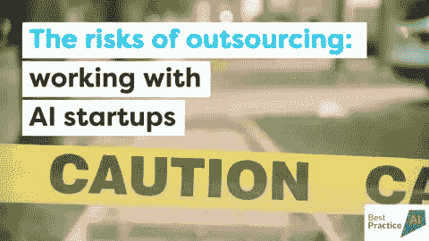

# 人工智能外包的风险——如何成功地与人工智能初创公司合作

> 原文：<https://towardsdatascience.com/the-risks-of-ai-outsourcing-how-to-successfully-work-with-ai-startups-1c764af21113?source=collection_archive---------17----------------------->

企业正在与科技巨头和人工智能初创公司争夺最优秀和最聪明的人工智能人才。他们越来越多地将人工智能创新外包给初创公司，以确保他们不会在人工智能竞争优势的竞争中落后。然而，外包带来了真实的和新的风险，而企业往往不具备识别和管理这些风险的能力。企业在与任何人工智能初创公司合作之前，都存在真正的文化障碍、隐含的风险和应该问的问题。

一只我似乎无处不在。阅读媒体而不了解人工智能对企业的变革性影响几乎是不可能的。 [Gartner research](https://www.forbes.com/sites/alexknapp/2018/04/25/gartner-estimates-ai-business-value-to-reach-nearly-4-trillion-by-2022/#2e4f1c5533f9) 预测，到 2022 年，企业将从人工智能中获得高达 3.9 万亿美元的价值。从人力资源到财务到运营、销售和营销，人工智能将有助于增加收入、提高效率和建立更深层次的客户关系。聊天机器人会让你等很久才能和客户服务代表说话，这是过去的事情了。许多重复性和枯燥的公司工作，如数据输入、质量保证或候选人筛选，将实现自动化。

但人工智能行业刚刚起步，发展非常迅速，缺乏专业知识和经验。这意味着，如果想从这 3.9 万亿美元中分得一杯羹，许多企业将不得不合作并将他们的人工智能解决方案外包给成千上万的新人工智能创业公司。但与这些初创公司合作充满了潜在的地雷，包括技术、实践、法律、声誉和知识产权所有权风险。许多这些风险源于文化差异，因此在企业和创业公司合作之前，理解它们是非常必要的。

## 快速移动并打破东西

创业公司的文化通常是企业生活的梦魇。硅谷推广了“**快速行动，打破常规”**的理念——快速推出一些东西，它不会完美，接受它。我们还听到优步等人工智能公司如何通过故意突破现有监管的边界来推出创新的消费者服务。企业家被描述为不合理地无视可以合理完成的事情。他们不喜欢被拒绝。他们努力扩大业务规模，速度非常快。他们讨厌官僚主义。他们现在就想要解决方案，而不是几天或几周。为了达成交易，他们在营销方面很有创意。这是企业家和他们的创业公司的 DNA。

因此，缺乏企业生活经验的年轻企业家发现销售和与企业合作很困难。毫不奇怪，企业会发现与初创公司合作充满挑战。

这些**文化** **差异**往往发生在**期望**有差距的时候。创业公司在享受赢得一个品牌客户，比如你的公司时，他们的眼里可能会有星星。你的品牌将有助于验证他们年轻的努力。但是，当涉及多个企业利益相关者，尤其是法律利益相关者时，创业公司是否了解决策过程需要多长时间？在同意签署一个人工智能原型或交付物之前，他们了解企业的要求有多高吗？他们知道从后端系统提取数据可能需要几个月的时间吗？他们是否明白，做一个人工智能试点项目并不能保证在整个组织中推广该解决方案？他们知道发票的支付会很慢吗？

文化差异经常会导致误解、紧张和偏见，这可能会导致项目失败，甚至更糟糕的是，初创公司在试图满足你的需求时耗尽了资金，从而走向灭亡。在建立关系之前，企业有自知之明并理解文化差异是至关重要的。

## 与人工智能初创公司合作充满了潜在的地雷

与人工智能初创公司合作的挑战和风险不仅是文化方面的，还包括:

1.  **技术和算法风险—** 今天的许多人工智能技术相对不成熟，存在着在现实世界中可能不起作用的风险。我们已经看到客服聊天机器人项目被屏蔽，因为聊天机器人在与真实客户一起使用时回答的是胡言乱语。仅仅因为一个算法预测一个客户的消费贷款违约概率为 90%，这并不意味着它在根据你的数据进行训练时会有同样的准确性。
2.  **集成和实施风险—** 众所周知，人工智能初创公司非常乐观，通常会低估集成和实施人工智能解决方案的时间和成本。概念的证明通常可以在几个月的时间内快速完成。但是在一个组织中推广这种方法可能充满挑战，例如，当与企业现有的遗留系统集成时，创建干净和有标签的数据集，以及使用现有的流程。一些[调查](https://www.informationweek.com/big-data/ai-machine-learning/ai-automation-job-trend-to-reverse-in-2020/d/d-id/1334444)显示，在一个组织中实施人工智能所花费的时间是初创公司预期的两倍。
3.  **未来** **证明风险** —人工智能正在经历其淘金热时刻，最近有数千家人工智能初创公司成立。然而，如果我们快进几年，历史告诉我们，许多这些年轻的公司将半途而废。即使人工智能创业公司蓬勃发展，也不能保证他们明天就会拥有你想要的技术能力。
4.  **法律和声誉风险**——人工智能初创公司可能会使用让你的公司面临法律和声誉风险的技术、工具和数据。数据隐私法，包括最近推出的欧洲 GDPR，已经要求处理个人数据(许多人工智能算法的燃料)的供应商遵循适当的技术和组织措施，以确保信息安全。根据 GDPR，还有一些要求，即任何具有法律效力的自动决策——如决定谁有资格获得贷款或工作的人工智能系统——都是“透明的”和“可解释的”。同样，如果一家公司对人工智能的使用被视为对某些人口统计数据有偏见，也会有品牌声誉风险。我们已经看到很多对面部识别技术的批评，面部识别技术在识别白人男性的性别方面比女性和种族群体更好。
5.  **知识产权** **风险** —许多初创公司会辩称，他们提供的算法要聪明得多，因为它们是在来自各种各样客户的数据集上训练的。但是，如果您的数据是一项战略资产，例如一家拥有数百万客户索赔历史的保险公司，您可能不希望它被用于竞争对手的利益。需要做一个权衡。同样，你可能不希望你的人工智能解决方案的软件代码与创业公司的其他客户共享。

## 成功协作的关键成功因素

对于大多数企业来说，在行业发展的早期阶段，与人工智能初创公司合作可能是必要的。但在人工智能初创公司的财富中导航，以确定明天将出现的玩家并分享相同的目的地是很困难的。在评估潜在的人工智能供应商时，确保您提出以下问题:

1.  **文化契合度**——初创公司是否有与复杂企业合作的经验？他们对这段关系有现实的期望吗？
2.  **技术和算法功效基准** —初创公司能否解释并证明其技术和算法的有效性和局限性？他们能解释解决方案对您的数据有多有效吗？根据你的数据训练人工智能需要多长时间？将他们的解决方案与您的系统、数据和流程集成需要多长时间？
3.  **产品路线图** —创业产品路线图是否符合您未来的需求？该产品与您的技术体系兼容吗？
4.  **财务健康**——初创公司是否表现出客户和收入的增长，以及领先风险投资家的强大财务支持？
5.  负责任的人工智能(Responsible AI)—初创公司是否有记录、解释和遵循的负责任的人工智能原则？他们能帮助你理解他们的人工智能解决方案的法律和声誉风险吗？他们是否遵循算法的透明性和可解释性原则？他们知道他们系统中使用的数据的来源以及数据样本偏差的风险吗？
6.  **知识产权所有权** —初创公司拥有知识产权还是客户拥有知识产权？

人工智能相对较新，但我们现在开始看到人工智能采购框架来帮助指导人工智能供应商的选择和管理。例如,[世界经济论坛](https://www.weforum.org/press/2018/09/united-kingdom-partners-with-world-economic-forum-to-develop-first-artificial-intelligence-procurement-policy/)正与英国政府合作开发这样一个框架。

总而言之，最重要的是要明白，人工智能项目的大多数挑战都可以归结为人的因素。关系往往在开始的时候就结束了，所以要确保你和你的初创公司保持一致，并承诺清晰、频繁地交流你的期望和需求。但现实是，我们都需要找到一种方法，让这些关系像企业和人工智能创业公司相互需要一样发挥作用。

## 关于西蒙·格林曼

西蒙·格林曼(Simon Greenman)是最佳实践人工智能公司(Best Practice AI)的合伙人，这是一家人工智能管理咨询公司，帮助公司利用人工智能创造竞争优势。西蒙是世界经济论坛**全球人工智能委员会的成员；**AI 专家常驻[seed camp](https://medium.com/u/ce257490d611)；并担任伦敦哈佛商学院校友天使会的联合主席。他在欧洲和美国的数字化转型领域拥有 20 年的领导经验。请通过[直接给他发邮件](mailto:simon@bestpractice.ai)或[联系，在 LinkedIn](https://www.linkedin.com/in/simongreenman/) 或 [Twitter](https://twitter.com/sgreenman/) 上找到他，或在[媒体](https://medium.com/u/828eed16d402)上关注他。

他的文章最初发表在 [**电子杂志:风险管理的新曙光**](https://knect365.com/riskminds/article/8326b4b7-e46b-41c6-9da3-53ddb8faf278/emagazine-a-new-dawn-for-risk-management/gate) **之后是**[**knect 365**](https://knect365.com/riskminds/article/ab80aed5-5ec8-474e-84aa-9822d05f0a74/the-risks-of-outsourcing-working-with-ai-startups)**。**