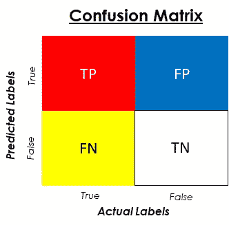
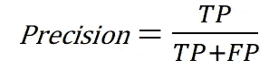
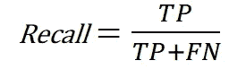
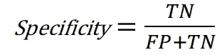
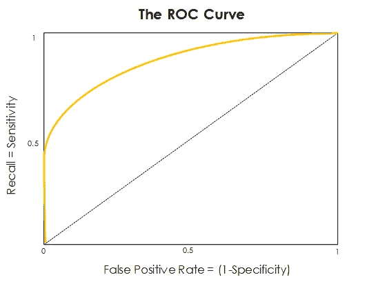
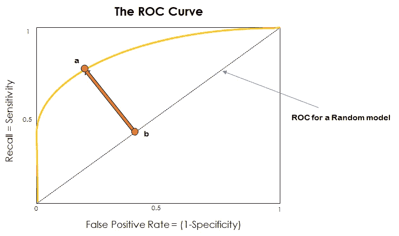
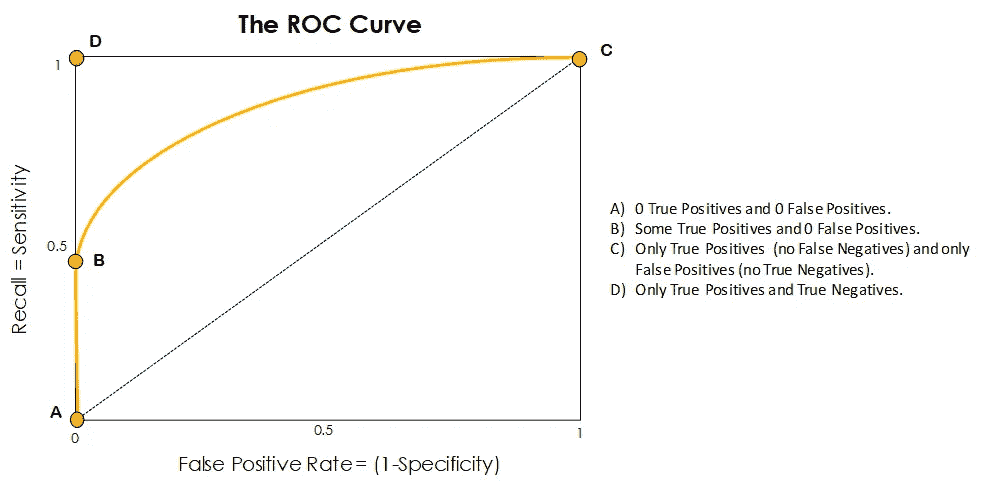
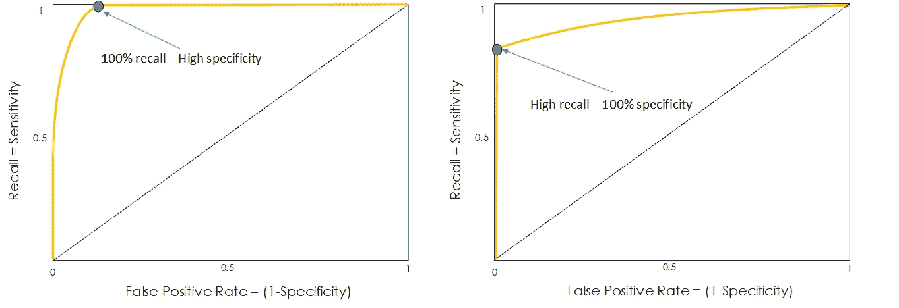
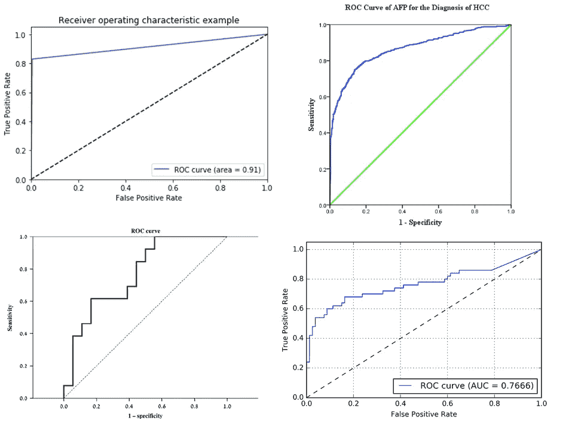
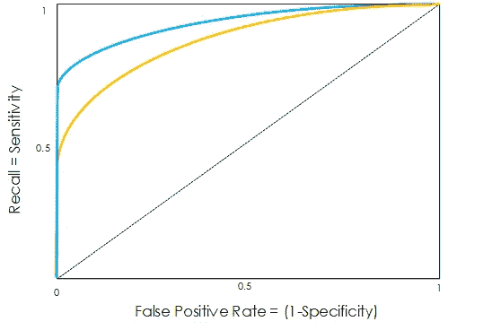

# ROC 曲线:揭开面纱

> 原文：<https://towardsdatascience.com/the-roc-curve-unveiled-81296e1577b?source=collection_archive---------14----------------------->

## ROC 曲线完全指南

*这篇文章的目的是解释什么是 ROC 曲线，它在评估分类算法性能中的重要性，以及如何使用它来比较不同的模型。*

*这个帖子可以被认为是****'***[***的延续:揭开了'***](/the-confusion-matrix-unveiled-2d030136be40) *【的困惑矩阵，所以如果你不熟悉困惑矩阵和其他分类度量，我推荐你去读一读。*

我们开始吧。

# 概率阈值

当面临二元分类问题时(*例如使用某个患者的健康记录*来识别他是否患有某种疾病)，我们使用的机器学习算法通常会返回一个概率(*在这种情况下是患者患有疾病*的概率)，然后将其转换为预测(*患者是否患有这种疾病*)。

Pipeline of the previously explained scenario

为此，必须选择某个阈值，以便将该概率转换成实际预测。这是一个非常重要的步骤，因为它决定了我们的系统将输出的预测的最终标签，所以小心选择这个阈值是一项至关重要的任务。

我们如何做到这一点？好吧，第一步是考虑我们面临的任务，以及对于这样的任务是否有我们应该避免的特定错误。在上面的例子中，我们可能更倾向于预测一个特定的病人实际上并没有患病，而不是说一个病人在实际患病时是健康的。

总的来说，该阈值通过以下规则合并到先前描述的管道中:

Rule for using the probability to produce a label

开箱即用，大多数算法使用 0.5 的概率阈值:如果从模型中获得的概率大于 0.5，则预测为 1 -(在我们的情况下有疾病)，否则为 0(没有疾病)。

当我们改变这个概率阈值时，对于某一组数据，相同的算法产生不同的 1 和 0 集合，也就是不同的预测集合，每个集合都有其相关的混淆矩阵、精确度、回忆等…

Figure of a confusion Matrix for a specific set of predictions

在上图中，显示了混淆矩阵的图像。让我们记住可以从中提取的指标，并加入一些新的指标:

*   **模型**的*精度*使用预测标签的真实行计算。它告诉我们，当我们的模型做出正面预测时，它有多好。在之前的医疗保健例子中，它会告诉我们，在我们的算法预测生病的所有人中，有多少患者实际上患有疾病。

Formula for the precision of the model

当我们想要避免我们的算法的真实预测中的错误时，即在我们预测为生病的患者中，这个度量是重要的。

*   **我们型号**的*召回*是使用实际或真实标签的 True 列计算的。它告诉我们，在我们的真实数据点中，算法或模型正确地捕捉了多少。在我们的案例中，它将反映出有多少实际患病的人被确定为患病。

Formula for the recall of the model

当我们想要尽可能地识别我们的数据的最真实的实例时，这个度量是重要的，例如，实际上生病的病人。这个指标有时被称为*敏感度*，它代表被正确分类的真实数据点的百分比。

*   **我们的模型**的特异性是使用实际或真实标签的假列来计算的。它告诉我们，在错误的数据点中，算法正确地捕捉了多少。在我们的案例中，是有多少真正健康的病人被认为是健康的。

Formula for the specificity of our model

当我们想要尽可能地识别数据中最错误的实例时，这个度量标准是很重要的；即没有生病的病人。这个度量也被称为 ***真负率*** 或 TNR。

# ROC 曲线

在定义了评估我们的模型可能涉及的大部分指标之后，我们实际上如何选择概率阈值来为我们想要的情况提供最佳性能呢？

这就是 **ROC 或接收器工作特性**曲线发挥作用的地方。这是两个指标(灵敏度或召回率和特异性)在我们改变这个概率阈值时如何变化的图形表示。直观地说，这是在一个单一、简洁的信息源中，当这个阈值从 0 到 1 变化时，我们将获得的所有混淆矩阵的总结。

Figure of a standard ROC curve of a model

首先看一下这个图，我们看到纵轴上是召回率(量化我们在真实标签上做得有多好)，横轴上是假阳性率(FPR)，这只是特异性的补充指标:它代表我们在模型的真实阴性上做得有多好(FPR 越小，我们在数据中识别真实阴性实例就越好)。

为了绘制 ROC 曲线，我们必须首先计算各种阈值的召回率和 FPR，然后将它们彼此相对绘制。

如下图所示，从点(0，0)到(1，1)的虚线代表随机模型的 ROC 曲线。**这是什么意思？**它是一个模型的曲线，预测 0 半时间和 1 半时间，与其输入无关。

Figure of the ROC curve of a model

对于随机模型，ROC 曲线大多数时候都是与 ROC 曲线一起表示的，这样我们可以很快看到我们的实际模型做得有多好。这个想法很简单:我们离随机模型的曲线越远越好。正因为如此，我们希望从点 **a** 到点 **b** 的距离尽可能的大。换句话说，我们希望曲线尽可能靠近左上角。

下图显示了 ROC 曲线的一些特殊点:

Some important points of the ROC Curve.

*   **在点 A** 我们有一个概率阈值 1，这不会产生真阳性和假阳性。这意味着，根据我们的算法返回的概率，每个样本都被分类为假。你可以想象，这不是一个很好的阈值，因为基本上通过选择它，我们构建了一个只会做出错误预测的模型。从点 A 位于虚线上这一事实也可以观察到这种不良行为，虚线代表纯粹随机的分类器。
*   **在点 B** 上，阈值已经下降到我们开始捕获一些真阳性的点，因为具有高阳性概率的样本实际上被正确分类。此外，在这一点上没有假阳性。如果这一点有一个体面的回忆，这是完全关键的，以避免假阳性，我们可以选择它描绘的阈值作为我们的概率阈值。
*   **在点 C** 上，我们已经将阈值设置为 0，因此以与点 A 镜像的方式，一切都被标记为真。根据标签的实际值，我们会得到真阳性或假阳性，但从来没有对假或阴性行的预测。通过将阈值放在这里，我们的模型只创建真实的预测。
*   最后，**点 D** 是性能最优的点。在里面我们只有真正的积极和真正的消极。每个预测都是正确的。我们得到实际到达该点的 ROC 曲线是非常不现实的(所表示的 ROC 甚至不接近该点)，但是正如我们以前说过的，我们应该尽可能接近左上角。

大多数情况下，我们最终要做的是找到曲线中 B 和 C 之间的一个点，该点满足 0 成功和 1 成功之间的折衷，并选择与该点相关的阈值。

根据我们的 ROC 曲线的形状，我们还可以看到我们的模型在分类 0 或分类 1 方面做得更好。这可以从下图中观察到:

Comparison of two different ROC curves.

左边的 ROC 曲线在分类 1 或我们数据的真实实例方面做得很好，因为它几乎总是呈现完美的回忆(这意味着它接近我们图表的上限)。然而，当它到达蓝色标记的点时，它在回忆中显著下降，同时过渡到完美的特异性。

右边的 ROC 曲线在对我们的数据的 0 或错误实例进行分类方面做得非常好，因为它几乎总是呈现出完美的特异性(这意味着它接近我们图表的左边界限)。

另一件要提到的事情是，如果 ROC 曲线太好(就像上图中说明不同场景的例子一样)，这可能意味着模型过度拟合了训练数据。

很酷吧？最后，下图显示了取自不同来源的其他一些 ROC 曲线。

Group of 4 different ROC curves taken from different sources

您可能已经注意到，其中一些图表也给出了 ROC 曲线下的面积值。**这是为什么？我们来看看曲线下面积。**

# ROC 曲线下的面积:AUC

正如我们之前提到的，我们的 ROC 曲线越靠近图表的左上角，我们的模型就越好。当我们针对特定任务尝试不同的机器模型时，我们可以使用准确性、召回率或精确度等指标来比较不同的模型，但是，仅使用其中一个指标并不能完全准确地描述我们的模型的表现，因为仅基于其中一个指标进行比较会遗漏所有其他指标提供的信息。

**这就是 AUC 发挥作用的地方**。该度量从 0.5(随机分类器)到 1(完美分类器)的值，并且它在单个度量中量化了我们的 ROC 曲线有多酷和好看；这反过来解释了我们的模型对真假数据点的分类有多好。较大的 AUC 通常意味着我们的模型比具有较低 AUC 的模型更好，因为我们的 ROC 曲线可能具有更酷的形状，更靠近我们图表的顶部和左侧边界，并且更接近期望的左上角。

Comparison of two ROC curves

在上图中，我们可以看到，ROC 由蓝线表示的模型比 ROC 由金线表示的模型更好，因为它下面有更多的区域(蓝线和我们图表的左、按钮和右界限之间的区域),并且在所有情况下都表现得更好。

**容易吧？我们的 ROC 曲线下的面积越大，我们的模型就越好。**

就是这样！我们已经了解了什么是 ROC 曲线，AUC 意味着什么以及如何使用它们。让我们总结一下我们所学到的！

# **结论和**关键经验 **:**

*   ROC 是为单个模型构建的，它可以是一种使用其形状或面积(AUC)来比较不同模型的方法。
*   ROC 曲线的形状可以告诉你一个特定的模型在对我们的数据进行真假分类时是否做得更好。
*   使用 ROC 曲线，我们可以选择一个与我们对特定任务的兴趣相匹配的概率阈值，以避免某些错误超过其他错误。
*   ROC 不仅仅是一种比较算法的方法，它还让我们根据与我们最相关的度量来选择分类问题的最佳阈值。

就这些，我希望你喜欢这个帖子。欢迎在 LinkedIn 或[上与我联系，在 Twitter](https://twitter.com/Jaimezorno) 上关注我，在 **@jaimezorno** 。还有，你可以看看我在数据科学和机器学习上的帖子[**这里**](https://medium.com/@jaimezornoza) 。好好读！

更多类似的帖子请关注我的媒体 ，敬请关注！