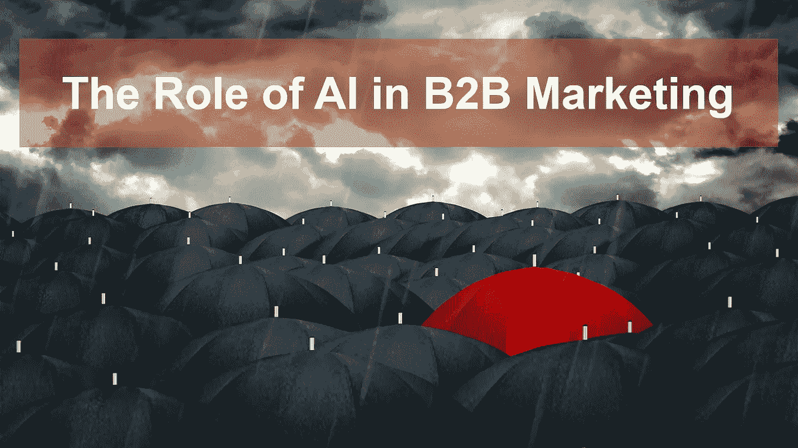
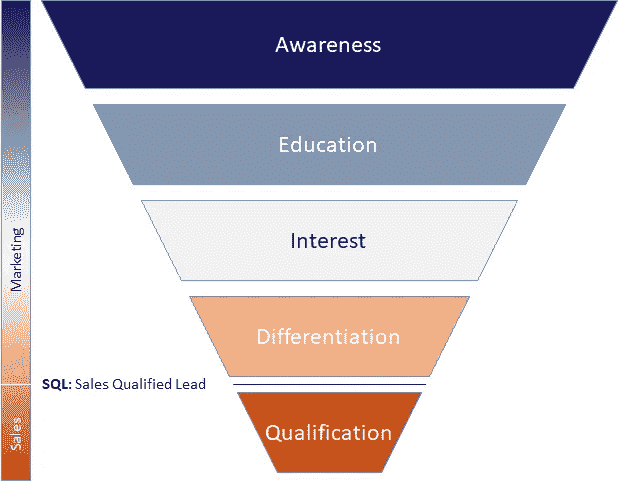
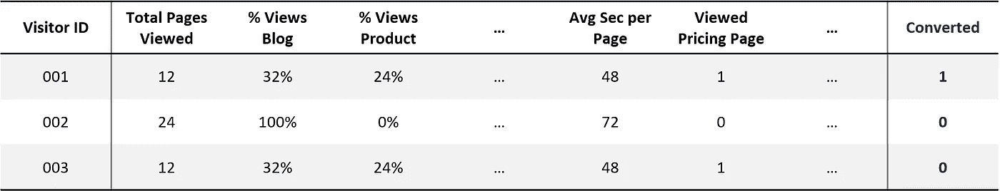
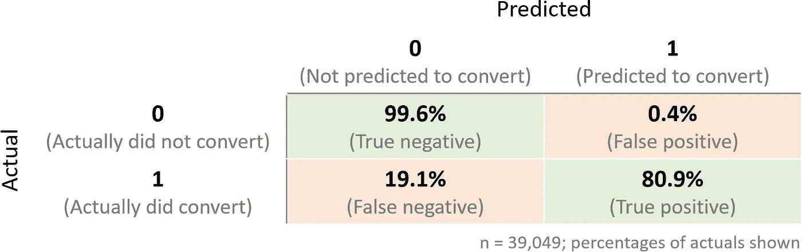

# 人工智能在 B2B 营销中的作用

> 原文：<https://towardsdatascience.com/the-role-of-ai-in-b2b-marketing-8fa31aa2de2f?source=collection_archive---------10----------------------->

## 使用机器学习和行为建模来生成线索

B2B 营销很容易。你所需要做的就是在他们自己的教育过程中，在准确的时间找到完美的前景。一旦你做到了这一点，只要把正确的信息交到他们手中，让他们知道你是如何找到完美的解决方案来彻底解决他们的痛点的。坐下来，看着你的企业像服用类固醇的杂草一样成长。没什么。

但是，如果 B2B 营销如此简单，为什么有些组织似乎在这方面取得成功，而其他人却在苦苦挣扎？事实证明，在准确的时间找到完美的潜在客户类似于在一片黑色雨伞的海洋中找到一把红色雨伞，但要困难得多。值得追求的前景往往只能通过微妙的线索来识别，行为模式只能通过仔细分析正确的数据来区分。

> 一些公司对此的反应是砸钱解决问题——举手投降，到处寻找保护伞。其他人很擅长识别红色雨伞。

我在一家名为 Projector PSA 的小型软件公司工作，该公司开发专业服务自动化软件，旨在帮助咨询公司运营业务。我们与比我们大几个数量级的对手竞争。因为我们不能盲目地花钱解决问题，我们为找到更聪明、更有效的做事方法而自豪。这些方法中的许多都植根于有效利用我们可以获得的大量数据，例如我们如何使用[语义分析来执行竞争分析](https://medium.com/startup-grind/using-sentiment-analysis-without-a-phd-in-data-science-7185d3436839)，使用[预测分析来改善收入预测](https://www.projectorpsa.com/blog/forecasting-revenue-predictive-analytics-interactive-case-study?utm_source=ddi&utm_medium=sync)，以及使用[神经网络来识别有效的项目经理](https://www.projectorpsa.com/blog/artificial-intelligence-effective-project-managers?utm_source=ddi&utm_medium=sync)。

今天，我想谈谈我们如何开始在 B2B 营销工作中使用人工智能。具体来说，我们如何使用机器学习算法和行为建模来推动我们的销售线索生成引擎。

# 营销漏斗

在深入机器学习方面之前，我需要简要描述一下我们的整体营销模型。像许多企业一样，我们认为我们的营销过程是一个漏斗，对应于访问者在教育旅程中的进展。他们可能只是在寻找经营专业服务公司的最佳实践的基本信息。我们在这一阶段的工作是将这种普遍的兴趣转化为意识，即一类称为专业服务自动化(PSA)软件的产品是存在的，并且它可能是有用的。或者，他们可能已经知道缩写 PSA，并正在积极比较不同的产品。在这里，我们的职责是展示我们的产品与市场上其他产品的不同之处。这个漏斗(为清晰起见进行了简化)看起来有点像这样:

我们网站上的不同内容是为每个教育阶段的目标访问者编写的。例如，我们可能有一篇针对处于认知阶段的人的关于测量利用率的最佳实践的博客文章。或者，我们可能有一本[电子书，为希望获得 PSA 市场更深入教育的游客提供 PSA 软件](https://www.projectorpsa.com/ebook?utm_medium=sync&utm_source=medium_tds)的初级读本。最后，我们有一个[交互式性能记分卡](https://www.projectorpsa.com/scorecard?utm_medium=sync&utm_source=medium_tds)，允许读者将我们的产品与其他产品的性能进行比较——这是差异化阶段的访问者发现有用的内容。

在经历了认知、教育、兴趣和差异化阶段的所有人中，只有一小部分人通过注册免费试用或联系我们的销售团队成为可识别的销售线索。在成为 SQL 或销售主管的过渡阶段，我们收集访问者的信息，他们的联系信息和他们的公司名称。

那么，那些从未表明自己身份、从未成为 SQL 的访问者呢？他们永远消失了吗？

# 研究和主动外联

事实证明，对于这些匿名访客，我们称之为访客非转化者，因为他们从未转化为线索，我们有一个关键的信息。任何网站的每个访问者都有一个 IP 地址，这是访问者访问我们网站的唯一互联网地址。

许多 IP 地址指向互联网服务提供商(ISP)，如威瑞森或康卡斯特，这对我们来说是一个死胡同。然而，如果有人在 Acme Consulting 工作，并在工作中访问我们的网站，使用一种称为反向 DNS 查找的技术，我们通常可以将该 IP 地址转换为 Acme Consulting 公司。

在此基础上，我们可以让我们的研究团队在 Acme 找到符合我们典型买家特征的人(比如他们的首席运营官或专业服务副总裁),并单独联系他们。我们不一定需要接触到真正访问过我们网站的人，但是只要知道 Acme 对我们这样的产品感兴趣，就是我们接触的一个很好的触发器。

> 这种研究和主动外展过程，如果做得好，实际上*应该是相当劳动密集型的。*

*我们的团队需要确保我们接触到正确的人，并为每个人找到正确的有针对性的个性化接触点。接触点不仅仅是模板化的垃圾邮件，也可能是一个电话、一篇博客帖子上的评论、一个有趣观点的转发或一位相关同事的介绍。需要了解市场、收件人的工作环境以及潜在客户可能面临的棘手问题的接触点。最重要的是，接触点实际上为接收者提供了价值。*

*问题是我们可能每个月都有成千上万的访问者访问我们的网站。对于研究阶段来说太多了，对于劳动密集型的个性化推广来说就更少了。*

# *行为分析*

*在我看来，这就是事情变得有趣的地方……数据科学发挥作用的地方。因为我们不希望每个月对成千上万个 IP 地址中的每一个进行哪怕是最基本的研究，所以我们需要弄清楚如何进行优先排序。我们可以使用自动化手段过滤掉已知的 ISP、已经转换的 SQL、当前客户和其他访问者，以缩小非转换访问者的范围，但这仍然给我们留下了大量需要进一步优先考虑的访问者。进入行为分析。*

*我们可以从网络日志中了解到很多关于访问者在我们网站上行为的信息。如上所述，我们将网站上的内容分为不同的类别，如我们的博客、我们的产品页面、关于我们公司的页面、新闻发布、工作描述等。*

> *我们发现某些页面(如我们的定价页面)本身就是购买意向的良好指标。然而，更有趣的往往是行为的组合。*

*一个人看较少数量的页面，但是看各种各样的内容可能表示更高的兴趣。如果一个访问者看了很多页，但只看了一种类型，比如说，我们的工作描述，那么这个人更可能是一个招聘候选人，而不是一个潜在客户。那些只看我们的博客，但不看我们的产品页面的人可能更有兴趣学习经营专业服务公司的最佳实践，而不是找到一种产品来帮助他们。一个只看我们的产品页面和截图的访问者可能会试图对我们的应用程序进行逆向工程，而对实际使用它完全不感兴趣。*

*我们的网络日志还能告诉我们访问者第一次是如何到达我们的网站的——他们是在谷歌上搜索了什么，还是从合作伙伴的网站上点击进入的。它们可以显示访问者在每个页面上花了多长时间，他们是否注册了优质内容(如我们的电子书)，以及他们是否多次回来获取更多信息。通过我们在网站上收集的数据跟踪每个访问者，我们可以对那个人的行为进行大量的分析，并推断出他们的一些兴趣。*

*在过去，传统的营销自动化工具提供了一些功能，通过一种称为线索评分的机制，将所有这些行为转化为可操作的信息。用户将配置该工具，以理解阅读一篇博客文章可能值一分，查看一个产品页面可能值两分，在定价页面上花费超过 30 秒值五分。这有点像用强力链锯来解决一个需要手术刀般精确的问题。它需要根据对每个行动的相对价值的一些相当任意的假设来手动建立领先评分模型，很少能追溯应用到历史数据，并且通常与现实世界的结果相关性很差。*

# *机器学习*

*最后，我们谈到了人工智能和机器学习。我们希望避免手动编制的销售线索评分机制的任意性。为了做到这一点，我们决定教一个机器学习分类模型来确定所有行为输入的正确权重，以尝试预测转换倾向。*

*对于每个访问者，无论是成功的 SQL 转换还是未转换的访问者，我们都将所有的行为数据转化为一组标志、比率、数字和其他指标。这在不同的情况下会有所不同，但对我们来说，这是由一些因素组成的，比如浏览的总页数，每种类型的页面所占的比例(博客、产品页面、工作描述等)。)、不同类型页面上的平均持续时间等。最重要的是，我们捕获了我们的关键目标属性，一个指示访问者是否转换为 SQL 的标志:*

**

*随着所有这些数据的处理，我们将其转化为每个访问者的向量，并将我们所有的访问者数据输入到几个机器学习分类算法中。在比较了它们的输出之后，我们最终选定了一个特定的神经网络模型。(在这里，我不会详细介绍我们用来比较和选择不同算法的过程。)*

*这个约有 40，000 名访问者的数据集既用作训练数据，也用作测试数据。随着我们收集更多的数据，我们可以决定是使用这个初始训练模型测试新访客，还是使用额外的数据继续训练算法。*

**

*不管怎样，我们最终追求的是模型的混淆矩阵。混淆矩阵显示，在所有实际上没有转换的访问者中，该算法正确预测了其中的 99.6%。在转化的访问者中，它的预测正确率为 80.9%。然而，除了承认算法获得了不错的命中率之外，这些正确的预测，真正的负面和真正的正面情况，实际上对我们来说并不那么有趣。*

*我们真正感兴趣的是错误的预测，特别是算法认为*应该*转换但没有转换的 0.4%。这些误报实际上是没有转化的访问者(没有转化为潜在客户的访问者)，他们的“行为”更像 SQL(转化为潜在客户的访问者)。这些都是值得仔细研究的访问者，如果我们仅仅相信二进制 0/1 预测，这 0.4%就变成了一百多个值得追逐的潜在客户。*

*更有趣的是，我们不必仅仅相信二进制 0/1 预测。我们可以查看所有未转化的访问者(0.4%以及 99.6%)，并查看分类模型提供的 p(1)概率。也就是说，访问者应该按照算法的预测进行转换的概率在 0 和 1 之间。*

*这给了我们更好的控制我们追逐的非转换访问者。如果我们的研究和推广团队完全瘫痪，我们可能只会追逐 0.8 或更大概率的潜在客户(0.4%的一小部分)。另一方面，如果他们有大量的容量，我们可能会以 0.4 或更高的概率追逐潜在客户(从而稍微进入 99.6%象限)。*

> *关键是，这种方法不只是给我们一个应该/不应该转换的二元概念，它根据预测转换的概率为我们排列整个列表的优先级。*

# *结论*

*我很想说，这一过程使我们的销售线索生成率一夜之间翻了两番。我想说的是，我们整个营销团队去博拉博拉岛度假了一个月，因为他们明年的工作已经完成了。但是，我不能。不是因为我们没有得到积极的结果(我们得到了)，而是因为我们才刚刚开始这个过程…现在还为时过早。我们已经开始处理潜在客户识别部分，并且正在为研究和主动拓展工作准备好所有的流程、基础设施和培训。*

*我能说的是，在我们最初非常小的概念验证中，我们联系了四家公司，我们确定了其中一家，并将其转换为 SQL。这个样本量太小，无法可靠地预测长期的实际转化率。但是，这足以让我们将最初的概念验证扩展为更大的计划。*

> *这种概念的证明，即使它没有导致任何积极的转化，也正是我们作为一家公司试图获得这一点竞争优势所喜欢探索的思维类型。*

*换个角度看问题。努力更有效地做事。为了更好地识别红色雨伞。*