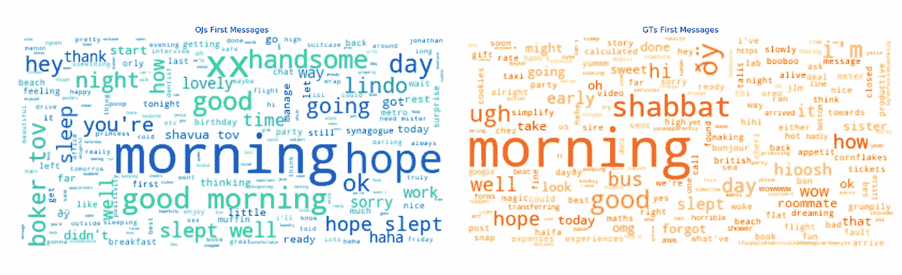
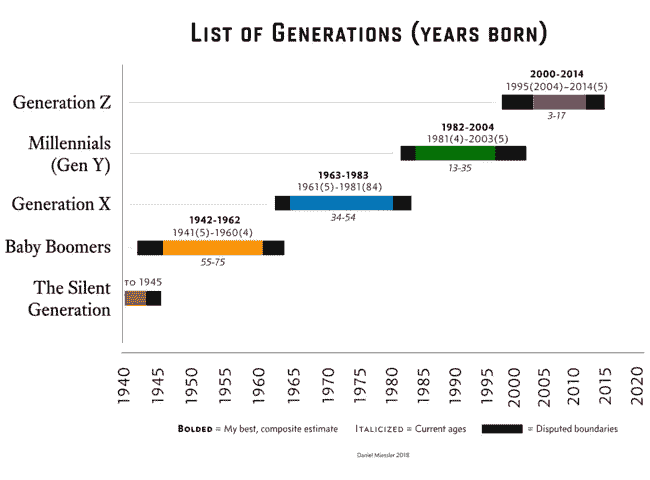
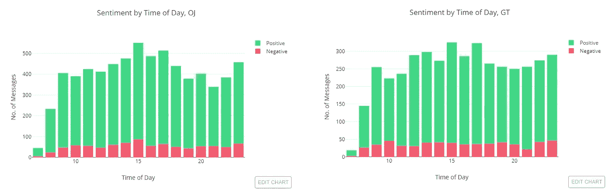
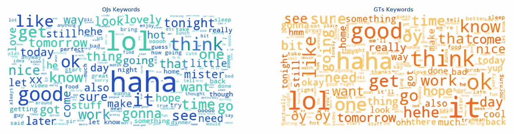

# 数据科学的浪漫一面:通过一年的短信分析一段关系

> 原文：<https://towardsdatascience.com/the-romantic-side-of-data-science-analyzing-a-relationship-through-a-year-worth-of-text-messages-be7e32d81fa9?source=collection_archive---------10----------------------->

这应该是一个私人项目，我想我会上传到一个私人的 Google Colab 笔记本上，并与任何相关的人分享(这是另一个人，这里称为“OJ”)。但是，一个灯泡——为什么不把它清理干净并与他人分享呢？

基本上，为了庆祝我们约会一周年，我决定从沟通的角度来探索我们的关系，看看我们的短信行为:我们对彼此说了什么，我们什么时候说的，我们如何回应对方，等等。我会把通话记录放在里面，但是我实际上从来没有跟踪过(真惭愧！)所以我不得不放弃，特别是因为我们通常一周最多打两个电话，这让它变得没那么有趣了。

所以，我将向那些对我做了什么和为什么做感兴趣的人讲述我的思考过程，最后，我将分享一些在这个过程中派上用场的链接和工具。我一直在努力提高我的 Python 技能，所以你也可以在那里找到一些有用的 Python 相关的片段。

***(请注意:这个故事在桌面上阅读更好，因为信息图是交互式的)***

# 方法学

我们使用的主要沟通渠道是 WhatsApp。我们偶尔会做 SMS-text，但这可以忽略不计，偶尔的 Messenger 链接或 YouTube 消息非常罕见，所以我选择坚持使用 WhatsApp 来简化这个过程。

*   **数据来源:**大约一年前的消息历史从 WhatsApp 导出(显然，导出时你不会得到所有的消息，最多只有大约 4 万条消息)。
*   **数据争论#1:** 最初的数据处理是在 Excel 中完成的，只是为了清理有些混乱的导出(显然，当您键入 WA 消息时使用 ENTER 会创建一个没有时间戳的无意义的新数据行)。
*   **数据争论#2:** 第二次争论是在 Spyder 中使用 pandas 在 Python 中完成的(我是一只实验鼠，使用 MATLAB 已经有很长时间了，所以 Spyder 是我的毒药)。
*   **探索性分析:**大部分是用 pandas 和 plotly 完成的，还有一些 WordCloud 和 nltk 的 VADER(后面会有更多)。Plotly 是目前为止我最喜欢的 python 可视化库，因为一旦你意识到它是可能的，它的交互性是必须的。这是我第一次在一篇中型文章中加入情节，所以希望它能在不同的平台上大放异彩。

# 故事


Photo cred: Annie Spratt [[Unsplash](https://unsplash.com/photos/5m2xl-GC0As)]

我们在 2018 年 4 月相遇，在 Tinder 上右键点击和有史以来最自发的设置之后——同一天点击和约会！这对我来说是第一次，下着雨在蒙特利尔高原街区的酒吧间漫步后，我们找到了一张还算不错的桌子，在 pisco sour 酒吧互相认识。

一年过去了，我试图想出一种有创意的方式来纪念这一时刻。当我在做其他一些数据密集型和量化自我的项目时，我想——‘哦，也许我可以搞出这个来？’所以，我们在这里，分析了一年的短信。

# 总体消息历史记录

总的来说，在大约 11 个月的时间内(希望这能及时准备好！)，我发送了 17，408 条消息(平均每天 60 条消息)而 OJ 发送了 22，589 条消息(平均 80 条消息)我想我们知道谁在这里喋喋不休！

A year worth of messages: change the slider to zoom in on specific time frames, and try guessing what do peaks mean!

时间线显示了一些峰值(主要是一个超级峰值)和一两个几乎没有发生的死区。高峰期通常与我们其中一个人的旅行相对应(7 月的夏威夷、11 月的多伦多、12 月的纽约和 3 月的多伦多)，而低谷通常是当我们两人一起旅行(6 月的以色列、2 月的哥伦比亚)并且不需要太多信息交流时(除了偶尔的“给我带一卷卫生纸”或“我应该买哪种奥利奥？”).所以这里没有大的冲击。

所以，总的来说，OJ 发送了更多的信息，但有趣的是考虑这是否归结为实际上更多的单词，或者仅仅是将可能是长的信息分解成短的。下表显示了一个稍微更详细的分类:事实上，当发送更多的消息时，OJ 的消息往往更短，而我的消息稍微长一点(尽管没有统计学意义)。它确实给了我们发信息行为的一个总体感觉——一个人更喜欢连续的多条短消息，而另一个人更喜欢一条更长的消息。

# 互动:何时和如何？

我们现在可能会问更多关于交互本身的问题:我们什么时候使用消息交谈？这种互动是怎样的——谁在发起，什么时候发起，对方通常需要多长时间做出回应？

让我们看看！

**习惯中反映的文化**

请看下图，展示了每天消息统计的细目分类(方框图解释[这里](https://chartio.com/resources/tutorials/what-is-a-box-plot/)，如果你需要的话！)，看起来在大多数工作日(周一至周四)这种行为通常是相似的，周三略有下降(也许值得用我们一起度过的日子的数据来交叉一下？我实际上收集了这些数据，可能会在以后的帖子中研究一下！).

Breakdown of distinct messages by weekdays. Each day we can observe 50% of the messages sent within the limits of the box, while the whiskers represent the rest of the data (and any single dot represents an outlier).

周五至周六发生的事情很有趣，一旦你了解了这些人，就很有道理:我们中的一个人(OJ)是一个观察犹太人(意思是，在安息日，即周五天黑后至周六天黑后，通常没有电子设备在使用——在这里阅读更多信息)因此，我们在周五至周六的交流要少得多，这些情况下的异常值比大多数其他日子更接近核心。周日恢复正常，因为没有任何限制了！

离群值通常与旅行期间相关，在此期间，我们(奇怪地)保持着更高的沟通率。

**我们是白天的生物**

正如我们在下图中看到的，我们大部分的对话发生在预期的白天时间——在加拿大，高峰在工作日快结束时的下午 3-4 点左右(下午 5 点左右)。当观察我们之间的差距时，下午 3 点似乎也是差距最大的一点——也许这与我工作效率的高峰时间有关(这是另一篇文章的讨论内容！)以及当时我对沟通的不重视。

Average messages per hour, and the difference between senders: very little late-night messaging (we both are tea-lovers and old souls, it is known) and peak/plateau around late afternoon

**我的家庭作业:展现更多的主动性！**

现在让我们来看看主动性:谁需要在这方面有所改进，并在信息方面表现出更多的主动性？嗯，我想这一段的标题可能已经给出了一个。但是，为了检验这一点，我们将查看每天的第一次互动，查看早上 7 点以后发生的任何事情(让我们考虑这样一个事实，我们很少在外面度过漫长的夜晚，因此我们排除了这些)，并查看是谁发起了对话！

Distribution of our first messages of the entire period: clearly (and obviously) we usually start conversations in the morning. We do have a bunch of late ‘first messages’ most likely due to OJ’s observing Shabbat, which limits communications on Saturdays during the day.

不难看出:我有一些需要改进的地方——看起来我落后了，需要加快步伐。下一个有趣的问题是——这是如何随时间变化的？我开始时很好，后来逐渐慢下来了吗？还是仅仅因为我不是一个喜欢早起的人？

Counting and allocating first messages of the day, per month. Each day was marked with conversation initiator, and this was accumulated throughout the month, for each month.

嗯，好像是定期的！我们都有起起落落，但至少看起来我大部分都在进步，而且慢慢地平衡了。现在我们可以问一个不同的，也许有点吓人的问题:这些最初的信息实际上是什么样子的？



你可能不知道，但在我们的动态中，我是消极的——南希和 OJ 是积极的——帕特里夏，这很容易从每天的第一条信息中捕捉到:我更倾向于使用“啊”和“可怕”这样的术语，而 OJ 的词汇比任何早上反应迟钝的人所能预料的要积极得多。

我现在看起来不太好，而 OJ 在关系维护方面得分很高！我的早晨很消极，主动性也很低，但我想知道，在反应能力方面，我是不是也落后了？

**互联时代**

在进入这一部分之前要记住的是，我们都是千禧一代(是的，尽管我出生在 80 年代——见我在这里添加的图表)，因此，我们可以高度连接，并把我们的手机作为我们身体的另一个器官。我真的很讨厌这样，并积极尝试断开连接，不把手机放在身边，但这也是另一篇文章的素材！



Generational breakdown. Are you also wondering whether Jesus, Moses and Mohammad were all part of the silent generation that apparently spans anything before 1945? [[Source](https://danielmiessler.com/blog/visual-us-generations/)]

Delay distribution of both senders — vast majority of replies happen within 2 minutes from the moment they were received!

看着我们的回复时间分布，似乎我们实际上非常相似，并且非常响应(叹息)。考虑到这个分布中的每个 bin 都有大约 2 分钟的延迟，我确实有点落后，但这似乎无关紧要。值得研究的是，我们是否在一天中的特定时间反应更快——这可能比我们反应时间的总体分布更有价值！让我们看看下面(请原谅我这里缺少支线剧情，但是 plotly 确信在使用热图时不可能生成！):

More details below!

The Y-axis of these heatmaps indicates the time delay between getting a message and replying. The X-axis shows the time of day in which the message was received. The different colors in the heatmap indicate how many messages were sent throughout the year, in the specific time of day (x-axis)and within a specific delay (y-axis). For example, we can see that for messages OJ received at 10am, 156 were answered to within 0–2 minutes. Kapish?

首先，就像我们之前看到的，大部分交流发生在白天，大约下午三点左右。不出所料，我们都不是回复深夜信息最快的人，而且在回复白天信息的延迟方面，我们似乎没有太大区别:在大多数情况下，我们都相当快！这在几个月后会很有意思，希望我不会像以前那样有联系——这可能是一个有用的衡量标准。

# 我到底在说什么？

内容就像我们到目前为止探索的统计数据一样有趣。但这也是一个更私人的问题，所以我将保持这一部分最少:)

消极的南希还是积极的帕特丽夏？

如果你一直在仔细阅读，你可能已经注意到，传统上在这种关系中，我被认为是我们当中比较消极的。但是这真的反映在我说的和 OJ 说的上吗？

Sentiment analysis of our messages was created using nltk’s built-in VADER, which enables sentiment analysis on natural sentences (mostly social media content). I have locally edited the existing VADER lexicon to match our vocabulary more accurately and include terms in French we use very often to reflect sentiment better. More details at the end.

看起来这是一个明确的否定！事实上，当比较百分比的时候，我似乎比 OJ 更不消极！这是令人震惊的，但差异很小。另一个可能更好地反映情况的观点不是我在信息传递中的消极，而是——缺乏积极。OJ 显然更积极，有整整 28.9%的消息是以积极的语气说的，而我站在整整 5.7%的低点。但这是意料之中的。

看看这一天发生了什么(请原谅我把这个作为照片插入，这不可能作为一个像样的支线剧情插入！)，似乎我们没有展示出任何明显奇怪的东西，也许除了在清晨我那端的负面内容稍微多一点(叹气)。



Comparing negative and positive messages at different times of day

**有人起绰号吗？**

最后，通过观察可视化所有内容(而不仅仅是第一条消息的内容)的词云，第一个结论是:我们真的不能说太多。



Both word clouds, for all of the conversations! Most of the stop words have been removed using nltk’s built in stop words, however due to different encoding, some snuck back in (e.g. ‘that’,’it’) and I have not yet removed these. In a future version and when I will have some extra time, I might get around to that :)

没有任何单词特别突出；我们可以从中挑出一些习惯，比如英国人经常使用“先生”或“先生”，或者我们都过度使用“哈哈”、“哈哈”和“呵呵”。毕竟千禧一代。在这里，在任何一边，我们甚至检测不到任何昵称，这是我们逐步引入和取消昵称的一个强有力的指标。

不，理解内容的一个更有用的实践是在特定的上下文中分析:例如，我们的对话在旅行中是如何变化的？在消极的上下文中，我们在说什么？我们在抱怨什么？诸如此类。

# 底线

对我来说，这是一次有趣的旅程，回想起来，我本可以从很多其他方面来看:谁更经常使用“爱”这个词？我们能发现在我们开始约会后多久我们开始用“爱”来称呼对方吗？我们平均短信对话多长时间？还有很多很多可以问的问题。

但是看看我们所拥有的，我们能从这种做法中学到什么？

*   OJ 是个健谈的人。
*   GT 需要发起更多的对话。
*   GT 并没有你想象的那么消极！但可能没有 OJ 积极。
*   在等待时间方面，我们是尊重的，不会让对方在等待回应的过程中晾太久。
*   安息日是放下电话的好时机。
*   **数据可以成为一个有趣而有创意的周年传统！**

*祝我们一周年快乐，OJ :)*


Photo Credit: Matthew Henry [[Burst](https://burst.shopify.com/photos/love-heart-drawn-in-lights)]

# 为数据爱好者提供一些技术信息

正如我前面提到的，我用 Python 编写了这个项目的代码。它像熊猫一样重，而且情节几乎完全是由 plotly 完成的。和往常一样，在这个过程中我最好的伙伴是我使用的不同库的 stackoverflow 和文档页面。

既然你们有些人询问，我已经在 GitHub 上发布了[代码。随意叉，克隆，玩，问任何关于它的问题。](https://github.com/guyts/thatdataguy-romance-whatsapp-analysis)

如果你没有带标签的训练集，VADER 是一个很好的 nltk 工具，可以用来分析 Python 中的文本数据情感。它对大量的词汇使用术语评分(你可以很容易地添加进来——见下文),在查看了我导出的样本数据后——它实际上非常准确！

单词云是用 Python 的 WordCloud 库生成的，而且……相当不错。我没有经常使用这些工具，但我正在寻找一个更好的解决方案和定制工具，所以如果你有什么建议，请随时留言！

这里有一些我觉得有用的链接，你可能也会喜欢！

*   plotly——Python(和其他语言)的交互式绘图库，有详细的[文档](https://plot.ly/python/getting-started/)页面。
*   VADER — [这一页](http://t-redactyl.io/blog/2017/04/using-vader-to-handle-sentiment-analysis-with-social-media-text.html)很好地介绍了幕后工作以及如何实际使用该工具。如果您想编辑词典并使用`update`方法添加您自己的术语:

```
**from** vaderSentiment.vaderSentiment **import** SentimentIntensityAnalyzer
analyser = SentimentIntensityAnalyzer()
new_words = {
    'greaaaat': 2.0,
    'shiiit': -2.0
}
analyser.lexicon.update(new_words)
```

*   导入`from wordcloud import WordCloud` 后 WordCloud 就可以轻松使用了。一旦完成，你就可以构建 WC 对象，自定义颜色，删除停用词等等。我通过 DataCamp 教程了解到这一点，你可以在这里找到。

希望这是有见地的，如果你有任何问题，请提出来！