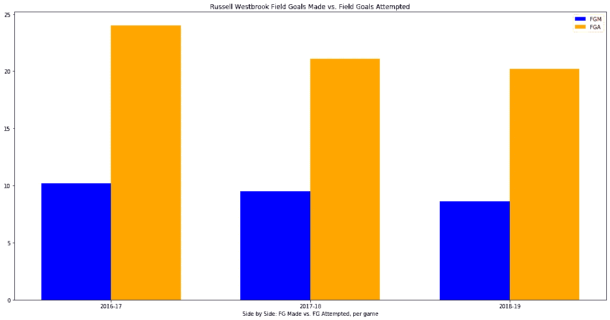

# 拉塞尔·维斯特布鲁克效应

> 原文：<https://towardsdatascience.com/the-russell-westbrook-effect-7782b54bb860?source=collection_archive---------11----------------------->

连续三个赛季，他在俄克拉荷马城场均三双。虽然常规赛的数字惊人，但这并没有转化为季后赛的成功。与雷霆队的老伙伴詹姆斯·哈登重聚，威斯布鲁克在休斯顿会有什么样的影响？

奥斯卡·罗伯特森是第一个整个赛季场均三双的球员。那是在 1961-1962 赛季。在那之后，直到 2016-17 赛季，拉塞尔·维斯特布鲁克才做到了一名球员在整个赛季平均三双。不可思议的是，他连续两个赛季做到了这一点。

连续三个赛季三双，仍然有点难以理解事情会走向何方。总的来说，萨姆·普雷斯蒂(俄克拉荷马雷霆队的总经理)连续两次在选秀中成功获得了 3 个 MVP，这很令人着迷。凯文·杜兰特，拉塞尔·维斯特布鲁克，詹姆斯·哈登。虽然他们在 2012 年确实打进了 NBA 总决赛(输给了勒布朗·詹姆斯率领的迈阿密热火队)，但从那以后，他们或多或少走了下坡路。接下来的那个夏天，哈登被交易到休斯顿，在那里，他在火箭队如日中天，并继续如日中天。在 2016 年西部决赛中以 3 比 1 领先后，凯文·杜兰特离开小镇，前往金州勇士队。然后是拉斯的三个三双赛季，几个赛季与保罗·乔治合作，然后…这一切都在去年夏天结束了。即使对一个相对随便的 NBA 球迷来说，讲述一个已知的故事也不重要，但值得注意的是，这就是拉斯和他的雷霆兄弟们的结局。

鲁斯交出的 2016-17 MVP 赛季成绩斐然。他是雷霆队中唯一一个真正的超级巨星，而凯文·杜兰特在休赛期刚刚离开了球队。作为参考，他的基本数据是:PPG 31.6 分，APG 10.4 分，每场 10.7 分。我知道 47 胜 35 负的战绩证明了空洞的统计数据，但当你想到他在那个赛季的使用率领先联盟的事实时，这仍然是值得注意的。

对基本数据的目测告诉我们，场均得分的下降是真实的，尤其是从场均三双的第一年到场均三双的第二年。虽然拉斯每场比赛的助攻和篮板数量都差不多，但不可否认的是得分的下降。当你意识到第二年他每场比赛实际上多打了将近两分钟时，这种情况从第一年到第二年看起来更糟。值得注意的是，在第二年，罗斯在保罗·乔治有了一个真正的超级巨星队友。

我认为我可以通过降低投篮命中率来消除整个保罗·乔治队友效应。拉斯总是被贴上运动后卫的标签，喜欢投不太好的球。然而，数字并不完全指向这一点。

在第二年，投篮命中率总体上变得更好，这是他作为队友得到控卫的第一年。三个百分点从来都不好，但问题是你真的不能因此责怪他。看看这三年的投篮次数:

拍摄尝试每一季都会减少——制作也是如此。然而，更能说明问题的是，从第一年到第三年，他平均每场比赛少出手 4 次，但在这段时间里，他只少出手 1.6 次。你不能把所有的责任都推到罗斯身上。三分球也讲述了同样的故事:

拉斯从第一年的场均 7.2 个三分球到 4.1 个，然后是 5.6 个。类似于每场比赛的投篮命中率，他在第一年投了 2.5 个三分球，第三年是 1.6 个，只少了 0.9 个。拉塞尔·维斯特布鲁克并不是一个有史以来最伟大的三分射手。不过这些数据告诉我们的是，他已经听到了，并积极努力减少他不擅长的投篮。

让我们回到 MVP 赛季。联盟中没有一个球员在那个赛季拥有联盟最高的使用率的同时拥有更高的 PER。可供参考的是:PER-30.6，Usage %-41.7，VORP-12.4，这些都是职业生涯的新高。

在我看来，关于拉塞尔·维斯特布鲁克效应的事情是，尽管保罗·乔治增加了一个真正的超级巨星，拉斯场均三双的能力并没有减弱。看一下从第 1 年到第 3 年的高级指标:

PER、使用率%和 VORP 都在逐年下降。很明显，这更多的是因为罗斯从 PG 那里得到了一些帮助。VORP 队的崩溃告诉我们同样的故事。

每年 Russ 的个人 VORP 都会下降，在他们合作的最后一年几乎与 PG 持平。

所以我的主要收获是“假新闻媒体”让罗斯成为了一个比他实际情况差得多的投篮手。在场均三双的第一年，大量出手绝对是有意义的，因为真的没有其他人可以帮助他得分。此外，很明显，在某种程度上，拉斯推迟了，他的 VORP 和使用率在过去两个赛季下降就是证明。视力测试可以证实这一点，因为保罗·乔治在赛季的第二个三分之一阶段疯狂地打 MVP。

最重要的数字？

(按照三倍平均年份的顺序)

第一年:47 胜

第二年:48 胜

第三年:49 胜

这就是为什么保罗·乔治现在在快船，而拉塞尔·维斯特布鲁克现在在火箭。

# 休斯顿我们有一个..？

首先——不，休斯顿没有问题。他们的战绩是 12 胜 6 负，虽然一开始对他们的缓慢开局有些过度反应，但我认为他们的合作最终会很好。詹姆斯·哈登场均 37.7 分，一如既往。从统计的角度来看，拉斯在成为球队的第一选择方面后退了一步。他似乎确实在遵从詹姆斯·哈登的意见。这个赛季他场均没有三双。但是，火箭队还是赢了。拉斯仍然是平均 22.5 PPG，但他的 VORP 是有史以来最低的 0.3

如果你问我，休斯顿的“拉塞尔·维斯特布鲁克效应”将完全取决于他在间距和投篮上的投入。很明显，詹姆斯·哈登是这个队的头号选择。只要拉斯记住这一点，我希望休斯顿能在西部季后赛中胜出。

*这是我将在本赛季晚些时候再次讨论的话题。没有足够的数据来说明休斯顿到底发生了什么

来源:

图片来源:[https://clutch points . com/火箭-谣言-休斯顿-计划-错开-詹姆斯-哈登-和-拉塞尔-威斯布鲁克/](https://clutchpoints.com/rockets-rumors-houston-plans-to-stagger-james-harden-and-russell-westbrook/)

所有数据:basketball-reference.com