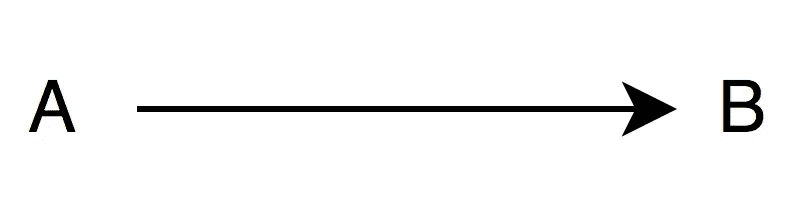
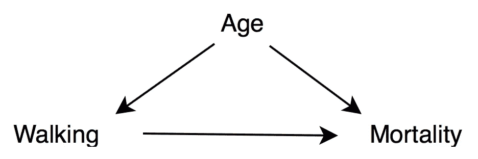

# 为什么的科学:简介

> 原文：<https://towardsdatascience.com/the-science-of-why-a-brief-introduction-b2ae413055ab?source=collection_archive---------44----------------------->

## 理解因果关系是如何工作的，以及如何处理它

“相关性并不意味着因果关系”。你可能以前听过这句话，现在这两者之间的区别应该很明显了，对吗？不完全是。尽管我们知道它们不是一回事，但因果关系并不那么容易定义。

If you didn’t get the joke, you should probably read this article.

此外，它也很难衡量和识别。在本文中，我们将尝试为因果关系提供一个定义，也许最重要的是，我们如何识别和测量它。

# 相关性和因果性的区别是什么？

当两件事通常一起发生时，我们说它们是相关的。例如，圣诞节时，北半球通常天气寒冷(南半球天气温暖)。这些事情是相互关联的，但是这是否意味着寒冷的天气*导致了*圣诞节(或者圣诞节*导致了*寒冷的天气)？嗯，这没什么意义，对吧？这是因为因果关系意味着，如果没有另一件事，一件事就不太可能发生(或者根本不会发生)。例如，下雨时，人们用雨伞。雨和雨伞是相互关联的，但也有因果关系:雨*让*人们拿到雨伞。如果没有下雨，人们可能不会用雨伞。

*因果关系*被定义为“原因和结果之间的关系”，而*原因*被定义为*一个*“引起一个动作、现象或条件的人或事”。然而，多年来，哲学家们一直在努力与这些定义达成一致，一旦统计学家开始研究相关性，他们就必须非常清楚地表明，这是一种不同的现象，他们无法解释因果关系。

# 我们如何确定因果关系？

从统计学上看，找到相关性或多或少是容易的:所有需要的信息都应该在数据中。然而，因果关系更棘手:它需要领域知识。我们知道寒冷的天气不会导致圣诞节的唯一原因是因为我们知道季节是如何工作的，我们知道圣诞节每年都在同一天发生，因此我们知道为什么它们是相关的，我们知道这不是因为一个导致另一个。

因此，确定因果关系超越了统计学:它需要理解支配我们正在研究的主题的潜在模型和结构。

确定因果关系的黄金标准是随机对照试验:例如，在医学中，当我们想测试一种药物是否真的如预期的那样起作用时，我们将我们的样本分成两个随机组，然后只给其中一组人服用药物。然后我们比较这个组和另一个组(对照组)的变化。无论这些变化是什么，我们都可以有把握地假设它们是由药物引起的(考虑到整个试验是精心设计的)。然而，这种方法并不总是可行的，特别是在像经济学这样的社会科学中，我们处理的是整个国家和经济。为了识别这些情况下的因果关系，我们可以利用*因果图*。

The simplest causal diagram there can be

左边的图像是因果图的最简单版本:它代表了 A 导致 b 的情况。使用这种复杂关系的图形表示是科学界的一项重大突破，因为它可以轻松理解复杂的相互作用。一旦理解了这种表示，我们可以看一个更现实的例子:

假设我们想知道多走路是否能延长寿命。然后，我们选取一组人，测量他们每天走多少路，然后分析他们的死亡率。这项研究实际上是在 1998 年进行的，并发表在《新英格兰医学杂志》上。他们得出的结论是，走路多的人死亡率较低。然而，这是一个我们无法推断因果关系的典型案例，我们可以通过查看上面的图表来理解为什么:将步行与死亡率联系起来的箭头代表了步行可以让你活得更长的假设，但当我们给这幅图添加一个新元素“年龄”时，我们可以看到年龄也有可能是我们所说的*混杂因素*:一个增加死亡率的变量，原因很明显，但也使人们走得更少。为了解释这种影响，最好的方法是按年龄控制我们的分析:只比较相同年龄范围内的人的数据。

一旦我们开始添加更多的变量，因果图会很快变得非常复杂，但这里的关键是要确保我们考虑了变量之间所有可能的相互作用，记住不要在两个变量之间放置箭头实际上是一个很强的假设，即这两个变量是独立的，所以要小心。一旦你有了一个合理的因果图，并且你已经控制了混杂因素，你将能够推断出因果关系，取决于你做出这个图的假设。

# 如何衡量因果关系？

只有当你有了一个有意义的因果图，并且你已经检查了它的假设，才能测量因果关系。在衡量两个变量之间的因果关系时，你会意识到你还需要知道那个关系的形状是什么。例如，如果关系(年龄->步行)是线性的，那么一个人每变老一年，她就少走一个固定的量。你在测量的同时发现了这个形状，然后你可以进行一些测试来确保你的结果是正确的。一种方法是运行回归。这里是我的一篇文章的链接，解释了线性回归的基础。

# 结论

正如我们已经看到的，仅仅知道相关性并不意味着因果关系是不够的:我们需要能够识别和测量它。由于科学方法的最新进展，现在我们能够正确地做到这一点，这为许多不同的领域打开了大门。

如果你想了解更多，一个很好的起点是 Judea Pearl 的《为什么》,这本书介绍了这个主题，没有涉及技术细节，但仍然以一种扎实的方式。你的因果王国之旅不必在此结束！