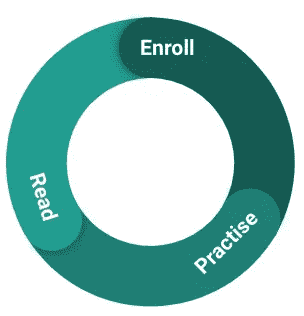
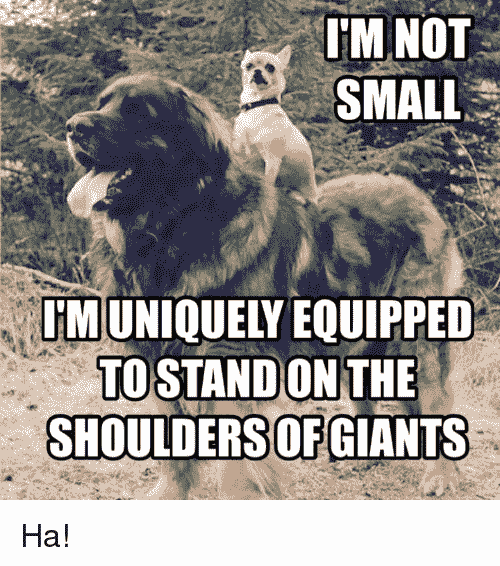
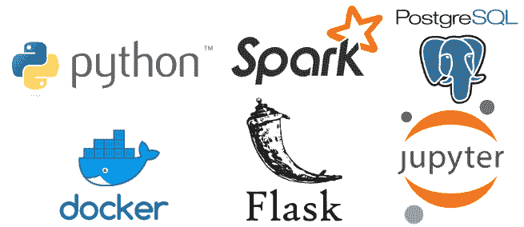
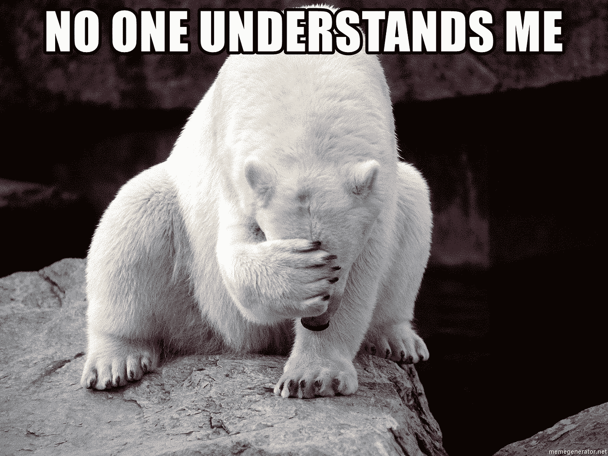
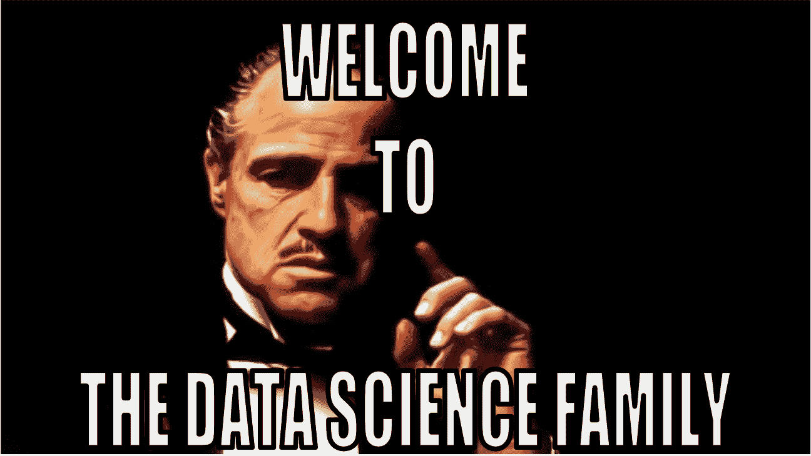
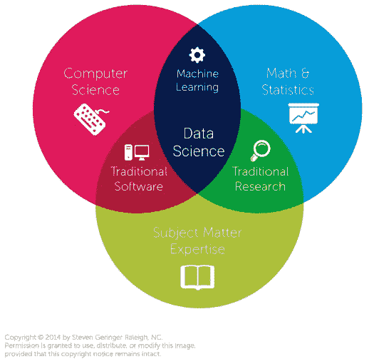

# 从数据分析师成长为数据科学家的秘方

> 原文：<https://towardsdatascience.com/the-secret-sauce-for-growing-from-a-data-analyst-to-a-data-scientist-819595c3c43c?source=collection_archive---------5----------------------->

## 从数据分析横向迁移到数据科学的顶级技巧

Road to Data Science (Photo by [Aleksandr Barsukov](https://unsplash.com/@aleksandr_barsukov?utm_source=unsplash&utm_medium=referral&utm_content=creditCopyText) on [Unsplash](https://unsplash.com/@aleksandr_barsukov?utm_source=unsplash&utm_medium=referral&utm_content=creditCopyText))

毫无疑问，数据科学的热浪袭击了大多数行业，使数据科学家成为 21 世纪最性感的工作，正如《哈佛商业评论》所提到的。尽管对有经验的数据科学家的需求和胃口越来越大，但这份工作在大多数时候都被描述得含糊不清。此外，数据科学和数据分析或工程之间的界限仍然被许多招聘经理松散地定义。这种缺乏真正行业标准的情况让许多希望转行从事数据科学工作的专业人士感到困惑。与许多分析师和软件开发人员交谈后，我意识到关于人工智能和机器学习(ML)的可用信息是多么令人难以置信。我也从经验中知道，在没有任何指导的情况下，知道从哪里开始是多么困难。目前，我是 [Zoopla](http://www.zoopla.co.uk) 的一名数据科学家，我想分享一些我从个人从分析到数据科学的职业旅程中学到的经验。

Cute GIF from [https://imgur.com/gallery/oJSx1YR](https://imgur.com/gallery/oJSx1YR)

## 在坚实的数学基础上站稳脚跟

大多数 ML 算法建立在*多变量微积分和线性与非线性代数*之上。高技能的数据科学家能够在数学层面上改变计算机程序，从而推动模型性能的真正改善。掌握数学技能很重要，尤其是统计学和线性代数。拥有*学习和理解机器学习技术的能力*是成为一名数据科学家的必要条件。不管你是从心理学还是数学学位、博士学位还是在线课程中学到的，都无关紧要。

我个人拥有剑桥大学的工程学士和硕士学位。通常，STEM 学士学位已经提供了学习机器学习和数据科学技术所需的数学基础。许多有抱负的数据科学家被博士学位是从事数据科学职业的先决条件的神话所打击。目前，有许多数据科学家拥有博士学位，但这不是一个规则。例如，我的前同事 Jorge Brasil[拥有应用数学硕士学位，在包括微软在内的顶级公司拥有超过 7 年的数据科学经验。](https://www.linkedin.com/in/jorge-brasil-60917846/)

> 技巧 1:关注你的能力而不是你的背景。

作为一名数据科学家，你经常将*困难的、开放式的、定义不清的问题*分解成*小步骤*。这是一项你在研究生阶段接受的为期 3-6 年的技能培训。行业也可以提供这种技能，这就是为什么我个人选择在本科毕业后加入一家电子商务初创公司，成为数字分析和定价团队的第二名成员。

## 在教你的机器之前先教你自己

数据分析师报告、总结和解释历史和当前信息，使其对业务有用。这与数据科学家截然不同，后者的职责是以一种允许对未来做出预测或规范性决定的方式总结数据。数据科学家的核心任务是*训练、测试和优化 ML 算法*，因此，他们的技能主要集中在 ML 建模上。

medium 和其他平台上的许多博客帖子非常适合新手，可以指导你解决你可能想要解决的具体问题。其他有用的阅读材料如下:

*   bishop[——模式识别和机器学习](https://cds.cern.ch/record/998831/files/9780387310732_TOC.pdf)(许多人称之为机器学习圣经)
*   Hal Daumé III [—机器学习课程](http://ciml.info/)
*   迈克尔·尼尔森 [—神经网络和深度学习](http://neuralnetworksanddeeplearning.com/)

理论和沉重的方程式有时会让人不知所措，不应该把某人拒之门外。对我有效的一种方法是在编码的同时阅读。例如，尝试从头构建一个单层感知器(最简单的一种神经网络)，以完全理解你在书中读到的内容。

Learning combo: books, courses and code.

> 技巧 2:运用你所学的科学方法。

也有许多在线课程和硕士，在理论和实践上有不同的权重，涵盖了机器学习 ML 的基础。我最喜欢的选择是:

*   [Coursera ML 课程](https://www.coursera.org/learn/machine-learning)来自吴恩达，该领域的领导者，涵盖了一些基础知识。尝试 Python 中的作业可能比 Octave/Matlab 中的作业更好，因为如果你有更强的 Python 技能，你将在就业市场中处于更好的位置。
*   [Fast.ai](https://www.fast.ai/) 课程([面向程序员的机器学习入门](http://course18.fast.ai/ml)、[面向程序员的实用深度学习](http://course.fast.ai/)、[面向程序员的前沿深度学习](http://course18.fast.ai/part2.html))具有启发性的[教学理念](https://www.fast.ai/2016/10/08/teaching-philosophy/)和更加实用的侧重点，由 ML 名人杰瑞米·霍华德和瑞秋·托马斯博士打造。
*   斯坦福大学分享了一系列人工智能课程的材料，举几个我个人喜欢的例子: [cs224n](http://web.stanford.edu/class/cs224n) 用于视觉识别的卷积神经网络和 [cs231n](http://cs231n.stanford.edu/) 具有深度学习的自然语言处理。

这里的目标既不是记忆公式和推导，也不是阅读这些书和讲座的每一页。你的目标应该是*捕捉大多数模型和算法以不同方式处理的基本概念*，例如神经网络中的漏层、消失梯度、信号/噪声关系。获得将问题与这些基本原理联系起来的能力将使你成为一名优秀的应用数据科学家，这是许多雇主都希望拥有的。

## 做科学研究

> *提示 3:为你的业务环境和问题选择正确的方法。*

数据科学家的真正技能是知道需要什么技术和机器学习方法来回答手头的业务问题。该领域在过去十年中蓬勃发展，作为一名数据科学专业人员，需要不断渴求知识才能脱颖而出。我强烈建议阅读不同技术公司和该领域关键人物的学术论文和 ML/AI 博客。当你被要求为抽象的问题陈述提供解决方案，而这些问题陈述并没有提供直接的解决方案时，这可能会很有帮助。通过研究外面有什么找到正确的解决方案，80%的工作已经完成。安德烈·卡帕西在斯坦福课堂上说得很好 [cs231n](http://cs231n.stanford.edu/) ，*《不要做英雄》*。在我的团队中，我们不会低估其他人在寻找目前最有效的架构方面所付出的努力和时间。我们没有为一个常见问题开发自己的架构，而是导入库，下载预先训练好的模型，并根据我们的数据对它们进行微调。商业世界期望你*快速交付(和失败)*，因此，如果可能的话，你不应该重新发明轮子，而是站在巨人的肩膀上。

“If I have seen further it is by standing on the shoulders of Giants”, Isaac Newton (1675) (image from [https://me.me/i/3487477](https://me.me/i/3487477))

## 提高你的编程技能

数据分析师使用数据来帮助企业做出明智的决策。他们精通 SQL、Excel 和可视化工具，如 Tableau 或 Power BI。另一方面，数据科学家需要建立强大的模型来推断和解决大规模的业务问题。因此，他们需要发展自己的编程技能。我不是从 10 岁开始就穿着连帽衫编码的，但对我来说，开始学习如何编码永远不会太晚。在大学里，我在 Matlab 中学习机器学习，并为不同的工作项目编写 JavaScript 代码，但实践 pythonic 式的方法很重要。

Python 正在成为世界上最流行的编码语言，并且拥有无数经过良好测试的数据科学库，这些库还在不断更新。不出所料，大多数数据科学团队，包括我的团队，都在寻找 Python 用户。所以如果你不知道 Python，注册一个[在线课程](https://wiki.python.org/moin/BeginnersGuide/Programmers)，学习基础知识让你入门。你不应该忽视风格指南，如 [PEP8](https://www.python.org/dev/peps/pep-0008/) 和显示耐心，因为实践会带来预期的结果。此外，[学习](https://nbviewer.jupyter.org/github/fastai/course-v3/blob/master/nbs/dl1/00_notebook_tutorial.ipynb)如何使用 [Jupyter](https://github.com/jupyter/jupyter/wiki/A-gallery-of-interesting-Jupyter-Notebooks) 对于更快的工作流程和数据/模型探索将是关键。

> 技巧 4:练习练习再练习，获得更强更快的编程技能。

Because programming gives you magical powers

参加黑客马拉松、参加 kaggle 竞赛、从事个人编程项目都是提高编程技能的不同方式。识别或参与从您的分析结果中得出的数据科学机会，可以成为您在当前职位上积累经验的一种方式。预测和异常检测的算法可以是你可以要求参与的其他项目，甚至可以作为你作为分析师发展的一部分。我记得我在行业中的第一个数据科学项目是在一个电子商务网站上自动完成搜索查询的算法。这个项目是由我还是初级分析师时报道的一些关于搜索和购物篮的有趣分析见解发起的。

## 获得软件工程技能

当你想让你的模型看到生产之光的时候，软件工程技能就变得必要了。出于方法和法律的原因，培养一种旨在通过自动化实现项目和结果的可复制性的编码态度是至关重要的。在一个拥有成熟数据科学文化的公司中，有人可能创建原型，有人可能编写产品代码，还有人可能部署它。然而在现实中，不管公司的规模有多大，你都不太可能得到所有需要的支持，仅仅知道统计数据不足以交付数据科学项目。

> *提示 5:尽早将项目中的步骤自动化。*

因此，最初的数据科学清单可能如下所示:

*   **可重现的数据管道(例如 spark 和 python 中的数据管道)**:您是否曾经不得不重现您以前做过的分析？创建一个逻辑数据流(如原始(不可变数据)- >中间(进行中的工作)- >已处理(最终特征))并使用 [Makefiles](https://www.gnu.org/prep/standards/html_node/Makefile-Conventions.html#Makefile-Conventions) 将为你和你的同事节省大量时间。我和我的团队是 [cookiecutter](https://github.com/audreyr/cookiecutter) 的超级粉丝，它提供了一个像这样的逻辑项目结构。
*   训练和评分的端到端自动化:一个模型在大多数时候是一个活的有机体，需要新的预测，数据可能会发生变化。这转化为再培训、评分和提炼。然后有必要将你的模型参数、秘密和随机种子放入配置文件中，将一个 ds 项目分解成不同的元素，并应用[模块化](https://scholarspace.manoa.hawaii.edu/bitstream/10125/59549/0109.pdf)，例如创建一个可以在训练和评分过程中使用的共享特征库。
*   **单元测试覆盖率**:我打赌你想拥有无忧无虑的睡眠和不受打扰的假期。然后，为了确保健壮性，为你的项目编写测试是很重要的。
*   **构建一个提供预测的 API**:要推销你的想法和模型，你需要有一个概念证明，在很多情况下，这相当于一个 REST API。如果你除了 Python 之外懒得用别的语言，可以用 [Swagger UI](https://swagger.io/tools/swagger-ui/) 自带的 [Flask](http://flask.pocoo.org/docs/1.0/) 和 [Flasgger](https://github.com/rochacbruno/flasgger) 。Swagger 将有助于记录和可视化 RESTful web 服务。
*   **针对 ECS 部署或生产环境的数据科学解决方案的容器化** : [Docker](https://www.youtube.com/watch?v=GOW6yQpxOIg) 允许您隔离项目及其依赖关系，在环境之间移动模型，并每次以完全相同的方式运行代码，实现 100%的可重复性。这将有助于您与开发人员和工程师的合作，因为他们可以将您的容器用作黑盒，而无需了解数据科学。

Some tick-off items on a data scientist’s programming list

## 将科学翻译成领域语言

作为一名数据人员和主题专家，您可以通过在数据中寻找代理来克服诸如丢失业务或 KPI 定义之类的障碍，或者使其成为您从 ML 中学习的潜在因素。数据科学通常会给业务带来中断，因此，您需要向高层领导推销您的想法，以便获得适当的支持和资源。有人可能会说，让业务中的所有利益相关者都能理解算法是一种艺术。学习如何翻译我所构建的东西，以便向他人展示它的重要性，是我必须不断学习和再学习的事情。正如毕马威数据科学和工程现任主管丽贝卡·波普在[硅谷女性会议](https://www.women-in-technology.com/)上强调的那样，“永远记住你(而不是你的代码)是有影响力的。人们不买算法，他们信任你和你的能力。”。因此，确保你花时间和精力将数学转化为你所在垂直行业特有的视觉叙事。

> *提示 6:用垂直行业的术语交流你的工作。*

A data scientist explaining deep learning . (image from [https://memegenerator.net/img/instances/63241330.jpg](https://memegenerator.net/img/instances/63241330.jpg))

## 成长的时间到了

身处一个新成型的职业，刺激大于辛苦。Zoopla 让我有机会在一个才华横溢的数据科学团队中工作，与我可以学习的人一起工作有助于我更快地实现我的职业目标。找到一个让你成长的团队，拥有像海绵一样的头脑，会加速你的成功之旅。我很幸运，我的直线经理 Jan Teichmann 有经验来指导我成为一名高技能的数据科学家。理想情况下，你的经理了解你的日常工作以及你想要达到的目标。否则，从你的团队或公司之外寻找你可能需要的额外指导，例如从你大学的校友或教授那里，或者从你网络中友好的数据科学家那里。会面和会议也能鼓舞人心，帮助你完成这项任务。

> *提示 7:记住没有任何教科书或课程比辅导更重要。*

Customised meme (Read it with Don Corleone’s voice)

*总而言之*，在数据科学领域开始职业生涯时，你应该重点掌握的技能是统计学*，多变量微积分和线性代数，机器学习，编程技能，软件工程和可视化技能*。

Data Science Venn Diagram by Steven Geringer Raleigh, NC.

实现目标的最佳技巧:

1.  关注你的能力，而不是你的背景
2.  运用你所学的科学方法。
3.  针对您的业务环境和问题选择正确的方法。
4.  *练习，练习，练习更强更快的编程技能。*
5.  *尽早将项目中的步骤自动化。*
6.  *用你所在垂直行业的术语来表达你的工作。*
7.  请记住，没有任何教科书或课程比辅导更重要。

你还在等什么？珍惜机会，努力成为你梦想中的人。；)

欢迎分享数据科学爱好，并在 [LinkedIn](https://uk.linkedin.com/in/natalia-koupanou-51563269) 上与我联系。特别感谢 [Jan Teichmann](https://www.linkedin.com/in/janteichmann/) 的反馈和支持！