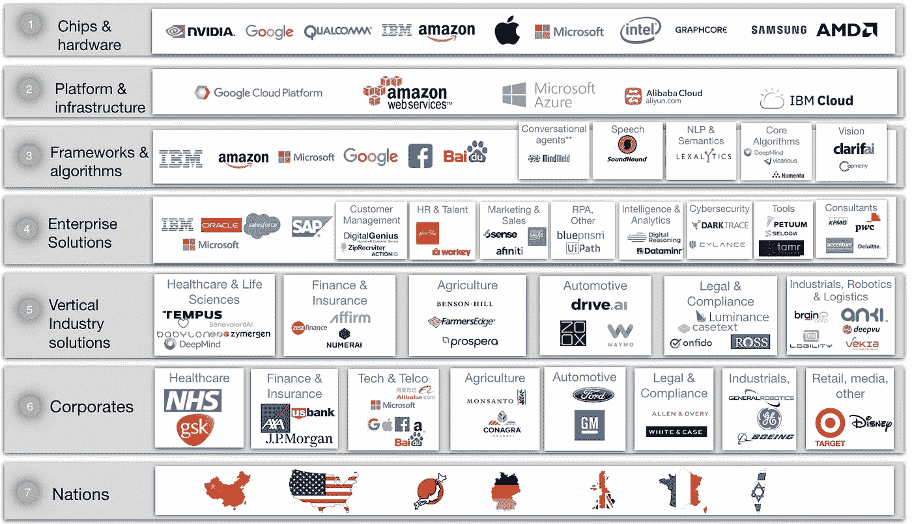
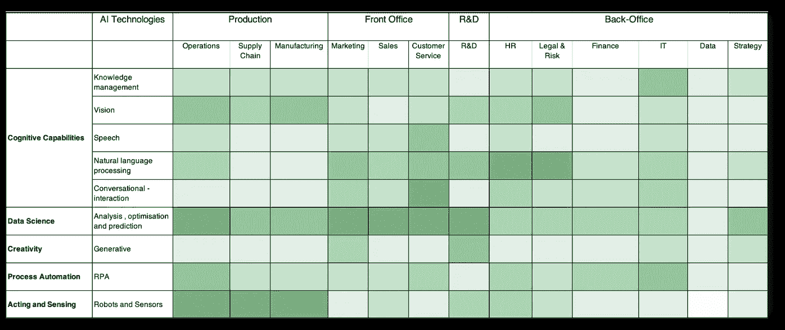
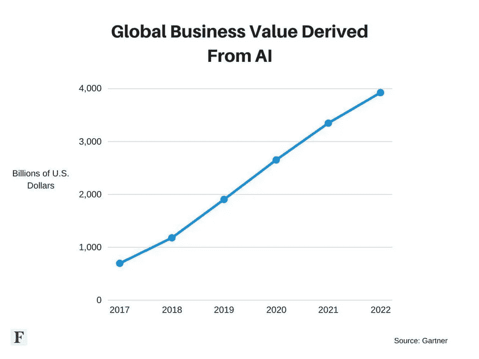

# 成功的人工智能创业公司的秘密。AI 到底是谁在赚钱？第二部分

> 原文：<https://towardsdatascience.com/the-secrets-of-successful-ai-startups-whos-making-money-in-ai-part-ii-207fea92a8d5?source=collection_archive---------1----------------------->

## 从硅谷到伦敦，再到上海，人工智能初创公司层出不穷。但是随着淘金热的到来，少数被选中的人会找到金子，而其他许多人会失望而归。要取得成功，人工智能初创公司需要跨越从技术到企业的商业鸿沟。在拥抱负责任的人工智能实践的同时，学会不要走得太快，不要弄坏东西。

# 欢迎来到全球人工智能创业淘金热

A I 处于全力淘金模式。每天我们都会听到人工智能公司筹集大量资本的头条新闻，以便为他们提供勘探人工智能金矿的资源。资金正流向这些新领域。在美国，[人工智能的风险投资资金同比增长 72%](https://www.cbinsights.com/research/artificial-intelligence-funding-venture-capital-2018/), 2018 年达到 93 亿美元。

Which AI startups will strike gold?

[总部位于纽约的人工智能和机器学习公司 Dataminr](https://www.dataminr.com/about) ，实时了解新闻和信息，例如，在 2018 年筹集了[3.92 亿美元。硅谷人工智能驱动的计算机安全和管理公司](https://www.axios.com/dataminr-raises-new-funds-at-16-billion-valuation-36f1d061-7456-4876-8684-6e83d0855b5d.html) [CrowdStrike](https://medium.com/u/3343218c23de?source=post_page-----207fea92a8d5--------------------------------) 、 [Team Tanium](https://medium.com/u/fcac713595b2?source=post_page-----207fea92a8d5--------------------------------) 、 [Cylance，Inc.](https://medium.com/u/59905112020c?source=post_page-----207fea92a8d5--------------------------------) 去年各自融资超过 1 亿美元。并且 [Pony.ai](https://www.pony.ai/) 筹集了 1.02 亿美元来开发其最新的自动驾驶系统。

但是西部蛮荒的边疆也在东部开放了。即中国。专注于创新的计算机视觉和深度学习的 SenseTime 在 2018 年筹集了两笔 6 亿美元的资金。它现在声称是世界上最有价值的人工智能初创公司。自称为人工智能和人形机器人公司的 [UBTECH](https://ubtrobot.com/pages/about-ubtech) 在 2018 年筹集了 8.2 亿美元。[面部识别领域的领军企业 Face ++ T5 已经融资逾 6 亿美元，目前正寻求融资 5 亿美元。iFlytek](https://www.faceplusplus.com/) ，一家声称拥有中国语音识别市场 70%份额的公司，正在寻求融资 5 . 65 亿美元。这些确实是很大的数字，我们可以期待更多的数字出现。

在欧洲，有一些人工智能的明星，如法国人工智能工具公司 Dataiku，帮助企业将人工智能从实验转移到生产。他们在 2018 年筹集了超过 1 亿美元，但为这一增长提供资金的主要是美国风险投资公司，如纽约的 [FirstMark](https://medium.com/u/30dea56d271f?source=post_page-----207fea92a8d5--------------------------------) 。

仅在伦敦，最近的伦敦人工智能市长报告就确定了超过 650 家本地人工智能公司，是柏林和巴黎总和的两倍。这些公司中有许多是年轻的初创公司，特别集中在有需求的保险、金融和法律部门。资金已经涌入这些生机勃勃的年轻公司，但在这个阶段，资金往往是数百万或数千万，而美国和中国的资金是数亿。

# **小心傻瓜的黄金**

但就像任何淘金热一样，有许多勘探者在夸大其词。走进任何公司推介活动或 AI meetup——现代前沿沙龙——你可以发现创业公司的创始人大声疾呼，他们的风险是如何由最新的深度学习进展推动的。但是如果你在白天的寒光下挖掘地下，似乎有很多傻瓜的金子。正如伦敦 MMC Ventures 在最近的一份人工智能报告中指出的，在欧洲的 2830 家所谓的人工智能初创公司中，超过 40%没有真正使用人工智能。

甚至有[声称](https://medium.com/s/story/what-microsoft-and-google-are-not-telling-you-about-their-ai-b609f5395a8e)人工智能技术巨头，如微软和谷歌，并不总是过于倾向于依赖人类来驱动他们的“人工智能解决方案”。澳大利亚公司[阿彭](https://appen.com/about-us/)从事**验证搜索结果**的全球业务，拥有超过 1，000，000 名灵活员工的全球团队。这是一支名副其实的人工检查搜索结果的大军。我们不会假设这些鼓吹一切自动化的全球人工智能领导者。随着[兰斯伽](https://medium.com/u/ab685c989c2d?source=post_page-----207fea92a8d5--------------------------------):

> “科技公司受益于这样一种看法，即它们已经建立了复杂的自动化和人工智能，而不是一个依赖人工劳动的系统。”

我们认为人工智能初创公司要么(1)如果没有深度神经网络等人工智能现代技术就不会存在——这是它们存在的**核心**要么(2)提供人工智能基础设施和工具，如人工智能专家硬件、人工智能应用的云服务或加速人工智能解决方案实施的工具。

# 人工智能价值链——人工智能初创公司在哪里？

人工智能的比赛场地广阔而漫长，由人工智能的创造者(即创造人工智能技术的人)和接受者(即利用人工智能技术并获取价值的人)组成。在这个[系列的第一部分中，我](/who-is-going-to-make-money-in-ai-part-i-77a2f30b8cef)介绍了一个七层价值链，为谁将在人工智能中赚钱。

The AI value chain — who will make money with AI? The companies noted are representative of larger players in each category but in no way is this list intended to be comprehensive or predictive. © Best Practice AI Ltd

有(1)人工智能**芯片**和**硬件**制造商正在寻求为所有人工智能应用提供动力，这些应用将被编织到全球大大小小的组织结构中；(2)将托管 AI 应用的**云** **平台**和**基础设施**提供商；(3)AI**算法**和**认知**服务**构建** **区块**制造者，他们提供视觉识别、语音和深度机器学习预测模型，为 AI 应用提供动力；(4) **企业** **解决方案**软件用于客户、人力资源、资产管理和规划应用的提供商；(5) **行业** **垂直** **解决方案**寻求使用人工智能为医疗保健和金融等行业的公司提供支持的提供商；(6) **寻求增加收入、提高效率和深化洞察力的人工智能的企业用户；最后(7) **民族国家**希望将人工智能嵌入其国家战略，成为人工智能国家。**

## **这次淘金热的镐和铲都是科技巨头**

虽然人工智能初创公司正在寻求提供新的芯片、云服务和算法，但人工智能价值链的这一领域由谷歌、微软和亚马逊等技术巨头主导。他们成了这次淘金热的镐和铲。无论人工智能公司在挖什么金子，巨头们都希望确保他们用自己的人工智能硬件、云和算法解决方案为该组织提供动力。

设计、制造和分销硬件芯片需要大量资金，因此只有少数初创公司有发展空间。总部位于英国的[**graph core**](https://www.crunchbase.com/organization/graphcore)**已经筹集了超过 1.1 亿美元来构建为机器学习而优化的芯片。但随着谷歌、脸书和微软等公司推出自己的人工智能优化芯片，它们正在一个竞争激烈的空间中竞争。例如[谷歌云](https://medium.com/u/4f3f4ee0f977?source=post_page-----207fea92a8d5--------------------------------)已经引入了它的[云张量处理单元](https://cloud.google.com/tpu/docs/tpus)来驱动他们的云服务。IBM Research 和英特尔等芯片巨头并没有止步不前，他们希望提供自己的人工智能优化芯片。中国人工智能芯片制造商寒武纪正在为数亿部来自中国华为的手机提供动力。**

**类似地，科技巨头们也在看他们的云服务中哪一个可以运行将随处可见的数百万人工智能应用程序。会是 [AWS 创业公司](https://medium.com/u/73c1b22e3b76?source=post_page-----207fea92a8d5--------------------------------)、[谷歌云](https://medium.com/u/4f3f4ee0f977?source=post_page-----207fea92a8d5--------------------------------)、微软 Azure 甚至中国的阿里巴巴吗？这场战斗非常激烈，因为预计到 2020 年，整个云市场的价值将达到 4000 亿美元。云市场之战将越来越多地围绕人工智能云展开。**

**然后，科技巨头们正在努力确保他们提供最好的底层**人工智能算法和认知服务**来支持将被构建的数百万人工智能应用。提供基于云的人工智能产品的公司将更容易获得这些构建模块。计算机程序员今天可以通过应用程序接口(API)编写几行代码来插入真正强大的人工智能服务。[谷歌](https://cloud.google.com/products/ai/)，[亚马逊](https://aws.amazon.com/machine-learning/ai-lex-polly-rekognition/)，[微软](https://azure.microsoft.com/en-gb/overview/ai-platform/)， [IBM](https://www.ibm.com/cloud/ai) 都在云中提供机器学习和**认知** **服务**。这种新类别的人工智能即服务(AIaaS)将为大量的对话代理和聊天机器人、语音、自然语言处理(NLP)和语义、视觉和增强的核心算法程序提供动力。算法领域竞争激烈，但有些初创公司似乎正在寻找空间，通过专注于非常深入的领域和技术特定的解决方案来开拓自己的空间。提供情感识别软件服务的初创公司 Affectiva 已经筹集了超过 5000 万美元。Clarifai 是一家为企业提供高级图像识别系统以检测近似重复和视觉搜索的初创公司，在过去三年里已经筹集了近 4000 万美元。视觉相关算法和服务的[市场](https://www.statista.com/statistics/607835/worldwide-artificial-intelligence-market-leading-use-cases/)预计在 2016 年至 2025 年间的累计收入为 80 亿美元。**

## **跨企业和行业的人工智能**

****企业软件**一直被 [Salesforce](https://medium.com/u/f4fb2a348280?source=post_page-----207fea92a8d5--------------------------------) 、IBM、Oracle、SAP 等巨头把持。他们为金融和制造等部门提供人力资源软件(HRS)、客户关系管理( **CRM** )软件和企业资源规划( **ERP** )应用程序。但许多初创公司正急于提供下一代企业服务，填补现有企业目前未涉足的空白。一些初创公司甚至试图颠覆现有企业，认为现有的企业解决方案对于未来的企业来说过于昂贵、笨重和复杂。今天，有超过 200 家人工智能公司正在招聘，其中许多是人工智能初创公司。网络安全领导者 **DarkTrace** 和 **RPA** 领导者 [UiPath](https://medium.com/u/a555af6ca215?source=post_page-----207fea92a8d5--------------------------------) 拥有数亿美元的战争资金。但现任者希望确保他们的生态系统处于前沿，并投资于初创公司，以增强他们的产品。Salesforce 投资了客户管理解决方案 DigitalGenius，并投资了提供企业翻译服务的 Unbabel。Salesforce 最近[以 8 亿美元收购了](https://www.thedrum.com/news/2018/07/16/salesforce-inks-deal-acquire-datorama-reported-800m)[**Datorama**](https://datorama.com/)，这是一家成立于 2012 年的人工智能营销公司。 [SAP 最近收购了 Recast。AI](https://cai.tools.sap/blog/sap-acquires-recast-ai-accelerate-natural-language-processing-capabilities/) 为对话代理技术加速其自然语言处理能力。**

**还有**工具**创业公司已经筹集了大量资金。 [Petuum，Inc.](https://medium.com/u/c0fa6af5e77f?source=post_page-----207fea92a8d5--------------------------------) 工具提供商总部位于美国匹兹堡，自 2016 年成立以来已融资超过 1 亿美元。它们有助于加速和优化机器学习模型的部署。**

**然后人工智能创业公司正在为特定行业创建解决方案。BenevolentAI 已经筹集了超过 2 亿美元来帮助其 moonshot 通过先进的数据分析加速药物的研发。纵观医疗保健、金融、农业、汽车、法律、工业，初创公司正在筹集大量资金来解决行业问题。**

# **那么，什么是成功的人工智能创业公司？**

**那么是什么让这些 AI 创业公司成功呢？是什么让这些公司获得了发展势头并筹集了如此大量的资金？很明显，许多人工智能初创公司正在为企业提供**有价值的**点解决方案，并取得了成功，因为他们可以获得(1)大型和专有的**数据训练集，(2)领域知识**，这使他们对某个行业内的机会有深刻的见解，以及(3)围绕应用人工智能的**人才库**。**

1.  ****获取数据—** 大多数人工智能初创公司都在建立某种形式的机器学习模型，可以根据一些输入数据对结果进行分类或预测。在很大程度上，这些模型需要数据作为它们的“燃料”，而且数据越多越好。对于监督学习来说，通过向机器展示不同对象的例子，如狗和猫的图片，来教会机器进行分类或预测，标记数据至关重要。这就是为什么你会看到公司合作收集数据。[谷歌的 deep mind](https://deepmind.com/)——21 世纪的贝尔实验室——[与 10 家英国国民健康服务医院签订了一份为期五年的协议](https://www.ft.com/content/f4a73450-e771-11e8-8a85-04b8afea6ea3)，处理 160 万患者的医疗数据。Tractable 是一家分析和预测车祸维修成本的人工智能公司，它已经获得了 1 . 3 亿多张受损汽车的图片。这些图像已经被注释以识别哪个车辆部件被特别损坏。这些被标记的数据是深度神经网络学习的“燃料”。整个研发学院都在努力减少做出准确决策所需的数据量，但在大多数情况下，初创公司获得的数据越多、质量越高越好。尽管更多的数据并不总是带来线性回报。领先的思想家和投资者李开复认为，中国在人工智能领域表现如此出色的一个关键原因是，他们的数据集比其他任何地方都大得多。他指出，中国的手机用户数量是美国的三倍。而移动互联网支付是它的五十倍。**
2.  ****获得人工智能人才—** 获得最优秀的人工智能研究人员和工程师是一项挑战，尤其是在一个英国[谷歌 DeepMind](https://news.efinancialcareers.com/uk-en/325021/google-deepmind-pay) 工程师的平均年薪超过 28 万英镑或 36.3 万美元的时代。许多人工智能初创公司都是从大学中分离出来的，创始人一直在人工智能的不同领域进行研究。英国 [Poly.ai](https://poly-ai.com/) 最近[筹集了 1200 万美元](https://www.amadeuscapital.com/polyai-raises-12m-to-deploy-conversational-ai-agents-in-contact-centres/)用于在联络中心部署对话式人工智能代理，里面挤满了剑桥大学的人工智能博士。一个人才会吸引其他人才。**
3.  ****获取领域专业知识—** 通常情况下，能够创造突破性创新的洞察力来自于拥有一个多学科团队，这个团队能够发现并识别没有人能够单独发现的机会。例如，与保险流程专家合作的机器学习专家通常可以看到如何利用这种新的使能技术更好地解决问题。**

# ****AI 主要是企业使能技术(就像 80 年代的 SQL 数据库)****

**成功的人工智能创业公司已经真正理解了人工智能技术的本质以及它是如何被购买和消费的。人工智能是一种**使能**技术——一套工具、技术和方法，可以用来解决无数的用例。20 世纪 80 年代，SQL 数据库的引入允许以表格格式存储和查询结构化数据。这使得数以百万计的应用程序给企业资源规划和客户关系管理带来了数十亿美元的产业。类似地，人工智能将**支持**大量的用例。例如，视觉算法正被用于几乎每个行业，从发现制造缺陷到识别商店扒手，再到帮助自动驾驶汽车在街上导航。自然语言处理可以在任何地方使用，从审查社交媒体中的客户情绪到审查合同完整性的法律文件，从筛选简历和履历到识别金融交易的潜在机会。语音转文本技术正被用于医学转录算法。**

**由于人工智能是一个使能器，许多人工智能初创公司将帮助企业和组织解决问题。这意味着人工智能初创公司通常会专注于 B2B 和企业。在[最佳人工智能实践](https://medium.com/u/1e986fd5599e?source=post_page-----207fea92a8d5--------------------------------)，我们确定了超过 600 个人工智能常见商业用例，以及超过 1000 个人工智能如何在企业中使用的案例研究。人工智能几乎有无限多的方式可以组合和设计来解决业务需求。**

****

**[Best Practice AI](https://medium.com/u/1e986fd5599e?source=post_page-----207fea92a8d5--------------------------------) identified over 600 use cases of AI technologies applied across production, front-office, R&D and back-office functions. The darker the shade the more use cases we identified. © [Best Practice AI](http://www.bestpractice.ai)**

**我们超过 3000 家全球人工智能初创公司的目录表明，大多数公司都在试图进入企业。**

****

**[Gartner predicts enterprise AI derived value will grow from US$1.2T in 2018 to nearly $4T in 2022.](https://www.forbes.com/sites/alexknapp/2018/04/25/gartner-estimates-ai-business-value-to-reach-nearly-4-trillion-by-2022/#3adeb99f33f9)**

**如此多的活动集中在企业上也就不足为奇了。分析公司 [Gartner](https://www.gartner.com/technology/pressRoom.do?id=3872933) 最近预测，到 2022 年，企业将从所有人工智能用例中获得惊人的**3.9 万亿**，是的，万亿的价值。难怪大多数人工智能初创公司都专注于为企业提供解决方案，无论是跨所有行业的横向解决方案，如人工智能驱动的人力资源，还是为特定行业量身定制的人工智能解决方案。**

# **跨越 AI 商业鸿沟到企业**

**那些做得很好的创业公司一般都了解人工智能技术的本质和企业中的机会。但不仅如此，开始形成规模的人工智能初创公司都跨越了从技术世界到企业的商业鸿沟。他们已经学会了:**

## ****1。不要动作太快，弄坏东西；拥抱负责任的 AI****

**这种由硅谷推广的文化在 B2C 世界中运行得很好，在这个世界中，应用程序中一个错误的后果相对有限。全球的软件开发人员已经接受了精益创业和敏捷方法。但这意味着实时应用程序经常会有错误和中断。这在企业中并不太适用。**

**在金融服务、农业或制药等高度监管的企业中尤其如此。技术正在推动越来越多的监管。欧洲在 2018 年引入了 GDPR 法规，该法规为个人提供了公司使用其个人数据的权利。滥用消费者个人数据将被处以高额罚款，最高可达公司收入的 2%。在金融行业，当你处理真实的金融数据和金融交易时，“哎呀，我想这个应用程序不起作用了”这样的回答是行不通的。一家严重依赖人工智能的新英国挑战者银行发现自己因涉嫌合规失误而陷入监管机构的[困境](https://www.bloomberg.com/news/articles/2019-03-01/regulator-circles-revolut-following-alleged-compliance-lapse)。在一个自动决策的后果可以改变生活的世界里，例如自动车辆碰撞或关键的医疗保健诊断，你最好确保你对你的自动决策的可靠性和准确性有信心。**

**企业越来越多地实施董事会治理和监督，以管理因使用人工智能而给公司带来的**声誉**风险。例如，如果用于训练人工智能算法的数据集存在样本偏差，那么如果它们被视为具有歧视性，那么一家公司的品牌就会受损。我们都看到了最近的[头条](https://www.nytimes.com/2018/02/09/technology/facial-recognition-race-artificial-intelligence.html)显示算法在识别白人男性的性别方面比其他种族要好得多。或者最近来自亚马逊的案例，他们放弃了他们的招聘推荐系统，因为机器学习只是反映了历史上招聘主要是男性、白人和年轻人的事实。**

**越来越多的初创公司将需要为企业提供某种程度的保证，以防范其人工智能产品的风险。你的 AI 启动技术是否为具有法律效力的全自动决策提供了可解释性？例如，如果你的技术可以用于自动化招聘决策，那么你就需要解释这些算法在 GDPR 下是如何工作的。你需要证明该算法不会基于受保护的类别(如性别、年龄、社会人口统计数据或健康挑战)对人们产生偏见(请随意看看我们关于可解释人工智能主题的[介绍性读物](https://medium.com/@bestpracticeAI/introductory-reading-list-for-explainability-in-machine-learning-ef85b93524de))。英国的[信息专员办公室](https://ico.org.uk/)最近发布了一份讨论文件，确定了[企业可能需要管理的八个人工智能特定风险领域](https://ai-auditingframework.blogspot.com/2019/03/an-overview-of-auditing-framework-for_26.html)，包括(a)特别关注偏见和歧视的分析的公平性和透明度，(b)人工智能模型的准确性，(c)自动决策的水平，无论是全自动还是人工参与，(d)安全和网络风险，以及(e)准确性与隐私和可解释性之间的权衡。**

**初创公司和企业将需要真正精通这个话题，这个话题越来越多地被称为**负责任的人工智能实践**。作为一家初创公司，不要走得太快，打破太多东西。这会给你带来很多麻烦。并确保你接受并展示了负责任的人工智能实践(这个话题我将在后面详述)。**

## ****2。解决真正高价值的用例，而不是最好拥有的用例****

**在过去的几年里，我们已经看到了消费者移动应用的浪潮，它解决了任何可以想象的消费者需求。通过在谷歌和脸书上投放广告，应用程序可以在几周内构建、发布并获得消费者流量。但是这种方法在企业中行不通。这是一种零和游戏，首席信息官(CIO)和其他执行领导没有兴趣接受另一种技术解决方案。我们都知道，在尝试使用人力资源、财务、销售或营销部门的最新应用程序时会遇到工作挫折。我们努力记住我们的密码。新的应用程序都不一样。然后，我们经常记不起将该文件存储在了什么位置，是项目文件夹还是个人云文件夹。技术领导者在试图将更多技术集成到他们现有的、经常磨损的遗留数据库和技术平台中时遇到了挫折。**

**为了引起首席信息官和部门负责人的注意，比如首席营销官(CMO)，你的解决方案最好是解决一个真正重要的问题。它应该解决的问题类型应该是，经理睡觉时会担心这个问题，而他们的奖金计划显然与此相关。**有产者好**不在企业工作。我最近与一家人工智能初创公司的 CTO 聊天，他花了两年时间构建一个人工智能产品套件来推动企业智能，但销售却没有出现。为什么？价值还不够高。**

**一个真正高价值使用的例子来自 [HireVue](https://medium.com/u/a0085f2a0fc1?source=post_page-----207fea92a8d5--------------------------------) 。他们与[联合利华合作，节省了超过 50，000 个](https://www.bestpractice.ai/studies/unilever_saved_over_50_000_hours_in_candidate_interview_time_and_delivered_over_1m_annual_savings_and_improved_candidate_diversity_with_machine_analysis_of_video_based_interviewing)小时的候选人面试时间，每年节省超过 100 万英镑，并通过基于视频的面试的机器分析提高了候选人的多样性。那是一大笔钱。英国初创公司 Reinfer 最近完成了一项与一家大型国际银行的试点项目，该公司使用先进的 NLP 算法来筛选数十亿封电子邮件和信息，以确定人们在交流什么。它通过使用机器学习分析邮箱，确定了交易后运营中的主要问题，有可能节省数百万美元的运营成本。这些是真正高价值的用例。**

## ****3。掌握 B2B 企业销售并学会计算耐心****

**创业公司需要确保他们掌握企业销售。这些技能对人工智能供应商来说非常珍贵，因为掌握**咨询** **销售**需要时间和实践经验。我职业生涯早期参加的最有价值的培训课程是[旋转](https://www.funnelenvy.com/blog/spin-selling-approach-closing-sales/)销售方法——S(状态)、P(问题)、I(完成)、N(速度)。销售需要时间来确定利益相关者，与这些利益相关者会面，评估当前业务**情况**，提问以确定关键**问题**，评估这些问题在多个部门的**影响**，就影响和**需求**达成共识。即使这样，也不能保证你对这种需求的解决方案会得到预算的优先考虑。**

**一个典型的公司经理有一个从现在到未来的待办事项清单。对于一家初创公司来说，解决**高价值用例需求**至关重要，所以不要仅仅将你的公司建立在“产品直觉”的基础上**

**当销售周期可以持续 12-18 个月时，耐心是非常珍贵的。很多 AI 创业公司资金告罄，或者把宝贵的资源分配给没有资格的销售机会。如果你认为机会最终不会有任何结果，那么确保你能迅速发现它们。 [Re:infer](https://www.reinfer.io/) 发现销售周期真的真的很长，但他们坚持不懈地确定一个真正高价值的使用案例，找到一个内部冠军，并完成一个成功的销售试点。他们还发现，企业准备在整个组织中推出人工智能确实会减缓销售过程。**

## ****4。为现实世界翻译人工智能****

**初创公司需要能够用商业受众容易理解的语言解释他们独特的算法、技术、产品或解决方案的价值，这一点至关重要。他们需要会说两种语言。随着许多人工智能初创公司由年轻、邪恶、聪明和高度技术化的头脑创建，与“西装革履者”之间往往存在沟通差距。在解释这项尖端技术的细节时，我们看到高管们的目光一直呆滞。如果很少提供这种技术如何通过影响收入、效率和客户服务来推动业务发展的背景，高管会很快失去耐心。初创公司要会说技术和商业语言，这一点至关重要。他们需要在技术语言和商业语言之间进行翻译。**

## ****5。降低试验壁垒(试点)****

**重要的是，初创公司要让试点项目变得非常简单。人工智能解决方案通常需要大量数据和大量时间来训练机器学习模型。人工智能通常需要大量的工程集成到后端技术中才能很好地工作。可能需要几个月的时间来获取、清理和整理数据，然后再用几个月的时间来训练模型。在非常繁忙的企业中，几乎没有兴趣做大量繁重的工作来设置试点。公司希望快速验证概念。DigitalGenius 在这方面做得很好。他们的客户服务技术工作在现有的企业平台之上，如 [Salesforce](https://medium.com/u/f4fb2a348280?source=post_page-----207fea92a8d5--------------------------------) ，他们已经将训练技术回答客户查询所需的时间减到最少。他们还使集成到现有的工作流程中变得非常简单，提供了人在回路上的决策。荷兰航空公司[KLM 声称，通过使用 DigitalGenius 实现机器学习聊天机器人，可以回应超过 50%的客户](https://www.bestpractice.ai/studies/klm_automates_responses_to_over_50_of_customer_enquiries_on_social_media_by_implementing_a_machine_learning_chatbot)在社交媒体上的查询。**

## ****6。技术型创始人需要雇佣业务人员**。**

**初创公司需要确保他们有技能跨越从技术人员到企业的商业鸿沟。《哈佛商业评论》最近报道说，最有可能成功的创业公司拥有技术型创始人，他们很快就雇佣了商务人员。“为什么技术技能似乎对创始人更重要，有一种理论认为，普通的技术型创始人比普通的商业培训型创始人拥有更好的商业技能。”但将创始人的 DNA 与商业人士融合在一起，往往需要炼金术。我已经记不清有多少次看到初创公司努力适应这种文化。最常见的是技术创始人会雇佣销售“农民”而不是销售“猎人”农民不知道如何出去寻找创业所需的业务。他们已经习惯了庞大的营销部门给他们带来源源不断的销售线索。**

# **寻找耐心和聪明的资本**

**例如，与移动应用程序的快速原型开发相比，构建企业人工智能技术和产品通常需要更长的**产品** **开发** **生命周期** - **周期**。产品上市可能需要一年多的时间。确保投资者了解时间表和投资概况至关重要。确保初创公司不会陷入种子期和首轮融资之间的资金缺口是至关重要的。在与一位最近的英国投资者交谈时，他们表示:**

> **他们鼓励他们资助的公司投入更多资金，以确保他们拥有产品开发和销售的跑道。**

**以及在筹集资金时成为双语玩家的需要。如今，许多投资者没有接受过科学方面的培训，对评估深度技术有一定程度的不适。除非一家初创公司能够用他们的商业市场机会、用例、价值主张、上市和经济语言说服投资者，否则他们将很难筹集到资金。**

**我经常看到这种语言问题在资金筹集后发生。许多创业公司都是大学研究人员的副产品。创业研究团队将夜以继日地工作，以获得一个原型。对其他学者来说，这种原型简直令人震惊。但当投资者或商业专业人士看到演示时，空气很快就被吸走了。他们不明白。然后他们尝试演示，它很快就坏了。没有对研究和技术的合理理解，开发里程碑的意义可能不会被理解。总而言之，人工智能初创公司的早期进展很难被衡量和认可。这通常意味着，如果没有对主题的必要了解，进一步的融资可能很难获得。**

# **圣杯。企业号飞轮**

**AI 一般是**规模**的游戏。数据越多、质量越高，人工智能算法就越好，从而带来更深刻的见解、更高的生产力、更好的产品和服务以及更好的客户服务。这可以带来更多的企业客户，从而收集更多的数据，进而获得更深入的见解，等等。这会带来更多的客户和更多的融资。飞轮效应**和防御能力创造的可能性确实存在。成功的人工智能初创公司已经认识到这一点，并能够推动加速器，在竞争中越来越领先。****

> **人工智能确实是大型人工智能初创公司将变得更大的一个例子。规模很重要。**

# **那么这一切意味着什么呢？**

**这场人工智能淘金热的大多数赢家可能会青睐那些有规模的企业。科技巨头，如谷歌、微软或阿里巴巴都在飞速前进。他们可以雇佣最优秀的研究和工程人才，可以访问从他们的数十亿月度用户中构建的最大数据集，创造出最好的产品，并拥有令人难以置信的雄厚财力。拥有最多数据和机会利用人工智能的国家表明，领导力将来自中国和美国。**

**创业公司要想在这个竞争激烈的市场中蓬勃发展，就需要得到拥有一整套知识产权专利和已发表论文的领先研究人员的支持，拥有深厚的领域专业知识，并能够获得理想的独特和高质量的数据集。但最重要的是，人工智能初创公司需要跨越商业鸿沟，从技术世界进入企业。成功的创业公司知道他们需要:**

1.  **不要动作太快，弄坏东西；拥抱负责任的人工智能**
2.  **解决真正高价值的用例**
3.  **掌握企业销售，学会计算耐心**
4.  **为现实世界翻译人工智能**
5.  **降低审判门槛**
6.  **快速雇佣商务人士**

**他们还需要确保能够筹集到聪明而耐心的资本。**

****

**许多初创公司不会找到黄金，但那些能够扩大规模的公司会发现自己是全球性企业，或者很快被重量级公司收购。**

**即使一家初创公司没有找到商业化的道路，如果他们与一个强大的研究导向型团队一起致力于实现人工智能算法，那么他们也可能成为**收购者**(因其人才而被收购的公司)。去年，当我们的客户[bloomsburay 被脸书](https://techcrunch.com/2018/07/03/facebook-confirms-bloomsbury-ai-acquisition/)收购时，我们看到了这一点。**

****撰写** **作者** [西蒙·格林曼](https://medium.com/u/828eed16d402?source=post_page-----207fea92a8d5--------------------------------)**

**我热爱技术以及如何将技术应用于商业领域。我共同创立了自己的咨询公司[最佳实践人工智能](https://medium.com/u/1e986fd5599e?source=post_page-----207fea92a8d5--------------------------------)，帮助高管通过人工智能创造竞争优势。请联系讨论此事。请发表您的评论，或者您可以[直接给我发电子邮件](mailto:simon@bestpractice.ai)或[在 LinkedIn](https://www.linkedin.com/in/simongreenman/) 或 [twitter](https://twitter.com/sgreenman/) 上找到我，或者在 [Simon Greenman](https://medium.com/u/828eed16d402?source=post_page-----207fea92a8d5--------------------------------) 上关注我。**